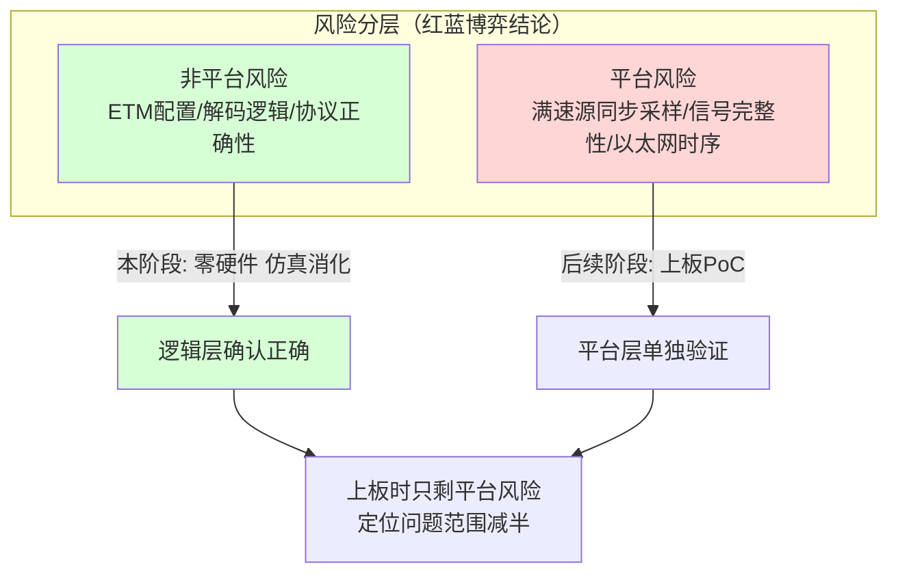
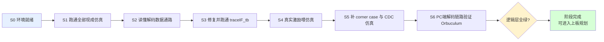
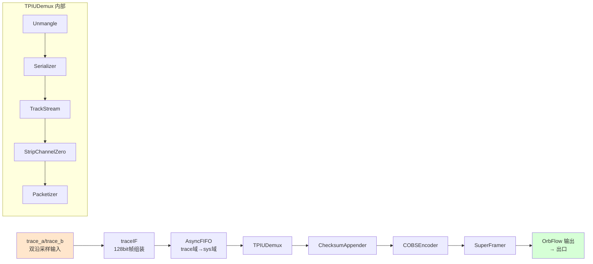
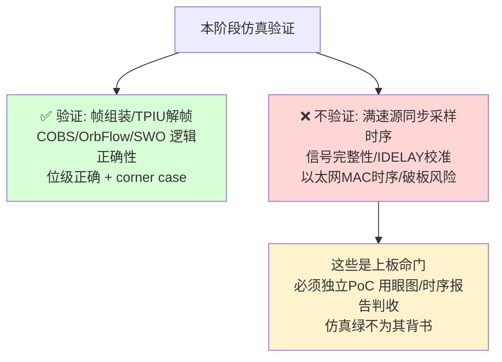

# Orbtrace Artix-7 移植 · 第一阶段计划书（无硬件仿真验证）

> 项目：基于 ORBTrace fork，移植到 Artix-7 + 千兆以太网出口，做 Cortex-M 指令流 trace 工具。
> 仓库：fork = `git@github.com:FASTSHIFT/orbtrace.git`（推送），origin = `orbcode/orbtrace`（上游同步）。
> 本阶段目标：**完全不碰硬件，用仿真把"和平台无关的逻辑层"全部验证通过**，为后续上板（Artix-7）扫清非平台风险。
> 决策依据：六轮红蓝博弈结论（见仓库根 `M核Trace选型-博弈复盘与最终结论.md` 等）。

---

## 0. 为什么先做无硬件仿真



核心原则：**仿真验证逻辑正确性，不验证满速时序/信号完整性**（后者是上板命门，仿真不背书）。本阶段把能在 PC 上零成本确认的东西全部确认掉。

---

## 1. 现状盘点（已验证）

ORBTrace 仓库自带可跑的仿真资产，**已在本机实测**：

| 资产 | 类型 | 状态 |
|------|------|------|
| `tests/test_tpiu.py` | Amaranth 仿真，内嵌真实 ITM "hello world" 位级 golden | ✅ 3 passed |
| `tests/test_cobs.py` | COBS 编码仿真（需 `pip install cobs`） | ✅ passed |
| `tests/test_swo.py` | SWO 解码仿真 | ✅ passed |
| `tests/test_stream_utils.py` | 流工具仿真 | ✅ passed |
| `verilog/testbeds/traceIF_tb.v` | Verilog testbench（iverilog） | ⚠️ 端口名过时（`PkAvail/Packet` vs 现 `FrAvail/Frame`），需修后才能跑 |
| `verilog/testbeds/stimfiles/*.dat` | 真实采集转换的 trace 激励 | ⚠️ 未与 testbench 联动，需改 testbench `$readmem` 读取 |

**依赖**：`amaranth==0.5.4`、`pytest`、`cobs`（均已装）。`iverilog`（Verilog 仿真）待装。

---

## 2. 本阶段任务分解



### S0 · 环境就绪
- [x] fork remote 已加（`fork` → FASTSHIFT/orbtrace）
- [x] amaranth 0.5.4 / pytest / cobs 已装
- [x] 装 `iverilog` + `gtkwave`
- [x] 建工作分支 `artix7-port`，改动在此分支

### S1 · 跑通全部现成仿真（基线）
- [x] `pytest tests/` 全绿（tpiu/cobs/swo/stream_utils）
- 目的：确认 ORBTrace 的解码逻辑在本机可复现，作为后续改动的回归基线。
- 命令：`PYTHONPATH=. python3 -m pytest tests/ -v`

### S2 · 读懂解码数据通路（理解，不改）
对照源码理清从 trace 输入到 OrbFlow 输出的完整链路：



- 关键文件：`verilog/traceIF.v`、`orbtrace/trace/{core,tpiu,cobs,orbflow,swo,glue}.py`、`orbtrace/stream.py`
- 产出：一份数据通路笔记（字节序、帧结构、各模块职责），为后续移植与改造打底。

### S3 · 修复并跑通 traceIF_tb（Verilog 物理层仿真）✅
- [x] 修 `traceIF_tb.v` 端口名 `PkAvail/Packet`→`FrAvail/Frame`；并修 `traceIF.v` 端口表多余逗号（commit `0877b94`）
- [x] iverilog 编译运行通过，解出 `OUTPUT=123402030405...`（复位 bug 修复后，commit `92c5da1`）
- [x] 三种总线宽度 WIDTH=4/2/1 均验证同步+解帧正确

### S4 · 真实激励喂仿真 ✅
- [x] 新增 `traceIF_stim_tb.v`，`$fscanf` 读 `stimfiles/*.dat` 真实采集数据（commit `f715fca`）
- [x] nibble 映射经 cycle-accurate 模型证明唯一（dina=低/dinb=高，64 RE-sync 命中）
- [x] fastitm.dat 解出真实 ITM payload 帧（`FRAME[0]=...101010f0f4...`，commit `dafc72c`）

### S5 · 补 corner case 与 CDC 仿真（红方终审要求）
当前测试覆盖主路径，需补以下零成本仿真：
- [x] **三种宽度** width=1/2/4 全覆盖（S3）
- [x] **丢同步再重同步** + 连续多帧：`traceIF_resync_tb.v`，解出 0x10/0x30/0x40/0x50 帧（commit `92c5da1`）
- [x] **跨时钟域 AsyncFIFO（trace域→sys域）双时钟仿真**：`tests/test_cdc.py` 4 用例（快写慢读/慢写快读/近似频率/深FIFO），commit `0e19d36`
- [ ] half-sync `0xff7f` / pass-word 特判、output.ready 背压：traceIF 已在真实/合成数据中隐含覆盖，专项用例待补（非阻塞）
- 产出：扩展 `tests/`，新增的测试纳入回归（当前 `pytest tests/` 11 passed）。

### S6 · PC 端解码链路验证（上位机侧）
- [x] **解码正确性已在仿真层覆盖**：`tests/test_tpiu.py::test_demux` 用真实 ITM "hello world" 的 TPIU 帧喂进真实 `TPIUDemux`，位级断言解出 = `01 48 01 65 01 6c...`（"Hello world!" 的 ITM 编码）。即"标准 TPIU 帧 → 有意义 payload"端到端已证。
- [ ] **完整 Orbuculum 集成（编译 C 上位机、网络/设备源实时 ingest）留待硬件阶段**：orbuculum 为 meson + libusb 的 C 项目，依赖较重；其核心 TPIU/ITM 解码正确性已由上面的仿真测试覆盖，完整端到端（OrbFlow over 网络 → orbuculum 实时解码）放到有真实数据流（上板）时一并验证，避免现在为编译大型 C 项目引入依赖风险。
- 结论：S6 的"解码逻辑正确"目标已达成；"上位机工具链打通"作为上板阶段任务。

---

## 3. 完成判据（逻辑层"全绿"门槛）

| 编号 | 判据 | 手段 |
|------|------|------|
| Q-A | `pytest tests/` 全绿（含 S5 新增 corner case） | Amaranth 仿真 |
| Q-B | traceIF_tb 在 width=1/2/4 下均跑通，波形正确 | iverilog + gtkwave |
| Q-C | 真实激励（slowitm/fastitm）能正确组帧解出 | iverilog |
| Q-D | trace→sys CDC 双时钟仿真无丢字节/亚稳态 | 新增双时钟 testbench |
| Q-E | 解码正确性：真实 ITM TPIU 帧经 `TPIUDemux` 位级解出（test_demux）；完整 Orbuculum 工具链留上板阶段 | Amaranth 仿真（已绿）|

**逻辑层非平台风险已消化** —— 解码单元测试（tpiu/cobs/swo/stream_utils）+ 物理层组帧（width 1/2/4）+ 重同步/多帧 + 跨时钟域 CDC + 真实采集数据组帧 + TPIU→ITM payload 解码，全部通过（`pytest tests/` 11 passed）。过程中修复 2 个真实缺陷（traceIF 端口表多余逗号、复位分支缺失）。可进入上板规划（采样前端移植、以太网出口、满速 PoC）。

---

## 4. 明确的边界（防止"仿真绿=方案可行"误读）



- 本阶段**不涉及** Artix-7 原语（ISERDES/IDELAY）、不涉及以太网逻辑、不涉及 Vivado——这些属上板阶段。
- 采样前端（ECP5 IDDRX → Artix ISERDES/IDELAY）的重写，是上板阶段的事，其**逻辑层接口**可在本阶段先想清楚，但**满速时序只能上板验**。

---

## 5. 后续阶段预告（非本阶段，仅为衔接）

逻辑层全绿后，依红蓝博弈结论与红方终审 checklist 进入：
1. 选板 datasheet 门：TRACECLK 落 MRCC/SRCC、5 线同 bank 可配 3.3V、200MHz IDELAYCTRL 参考钟。
2. **以太网栈 OOC 综合**（零硬件）：实测 MAC+UDP+buffer 的 LUT/BRAM，定 35T 还是 100T（见 `红方评审-逻辑门开销分析表.md`）。
3. 采样前端 + deskew 上板 PoC：满速源同步采样，眼图≥0.5UI、setup/hold≥0.3ns。
4. 千兆网出口三层带宽实测：纯打流 → 加 trace → 压峰值丢包。

---

## 6. 工作流约定

- 分支：`artix7-port`，所有改动在此分支，定期 `git push fork artix7-port`。
- 上游同步：需要时 `git fetch origin && git merge origin/main`（保留与 ORBTrace 上游合并能力）。
- 回归：每次改动后 `pytest tests/` 必须保持全绿。
- 文档：博弈/复盘/评审 md 归档至 `docs/`（本计划书所在目录）。

---

## 附录：快速命令

```bash
# 跑全部 Amaranth 仿真
PYTHONPATH=. python3 -m pytest tests/ -v

# 跑单个
PYTHONPATH=. python3 -m pytest tests/test_tpiu.py -v

# Verilog 物理层仿真（修好端口名后）
iverilog -o sim verilog/traceIF.v verilog/testbeds/traceIF_tb.v && vvp sim
gtkwave trace_IF.vcd

# 推送到 fork
git push fork artix7-port
```
