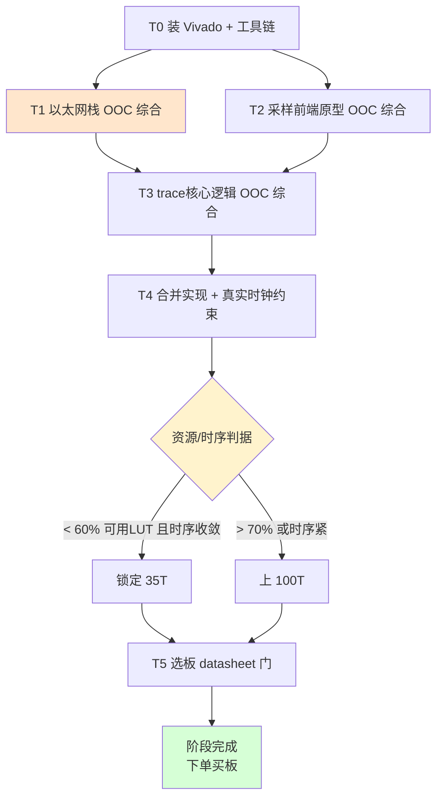
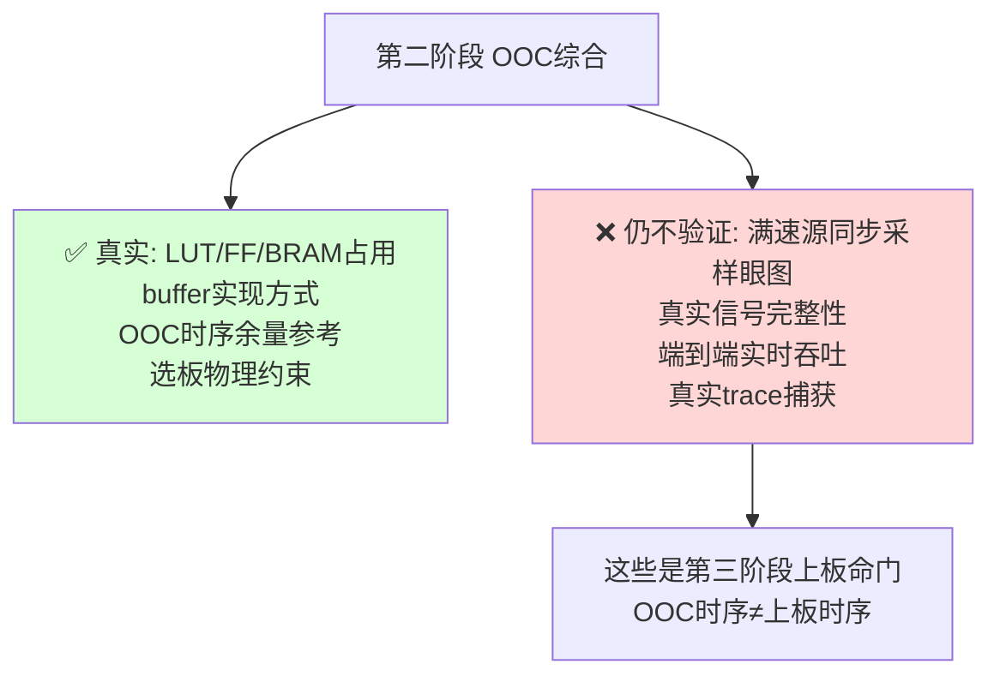

# Orbtrace Artix-7 移植 · 第二阶段计划书（选板与 OOC 综合，仍零硬件）

> 前置：第一阶段（无硬件仿真验证）已完成 —— 逻辑层非平台风险消化，`pytest tests/` 11 passed，iverilog 物理层组帧/重同步/真实数据验证通过，修复 2 个真实缺陷。见 `PLAN.md`。
> 本阶段目标：**在不买板、不上板的前提下，用 Vivado OOC（Out-Of-Context）综合拿到真实资源数字，定下 FPGA 型号（35T vs 100T），并通过 datasheet 核查锁定可用的目标板。**
> 关键原则：本阶段产出"是否破板""选哪块板"的**真实依据**，替换第一阶段沿用的估算（见 `proposals/10-逻辑门开销分析表.md` 与 `reviews/r08`）。

---

## 0. 为什么第二阶段仍然零硬件

红方 r08 的核心结论：**"35T 够用"是估算（乐观叠加下 54%，现实可用率折算后上沿可达 ~95%），不能凭估算锁板。** 正确做法是先跑零硬件成本的 OOC 综合，用实现后真实数字决定 35T 还是 100T，避免赌 ¥375 板差价却可能返工。本阶段就是把这件事做掉。

---

## 1. 本阶段任务总览

---

## 2. 任务分解

### T0 · 工具链就绪
- [ ] 装 **Xilinx Vivado**（WebPACK/Standard 免费版即可，支持 Artix-7；Linux 原生版，几十 GB）
- [ ] 确认目标器件库：`xc7a35t` 与 `xc7a100t`（同 FGG484 封装，便于将来无痛升级——T5 需核实引脚兼容）
- [ ] 备选评估：openXC7（nextpnr-xilinx）全开源流程，可作为不装 Vivado 的轻量替代（成熟度较低，仅作 plan B）

> 注：Vivado 是本阶段唯一"重"的一步，也是整个第二阶段的门槛。装好后 T1–T4 都是零硬件、可重复跑的综合任务。

### T1 · 以太网栈 OOC 综合（最高优先级）
红方 r08 致命点 F1/F2/S2：以太网是 LUT 大头且最不确定，buffer 可能吃大量分布式 RAM。**这块必须先用真实综合数字替换估算。**

- [ ] 选定千兆 MAC + UDP 核：
  - 候选 A：`alexforencich/verilog-ethernet`（`udp_complete_1g_rgmii`），Verilog，资料多
  - 候选 B：LiteEth（与 ORBTrace 的 LiteX 框架同源，集成阻力小）
- [ ] 对选定核跑 **OOC 综合 + 实现**（目标 `xc7a35t`），拿到实现后 **LUT / FF / BRAM / LUT-as-RAM** 数字
- [ ] **显式检查 LUT-as-RAM 数量**（r08 F1）：确认 buffer 能否在不破坏时序的前提下转 BRAM；记录转不走的部分
- [ ] 记录在目标时钟（RGMII 125MHz）下的时序余量

**产出**：以太网栈的实现后资源表 + buffer 实现方式结论。

### T2 · 采样前端原型 OOC 综合
- [ ] 写 Artix-7 采样前端原型：`ISERDESE2`（DDR 模式）×5 + `IDELAYE2`×5 + `IDELAYCTRL` + deskew 校准状态机骨架
- [ ] OOC 综合 + 实现，拿到 LUT/FF 真实占用（验证 r08 对 deskew 500~1500 的估算）
- [ ] **重点看实现后面积**（r08 ④：时序收敛会膨胀面积），记录是否需要寄存器复制/管线
- 注：本步只验"综合得出、资源可知"，**满速时序的眼图/收敛是第三阶段上板才能定**，OOC 时序仅供参考。

### T3 · trace 核心逻辑 OOC 综合
- [ ] 把第一阶段已验证的 traceIF + TPIU 解帧 + COBS + OrbFlow 逻辑（Amaranth 导出 Verilog，或现有 Verilog）跑 OOC 综合
- [ ] 拿到实现后 LUT/FF/BRAM（验证 r08 对 trace 核心 ~2-4K LUT 的估算）

### T4 · 合并实现 + 真实时钟约束
- [ ] 把 T1+T2+T3 合到目标器件顶层，加真实时钟约束：RGMII 125MHz + IDELAYCTRL 200MHz ref + trace 满速域
- [ ] 跑完整实现，拿到 **全设计实现后 utilization + 时序余量**
- [ ] 这是"35T 是否够"的**唯一权威答案**

### T5 · 选板 datasheet 门（红方终审 checklist，零成本）
对候选目标板（如微相 A7-Lite 35T/100T）逐项书面核实：
- [ ] **TRACECLK 候选引脚落在时钟能力脚（MRCC/SRCC）** —— 否则满速采样时序崩
- [ ] **5 根 trace 线（TRACECLK+TRACED0-3）尽量同 IO bank、bank 电压可配 3.3V**
- [ ] **板载时钟能经 MMCM 生成稳定 200MHz**（IDELAYCTRL 参考钟）
- [ ] **以太网 PHY 型号与接口**（确认 RGMII，对应 T1 选的核）—— 微相板为 Realtek（螃蟹 logo），大概率 RTL8211 + RGMII，需文档确认
- [ ] **35T 与 100T 引脚兼容性**（若 T4 判 35T 偏紧想留升级余地）

#### T5 初步核对结论（基于 A7-Lite 官方资料：`A7_lite.xdc` / `A7_LITE_GPIO.xlsx` / `A7-LITE_Rev1_3.pdf`）

> 已用厂商资料完成大部分核对，结论利好；标 ✅ 为已确认，⚠️ 为待 Vivado 器件库精确落定。

| 选板门项 | 结论 | 依据 |
|---------|------|------|
| 200MHz 参考钟 | ✅ 满足 | 板载 50MHz 晶振（CLK_50M@J19），经 MMCM 倍频出 200MHz |
| 5 线同 bank + 3.3V | ✅ 满足 | GPIO1 扩展口整组在 **Bank 16**，`VCCIO_A` 电压可配，板上有 VCC_3V3；trace 5 线全放 GPIO1 即可 |
| TRACECLK 落时钟能力脚 | ✅ 基本确认（⚠️待精确对应） | 原理图显示 GPIO1(Bank16) 含多个 MRCC/SRCC 脚：如 `IO_L12P_T1_MRCC_16`、`IO_L13P_T2_MRCC_16`、`IO_L11P_T1_SRCC_16`。TRACECLK 落其一即可；**具体 GPIO1_xx ↔ MRCC 脚的精确对应需装 Vivado 后用器件库核对** |
| 以太网 RGMII | ✅ 确认 RGMII | `A7_lite.xdc` 的 ETH 引脚组为标准 RGMII（RXCK/RXCTL/RXD[3:0]+TXCK/TXCTL/TXD[3:0]+MDC/MDIO），LVCMOS33；PHY 为 Realtek（螃蟹 logo），对应 T1 选 RGMII MAC |
| 35T/100T 引脚兼容 | ⚠️ 待确认 | 微相 A7-Lite 35T/100T 均为 **FGG484** 封装（见 `04_source_code`/规格），同封装通常引脚兼容；具体以厂商确认为准 |
| GPIO 引出形式 | ✅ 加分项 | GPIO1/GPIO2 以**差分对（P/N）**引出（共 ~42 对 IO），利于 trace 信号完整性 |

**结论：A7-Lite 通过选板门的关键项**（时钟、bank/电压、TRACECLK 时钟脚、RGMII 出口均满足）。**唯一待精确落定的是"GPIO1 哪个引脚号 = 哪个 MRCC 脚"，需 Vivado 器件库核对后写进 trace 的 xdc。** 原始 `A7_lite.xdc` 只含板载固定外设，**trace 引脚需自行从 GPIO1 中选定并新增约束**。

---

## 3. 决策判据（定 35T 还是 100T）

红方 r08 给的硬判据，本阶段照此执行：

| T4 实现后结果 | 决策 |
|--------------|------|
| 总 LUT（含实现后膨胀）< **~60% 可用 LUT**（按 80% 可用率折算，即 < ~10,000 LUT @35T）且时序收敛 | **锁定 35T**（¥375，省钱） |
| 60%~70% | 谨慎：可锁 35T 但留 100T 后备，或直接 100T 求稳 |
| > **~70%** 或时序紧张 | **直接上 100T**，别赌板差价 |

> 关键提醒：分母用 **80% 可用率**（红方 S1），不是 100% 物理 LUT；面积取**实现后**（含时序膨胀），不是综合后功能面积。

---

## 4. 本阶段边界（什么仍不验证）

- **OOC 综合的时序 ≠ 上板真实时序**：OOC 是"脱离上下文"的估计，满速源同步采样的真实收敛（眼图、setup/hold）只能上板验。本阶段时序数字仅用于"面积是否破板"的辅助判断。
- 本阶段**不买板、不上板**；产出的是"买哪块板"的决策依据。

---

## 5. 完成判据（进入第三阶段的门槛）

| 编号 | 判据 | 手段 |
|------|------|------|
| Q2-A | 以太网栈实现后资源表 + buffer 实现方式结论 | Vivado OOC 实现报告 |
| Q2-B | 采样前端原型实现后 LUT/FF（验证 deskew 估算） | Vivado OOC 实现报告 |
| Q2-C | 全设计合并实现后 utilization + 时序余量 | Vivado 实现报告 |
| Q2-D | 按 §3 判据明确 35T / 100T 决策（书面） | 决策记录 |
| Q2-E | 选板 datasheet 5 项全部书面确认通过 | datasheet + 板原理图核查 |

**全绿 = 板型与目标板锁定，可下单买板，进入第三阶段上板 PoC。**

---

## 6. 风险与对策

| 风险 | 严重度 | 对策 |
|------|--------|------|
| Vivado 安装/许可/磁盘（几十GB） | 🟡 中 | 用免费 WebPACK；磁盘预留 ≥80GB；或先试 openXC7 轻量流程 |
| 以太网栈 OOC 数字比估算大很多，35T 破板 | 🟡 中 | 正是本阶段要查的；破则上 100T（同封装，引脚兼容则改约束即可） |
| buffer 无法转 BRAM（r08 F1） | 🟡 中 | T1 显式量化转不走的 LUT；计入总账 |
| 选板 datasheet 某项不满足（如 TRACECLK 非时钟脚） | 🔴 高 | T5 是硬门，不满足就换板/换引脚方案，**买板前必须过** |
| OOC 时序乐观，上板才发现满速不收敛 | 🔴 高 | 本阶段明确 OOC≠上板；第三阶段独立 PoC 验，不靠 OOC 背书 |

---

## 7. 工作流约定（沿用）

- 分支：继续 `artix7-port`（或按需开 `artix7-port-stage2` 子分支），改动 push 到 `fork`。
- 综合工程/约束文件纳入版本管理（建议 `gateware/artix7/` 或 `syn/` 目录）。
- OOC 实现报告（utilization/timing）归档至 `docs/artix7-port/synth-reports/`，作为决策证据。
- 文档：本计划书与产出报告随阶段更新。

---

## 附录：与前序文档的衔接

- 估算基线（待本阶段实测替换）：`proposals/10-逻辑门开销分析表.md`
- 红方对估算的质疑（本阶段要回应的）：`reviews/r08-逻辑门开销分析表评审.md`
- 选板物理约束来源：`reviews/r07-博弈复盘终审确认.md`（红方终审 checklist）
- 第一阶段成果：`PLAN.md`
