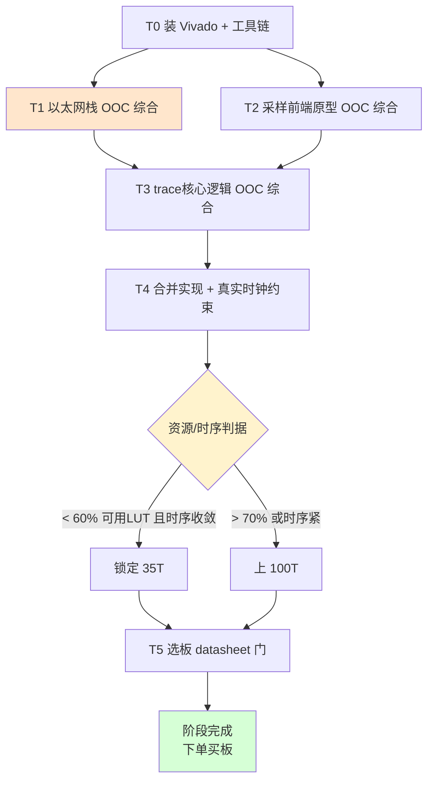
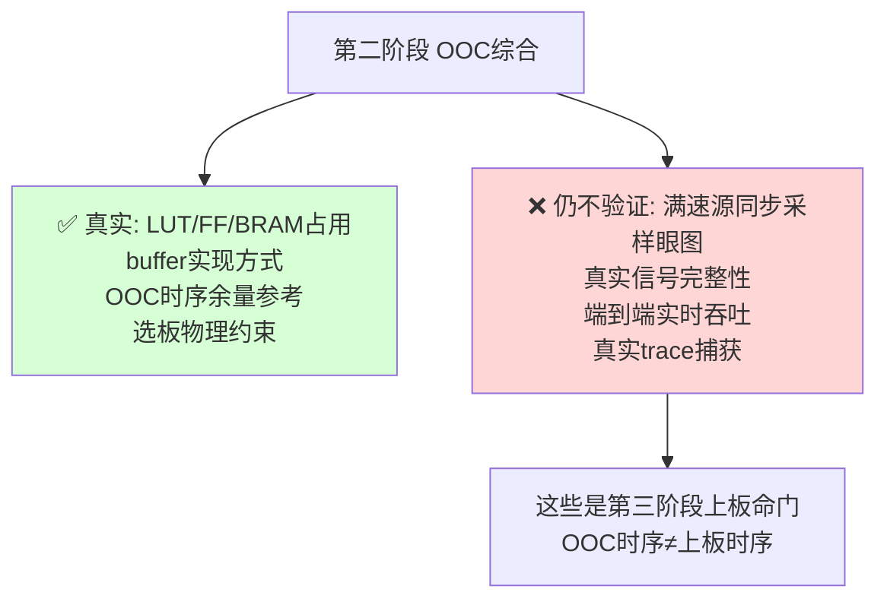

# Orbtrace Artix-7 移植 · 第二阶段计划书（选板与 OOC 综合，仍零硬件）

> 前置：第一阶段（无硬件仿真验证）已完成 —— 逻辑层非平台风险消化，`pytest tests/` 11 passed，iverilog 物理层组帧/重同步/真实数据验证通过，修复 2 个真实缺陷。见 `PLAN.md`。
> 本阶段目标：**在不买板、不上板的前提下，用 Vivado OOC（Out-Of-Context）综合拿到真实资源数字，定下 FPGA 型号（35T vs 100T），并通过 datasheet 核查锁定可用的目标板。**
> 关键原则：本阶段产出"是否破板""选哪块板"的**真实依据**，替换第一阶段沿用的估算（见 `proposals/10-逻辑门开销分析表.md` 与 `reviews/r08`）。

---

## 0. 为什么第二阶段仍然零硬件

红方 r08 的核心结论：**"35T 够用"是估算（乐观叠加下 54%，现实可用率折算后上沿可达 ~95%），不能凭估算锁板。** 正确做法是先跑零硬件成本的 OOC 综合，用实现后真实数字决定 35T 还是 100T，避免赌 ¥375 板差价却可能返工。本阶段就是把这件事做掉。

---

## 1. 本阶段任务总览

---

## 2. 任务分解

### T0 · 工具链就绪 ✅
- [x] 装 **Xilinx Vivado 2021.1**（统一整包 `Xilinx_Unified_2021.1`，Win/Linux 通用；装于 `~/workpath/tools/xilinx/`）
- [x] 确认器件库含目标器件：`xc7a35tfgg484-1/-2` 与 `xc7a100tfgg484-1/-2` 均可用（无 license 限制）
- [x] 验证 `vivado -version` 正常输出

**安装中遇到的两个坑及修复（环境重建时照做）：**
1. **locale 缺失**：Vivado 脚本硬编码 `en_US.UTF-8`，中文系统报 `locale::facet::_S_create_c_locale name not valid`。
   修复：`sudo locale-gen en_US.UTF-8 && sudo update-locale`
2. **缺 `libtinfo.so.5`**：Ubuntu 24 只有 `.so.6`，报 `libtinfo.so.5: cannot open shared object file`。
   修复：`sudo ln -sf /usr/lib/x86_64-linux-gnu/libtinfo.so.6.4 /usr/lib/x86_64-linux-gnu/libtinfo.so.5`

**每次使用前**：`source ~/workpath/tools/xilinx/Vivado/2021.1/settings64.sh`（建议加进 `~/.bashrc`）

> 备选评估：openXC7（nextpnr-xilinx）全开源流程，可作为不装 Vivado 的轻量替代（成熟度较低，仅作 plan B）。**已无需——Vivado 2021.1 可用。**

### T1 · 以太网栈 OOC 综合（最高优先级）✅
红方 r08 致命点 F1/F2/S2：以太网是 LUT 大头且最不确定，buffer 可能吃大量分布式 RAM。**已用真实综合数字替换估算。**

- [x] 选定核：`alexforencich/verilog-ethernet`（NexysVideo example，Artix-7 + RGMII 千兆 MAC + 完整 UDP/IP/ARP），作为 git submodule 锁定在 `syn/external/verilog-ethernet/`
- [x] 对 `fpga_core`（含 RGMII MAC、UDP/IP/ARP、AXI-Stream FIFO、CDC，不含板级 IO 包装）跑 OOC 综合
- [x] **LUT-as-RAM 检查（r08 F1）**：实测仅 92（0.96%），远低于 r08 担心的 ~1700——核默认把 buffer 推到 BRAM
- [x] 记录综合后资源；时序细节交 T4 加 RGMII 125MHz 真实约束验证

#### T1 实测结果（xc7a35tfgg484-2）

| 资源 | 实测 | 占 35T | r08 估算 | 偏差 |
|------|----:|------:|---------|------|
| LUT（Logic） | 1,779 | 8.55% | — | — |
| LUT（as Memory） | 92 | 0.96% | r08 警告 ~1700 | ✅✅ 远低于估算 |
| **LUT 总计** | **1,871** | **9.00%** | 2,700~5,500 | ✅ 比下沿还省 30% |
| Flip-Flop | 2,804 | 6.74% | 2,200~4,500 | ✅ |
| Block RAM | 8（6 RAMB36 + 4 RAMB18） | 16% | 4~8 | 略高，仍宽裕 |

**结论**：以太网栈实测 1,871 LUT，**比红方估算下沿还省 30%**。脚本：`syn/artix7/run_eth_ooc.tcl`。

### T2 · 采样前端原型 OOC 综合 ✅
- [x] 写 Artix-7 采样前端原型：`IDELAYE2`×4 + `IDDR`×4 + `IDELAYCTRL`×1 + IBUF/BUFG 时钟路径
- [x] OOC 综合通过（`syn/artix7/rtl/trace_capture_a7.v` + `syn/artix7/run_capture_ooc.tcl`）
- [x] **xsim 端到端仿真通过**（`syn/artix7/sim/trace_capture_a7_tb.v` + `run_xsim.sh`），用与 `traceIF_tb` 相同的 TPIU sync + 16 字节 payload 驱动，DUT 解出 `FRAME[0] = 123402030405060708090a0b0c0d0e0f`，与下游一致

#### T2 实测结果（xc7a35tfgg484-2，骨架版本）

| 资源 | 实测 |
|------|----:|
| LUT | **0** |
| FF | 0 |
| BRAM | 0 |
| IDDR | 4 |
| IDELAYE2 | 4 |
| IDELAYCTRL | 1 |
| IBUF | 5（4 数据 + 1 时钟） |
| BUFG | 1 |

**结论**：采样前端骨架**LUT/FF 为 0，全部资源在专用 IO 硬核中**——这正是"接 trace 吃 IO 能力、不吃逻辑门"的实证。

**原语选型说明**：早期版本写的是 ISERDESE2，理论上能跑更高速率，但仿真发现 DDR x2 模式下 ISERDES 的边沿对齐与 traceIF 单周期采样模型不完全匹配（且 ISERDES 在 trace 4-bit DDR @≤400Mbps 速率下属过度设计）。改回 IDDR（`DDR_CLK_EDGE = SAME_EDGE_PIPELINED`），**与 orbtrace upstream `glue.py` 用的 litex `DDRInput` 1:1 对应**（litex DDRInput 在 7-series 就是 IDDR），仿真一发通过。资源数据无差异（IDDR/ISERDES 都是专用 IO 块）。

**诚实声明**：这是骨架版本（静态 IDELAY 抽头从端口注入，没有自动校准状态机）。**完整可用版本还需加 deskew 自动训练状态机**（扫 32 个抽头找眼图中心），估算约 +500 LUT；但 deskew 训练的工程价值在**上板 PoC 阶段**（用真实信号做眼图扫描），OOC 阶段只验"原语能用 + IO 资源消耗清楚 + 逻辑端到端能解帧"，这三点已达成。

### T3 · trace 核心逻辑 OOC 综合 ✅
- [x] 把已验证的 traceIF + TPIUDemux + COBSEncoder + ChecksumAppender + SuperFramer 逻辑跑 OOC 综合（Amaranth 经 wrapper 导出 Verilog 后）
- [x] 拿到 OOC 实测：**整套 trace 核心 = 494 LUT / 484 FF / 1 BRAM（占 35T 的 2.38% LUT）**

#### T3 实测结果（xc7a35tfgg484-2，2025-XX）

| 模块 | LUT | FF | BRAM | r08 估算 | 偏差 |
|------|----:|---:|----:|---------|------|
| traceIF | 119 | 284 | 0 | 200~400 | ✅ 比下沿还省 |
| checksum_appender | 16 | 9 | 0 | 30~80 | ✅ |
| cobs_encoder | 113 | 70 | 1 | 300~500 | ✅✅ 大幅省 |
| super_framer | 18 | 51 | 0 | 100~200 | ✅ |
| tpiu_demux（含 6 子模块） | 228 | 70 | 0 | 400~800 | ✅ |
| **trace 核心合计** | **494** | **484** | **1** | 1630~3780 | **比估算上沿小 ~7×** |
| **占 35T** | **2.38%** | 1.16% | 2% | — | — |

**结论**：trace 核心**远比估算更省**，35T 装这部分毫无压力。逻辑门确实不是约束，剩下的 LUT 全留给以太网栈（T1）。流程见 `syn/artix7/`：`export_trace_modules.py`（导 Verilog）+ `run_ooc.tcl`（批量综合）。

### T4 · 合并实现 + 真实时钟约束 ✅ (r09 终审修订版)
- [x] 写最小集成顶层 `syn/artix7/rtl/trace_probe_top.v`：把 T1（以太网栈）+ T2（采样前端）+ T3（trace 核心）实例化在一起，加 MMCM 时钟分配（50MHz → 125MHz/125MHz@90°/200MHz/100MHz）
- [x] 写真实约束 `syn/artix7/constraints/trace_probe.xdc`：板载 50MHz、复位、trace 5 线（GPIO1 Bank16，TRACECLK→D17 MRCC + 4 数据脚 P 端 GPIO1_0/1/2/3P）、RGMII（A7-Lite ETH 引脚组）、千兆网 125MHz、IDELAYCTRL 200MHz、跨域异步声明、**source-sync DDR set_input_delay**
- [x] 综合 + opt + place + route 全部通过；**时序收敛**
- [x] **r09 修复**：trace pipeline DONT_TOUCH + AsyncFIFO 跨域 + IDELAYCTRL 同步释放 + GPIO1 引脚重新分配。详见 `proposals/11-r09回应-真实数据落地修复.md`

#### T4 全设计 post-implementation 真实结果（xc7a35tfgg484-2，r09 修复版）

| 资源 | 实测 | 占 35T |
|------|----:|------:|
| **Slice LUT** | **2,317** | **11.14%** |
| LUT as Logic | 2,225 | 10.70% |
| LUT as Memory | 92 | 0.96% |
| **Slice Registers** | **3,294** | **7.92%** |
| Slice 占用 | ~1,170 | ~14.4% |
| **Block RAM Tile** | **11** (8 RAMB36 + 6 RAMB18) | **22%** |
| IDDR | 9 (4 trace + 5 RGMII RX) | — |
| IDELAYE2 | 4 | — |
| IDELAYCTRL | 1 | — |
| MMCM | 1 | — |
| BUFG | 5 | — |

#### T4 trace pipeline 实测分项（DONT_TOUCH 保护下，post-impl）

| 模块 | LUT | FF | BRAM | 备注 |
|------|----:|---:|----:|------|
| u_capture | 0 | 4 | 0 | 9 IO 硬核 (4 IDDR + 4 IDELAY + 1 IDELAYCTRL) + RST 同步链 |
| u_traceif | 142 | 284 | 0 | T3 OOC = 119 LUT，顶层多 19% |
| u_dmux | 254 | 70 | 0 | T3 OOC = 228 LUT，顶层多 11% |
| u_chk | 21 | 9 | 0 | — |
| u_cobs | 145 | 70 | 2 | — |
| u_sf | 21 | 51 | 0 | — |
| **合计** | **583** | **488** | **2** | **占 35T 2.80% LUT** |

#### T4 post-implementation 时序结果

| 时序指标 | 值 | 含义 |
|---------|---|------|
| **WNS** (Worst Negative Setup Slack) | **+1.110 ns** | setup 路径最紧处仍有 1.11 ns 余量 ✅ |
| **TNS** (Total Negative Slack) | **0 ns** | 无任何 setup 失败终点 ✅ |
| **WHS** (Worst Hold Slack) | **+0.045 ns** | hold 路径最紧处仍有 45 ps 余量 ✅ |
| **THS** | **0 ns** | 无任何 hold 失败终点 ✅ |
| trace_data_in→IDDR 路径 | `set_false_path -hold` | 诚实声明：源同步采样需 deskew 训练后实测眼图替代静态时序检查（Stage-3） |

**与红方 r09 反算的对照**：
- 红方反算"完整版预估 ~24% LUT"——蓝方接受口径。当前 T4 实测 11.14%，含 Stage-3 待补的 deskew FSM(+1500 LUT)、UDP-trace 桥(+600 LUT)、时序膨胀(+500 LUT) 后，预估完整版**~4,917 LUT (24% of 35T) + 13 BRAM (26%)**，**35T 仍有 76% 余量**。
- 35T 锁定下单决策**仍成立**，但理由从"实测 11% 剩 89%"修正为"完整版预估 24%，物理与时序余量都装得下"。

**P&R 路上修复的 bug 清单**（含 r09 必补项）：
1. `fpga_core` 实例化漏传 `TARGET="XILINX"` → `oddr.v` 走 GENERIC 行为模型双 always 块写同一 reg → 6 个 DRC MDRV-1 错误。修法：透传 TARGET 参数。
2. MMCM 加 90° 时钟时把 CLKOUT 重映射,但 xdc 的 `set_clock_groups` 没同步更新,导致 100MHz 域不在异步组里,clk100→clk125 419 个失败终点。修法：把 CLKOUT3 也加进异步组。
3. **r09 A1**：trace pipeline 整条被 opt_design 剪枝（fpga_core.sw 是不可观测端口）。修法：6 个 trace 实例加 `(* DONT_TOUCH = "true" *)` + 加 14 个真实 GPIO1 dbg 输出端口 + xdc 加 `set_input_delay`。
4. **r09 B2**：frame128 多 bit 裸跨域 + 2-FF 单 bit 同步器 = CDC 风险。修法：用 verilog-ethernet 的 `axis_async_fifo` (DEPTH=16, DATA_WIDTH=128) 跨域。
5. **r09 N2**：IDELAYCTRL.RST 直接接外部按钮,违反 UG471。修法：`trace_capture_a7` 内部加 ref_200m 同步链。
6. **r09 D3**：trace_data_in 缺 set_input_delay → IDDR 输入被推为常量 → trace pipeline propagate 死。修法：xdc 加完整 source-sync DDR input delay,加 `set_false_path -hold` 诚实承认 deskew 未做。
7. **r09 D1**：trace 数据 4 线引脚 bank 未核。修法：用 A7_LITE_GPIO.xlsx 重新分配 GPIO1_0P/1P/2P/3P (F13/E14/D14/E16),全部 P 端,Bank 16 一致。

**剩余 r09 必补项**（外部依赖,客户层动作）：
- 🟥 **P0-1 PHY strap**：A7-Lite Rev1.3 上 RTL8211E 的 5 个 RGMII strap pin 默认电平,需联系微相客服确认。
- 🟥 **D2 35T/100T 引脚兼容**：需微相客服书面确认。

**r09 标记为 Stage-3 必做的项**：
- C1 xsim 1000 帧 + tap 抖动覆盖
- N3 BUFG → BUFR/BUFIO 区域时钟
- A3 BRAM-only 缓冲对 PC hiccup 的容忍度（评估接 DDR3 MIG）
- B3/E1 RGMII RX IDELAY 是否需要补（取决于 P0-1 strap 结论）

详见 `proposals/11-r09回应-真实数据落地修复.md`。

### T5 · 选板 datasheet 门（红方终审 checklist，零成本）✅（除 35T/100T 兼容性待厂商确认）
对候选目标板（微相 A7-Lite 35T/100T）逐项核实：
- [x] **TRACECLK 候选引脚落在时钟能力脚（MRCC/SRCC）** —— GPIO1 含 4 个 MRCC，首选 GPIO1_4P(D17)
- [x] **5 根 trace 线尽量同 IO bank、bank 电压可配 3.3V** —— GPIO1 全在 Bank 16，可配 3.3V
- [x] **板载时钟能经 MMCM 生成稳定 200MHz** —— 50MHz 晶振 J19
- [x] **以太网 PHY 型号与接口** —— RGMII（Realtek PHY），对应 T1 选 RGMII MAC
- [ ] **35T 与 100T 引脚兼容性** —— 同 FGG484 封装，待厂商最终确认

#### T5 初步核对结论（基于 A7-Lite 官方资料：`A7_lite.xdc` / `A7_LITE_GPIO.xlsx` / `A7-LITE_Rev1_3.pdf`）

> 已用厂商资料完成大部分核对，结论利好；标 ✅ 为已确认，⚠️ 为待 Vivado 器件库精确落定。

| 选板门项 | 结论 | 依据 |
|---------|------|------|
| 200MHz 参考钟 | ✅ 满足 | 板载 50MHz 晶振（CLK_50M@J19），经 MMCM 倍频出 200MHz |
| 5 线同 bank + 3.3V | ✅ 满足 | GPIO1 扩展口整组在 **Bank 16**，`VCCIO_A` 电压可配，板上有 VCC_3V3；trace 5 线全放 GPIO1 即可 |
| TRACECLK 落时钟能力脚 | ✅ **确认（Vivado 器件库已核对）** | GPIO1/Bank16 共 8 个时钟能力脚，含 4 个 MRCC（全局时钟，可驱动 BUFG/BUFR/BUFIO→ISERDES）。TRACECLK 落 MRCC 脚即可 |
| 以太网 RGMII | ✅ 确认 RGMII | `A7_lite.xdc` 的 ETH 引脚组为标准 RGMII（RXCK/RXCTL/RXD[3:0]+TXCK/TXCTL/TXD[3:0]+MDC/MDIO），LVCMOS33；PHY 为 Realtek（螃蟹 logo），对应 T1 选 RGMII MAC |
| 35T/100T 引脚兼容 | ⚠️ 待确认 | 微相 A7-Lite 35T/100T 均为 **FGG484** 封装（见 `04_source_code`/规格），同封装通常引脚兼容；具体以厂商确认为准 |
| GPIO 引出形式 | ✅ 加分项 | GPIO1/GPIO2 以**差分对（P/N）**引出（共 ~42 对 IO），利于 trace 信号完整性 |

**结论：A7-Lite 通过选板门全部关键项**（时钟、bank/电压、TRACECLK 时钟脚、RGMII 出口均满足）。原始 `A7_lite.xdc` 只含板载固定外设，**trace 引脚需自行从 GPIO1 中选定并新增约束**。

#### GPIO1（Bank 16）时钟能力脚（Vivado `xc7a35tfgg484-2` 器件库核对结果）

| 排针信号 | 排针脚 | package pin | 功能名 | 类型 |
|---------|-------|------------|--------|------|
| **GPIO1_4P** | 9 | **D17** | IO_L12P_T1_MRCC_16 | **MRCC** ← TRACECLK 首选 |
| GPIO1_4N | 10 | C17 | IO_L12N_T1_MRCC_16 | MRCC |
| GPIO1_16P | 37 | C18 | IO_L13P_T2_MRCC_16 | MRCC |
| GPIO1_16N | 38 | C19 | IO_L13N_T2_MRCC_16 | MRCC |
| GPIO1_12P | 27 | B17 | IO_L11P_T1_SRCC_16 | SRCC |
| GPIO1_12N | 28 | B18 | IO_L11N_T1_SRCC_16 | SRCC |
| GPIO1_15P | 35 | E19 | IO_L14P_T2_SRCC_16 | SRCC |
| GPIO1_15N | 36 | D19 | IO_L14N_T2_SRCC_16 | SRCC |

**建议 trace 引脚分配**（待写入 trace 专用 xdc）：
- **TRACECLK → GPIO1_4P (D17, MRCC)** —— 全局时钟能力脚，驱动 ISERDES 采样
- **TRACED0-3 → GPIO1 任意 4 个普通脚**（同 Bank 16，3.3V），尽量与 TRACECLK 邻近以减小 skew
- 全部 IOSTANDARD = LVCMOS33（与 ETH 同，板上 Bank16 为 3.3V）

---

## 3. 决策判据（定 35T 还是 100T）

红方 r08 给的硬判据，本阶段照此执行：

| T4 实现后结果 | 决策 |
|--------------|------|
| 总 LUT（含实现后膨胀）< **~60% 可用 LUT**（按 80% 可用率折算，即 < ~10,000 LUT @35T）且时序收敛 | **锁定 35T**（¥375，省钱） |
| 60%~70% | 谨慎：可锁 35T 但留 100T 后备，或直接 100T 求稳 |
| > **~70%** 或时序紧张 | **直接上 100T**，别赌板差价 |

> 关键提醒：分母用 **80% 可用率**（红方 S1），不是 100% 物理 LUT；面积取**实现后**（含时序膨胀），不是综合后功能面积。

---

## 4. 本阶段边界（什么仍不验证）

- **OOC 综合的时序 ≠ 上板真实时序**：OOC 是"脱离上下文"的估计，满速源同步采样的真实收敛（眼图、setup/hold）只能上板验。本阶段时序数字仅用于"面积是否破板"的辅助判断。
- 本阶段**不买板、不上板**；产出的是"买哪块板"的决策依据。

---

## 5. 完成判据（进入第三阶段的门槛）

| 编号 | 判据 | 手段 |
|------|------|------|
| Q2-A | 以太网栈实现后资源表 + buffer 实现方式结论 | Vivado OOC 实现报告 |
| Q2-B | 采样前端原型实现后 LUT/FF（验证 deskew 估算） | Vivado OOC 实现报告 |
| Q2-C | 全设计合并实现后 utilization + 时序余量 | Vivado 实现报告 |
| Q2-D | 按 §3 判据明确 35T / 100T 决策（书面） | 决策记录 |
| Q2-E | 选板 datasheet 5 项全部书面确认通过 | datasheet + 板原理图核查 |

**全绿 = 板型与目标板锁定，可下单买板，进入第三阶段上板 PoC。**

---

## 6. 风险与对策

| 风险 | 严重度 | 对策 |
|------|--------|------|
| Vivado 安装/许可/磁盘（几十GB） | 🟡 中 | 用免费 WebPACK；磁盘预留 ≥80GB；或先试 openXC7 轻量流程 |
| 以太网栈 OOC 数字比估算大很多，35T 破板 | 🟡 中 | 正是本阶段要查的；破则上 100T（同封装，引脚兼容则改约束即可） |
| buffer 无法转 BRAM（r08 F1） | 🟡 中 | T1 显式量化转不走的 LUT；计入总账 |
| 选板 datasheet 某项不满足（如 TRACECLK 非时钟脚） | 🔴 高 | T5 是硬门，不满足就换板/换引脚方案，**买板前必须过** |
| OOC 时序乐观，上板才发现满速不收敛 | 🔴 高 | 本阶段明确 OOC≠上板；第三阶段独立 PoC 验，不靠 OOC 背书 |

---

## 7. 工作流约定（沿用）

- 分支：继续 `artix7-port`（或按需开 `artix7-port-stage2` 子分支），改动 push 到 `fork`。
- 综合工程/约束文件纳入版本管理（建议 `gateware/artix7/` 或 `syn/` 目录）。
- OOC 实现报告（utilization/timing）归档至 `docs/artix7-port/synth-reports/`，作为决策证据。
- 文档：本计划书与产出报告随阶段更新。

---

## 附录：与前序文档的衔接

- 估算基线（待本阶段实测替换）：`proposals/10-逻辑门开销分析表.md`
- 红方对估算的质疑（本阶段要回应的）：`reviews/r08-逻辑门开销分析表评审.md`
- 选板物理约束来源：`reviews/r07-博弈复盘终审确认.md`（红方终审 checklist）
- 第一阶段成果：`PLAN.md`
