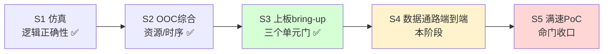
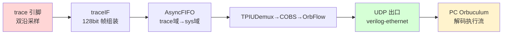
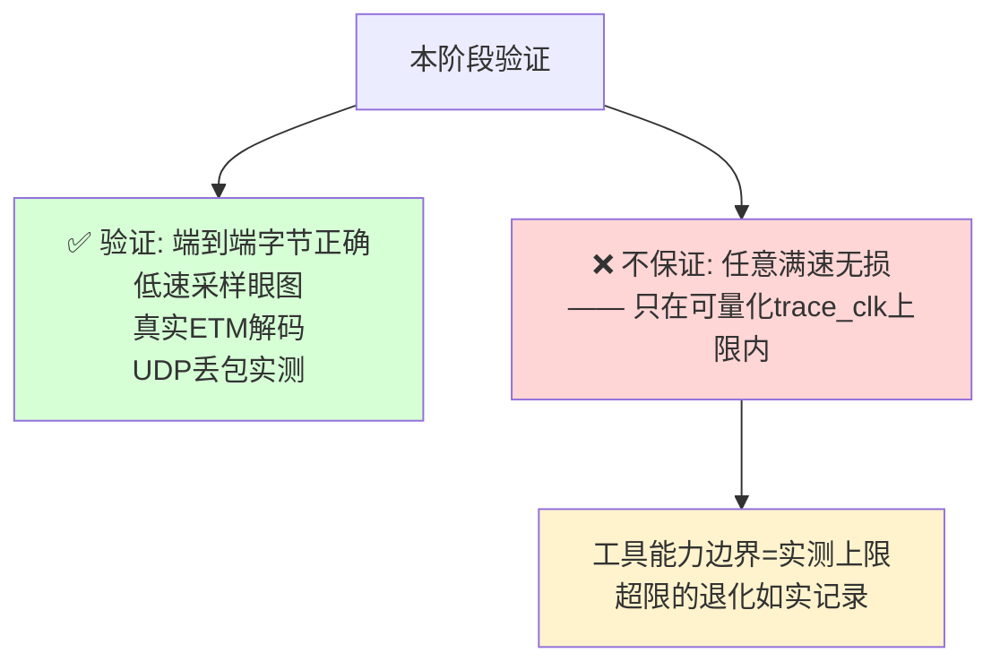

# Orbtrace Artix-7 移植 · 第四阶段计划书（trace 数据通路端到端打通）

> 前置：第三阶段（上板 bring-up）已完成三道单元门——JTAG 点灯、STM32 ETM 自验（示波器确认 4-bit trace 出数据）、千兆网口 RGMII 链路（UDP 双向环回实测通过）。见 `stage3-bringup/`。
> 本阶段目标：**把三个已验证的孤岛连成一条链——`trace 引脚 → traceIF 采样/解帧 → OrbFlow/COBS 组帧 → UDP 出口 → PC Orbuculum 解码`——并端到端解出真实执行流。**
> 关键原则：**每一关只引入一个新的未知量**，每一关都有「已知输入 → 可观测输出 → 可证伪判据」。先摘数字段与工具链（仿真已覆盖、硬件没跑过），把物理命门单独拎出来用眼图判收，最后才放真实不可控输入进来。

---

## 0. 为什么这是一个独立 stage

S3 验证的是**单元能力**（能烧、能配 ETM、网口能通），但三者各自孤立。S4 是第一次把它们**串成数据流**，它有自己独立的命门：

- **物理采样**：源同步采样相位、IDELAY 校准、眼图余量——这是红蓝博弈一贯认定的真命门，仿真不背书（见 `PLAN.md` §4 边界声明）。
- **UDP 鲁棒性**：丢包 / 乱序到底有多严重，要不要重传——之前一直是悬而未决的设计问题。
- **Orbuculum 真集成**：`PLAN.md` 的 S6 明确把「编译 C 上位机 + 网络源实时 ingest」**留到有真实数据流的硬件阶段**，就是现在。

所以它不是 S3 的延续，是一个新阶段。

---

## 1. 现状盘点

### 已验证的三个孤岛

| 孤岛 | 证据 | 文档 |
|------|------|------|
| STM32 ETM 发 4-bit trace | 示波器确认 TRACECLK + TRACED0..3 出数据 | `stage3-bringup/02-stm32-etm-enable.md` |
| FPGA RGMII ↔ PC UDP 链路 | `.42` UDP 1234 环回原样回显，因果开关实验闭环 | `stage3-bringup/03-rgmii-net-link.md` |
| trace 解帧/解码**逻辑** | `pytest tests/` 11 passed，真实 ITM TPIU 帧位级解出 | `PLAN.md` S1–S6 |

### 中间未验证的链（本阶段要打通）

红色=物理命门（没在硬件上跑过），绿色=已验证（net_test），黄色=工具链待集成。

### 可复用资产

- **net_test 网络顶层**：已验证的 RGMII + UDP 出口（`syn/artix7/bringup/`），可作为出口骨架。
- **traceIF.v / trace/*.py**：解帧/组帧 RTL + Amaranth 逻辑，仿真已绿。
- **etm_enable.cfg**：STM32 ETM 使能序列，trace_clk 可调。
- **deskew 方案**：`proposals/12-deskew方案选型.md` 已定「FPGA 出原始采样 + PC 端扫 tap 算眼心」。

---

## 2. 验证阶梯（任务分解）

```mermaid
graph TD
    V0[V0 数字回环<br/>golden帧→UDP→PC] --> V1[V1 物理采样回环<br/>已知pattern绕板一圈]
    V1 --> V2[V2 接真实STM32 ETM<br/>低速]
    V2 --> V3[V3 Orbuculum 真集成]
    V3 --> V4[V4 升速逼命门<br/>+UDP鲁棒性]
    V4 --> GATE{端到端解出<br/>正确执行流?}
    GATE --> DONE[阶段完成]

    V0 -.可提前并行.-> V3
    style V0 fill:#e6f0ff
    style V1 fill:#ffd6d6
    style V4 fill:#ffd6d6
    style GATE fill:#fff3cd
    style DONE fill:#d6ffd6
```

阶梯顺序刻意为：**先摘数字段（V0）和工具链（V3 可提前），把物理命门（V1/V4）单独拎出来眼图判收，最后才让真实不可控输入（V2）进来。** 任何一关挂了，未知量唯一。

### V0 · 数字回环（不接 STM32，纯 FPGA 自产自销）✅
- **输入**：FPGA 内部一个 **golden TPIU 帧发生器**（常量 ROM：同步字 `0xFFFF_FFFF`/`0x7FFF_FFFF` + 已知 ITM 包），直接喂进 traceIF 下游，**绕过物理采样**。
- **出口**：走已验证的 UDP 把帧发到 PC。
- **判据**：PC 收到的字节 == 塞进去的 golden（逐字节）。
- **目的**：验证「组帧 → UDP 出口」这条 RTL 在真硅片上字节无误，把这段从未知里摘掉。纯数字，最稳，**为后面所有阶段打地基**。
- [x] golden 帧发生器 RTL + 接入 net_test 出口（端口 5000；端口 1234 echo 保留为网络回归）
- [x] PC 端收包比对脚本（golden 对拍，`v0_golden_check.py`）
- [x] **实测通过**：len 8/32/64/100/128/200，128B×500 迭代 0 mismatch / 0 lost；过程中 V0 抓到一个真实位置计数 bug（sync 前缀每 32B 重复）并修复。详见 `stage4-datapath/01-v0-golden-egress.md`

### V1 · 物理采样回环（自发自收，验时序不验内容）✅
- **输入**：不依赖 STM32——FPGA 自己发已知 TPIU 帧 pattern，板上跳线绕回 trace 输入引脚（GPIO1 内部回环）。
- **判据（对齐 orbtrace）**：环回数据喂上游 `traceIF.v`，扫 IDELAY tap 0–31，看每 tap 「traceIF 解出的帧 == golden 且无坏帧」，找眼心。
- **目的**：把 deskew 方案（`proposals/12`）落地第一步，产出最佳 tap。真命门的第一次正面接触。
- [x] IDELAYE2 + tap 写入通道（trace_eyescan FSM 扫 tap）
- [x] PC 端眼图读出脚本（`eyescan_read.py`，UDP :5001）
- [x] **实测通过**：tap 18-31 共 14 个 tap 干净开眼，best_tap=24，traceIF 解出 `1234…0f` 逐字节正确。
- **关键产出**：① 判据必须用 orbtrace 的 traceIF（sync 锁定 + isREsync 自动处理上升/下降沿），别自造 bit 校验器；② **源同步采样时钟必须用 BUFR_IO 而非 BUFG**（上板坐实 HG-2）；③ 诊断纪律：iverilog 仿真先定位「逻辑对、是物理相位问题」再上板。详见 `stage4-datapath/03-v1-eyescan-loopback.md`

### V2 · 接真实 STM32 ETM（低速）✅（采样+解帧部分）
- **输入**：STM32 ETM 配低 trace_clk（TPIU /16 prescale），跑真实指令流。
- **判据（EXT_SRC 模式）**：内容每帧变，改判「每 tap traceIF 锁 sync 吐出的帧数」，高且稳=相位对。
- [x] 拆自环、STM32 PE2-6 → FPGA trace 输入脚 + 共地；`etm_enable.cfg` 打开 ETM
- [x] eyescan 加 `EXT_SRC` 参数（不驱动 pattern、任何解出帧都计数）
- [x] **实测通过**：眼心 tap 27-29 簇、best_tap=28 稳定复现；解出帧内容随执行流变化（真实 trace 指纹）；眼心信噪比 ~200×。详见 `stage4-datapath/05-v2-stm32-trace.md`
- **诚实观察**：V2 眼图不连续（数据稀疏 + 固定窗口的拍频假象），tap 27-29 簇最可信；待收尾改「定帧数计时」消除涨落。
- [ ] 把 traceIF 帧接进 TPIU demux→OrbFlow→UDP 送 PC（V2 收尾 / 接 V3）
- [ ] lost_cnt 暴露
- [ ] traceIF 采样前端接真实 trace 引脚（V1 的 tap 落地）
- [ ] trace_lost_cnt 接入 OrbFlow 并从 UDP 暴露
- [ ] 低速端到端解出可控 payload

### V3 · PC 端 Orbuculum 真集成（可与 V0/V1 并行）
- **背景**：`PLAN.md` S6 把 orbuculum（meson + libusb 的 C 项目）的完整集成明确留到本阶段，避免早期引入重依赖。
- **判据**：Orbuculum 从 UDP/网络源实时 ingest，解出**正确的函数跳转 / PC 流**，和 STM32 实际跑的代码对得上。
- [x] 编译 orbuculum（meson + ninja，2.2.0）
- [x] **根因定位**：裸 TPIU 帧喂 orbuculum 打散到杂 tag，因 FPGA 侧少做了 orbtrace 后 6 级管线；orbuculum 期望 OFLOW 格式（见 `stage4-datapath/06/07`）
- [x] **A 路线**：FPGA 侧补全 traceIF→tpiu_demux→checksum→cobs→super_framer，输出原生 OFLOW（`trace_orbflow_top.v`，iverilog elaboration 通过；待上板）
- [x] 工程化固化：`build.sh`/`program.sh`/`etm_enable.sh`/`capture.sh`/`decode.sh` + QSPI flash 固化（`flash_program.tcl`，IS25LP128F）
- [x] **上板 A/B 实测推翻 A 路线**：OrbFlow（过 tpiu_demux）解出 **0** I-sync 锚点（demux 把裸 ETM 流搅毁）；trace_stream（只到 traceIF 帧、不过 demux）稳定 **14-15** 锚点 → 真 PC。坐实**我们的裸流不能过 tpiu_demux**（见 `stage4-datapath/10` §8）。
- [x] **确定正确路线（消去法）**：FPGA 出 traceIF 字节流 → PC 端 `etm35lib` **直接按 ARM 规范锚定 I-sync**（绕过 tpiu_demux，对应 orbtrace bypass 语义）。
- [x] **端到端实测通过**：`trace_run.sh`(配 ETM→re-arm trace_stream→dump→`etm_decode_cli.py`)上板解出 **真实函数链**（`HAL::HAL_Update`/`draw_label`/`draw_x_ticks`/`lv_theme_default_init`/`lv_timer_handler` 等,带 file:line),与 LVGL widgets demo 吻合。
- [x] **工具链测试**：`etm35lib` 53 用例 100% 行覆盖 + 真实抓取回归 fixture；ARM 规范(IHI0014Q/DDI0440C)交叉核对(`08`)。
- 收尾(可选增强)：per-A-sync 子字节重对齐 + region 续解延长连续流；OrbFlow seq number + UDP 丢包统计(V4)。

### V4 · 连续流增强 + 升速命门 + UDP 鲁棒性
- **子字节重对齐(已完成)**：`etm35lib.decode_region_realign`/`decode_all_realign` 在错位处试 1..7 bit 移位续解,实测把解码事件延长最多 3.3×(`stage4-datapath/11`)。**诚实边界**:I-sync 锚点是真值,重对齐延长流是指示性(无独立佐证)。CLI `--realign` opt-in。
- [x] per-A-sync 子字节重对齐 + region 续解(63 用例/98% 覆盖)
- **升速**：逐步抬 trace_clk 到目标速率，看 V1 眼图余量、lost_cnt、UDP 丢包/乱序随速率的退化曲线。
- **UDP 鲁棒性**（回应「UDP 怎么防丢包/乱序」）：先**加 seq number 进 OrbFlow 帧**，PC 端统计丢失/乱序率，**用数据说话**该不该上重传 / FEC，而不是拍脑袋提前做。
- **判据**：在某个可量化的 trace_clk 上限内，lost_cnt==0 且 PC 解码无错；超过则记录退化点作为工具能力边界。
- [ ] OrbFlow 帧加 seq number
- [ ] PC 端丢包/乱序统计
- [ ] 升速退化曲线 + 工具能力边界数字
- **根治字节对齐(硬件方向)**：4-bit 口非字节对齐是 PC 端 trick 无法根治的;要让延长流也变铁证,需 FPGA 侧做真正的 TPIU formatter 重封装(像 ORBTrace),让流天然字节对齐。列为后续硬件增强。

---

## 3. 贯穿手段：让 2-LED 板子「可观测」

板上只有 2 个用户可控 LED（M18/N18），所以可观测性要靠别的：

| 手段 | 用途 | 阶段 |
|------|------|------|
| **UDP status 端口** | `lost_cnt / bad_sync_cnt / 当前tap / sync状态` 做成可 query 的 UDP 端口（类比现 1234 echo） | 全程基础设施 |
| **VIO** | 在线改 IDELAY tap / 复位，不重综合 | V1 调相位 |
| **ILA** | 抓 RGMII / trace 波形、AXIS 流 | V1/V2 调试 |
| **LED 频率编码** | 慢闪=好/快闪=坏/灭=没发生，一眼区分 | 全程粗状态 |
| **CH340 串口** | 右边 Type-C，print 调试 / 触发 | 备用 |

**每一阶一个独立最小 bitstream**（像 net_test 一样），不一上来就全集成。

---

## 4. 完成判据

| 编号 | 判据 | 手段 |
|------|------|------|
| W-0 | golden 帧经 FPGA RTL → UDP → PC，逐字节一致 | V0 对拍脚本 |
| W-1 | IDELAY tap 扫描出每 lane 眼心，眼图窗口 ≥ 目标 UI | V1 眼图脚本 |
| W-2 | 低速真实 ETM：sync 稳、lost_cnt==0、payload 对得上 | V2 端到端 |
| W-3 | Orbuculum 实时解出正确函数跳转流 | V3 与 golden 程序对拍 |
| W-4 | 给出可量化的 trace_clk 无损上限 + UDP 丢包率曲线 | V4 升速测试 |

**只有 W-0~W-4 全绿，才算 trace 工具端到端 PoC 成立。** 其中 W-1/W-4 是平台命门，必须用眼图 / 实测数字判收，仿真绿不为其背书。

---

## 5. 明确边界（防误读）

- 工具的承诺不是「任意满速无损」，而是「在实测可量化的 trace_clk 上限内无损」（沿用 r04/r09 一贯定义）。
- V4 的产出是**一条退化曲线 + 一个边界数字**，不是「无限带宽」。

---

## 6. 工作流约定（沿用）

- 分支 `artix7-port`；提交 Conventional Commits，body 详述改动 + 验证。
- 每一阶 bitstream 综合后跑 DRC，RTL 改动跑 `pytest tests/` + iverilog 回归。
- 物理命门（V1/V4）结论必须附实测数据（眼图 / tap 表 / 丢包率），不靠估算。
- 文档：本阶段调试踩坑续写到 `stage3-bringup/`（或视量另起 `stage4-datapath/`），方案/评审归 `proposals/`、`reviews/`。

---

## 7. 建议起步

**先做 V0**——它复用已验证的 UDP 出口，只加一个 golden 帧发生器，风险最低，又能立刻验证「组帧 RTL 在真硅片上对不对」，为后续所有阶段打地基。V3（编 Orbuculum）不依赖硬件，可并行提前启动。
