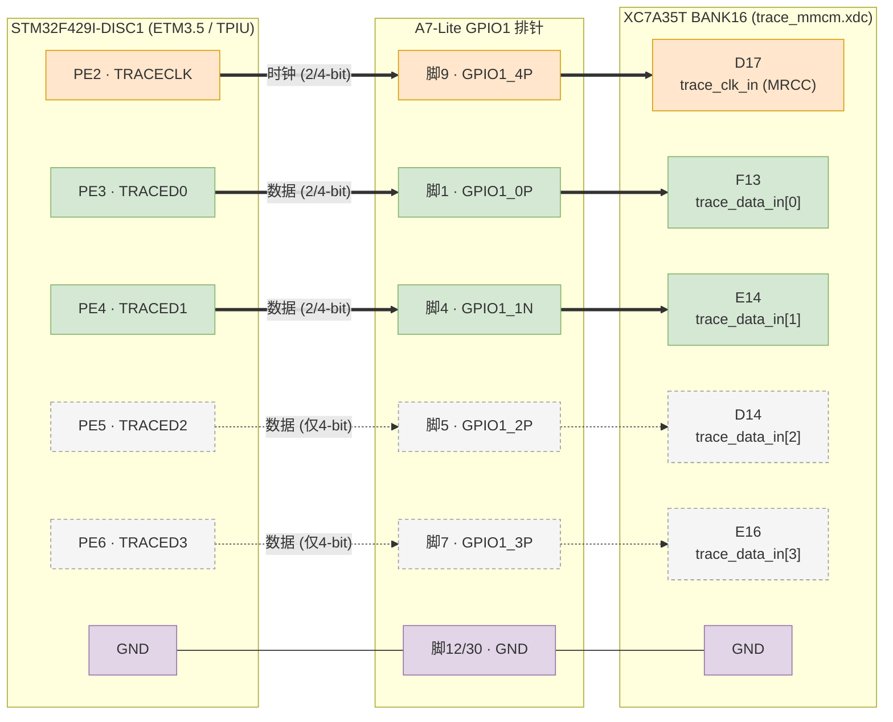
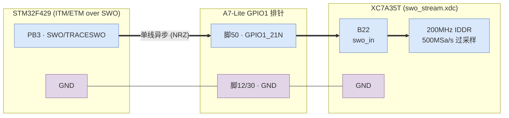
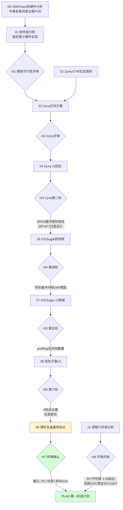

# Orbtrace Artix-7 移植项目文档

本目录记录将 ORBTrace 移植到 **Artix-7 + 千兆以太网出口**、用于 Cortex-M 指令流 trace 的全过程文档，包括方案设计、红蓝对抗评审、以及落地计划。

- Fork：`git@github.com:FASTSHIFT/orbtrace.git`（remote `fork`）
- 上游：`orbcode/orbtrace`（remote `origin`，保留同步能力）
- 开发分支：`artix7-port`

---

## 目录结构

```
docs/artix7-port/
├── README.md          # 本索引
├── PLAN.md            # 第一阶段计划书（无硬件仿真验证）✅
├── PLAN_STAGE2.md     # 第二阶段计划书（选板与 OOC 综合）✅
├── PLAN_STAGE4.md     # ★ 第四阶段计划书（trace 数据通路端到端打通）—— 当前在做
├── stage3-bringup/    # 第三阶段上板 bring-up 踩坑记录（点灯 / ETM / 网口）✅
├── proposals/         # 蓝方方案（按演进顺序 00→14）
└── reviews/           # 红方评审（按轮次 r01→r11）
```

> 阶段编号说明：第三阶段「上板 bring-up」以 `stage3-bringup/` 目录记录（点灯、STM32 ETM 自验、千兆网口链路三道单元门）。第四阶段把这些孤岛连成数据流，见 `PLAN_STAGE4.md`。

---

## Trace 引脚接线（STM32F429 → A7-Lite GPIO1）

STM32F429 的 4-bit 并口 ETM trace（TPIU）引脚全部集中在端口 E（PE2~PE6），接到 A7-Lite 的 **GPIO1 排针**，再由排针连到 XC7A35T 的 BANK16 输入引脚。

映射三方对齐来源：
- **FPGA 引脚**：工程约束 `syn/artix7/bringup/rtl/trace_mmcm.xdc`（`trace_clk_in` / `trace_data_in[3:0]`）
- **排针↔FPGA 引脚**：官方 `A7_LITE_GPIO.xlsx`（GPIO1 sheet）
- **STM32 引脚**：ETM3.5 TPIU 固定复用（PE2=TRACECLK，PE3~PE6=TRACED0~3）

| STM32 引脚 | 信号 | GPIO1 排针脚位 | 排针信号名 | FPGA 引脚 | I/O 标准 | 备注 |
|-----------|----------|:---:|-----------|:---:|-----------|------|
| PE2 | TRACECLK | 9 | GPIO1_4P | **D17** | LVCMOS33 | MRCC 时钟专用脚，进 MMCM |
| PE3 | TRACED0  | 1 | GPIO1_0P | F13 | LVCMOS33 | 2-bit 模式必接 |
| PE4 | TRACED1  | 4 | GPIO1_1N | E14 | LVCMOS33 | 2-bit 模式必接 |
| PE5 | TRACED2  | 5 | GPIO1_2P | D14 | LVCMOS33 | 仅 4-bit 模式 |
| PE6 | TRACED3  | 7 | GPIO1_3P | E16 | LVCMOS33 | 仅 4-bit 模式 |
| GND | 共地 | 12 或 30 | GND | — | — | 必须共地 |

> **2-bit（产品目标形态）**：只需接 PE2/PE3/PE4 → 排针脚 9/1/4（TRACECLK + TRACED0/1），IO 更省。
> **4-bit（交叉验证用）**：再补 PE5/PE6 → 排针脚 5/7。
> TRACECLK 落在 MRCC 引脚 D17 上，是为了让采样 MMCM 的专用时钟布线成立（见 `trace_mmcm.xdc` 注释）。

### 接线图



> 图例：实线 = 2-bit / 4-bit 都需要；虚线 = 仅 4-bit 模式接。橙色=时钟，绿色=必接数据，灰虚=可选数据，紫色=地。

### SWO 单线 trace（支线，与并口互斥）

除并口 ETM trace 外，FPGA 还实现了 **SWO 单线** trace 前端（`swo_stream_top.v` + `swo_iddr_capture.v`，提案 15/17）。SWO 只用一根异步单线，无独立时钟——FPGA 用自由运行的 200MHz 参考时钟 + IDDR 双沿过采样（500 MSa/s）在 fabric 内解出 NRZ 字节流。SI 简单（杜邦线即可）但带宽受限（UART ≤12Mbaud≈1.2MB/s），用途见 `../swo-trace-sidetrack/`，可作满速并口的黄金对照基线。

| STM32 引脚 | 信号 | GPIO1 排针脚位 | 排针信号名 | FPGA 引脚 | I/O 标准 | 备注 |
|-----------|----------|:---:|-----------|:---:|-----------|------|
| PB3 | SWO / TRACESWO | 50 | GPIO1_21N | **B22** | LVCMOS33 | 异步单线，200MHz IDDR 过采样 |
| GND | 共地 | 12 或 30 | GND | — | — | 必须共地 |

> 引脚来源：`syn/artix7/bringup/rtl/swo_stream.xdc`（`swo_in`=B22）+ GPIO 表（脚50=GPIO1_21N=B22）。B22 是当初通过边界扫描 SAMPLE 探到用户实际插 SWO 线的脚位。



---

## 这是一场"红蓝对抗"式的选型推演

为避免一拍脑袋选型，本项目用 **蓝方（提方案）vs 红方（拆台质疑）** 的多轮对抗，把一个模糊想法逼成可落地的工程决策。文档按"蓝方提案 → 红方评审 → 蓝方修正"的节奏交替推进。



---

## 最终结论（六轮收敛）

**采用方案丙**：PC+调试器验证 ETM 配置/解码链路 + 仿真 testbench 验证逻辑 + 只买一块 Artix-7+FT601/千兆网。**先做无硬件仿真验证（见 `PLAN.md`），暂不折腾板子。**

被否方案与核心原因：

| 方案 | 否决原因 |
|------|---------|
| 自制 ORBTrace PCB | 软硬件双未知；主板 KiCad 未开源 |
| RK3506 + DSMC | DSMC 无公开带宽/时序数据，不可立项 |
| Zynq 正向开发 | 对 F4/F7 过度设计；DDR3 缓冲是类别错误（抗失速缓冲须在 DMA 上游） |
| iCESugar 抓快照 | 环形缓冲冲掉 UAF 根因；串口导出分钟级；profiling 无时间数据 |
| 双轨并行 | A 轨非必需（能隔离的不需 FPGA / 仿真更优 / 对满速零证明力） |

**唯一不变的命门**：上板后的满速源同步采样 + 信号完整性，必须单独立 PoC，用眼图/时序硬阈值判收，仿真绿不为其背书。

---

## proposals/（蓝方方案）

| 文件 | 内容 |
|------|------|
| `00-orbtrace-硬件软件分析报告.md` | ORBTrace 软硬件分析、作者开源边界、可移植性 |
| `01-软件层分析与精简硬件可行性.md` | gateware 数据通路分析、能否用更少硬件实现 |
| `02-zynq-etm生态调研与定位.md` | 有无人用 Zynq 做 ETM trace、能否替代 J-Trace |
| `03-zynq正向开发方案.md` | Zynq-7000 正向方案 |
| `04-zynq方案v2-蓝方回应.md` | 回应 Zynq 第二轮评审 |
| `05-精简硬件可行性v2-蓝方回应.md` | 回应精简可行性评审（含 RK3506） |
| `06-icesugarpro抓快照方案.md` | iCESugar-Pro 抓快照方案 |
| `07-icesugarpro方案v2.md` | iCESugar 降格正名（链路验证+轻量 profiling）|
| `08-双轨方案v3.md` | iCESugar + Artix 双轨并行 |
| `09-博弈复盘与最终结论.md` | ★ 六轮复盘与最终选型 |
| `10-逻辑门开销分析表.md` | LUT/FF/BRAM 开销估算（35T 是否够）|

## reviews/（红方评审）

| 文件 | 对应 |
|------|------|
| `r01-精简硬件可行性评审.md` | 评 01/05 |
| `r02-zynq正向方案评审.md` | 评 03 |
| `r03-zynq方案v2第二轮.md` | 评 04 |
| `r04-icesugarpro抓快照第四轮.md` | 评 06 |
| `r05-icesugarpro-v2第五轮.md` | 评 07 |
| `r06-双轨方案v3第六轮.md` | 评 08 |
| `r07-博弈复盘终审确认.md` | 评 09（终审）|
| `r08-逻辑门开销分析表评审.md` | 评 10 |

---

## 当前进度

- [x] 选型收敛（方案丙）
- [x] fork + remote 配置 + `artix7-port` 分支
- [x] 文档归档
- [x] **第一阶段：无硬件仿真验证** —— 逻辑层非平台风险已消化（`pytest tests/` 11 passed + iverilog 物理层组帧/重同步/真实数据，详见 `PLAN.md`），过程中修复 2 个真实缺陷
- [x] **第二阶段：选板与 OOC 综合** —— 以太网栈 OOC 综合定板、采样前端原型综合、真实时钟约束时序收敛（详见 `PLAN_STAGE2.md`）
- [x] **第三阶段：上板 bring-up** —— 三道单元门全通：JTAG 点灯、STM32 ETM 自验（示波器确认 4-bit trace）、千兆网口 RGMII 链路（UDP 双向环回实测）。踩坑记录见 `stage3-bringup/`
- [ ] **第四阶段：trace 数据通路端到端打通** —— 把三个孤岛连成 `trace 引脚→traceIF→OrbFlow→UDP→Orbuculum` 数据流，端到端解出真实执行流（详见 `PLAN_STAGE4.md`，验证阶梯 V0→V4）
- [ ] **第五阶段：满速 PoC** —— 升速逼满速源同步采样命门，眼图 / 丢包实测定工具能力边界

---

## 相关支线任务

- **SWO 单线 trace 能力边界探索**：[`../swo-trace-sidetrack/`](../swo-trace-sidetrack/README.md)
  - 在 STM32F429 上实测 ITM/ETM-over-SWO 的可行性与边界，为本主线"为何必须并口高速 trace"提供实测依据。
  - 关键结论：SWO 单线 SI 简单（杜邦线即可）但带宽受限（UART ≤12Mbaud≈1.2MB/s）、M4 ETM 无地址过滤、ETM+ITM 不能经 SWO 混流；满速实时 + 多源时间戳对齐必须走并口 trace。
  - 副产物：可复现的 SWO/ETM/ITM 解码链路（CH343P + orbuculum/orbmortem），**可作为 Stage5 满速 PoC 的黄金对照基线**（同固件下用 SWO 解出的指令流校验并口数据通路）。
  - 工具补丁：orbuculum 的 CH343/稀疏同步适配已提交 fork 分支 `feature/ch343-swo-sparse-sync`。
