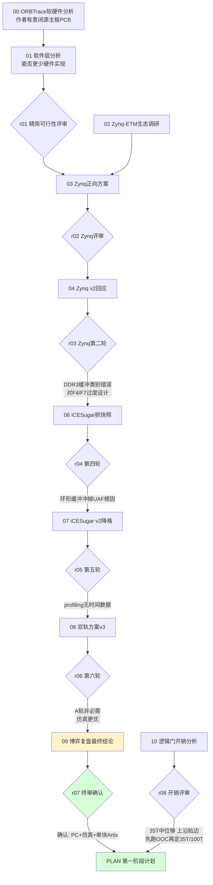

# Orbtrace Artix-7 移植项目文档

本目录记录将 ORBTrace 移植到 **Artix-7 + 千兆以太网出口**、用于 Cortex-M 指令流 trace 的全过程文档，包括方案设计、红蓝对抗评审、以及落地计划。

- Fork：`git@github.com:FASTSHIFT/orbtrace.git`（remote `fork`）
- 上游：`orbcode/orbtrace`（remote `origin`，保留同步能力）
- 开发分支：`artix7-port`

---

## 目录结构

```
docs/artix7-port/
├── README.md          # 本索引
├── PLAN.md            # ★ 第一阶段计划书（无硬件仿真验证）—— 当前在做
├── proposals/         # 蓝方方案（按演进顺序 00→10）
└── reviews/           # 红方评审（按轮次 r01→r08）
```

---

## 这是一场"红蓝对抗"式的选型推演

为避免一拍脑袋选型，本项目用 **蓝方（提方案）vs 红方（拆台质疑）** 的多轮对抗，把一个模糊想法逼成可落地的工程决策。文档按"蓝方提案 → 红方评审 → 蓝方修正"的节奏交替推进。



---

## 最终结论（六轮收敛）

**采用方案丙**：PC+调试器验证 ETM 配置/解码链路 + 仿真 testbench 验证逻辑 + 只买一块 Artix-7+FT601/千兆网。**先做无硬件仿真验证（见 `PLAN.md`），暂不折腾板子。**

被否方案与核心原因：

| 方案 | 否决原因 |
|------|---------|
| 自制 ORBTrace PCB | 软硬件双未知；主板 KiCad 未开源 |
| RK3506 + DSMC | DSMC 无公开带宽/时序数据，不可立项 |
| Zynq 正向开发 | 对 F4/F7 过度设计；DDR3 缓冲是类别错误（抗失速缓冲须在 DMA 上游） |
| iCESugar 抓快照 | 环形缓冲冲掉 UAF 根因；串口导出分钟级；profiling 无时间数据 |
| 双轨并行 | A 轨非必需（能隔离的不需 FPGA / 仿真更优 / 对满速零证明力） |

**唯一不变的命门**：上板后的满速源同步采样 + 信号完整性，必须单独立 PoC，用眼图/时序硬阈值判收，仿真绿不为其背书。

---

## proposals/（蓝方方案）

| 文件 | 内容 |
|------|------|
| `00-orbtrace-硬件软件分析报告.md` | ORBTrace 软硬件分析、作者开源边界、可移植性 |
| `01-软件层分析与精简硬件可行性.md` | gateware 数据通路分析、能否用更少硬件实现 |
| `02-zynq-etm生态调研与定位.md` | 有无人用 Zynq 做 ETM trace、能否替代 J-Trace |
| `03-zynq正向开发方案.md` | Zynq-7000 正向方案 |
| `04-zynq方案v2-蓝方回应.md` | 回应 Zynq 第二轮评审 |
| `05-精简硬件可行性v2-蓝方回应.md` | 回应精简可行性评审（含 RK3506） |
| `06-icesugarpro抓快照方案.md` | iCESugar-Pro 抓快照方案 |
| `07-icesugarpro方案v2.md` | iCESugar 降格正名（链路验证+轻量 profiling）|
| `08-双轨方案v3.md` | iCESugar + Artix 双轨并行 |
| `09-博弈复盘与最终结论.md` | ★ 六轮复盘与最终选型 |
| `10-逻辑门开销分析表.md` | LUT/FF/BRAM 开销估算（35T 是否够）|

## reviews/（红方评审）

| 文件 | 对应 |
|------|------|
| `r01-精简硬件可行性评审.md` | 评 01/05 |
| `r02-zynq正向方案评审.md` | 评 03 |
| `r03-zynq方案v2第二轮.md` | 评 04 |
| `r04-icesugarpro抓快照第四轮.md` | 评 06 |
| `r05-icesugarpro-v2第五轮.md` | 评 07 |
| `r06-双轨方案v3第六轮.md` | 评 08 |
| `r07-博弈复盘终审确认.md` | 评 09（终审）|
| `r08-逻辑门开销分析表评审.md` | 评 10 |

---

## 当前进度

- [x] 选型收敛（方案丙）
- [x] fork + remote 配置 + `artix7-port` 分支
- [x] 文档归档
- [x] **第一阶段：无硬件仿真验证** —— 逻辑层非平台风险已消化（`pytest tests/` 11 passed + iverilog 物理层组帧/重同步/真实数据，详见 `PLAN.md`），过程中修复 2 个真实缺陷
- [ ] **第二阶段：选板与 OOC 综合** —— 以太网栈 OOC 综合定板（35T/100T），选板 datasheet 门（TRACECLK 落 MRCC 等）
- [ ] **第三阶段：上板 PoC** —— 采样前端移植（ECP5→Artix ISERDES/IDELAY）、满速源同步采样眼图/时序、千兆网出口带宽实测
