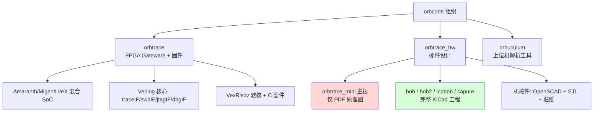
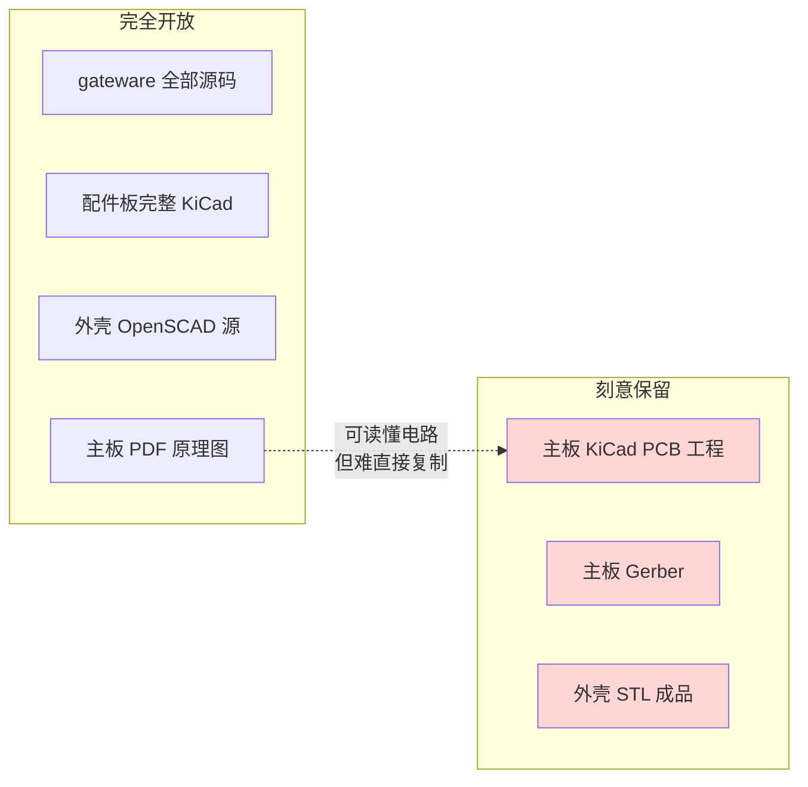
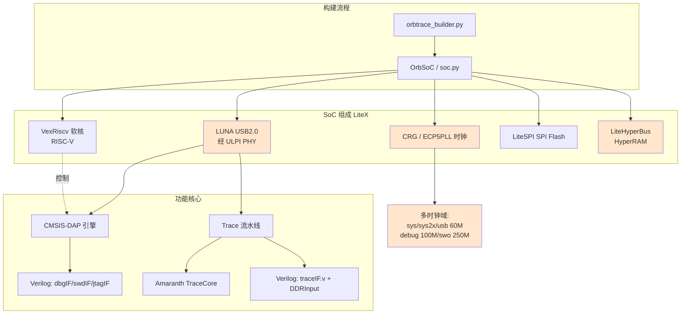
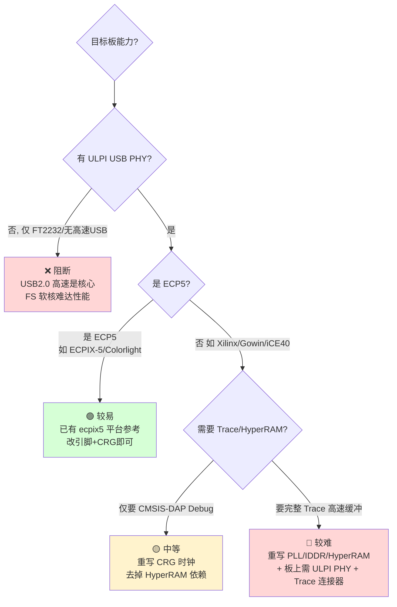
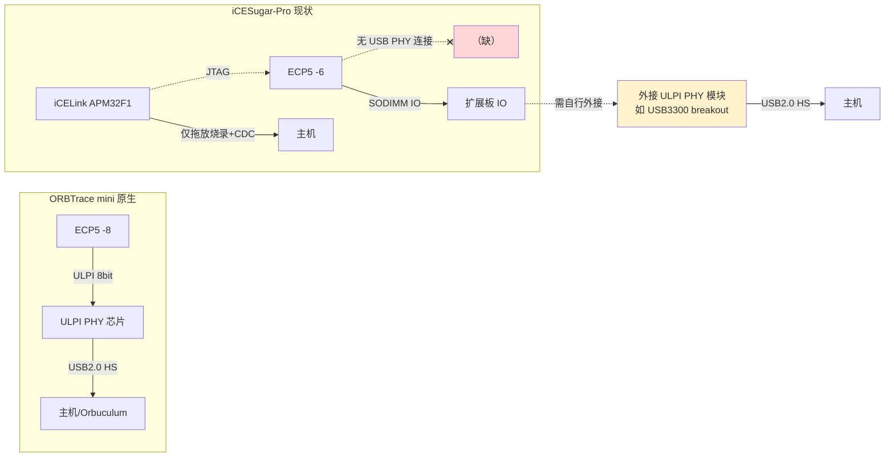
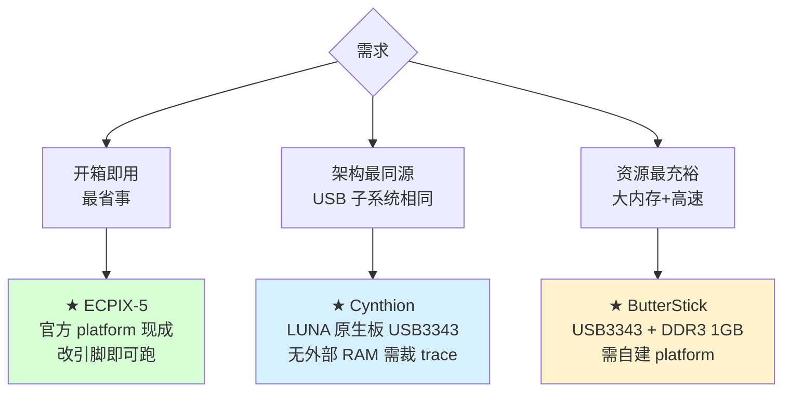
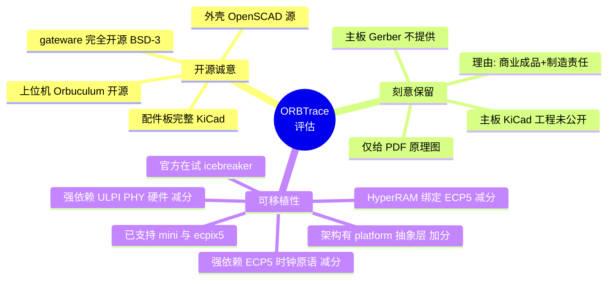

# ORBTrace 软硬件开源现状与可移植性分析报告

> 分析对象：`orbcode/orbtrace`（FPGA gateware）+ `orbcode/orbtrace_hw`（硬件）
> 分析日期：2026-06-06
> 结论速览：**主板 KiCad 工程确属"有意未完整开源"，但并非藏私；gateware 与特定硬件强耦合，移植到"烂大街"FPGA 板可行但工作量中等偏上。**

---

## 1. 项目概览

ORBTrace 是一个面向 ARM Cortex-M 的调试/追踪探针，提供两大能力：

- **Debug**：CMSIS-DAP v1（HID）/ v2（Bulk）接口，支持 JTAG 与 SWD，已对 BlackMagic、OpenOCD、pyOCD 验证。
- **Trace**：1–4 bit 并行 TRACE（TPIU）+ SWO，通过 USB Bulk 端点输出，配合 Orbuculum 上位机。

代码起源于 2021-03-13 从 Orbuculum fork 而来（见 `ORIGINS.md`），主作者为 Vegard Storheil Eriksen 与 Dave Marples。许可证为 **BSD-3-Clause**（gateware 与硬件仓库一致）。

### 1.1 仓库分布



---

## 2. 核心问题一：作者是否有意不开源主板 KiCad 工程？

### 2.1 事实证据

通过对两个仓库 git 历史的核查，事实非常清楚：

**(a) gateware 仓库曾经包含硬件，后被迁出**

`orbtrace` 仓库历史中存在一次关键提交：

```
ca999ea  Cleanup and move subdirectories to other repositories  (2021-07-10)
```

该提交删除了以下 KiCad 文件（迁往 `orbtrace_hw`）：

| 被移除目录 | 内容 |
|-----------|------|
| `hw/bob/` | `bob.kicad_pcb` / `bob.sch` / `bob.pro` 等完整工程 |
| `hw/capure/` | `capure.kicad_pcb` / `capure.sch` 完整工程 |
| `hw/lcdbob/` | `lcdbob.kicad_pcb` / `lcdbob.sch` 完整工程 |

**(b) 硬件仓库 `orbtrace_hw` 中各板卡开源程度不一致**

| 板卡 | 角色 | 原理图 | PCB 可编辑源 | 结论 |
|------|------|--------|-------------|------|
| **orbtrace_mini** | **主产品板** | 仅 `orbtrace_mini_v1_0.pdf` | ❌ **无 .kicad_pcb / .sch** | **未开源工程** |
| bob | PMOD 转接板 v1 | ✅ + PDF | ✅ `.kicad_pcb`/`.sch` | 完整开源 |
| bob2 | PMOD 转接板 v2 | ✅ + PDF | ✅ `.kicad_pcb`/`.kicad_sch` | 完整开源 |
| lcdbob | LCD 转接板 | ✅ | ✅ `.kicad_pcb`/`.sch` | 完整开源 |
| capure | 采集板 | ✅ | ✅ `.kicad_pcb`/`.sch` | 完整开源 |
| orbmule | 演示靶板 | 仅 PDF (f4/f7) | ❌ | 未开源工程 |

主板还附带了 GreenPAK 配置（`orbtrace_ldo.gp5`、`serial_led_v2.gp6`），但这是可编程逻辑芯片的配置，不等于 PCB 源。

git 历史核查确认：**`orbtrace_mini` 的 KiCad 源文件从未被提交过**，并非"误删"或"待整理"。

### 2.2 作者的公开声明

`orbtrace_hw/README.md` 中作者明确表态（已改写以符合引用规范）：

> 这些材料以开放形式提供，供学习和改进之用。作者**刻意选择不提供** ORBTrace mini 的 Gerber 文件以及外壳的 STL，理由是使用者的制造工艺与他们不同；如需可来信索取。
>
> （Content was rephrased for compliance with licensing restrictions）

### 2.3 判断

**是的，作者是有意不完整开源主板工程，但这是一种"克制的开源"而非封闭：**



动机分析（基于公开信息推断）：

1. **保护商业销售**：ORBTrace Mini 是一款在售的成品硬件，保留 PCB 工程和 Gerber 可避免直接照搬量产，是常见的"开源设计、商业硬件"折中。
2. **质量/制造责任考量**：README 明确说"制造工艺不同"，避免他人用错误工艺生产后归因到项目。
3. **并非真正封闭**：提供了完整 PDF 原理图（电气上完全可读懂、可自行重画）、所有配件板的完整工程，且声明"need 可来信索取"。

> 小结：对工程师而言，**电路设计是透明的**（PDF 原理图全公开），缺的是"开盖即用"的 PCB 布局文件。这属于开源硬件社区中可接受的常见做法，不构成"假开源"。

---

## 3. 核心问题二：gateware 可移植性分析

### 3.1 技术栈与架构



代码使用了**三种 HDL 混合**：Migen/LiteX（SoC 骨架）+ Amaranth（trace 核心、USB 封装）+ 手写 Verilog（时序敏感的 SWD/JTAG/Trace 物理层）。三者通过 `amaranth_glue/wrapper.py` 桥接。

### 3.2 与硬件强耦合的部分（移植障碍）

| 模块 | 文件 | 厂商/平台绑定 | 移植难度 |
|------|------|--------------|---------|
| **时钟/PLL** | `crg_ecp5.py` | 直接实例化 ECP5 原语 `CLKDIVF`、`ECLKSYNCB`、`ECP5PLL`、DPA 动态相位 | 🔴 高 |
| **HyperRAM** | `hyperram.py` + `liblitehyperbus` | `HyperRAMX2` 依赖 ECP5 IDDR/ODDR + IODELAY 相位校准 | 🔴 高 |
| **USB PHY** | `soc.py add_usb` | 需要外部 **ULPI PHY 芯片**（如 USB3343），LUNA 走 ULPI | 🔴 高 |
| **Trace 输入** | `trace/glue.py` | `litex.build.io.DDRInput`（抽象，但依赖板上专用 trace clk 引脚 120MHz 约束） | 🟡 中 |
| **引脚映射** | `platforms/orbtrace_mini.py` | 全部引脚硬编码到 LFE5U-25F-8BG256 封装 | 🟡 中 |
| **SPI Flash 型号** | `flash_modules.py` | S25FL064L（mini）/ IS25LP256D（ecpix5），可换 | 🟢 低 |
| **DFU/Bootloader** | `dfu.py` + flash 分区 | 依赖 ECP5 `programn` 复位、固定 flash 偏移布局 | 🟡 中 |
| **Debug/Trace 引擎** | `verilog/*.v`、`trace/core.py` | 纯逻辑，厂商无关 | 🟢 低 |

### 3.3 移植友好的部分

- **核心 IP 与平台解耦良好**：项目本身已经支持两个平台（`orbtrace_mini` 和 `ecpix5`），证明作者在架构上做了 platform 抽象层（`platforms/*.py` + `get_crg`/`get_flash_module`/`add_leds`/`add_platform_specific`）。
- CMSIS-DAP 引擎、SWD/JTAG/Trace 物理层是平台无关的 Verilog/Amaranth。
- 构建系统基于 LiteX，理论上支持 LiteX 已适配的所有 FPGA（Xilinx 7-series、Lattice、Gowin 等）。
- 存在 `wip_icebreaker` 分支——**作者本人已在尝试移植到 iCEBreaker（iCE40）**，说明移植路径被项目方认可。

### 3.4 移植到"烂大街"FPGA 板的可行性评估



**结论分级：**

| 目标板类型 | 可行性 | 关键工作量 |
|-----------|--------|-----------|
| ECP5 系列开发板（Colorlight i5/i9、ECPIX-5、OrangeCrab） | ⭐⭐⭐⭐ 高 | 改引脚约束 + 复用现有 CRG；若板载或外接 ULPI PHY 则 USB 可用 |
| iCESugar-Pro（ECP5 25F，详见 3.6） | ⭐⭐ 中低 | 芯片对口，但**无 ULPI PHY 且主存为 SDRAM**，须外接 USB PHY 子板 + 换内存控制器 |
| iCE40（iCEBreaker 等） | ⭐⭐⭐ 中 | 官方已有 `wip_icebreaker` 分支；资源小，trace 功能可能裁剪 |
| Xilinx 7-series（Arty A7 等） | ⭐⭐ 中低 | 必须重写 `crg_ecp5.py` 全部 ECP5 原语为 MMCM/IDDR；HyperRAM 换 DDR3/裁剪；需外接 ULPI PHY |
| Gowin（Tang Nano 等廉价板） | ⭐ 低 | 时钟原语、IO、USB PHY 全部要重做；多数 Tang Nano 无 ULPI |

**核心拦路虎是 USB2.0 High-Speed**：本设计依赖外部 ULPI PHY 芯片（板上硬件），而绝大多数"烂大街"廉价 FPGA 板**没有 ULPI PHY**。没有它，USB 只能退回 Full-Speed 软核，传输带宽不足以支撑高速 Trace（项目主打卖点）。

### 3.5 务实的移植建议

1. **最低成本路线**：选一块 **带 ULPI PHY 的 ECP5 板**（或自行外接 USB3343 模块），从 `ecpix5.py` 平台模板派生，只改引脚 + flash 型号。这是阻力最小的路径。
2. **仅需 Debug（CMSIS-DAP）不要 Trace**：可在 `orbtrace_builder` 用 `--without-trace` 关闭 trace，省掉 HyperRAM 和高速 DDR 输入，移植面大幅缩小。
3. **非 ECP5 平台**：必须重写 `crg_ecp5.py`（约 130 行，含 `CLKDIVF`/DPA 动态相位/多时钟域），并替换 HyperRAM 后端。建议参考 LiteX 对应厂商的 clock/IO 模块。
4. 不要低估 trace 的时序：`traceIF.v` + `DDRInput` 在 120MHz trace clk 上做 DDR 采样，跨平台需重新做相位校准（mini 板用了 ECP5 IODELAY/DPA 来对齐）。

---

## 3.6 实例评估：iCESugar-Pro（Muse Lab）匹配度

针对淘宝在售的 **iCESugar-Pro**（Lattice ECP5 / SODIMM / 可跑 RISC-V Linux），结合官方硬件仓库 `wuxx/icesugar-pro` 的规格做逐项核对。

### 3.6.1 板卡关键规格 vs ORBTrace 需求

| 项目 | iCESugar-Pro 实际规格 | ORBTrace mini 所需 | 匹配 |
|------|----------------------|-------------------|------|
| **FPGA 芯片** | LFE5U-**25F**-**6**BG256C | LFE5U-25F-**8**BG256C | 🟢 同 die / 同封装，仅速度等级不同 |
| **速度等级** | -6（较慢） | -8（较快） | 🟡 Trace 120MHz DDR 采样时序余量偏紧 |
| **逻辑资源** | 24K LUT，1 个 PLL | mini 同为 25F，需 ≥2 个 PLL 输出域 | 🟡 25F 物理上够，但 CRG 用了 pll+pll2 两组，需确认 PLL 数量 |
| **主存** | 32MB **SDR SDRAM**（IS42S16160B） | **HyperRAM**（经 LiteHyperBus） | 🔴 类型不同，控制器不通用 |
| **SPI Flash** | W25Q256JV 32MB | S25FL064L（可换） | 🟢 改 `flash_modules.py` 即可 |
| **时钟** | 25MHz 晶振 | 30MHz（`clk30`） | 🟡 改 CRG 输入频率 + 重算 PLL 分频 |
| **USB2.0 PHY (ULPI)** | ❌ **无**，板载 USB 仅接 iCELink 调试器（APM32F1），用于拖放烧录 + CDC 串口 | **必须**有 ULPI PHY 供 LUNA 高速枚举 | 🔴 **致命缺失** |
| **JTAG/调试输出引脚** | 106 IO 经 SODIMM 引出（需扩展板） | debug/trace/gpio 一组引脚 | 🟢 引脚够，重写约束即可 |

### 3.6.2 决定性问题：没有 ULPI USB PHY

这是最关键的一点。ORBTrace 与上位机（Orbuculum / OpenOCD）的**全部通信都走 FPGA 自己的 USB2.0 高速接口**，而该接口依赖板上外置 **ULPI PHY 芯片**（mini 板用的方案）。

iCESugar-Pro 的 USB 口**只连到板载 iCELink 调试器（APM32F1 单片机）**，用途是把 bitstream 拖进虚拟 U 盘烧录、外加一路 CDC 串口——这条路**不通向 FPGA gateware 作为 USB 设备**。FPGA 本身没有任何 USB PHY 引脚连接。

后果：**不外接 ULPI PHY，ORBTrace gateware 根本无法向主机枚举**——连最基础的 CMSIS-DAP Debug 都用不了（因为它也走这条 USB）。



### 3.6.3 综合匹配度结论

**硅片层面匹配优秀，板级集成不匹配。** 评分：⭐⭐（中低，开箱不可用）

- **优点**：FPGA 型号几乎与 mini 同款（同 25F/BG256），LiteX/yosys/nextpnr 工具链完全一致，引脚资源充足，社区已有 LiteX 适配（Colorlight/iCESugar-Pro 平台）。
- **硬伤一（致命）**：板上无 ULPI USB PHY，且 FPGA 无 USB 连接。必须**外接一块 ULPI PHY 模块**（如基于 USB3300/USB3343 的 breakout）焊到 SODIMM 扩展板 IO 上，否则整个设备无法与主机通信。
- **硬伤二**：主存是 SDR SDRAM 而非 HyperRAM，需把 `hyperram.py` 换成 LiteX 的 SDR SDRAM 控制器，或在 Trace 缓冲设计上做相应改造。
- **次要**：25MHz 时钟（需改 CRG）、-6 速度等级（trace 高速时序余量需实测）、flash 型号（小改）。

**务实建议：**

1. 想用它做 ORBTrace，**第一步必须解决 USB PHY**——买/做一块 ULPI PHY 子板接到扩展板，并在新建 platform 文件里把 `ulpi` 引脚映射过去。这是绕不开的前提。
2. 主存换 SDRAM 控制器，或评估是否可在 25F 内用 BRAM 做小缓冲、牺牲部分 trace 深度。
3. 时钟域：以 `ecpix5.py` + `crg_ecp5.py` 为模板派生新平台，把输入改 25MHz、重算 PLL；先用 `--without-trace` 跑通 USB 枚举和 CMSIS-DAP，再逐步加 trace。
4. 若只是想要一个**便宜的 CMSIS-DAP 调试器**且能接受外接 ULPI PHY 的折腾，本板可行；若期望**开箱即用的高速并行 Trace**，本板不合适——它缺的正是 ORBTrace 赖以工作的两块板级硬件（ULPI PHY + HyperRAM）。

> 一句话总结：iCESugar-Pro 是"对的芯片，错的板级配套"。芯片选型几乎完美复刻 mini，但缺了 ORBTrace 的两大命脉外设（USB ULPI PHY 与 HyperRAM），属于"能改造但要动硬件"，不是纯改 gateware 就能点亮。

## 3.7 最接近的替代开发板（按匹配度排序）

判定"接近"的核心标准是**是否同时具备 ECP5 + 板载 ULPI USB2.0 PHY**——这两者是 ORBTrace 工作的前提（USB 走 LUNA + ULPI）。大容量 RAM（HyperRAM/DDR3）为加分项，但 trace 缓冲可裁剪，优先级低于 USB PHY。

### 3.7.1 候选板对比

| 开发板 | FPGA | ULPI USB PHY | RAM | 与 ORBTrace 匹配度 | 说明 |
|--------|------|-------------|-----|------------------|------|
| **ECPIX-5**（LambdaConcept） | ECP5 LFE5UM5G-85F | ✅ 板载 ULPI PHY | DDR3 + HyperRAM | ⭐⭐⭐⭐⭐ | **官方已支持**，`platforms/ecpix5.py` 现成；最稳妥选择 |
| **Cynthion**（Great Scott Gadgets） | ECP5 LFE5U-12F | ✅ **3× USB3343** ULPI | 仅片内 RAM | ⭐⭐⭐⭐ | LUNA 的原生参考板，USB 子系统与 ORBTrace 同源；无外部 RAM，trace 需裁剪 |
| **ButterStick**（r1.0） | ECP5 LFE5UM5G-85F | ✅ 高速 USB（USB3343 ULPI） | 最高 1GB DDR3 | ⭐⭐⭐⭐ | OrangeCrab 同作者，高速 USB + 大内存，资源充裕；需自建 platform |
| **OrangeCrab**（r0.2 / 85F） | ECP5 LFE5U-25F/85F | ❌ 仅 FPGA 直驱 USB **全速 FS** | DDR3 | ⭐⭐ | 无 ULPI PHY，USB 只能软核 FS，带宽不足以高速 trace |
| **iCESugar-Pro** | ECP5 LFE5U-25F | ❌ 无（USB 仅接 iCELink） | SDR SDRAM | ⭐⭐ | 见 3.6，芯片对口但缺 ULPI PHY + 非 HyperRAM |
| Colorlight i5/i9、ULX3S 等 | ECP5 | ❌ 多无 ULPI | SDRAM | ⭐⭐ | 同样卡在 USB PHY，需外接 |

### 3.7.2 三档结论



1. **最省事、最接近 → ECPIX-5**：ORBTrace 仓库里已经有 `ecpix5.py` 平台和对应 CRG，板上有 ULPI PHY，开发板自带 HyperRAM/DDR3。**这是字面意义上"现成支持"的板子**，无需改 gateware 核心，只需按需接线（trace/debug 走 PMOD）。代价是价格较高、非"烂大街"。
2. **USB 架构最同源 → Cynthion**：ORBTrace 的 USB 栈用的就是 Great Scott Gadgets 的 LUNA 库，Cynthion 是 LUNA 的原生硬件，板载 3 颗 USB3343 ULPI PHY，移植 USB 部分几乎零阻力。短板是只有片内 RAM，高速 trace 缓冲需要裁剪或外接。
3. **资源最足 → ButterStick**：ECP5-85F + 高速 USB（USB3343 ULPI）+ 最高 1GB DDR3，跑满 trace 深度毫无压力，但需要自己写 platform 文件并把 RAM 后端从 HyperRAM 换成 DDR3。

### 3.7.3 给"想便宜复刻"的建议

如果坚持要用**廉价国产板**（如 Colorlight、iCESugar-Pro、Tang），共同的拦路虎都是**没有 ULPI PHY**。最现实的低成本路线是：

- 选一块**便宜的 ECP5 板（Colorlight i5 / iCESugar-Pro）+ 外接一块 USB3343/USB3300 ULPI PHY 子板**，把 ULPI 引脚接到板上 IO，再以 `ecpix5.py` 为模板新建 platform。
- USB PHY 是绕不开的硬件投入；只要解决了它，其余（时钟、flash、RAM）都是改 gateware 的活儿。

> 结论：要"最接近且能直接用"，首选 **ECPIX-5**（官方支持）；要"USB 同源好移植"选 **Cynthion**；要"资源拉满"选 **ButterStick**。廉价板都需额外外接 ULPI PHY 才能谈匹配。

---

## 4. 总体结论



**关于开源诚意**：作者**有意**未公开主板（orbtrace_mini）的 KiCad PCB 工程和 Gerber，这是经过深思熟虑的决定（README 明确声明，git 历史佐证从未提交过），目的是保护在售成品并规避制造责任。但项目整体仍是诚实的开源项目——电路通过完整 PDF 原理图透明公开，所有配件板、外壳、gateware、上位机均完整开源。这属于"开源设计 + 商业硬件"的常见且可接受的折中，不是假开源。

**关于可移植性**：gateware 在架构层面做了平台抽象（已同时支持自家 mini 板和第三方 ECPIX-5），具备移植基础。但代码与 **Lattice ECP5** 深度绑定（时钟原语、IODELAY、HyperRAM 控制器），且功能依赖板上 **ULPI USB PHY** 这一外部芯片。

- 移植到**带 ULPI 的 ECP5 板**：容易，照搬 `ecpix5` 模板即可。
- 移植到**普通廉价 FPGA 板（Tang Nano / Arty 等）**：可行但工作量中等偏上，且常因缺少 ULPI PHY 而无法发挥高速 Trace 卖点——这类板子最现实的用法是只跑 **CMSIS-DAP Debug 子集**。

---

## 附录：关键证据索引

- 硬件迁出提交：`orbtrace` 仓库 `ca999ea "Cleanup and move subdirectories to other repositories"`
- 主板仅 PDF：`orbtrace_hw/hw/orbtrace_mini/`（仅 `orbtrace_mini_v1_0.pdf` + greenpak 配置）
- 作者开源政策声明：`orbtrace_hw/README.md`
- 平台抽象层：`orbtrace/orbtrace/platforms/{orbtrace_mini,ecpix5}.py`
- ECP5 绑定：`orbtrace/orbtrace/crg_ecp5.py`、`hyperram.py`
- 移植先例：`orbtrace` 仓库 `origin/wip_icebreaker` 分支
- iCESugar-Pro 规格来源：官方硬件仓库 `wuxx/icesugar-pro`（LFE5U-25F-6BG256C / 32MB SDR SDRAM IS42S16160B / W25Q256JV / 25MHz / 板载 iCELink 调试器，无 FPGA 侧 USB PHY）
