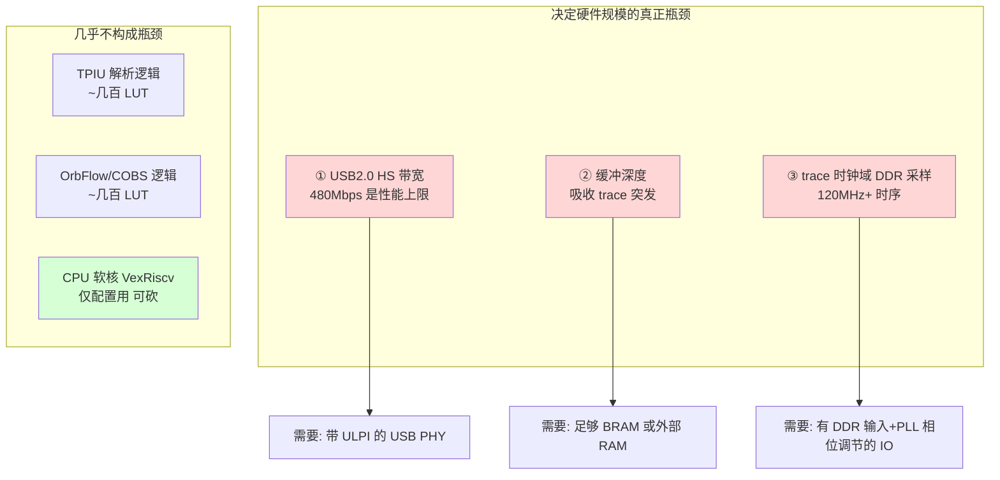
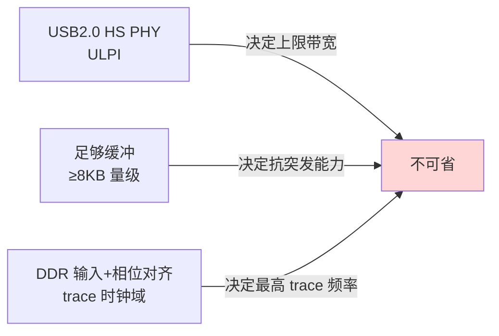
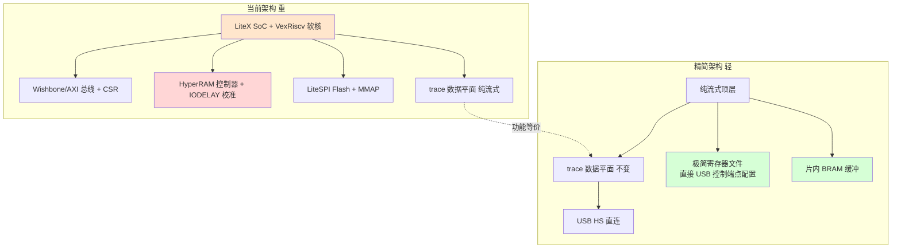
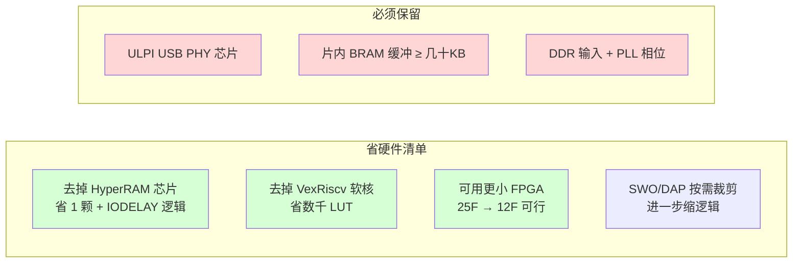
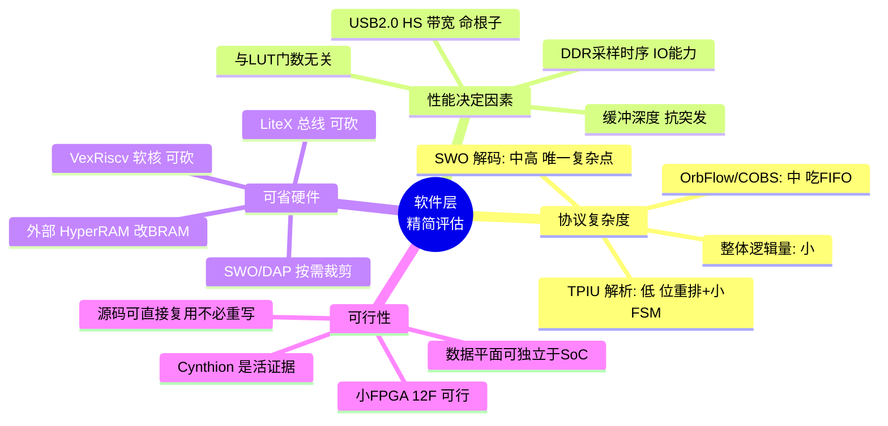
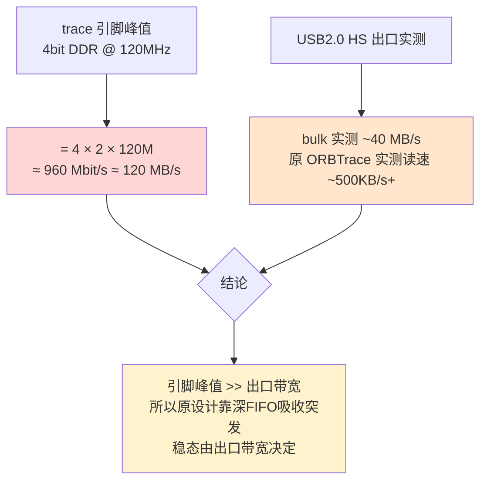
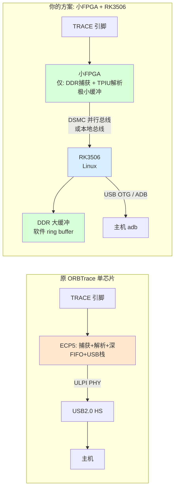
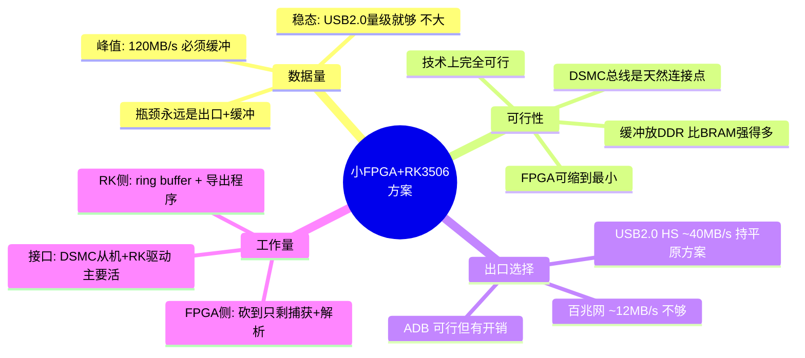
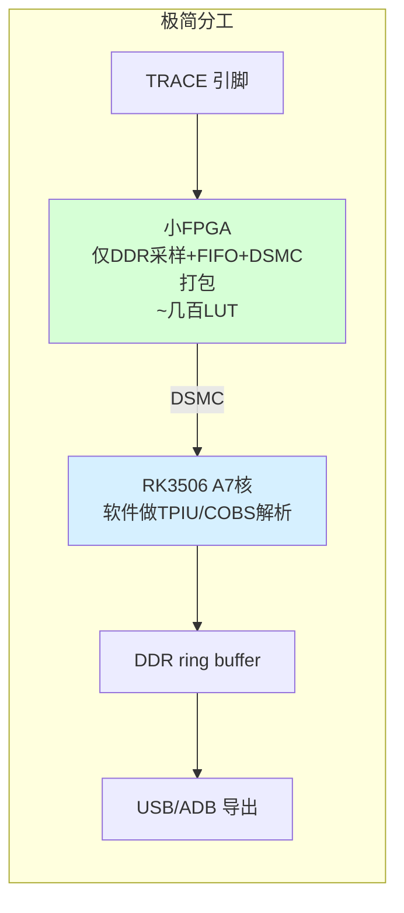

# ORBTrace 软件层（Gateware 数据通路）深度分析
## —— 能否在不降低性能的前提下用更少的硬件实现？

> 分析对象：`orbtrace/orbtrace/trace/` 全部 Amaranth/Verilog 数据通路 + USB/SoC 软件层
> 视角：纯软件（gateware 逻辑）层面，剥离板级外设，评估「逻辑复杂度」与「资源精简空间」
> 核心问题：ARM trace 协议解析是否复杂？能否用更小/更便宜的硅片在不牺牲吞吐的前提下重写？

---

## 0. 结论先行（TL;DR）

| 问题 | 回答 |
|------|------|
| ARM Trace 协议本身复杂吗？ | **协议本身不复杂，复杂度在「高速并发」与「多格式兼容」**。TPIU 解帧逻辑非常规整（见 §2），真正吃资源的是 SWO Manchester/UART 解码、COBS 编码、以及深 FIFO 缓冲。 |
| 能用更少硬件、不降性能实现吗？ | **能，且空间不小。** 数据通路核心逻辑量很小（纯组合+小状态机），瓶颈不在 LUT 而在 **① USB2.0 HS 带宽 ② 缓冲 RAM ③ trace 时钟域 DDR 采样**。只要保住这三点，逻辑部分可塞进更小的 FPGA。 |
| 最现实的「精简」方向 | 砍掉 VexRiscv 软核与 LiteX 全套总线、用纯流式硬件直连 USB；用片内 BRAM 替代 HyperRAM（牺牲极端突发深度但不降稳态吞吐）；SWO/并行 trace 二选一编译。 |

---

## 1. 软件层全景：数据是怎么流动的

ORBTrace 的 trace 软件层是一条**纯流式（streaming）单向管线**，几乎不需要 CPU 介入——这是它能高性能的根本原因。CPU（VexRiscv）只负责配置寄存器，**数据平面完全是硬件直通**。

```mermaid
graph LR
    subgraph "物理捕获 trace 时钟域"
        PIN[TRACEDATA<br/>1/2/4 bit + CLK] --> DDR[DDRInput<br/>双沿采样]
        DDR --> VIF[traceIF.v<br/>位宽拼接+TPIU同步]
    end

    subgraph "SWO 路径 swo 时钟域"
        SWOPIN[SWO 单线] --> PLC[PulseLengthCapture<br/>脉宽测量]
        PLC --> MAN[Manchester 解码]
        PLC --> NRZ[NRZ/UART 解码]
        MAN --> B2B[BitsToBytes]
        NRZ --> UART[UARTDecoder]
    end

    VIF --> TFIFO[trace_fifo<br/>跨时钟域]
    B2B --> SFIFO[swo_fifo]
    UART --> SFIFO

    subgraph "sys 时钟域：协议解析"
        TFIFO --> TSYNC[TPIUSync<br/>帧对齐]
        SFIFO --> TSYNC
        TSYNC --> DEMUX[TPIUDemux]
        DEMUX --> UNM[Unmangle<br/>去ID位混淆]
        UNM --> SER[Serializer]
        SER --> TRK[TrackStream<br/>通道跟踪]
        TRK --> STRIP[StripChannelZero]
        STRIP --> PKT[Packetizer<br/>按通道分包]
    end

    subgraph "OrbFlow 封装"
        PKT --> CHK[ChecksumAppender]
        CHK --> COBS[COBSEncoder]
        COBS --> SUP[SuperFramer<br/>超帧/超时刷新]
    end

    SUP --> BIGFIFO[fifo 8192 深<br/>主缓冲]
    BIGFIFO --> USBEP[USB Bulk IN EP]
    USBEP --> HOST[主机 Orbuculum]

    style PIN fill:#ffe6cc
    style DDR fill:#ffe6cc
    style BIGFIFO fill:#ffd6d6
    style USBEP fill:#ffd6d6
```

**关键观察**：整条链路从引脚到 USB 端点，**没有任何一步需要 CPU 参与数据搬运**。CPU 只在 `input_format`、`async_baudrate` 等配置寄存器上写值。这意味着——数据平面理论上可以脱离整个 RISC-V SoC 独立存在。

---

## 2. 逐模块复杂度剖析（这是回答"协议复不复杂"的核心）

### 2.1 物理层 `traceIF.v`（trace 时钟域，~120MHz）

实现 CoreSight **TPIU-Lite** 规范。逻辑职责：

- 按 `width`（1/2/4 bit）把 DDR 双沿数据滚动拼接进 36 位 `construct` 移位寄存器。
- 检测全帧同步字 `0x7FFF_FFFF`（区分上升沿/下降沿同步）。
- 把 16 位半字组装成 128 位 TPIU 帧，去掉 `0x7FFF` 同步包。

**复杂度评价**：🟢 **低-中**。这是一个移位寄存器 + 少量比较器 + 小计数器的状态机，逻辑量极小（一两百个 LUT 级别）。难点**不在逻辑而在时序**——它工作在 trace 时钟域（mini 板约束到 120MHz），且依赖 DDR 输入原语与相位对齐。**这是真正的硬约束**，与芯片无关的逻辑反而简单。

### 2.2 TPIU 协议解析（sys 时钟域）

TPIU 帧格式是 ARM 公开规范，结构非常规整：

| 模块 | 职责 | 复杂度 | 逻辑形态 |
|------|------|--------|---------|
| `TPIUSync` | 在字节流里找同步字、对齐 128 位帧 | 🟢 低 | 129 位移位寄存器 + 两个比较 |
| `Unmangle` | 解 TPIU 的「ID 位混淆」（偶数字节最低位被抽到第16字节） | 🟢 低 | 纯组合位重排，零状态 |
| `Serializer` | 15 字节帧 → 逐字节 | 🟢 低 | 一个索引计数器 |
| `TrackStream` | 跟踪当前 ITM/通道号，处理立即/延迟换道 | 🟢 低-中 | 一个寄存器 + 少量分支 |
| `StripChannelZero` | 丢弃通道 0（保留通道） | 🟢 极低 | 一个比较 |
| `Packetizer` | 按通道聚合成包，带超时/最大长度边界 | 🟡 中 | 3 态 FSM + 计数器 |

**复杂度评价**：🟢 **整体偏低**。TPIU 解析本质是"位重排 + 移位匹配 + 小状态机"，**没有乘法、没有大查找表、没有复杂算术**。这部分是整条链路里最"便宜"的逻辑。所谓"ARM trace 协议复杂"的印象，主要来自规范文档的篇幅，而非硬件实现量。

### 2.3 SWO 解码路径（最吃逻辑的部分）

SWO（单线输出）支持两种物理编码，这里是相对复杂的地方：

- **`PulseLengthCapture`**：在 2× 过采样域测量电平脉宽，处理毛刺。
- **`ManchesterDecoder`**：🟡 **中-高**。带自适应阈值（3/4、5/4 比特时间）、边沿计数复位、IDLE/CENTER/EDGE 三态 FSM，还有针对 41.66/48MHz 的"锁频"特例处理。这是全链路注释最多、特例最多的模块。
- **`NRZDecoder` + `UARTDecoder`**：🟡 中。NRZ 用累加器按 `bitlen` 切比特（`bitlen` 由 `Divider` 从波特率算出），UART 是标准 10 位移位 FSM。

**复杂度评价**：🟡 **中-高**，且这是**唯一带"模拟感"时序适配**的部分（自适应阈值、过采样）。如果目标应用只需要并行 TRACE 而不需要 SWO，**砍掉整个 SWO 路径能省下相当比例的逻辑**。

### 2.4 OrbFlow 封装 + COBS

- `ChecksumAppender`：🟢 极低，一个减法累加。
- `COBSEncoder`：🟡 中。它拆成 `GroupSplitter` + 两个 256 深 FIFO（len/data）+ `GroupCombiner`，用 FIFO 解决 COBS"先写长度头再写数据"的回填问题。**逻辑不难，但吃了两块 256×8 的 BRAM。**
- `SuperFramer`：🟡 中。按时间间隔/字节阈值决定何时强制 flush，避免小数据卡在缓冲里。

### 2.5 缓冲 FIFO（资源真正的大头）

| FIFO | 深度 | 位宽 | 用途 |
|------|------|------|------|
| `fifo`（主缓冲） | **8192** | 9 | USB 前主缓冲，吸收突发 |
| `cobs fifo_len/data` | 256 ×2 | 9/8 | COBS 回填 |
| `trace_fifo` | 4 | 128 | 跨 trace→sys 时钟域 |
| `swo2x/swo_fifo` | 8/16 | — | SWO 跨域 |

**资源评价**：🔴 数据通路里**真正占资源的是 RAM，不是 LUT**。8192×9 的主缓冲 ≈ 9KB，恰好是用片内 BRAM 还是外部 HyperRAM 的分界点。

---

## 3. 资源画像：到底是什么决定了"需要多大的硬件"

**核心洞察**：ORBTrace 的性能由 **USB2.0 高速带宽（理论 ~53MB/s，实测 ~500KB/s+ 读速）** 和 **缓冲深度** 决定，**而不是由逻辑门数量决定**。TPIU/OrbFlow 这些"协议解析"逻辑加起来在 ECP5-25F 里只占很小比例。当前 mini 板用 25F（24K LUT）还绰绰有余，说明逻辑根本不是瓶颈。

---

## 4. 核心问题：能否「用更少硬件、不降性能」重新设计？

答案是**能**，但要分清"哪些硬件能省"和"哪些是性能命根子不能动"。

### 4.1 性能命根子（动了就降性能，必须保留）

1. **USB2.0 HS 接口**：这是吞吐天花板。任何"精简"都不能用全速（FS, 12Mbps）替代，否则高速 trace 直接废掉。→ ULPI PHY 必须在。
2. **缓冲容量**：trace 数据是突发的（CPU 跑飞一段会瞬间灌大量数据），8192 深主缓冲是用来吸收突发的。可以减小，但减太多会在突发时丢数据（`Monitor.lost` 就是监控这个的）。
3. **trace 物理采样**：要支持 4bit@高频，需要 DDR 输入和可调相位的 IO。这是 IO 能力问题，不是逻辑问题。

### 4.2 可以大胆精简的部分（不降数据平面性能）

| 可精简项 | 现状 | 精简方案 | 对性能影响 |
|---------|------|---------|-----------|
| **VexRiscv 软核** | 完整 RISC-V CPU，跑 C 固件 | 数据平面不需要 CPU，配置可用 USB 控制端点直写寄存器（LUNA 本就支持 `RequestHandler`） | 🟢 无（数据平面本来就不过 CPU） |
| **LiteX 总线/CSR 体系** | Wishbone+AXI+CSR 一整套 | 流式逻辑直接接 USB 端点，去掉总线互连 | 🟢 无 |
| **HyperRAM + LiteHyperBus** | 外部 8MB HyperRAM + 复杂 IODELAY 校准 | 主缓冲改用片内 BRAM（ECP5-25F 有 ~1Mb，可做 ~64-100KB 缓冲） | 🟡 稳态无影响；极端长突发的吸收深度下降 |
| **SWO 路径**（若不需要） | Manchester+NRZ+UART 全套 | 编译期可选，只留并行 TRACE | 🟢 无（功能取舍） |
| **DFU/Flash 自烧写** | 完整 bootloader+flashwriter | 改用 JTAG 外部烧录（如开发板自带） | 🟢 无（仅影响易用性） |
| **CMSIS-DAP 调试引擎** | 与 trace 同居一颗 FPGA | 若只做 trace probe 可拆分 | 🟢 无（功能取舍） |

### 4.3 精简后能小到什么程度？

**逻辑上**：去掉 VexRiscv（VexRiscv 本身就吃几千 LUT）+ LiteX 总线后，纯 trace 数据平面 + LUNA USB + 极简配置，**理论上可以塞进比 25F 更小的器件**（如 ECP5-12F，Cynthion 用的就是 12F）。Cynthion（LFE5U-12F，无外部 RAM）能跑满速 USB 抓包，正是"小 FPGA + 片内 RAM + 流式"可行的活证据。

**RAM 上**：把 8192 深主缓冲 + COBS 的 2×256 FIFO 全放进片内 BRAM，ECP5-25F 的 ~1Mb BRAM 够用，**可彻底去掉外部 HyperRAM 芯片**——这是 BOM 上能省掉的一颗实打实的元件。

---

## 5. 重新设计的现实路线建议

如果目标是「性能不降、硬件更省」，推荐路线：

1. **保留 ORBTrace 的数据平面源码**（`trace/*.py`、`traceIF.v`）——这部分是项目精华，逻辑量小、已验证、协议正确，**没有必要重写**。直接复用。
2. **替换上层骨架**：丢掉 LiteX SoC + VexRiscv，改成纯 Amaranth 顶层，把 trace 管线直接接到 LUNA 的 USB 端点，配置走 USB 控制端点的 `RequestHandler`（参考 ORBTrace 自己的 `power/usb_handler.py`、`trace/usb_handler.py`，它们已经是这种写法）。
3. **缓冲改片内 BRAM**：把主缓冲深度设到 BRAM 能承受的最大值，去掉 HyperRAM 整条依赖（含 `crg_ecp5.py` 里复杂的相位/IODELAY 逻辑）。
4. **选板**：带 ULPI PHY 的小 ECP5 即可。Cynthion（12F + USB3343）是逻辑层面最理想的精简目标平台；或自制「小 ECP5 + USB3343 + trace 连接器」最小板。
5. **按需裁剪 SWO / CMSIS-DAP**：做编译期开关，只做并行 trace probe 时把 SWO 和调试引擎关掉。

### 5.1 为什么"不降性能"成立

性能由 USB HS 带宽 + 缓冲吸收能力决定，**这两者在精简方案里都保留了**（ULPI PHY 不动，BRAM 缓冲容量足够吸收稳态+常见突发）。被砍掉的 CPU、总线、外部 RAM **都不在数据平面的关键路径上**——数据从来不经过它们。因此稳态吞吐不变，只有"超长突发的最大吸收深度"会因 BRAM < HyperRAM 而下降，这对绝大多数 trace 场景无感。

---

## 6. 最终结论

**一句话回答你的两个问题：**

1. **ARM trace 协议不算复杂**——TPIU 解析在硬件里就是移位匹配+位重排+小状态机，逻辑量很小；真正"复杂"的是 SWO 的自适应解码和高速时序约束，而非协议本身。

2. **完全可以用更少的硬件、不降性能地重做**——因为 ORBTrace 的性能瓶颈在 **USB2.0 HS 带宽 + 缓冲**，而不在逻辑门数量。把 VexRiscv 软核、LiteX 总线、外部 HyperRAM 这些"数据平面用不到"的部分砍掉，保留纯流式 trace 管线 + LUNA USB + 片内 BRAM 缓冲，就能塞进更小、更便宜的 ECP5（甚至 12F），同时维持稳态吞吐。Cynthion（12F + 片内 RAM + USB3343）已经证明了这条路走得通。前提仍是那颗 **ULPI USB PHY 不能省**。

---

## 7. 进阶方案：小 FPGA + RK3506，直接 ADB 出数据？

你的设想是：用一颗**小 FPGA 只做 trace 物理捕获 + 协议解析**，把数据交给 **RK3506（三核 Cortex-A7 + M0 的 Linux SoC）**，再通过 RK3506 的 USB 以 **ADB** 把数据导到主机。这是一个把"USB 设备协议栈 + 缓冲"从 FPGA 卸载到 Linux SoC 的思路。先把数据量算清楚，再看可行性。

### 7.1 数据量到底有多大？

这是决定一切的前提。分两个层面看：

- **物理峰值**：4-bit @ 120MHz DDR = **约 120 MB/s** 的瞬时上限。这是"满速跑飞"时的理论峰值。
- **稳态实际**：绝大多数 trace 场景（ITM 软件埋点、PC 采样、部分 ETM）远达不到峰值，典型在**几 MB/s 到几十 MB/s**。ORBTrace 自己标称读速 500KB/s+ 量级（取决于配置）。
- **关键矛盾**：**瞬时峰值远高于任何 USB2.0 出口**。所以无论谁来做出口，都需要缓冲吸收突发——区别只在缓冲放哪、出口多宽。

**所以"数据量大不大"的准确回答是：稳态不大（USB2.0 量级就够），但瞬时突发很大（120MB/s 级），瓶颈永远是出口带宽 + 缓冲深度。**

### 7.2 RK3506 能力核对

根据 Rockchip 公开资料与多家模组厂规格：

| 能力 | RK3506 实际 | 对本方案的意义 |
|------|------------|---------------|
| CPU | 三核 Cortex-A7 @ 最高 1.5GHz + M0 | 🟢 跑 Linux + ADB 充裕 |
| USB | **USB2.0 OTG ×2（HS 480Mbps）** | 🟡 出口仍是 USB2.0 HS，带宽和原方案同档（~40MB/s 实测上限） |
| 以太网 | 双 10/100M | 🔴 仅百兆（~12MB/s），不如 USB2.0 |
| **ARM-FPGA 高速总线 DSMC** | **自带，master/slave 并行总线** | 🟢 **关键**：这是 RK3506 专门为接 FPGA 设计的并行接口 |
| 内存 | 外挂 DDR3L（典型 128MB~1GB） | 🟢 **缓冲可放 DDR，深度远超任何片内 BRAM** |

**最重要的发现**：RK3506 自带 **DSMC（一种 ARM-FPGA 高速并行总线）**，Rockchip 明确把它定位为"低成本、易开发的 ARM-FPGA 高速总线"。这意味着 **FPGA 和 RK3506 之间不需要走 USB，可以走并行总线直连**——这正好绕开了 ORBTrace 最头疼的 ULPI PHY。

### 7.3 架构对比

**这个方案的本质**：把"USB 设备协议栈 + 大缓冲"从 FPGA 整体卸载到 RK3506 的 Linux 软件 + DDR 内存。FPGA 退化成一个"纯捕获+解析"的小逻辑块。

### 7.4 可行性评估

| 维度 | 评估 | 说明 |
|------|------|------|
| **FPGA 逻辑量** | 🟢 极小 | 只留 `traceIF.v` + TPIU 解析，去掉 USB、深 FIFO、SoC。可用最小的 FPGA（甚至 iCE40/小 ECP5/Gowin） |
| **FPGA↔RK3506 接口** | 🟡 中 | 走 DSMC 并行总线最优；需写 FPGA 侧总线从机 + RK3506 侧驱动/DMA。这是主要工作量 |
| **缓冲** | 🟢 优 | 放 RK3506 的 DDR，深度以 MB/百 MB 计，**远超 FPGA 片内 BRAM**，抗突发能力更强 |
| **出口带宽** | 🟡 持平 | RK3506 出口还是 USB2.0 HS（~40MB/s）。**不会比原方案更快**，但稳态足够 |
| **ADB 传输** | 🟡 可行但非最优 | ADB 走 USB，本身有协议开销；高吞吐建议用 adb 的原始 forward/exec-out 或干脆自定义 bulk，而非 logcat 式通道 |
| **省掉 ULPI PHY** | 🟢 是 | FPGA 不再需要 USB PHY，USB 由 RK3506 自带控制器负责 |
| **整体 BOM/成本** | 🟡 取决 | 多一颗 RK3506 + DDR + NAND，但省了 FPGA 侧 USB PHY 和大 FPGA。若已有 RK3506 平台则很划算 |

### 7.5 关键结论

**直接回答你的问题：**

1. **数据量大不大**：**稳态不大**（典型几 MB/s，USB2.0 完全够），但**瞬时峰值很大**（4bit@120MHz ≈ 120MB/s），所以任何方案都必须有缓冲吸收突发。这是 trace 的固有特性，换架构也改变不了。

2. **小 FPGA + RK3506 直接 ADB 出来——可行，而且在某些方面更优**：
   - FPGA 可以缩到非常小（只做 DDR 捕获 + TPIU 解析，逻辑量几百到一两千 LUT），**不再需要 ULPI USB PHY**，这正好绕开了前面报告里反复强调的最大移植障碍。
   - **缓冲从 FPGA 片内 BRAM 搬到 RK3506 的 DDR**，深度从几十 KB 跃升到几十~几百 MB，**抗突发能力反而比原 ORBTrace 更强**。
   - RK3506 自带的 **DSMC（ARM-FPGA 高速并行总线）是天然的连接点**，FPGA↔SoC 不必走 USB。

3. **但要注意两点**：
   - **出口带宽不会变快**。RK3506 的对外口还是 USB2.0 HS（~40MB/s 实测上限），和原 ORBTrace 一个档次；它的百兆网更慢。所以"性能"层面是**持平**，不是提升——提升的是缓冲深度和省掉 PHY。
   - **ADB 不是最高效的出口**。ADB 协议有自身开销，若追求吞吐，建议在 RK3506 上用更直接的 USB bulk 通道（或自定义 gadget），ADB 更适合"方便、能复用现成工具链"的场景。

4. **主要工作量在接口**：FPGA 侧写 DSMC 总线从机，RK3506 侧写内核驱动 + DMA + 用户态 ring buffer + 导出程序。trace 解析逻辑可**直接复用 ORBTrace 的 `traceIF.v` 和 `tpiu.py`**（甚至可以把 TPIU 解析也挪到 RK3506 的 A7 上用软件做，FPGA 只做最原始的 DDR 采样+打包，进一步缩小 FPGA）。

### 7.6 一个更激进的变体

既然 RK3506 有三核 A7 @ 1.5GHz，**TPIU 解帧/COBS 这些纯逻辑运算其实也可以放到 CPU 上用软件做**。那样 FPGA 就只剩最不可替代的部分：**高速 DDR 采样 + 时钟域跨越 + 打包成总线突发**。这是 FPGA 唯一比 CPU 强的地方（GHz 级边沿采样 CPU 做不了）。

这样 FPGA 可以用**最便宜的小器件**（Gowin GW1N、小 ECP5、甚至 iCE40UP），因为它只承担"CPU 做不到的高速采样"那一小块。代价是 A7 要花 CPU 周期解析协议——但 trace 稳态数据率下，1.5GHz 三核绰绰有余。

> 总结：这是个**聪明的架构**。它把问题从"FPGA 要又大又带 USB PHY"转化成"小 FPGA 只管采样 + RK3506 管缓冲和出口"。性能与原方案持平（同为 USB2.0 出口），但**省掉了 ULPI PHY、缩小了 FPGA、大幅增强了缓冲深度**。唯一要接受的是 ADB/USB2.0 的出口带宽天花板，以及 FPGA↔RK3506 总线对接的开发工作量。

---

## 附录：证据索引

- 数据平面纯流式、CPU 不参与搬运：`orbtrace/orbtrace/trace/core.py`（`TraceCore.elaborate` 全程 `wiring.connect`，无 CPU 访存）
- TPIU 解析逻辑量：`trace/tpiu.py`（`TPIUSync`/`Unmangle`/`TrackStream`/`Packetizer`）
- SWO 复杂解码：`trace/swo.py`（`ManchesterDecoder` 自适应阈值 + 三态 FSM）
- COBS 双 FIFO 回填：`trace/cobs.py`（`COBSEncoder` 内 `fifo_len`/`fifo_data` 各 256 深）
- 主缓冲深度 8192：`trace/core.py` 中 `SyncFIFOBuffered(Packet(...), 8192)`
- 物理层时序约束：`verilog/traceIF.v` + `platforms/*.py` 中 `add_period_constraint(... trace:clk, 1e9/120e6)`
- USB 配置走控制端点（无需 CPU）：`trace/usb_handler.py`、`power/usb_handler.py`
- 小 FPGA + 片内 RAM 可行性参照：Cynthion = LFE5U-12F + 3×USB3343（见主报告 §3.7）
- RK3506 能力来源：Rockchip RK3506B 数据手册（三核 Cortex-A7+M0）、Luckfox Lyra Plus / Forlinx OK3506 规格（USB2.0 OTG×2 HS、双 100M 以太网、DDR3L 128MB~1GB）
- RK3506 的 ARM-FPGA 高速总线（DSMC，master/slave）：Forlinx RK3506-S12 产品说明「low-cost, easy-development ARM-FPGA high-speed bus in master/slave modes」
