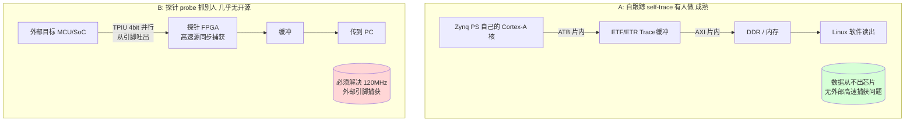
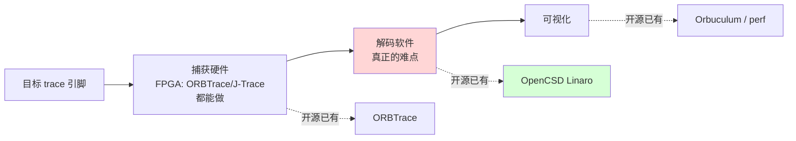
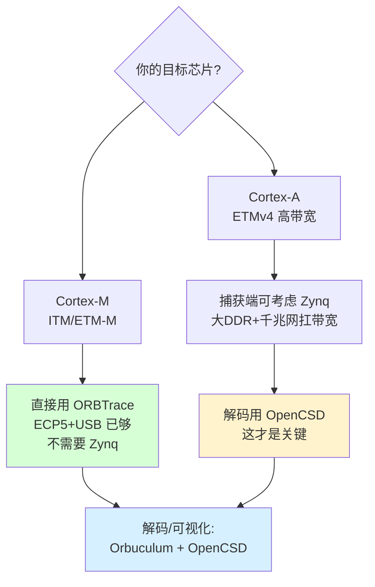

# 补充调研：有没有人用 Zynq 做 ARM ETM Trace？能否替代 J-Trace？

> 触发问题：「难道没人用 Zynq 做 ARM ETM trace 工具吗？这样至少能替代 J-Trace 大部分功能，J-Trace 实在太贵」
> 本文澄清一个关键概念混淆，并给出开源替代 J-Trace 的真实图景。

---

## 0. 结论先行

1. **「用 Zynq 抓自己的 ETM」——有人做，且成熟**（如 `wchen258/TPAw0v`，ECRTS 2023 论文）。但这是 trace **自己的** ARM 核，数据全程不出芯片，**不是探针**。
2. **「用 Zynq 当探针抓外部目标芯片的 ETM」——基本没有开源项目**。原因不是做不到，而是这场景下 Zynq 的强项（PS↔PL 片内 trace）用不上，沦为"一块带 ARM 的贵 FPGA"。
3. **真正难、真正值钱的不是捕获硬件，而是 ETMv4 解码软件**——而它**已经开源**（Linaro OpenCSD）。
4. **开源版 J-Trace 其实已经存在**：**ORBTrace（捕获）+ OpenCSD（解码）+ Orbuculum（可视化）**。Zynq 能做的是替换其中"捕获端"的硬件平台，但不解决解码这个真正的难点。

---

## 1. 两件被混淆的事（这是问题的关键）

| 维度 | A. 自跟踪（self-host trace） | B. 外部探针（替代 J-Trace） |
|------|---------------------------|---------------------------|
| trace 谁 | Zynq 自己的 ARM 核 | 另一颗外部目标芯片 |
| 数据路径 | 片内 ATB→ETR→AXI→DDR | 外部引脚→FPGA→缓冲→PC |
| 高速外部捕获 | **不需要**（数据不出芯片） | **必须**（120MHz 4bit DDR） |
| 代表项目 | `wchen258/TPAw0v`（ZCU102/Kria，论文） | **几乎只有 ORBTrace** |
| Zynq 是否合适 | 🟢 完美（就是为此设计） | 🟡 浪费（PS trace 设施闲置） |

你问的"替代 J-Trace"属于 **B 类**。而能搜到的 Zynq ETM 项目几乎全是 **A 类**——这就是"好像有人做、又好像没人做"的根源。

---

## 2. 为什么 Zynq 没被拿来做 B 类探针

### 2.1 Zynq 的杀手锏在 B 类里用不上

Zynq 之所以在 trace 领域资料多，是因为它的 **PS 内置完整 CoreSight（ETM/TPIU/ETF/ETR）**，能把**自己**的执行流经片内总线高速导出——这是 A 类。做 B 类外部探针时：

- 你只用到 **PL（那块 FPGA）** 去抓外部引脚；
- PS 那套为"自跟踪"准备的 CoreSight/TPIU **完全闲置**；
- 等于花 Zynq 的钱，只用了它 FPGA 的部分 + 一个跑 Linux 的 ARM 做数据转发。

→ 那还不如直接用**纯 FPGA + 小 MCU/USB**，这正是 ORBTrace 的 ECP5 方案。Zynq 在 B 类里**没有结构性优势**，只有"大 DDR + 千兆网"这种通用优势。

### 2.2 真正的难点在解码，不在捕获硬件（重要修正）

这里要修正前面报告隐含的一个乐观：**Cortex-M 的 TPIU ≠ Cortex-A 的 ETMv4**。

- ORBTrace 主打 **Cortex-M**：TPIU 帧格式相对规整（前面分析过，硬件解帧逻辑量小）。
- **Cortex-A 的 ETMv4 指令 trace 是带压缩的**：trace 流里大多只有"分支/异常"的增量信息，**必须配合被测程序的二进制镜像，才能反推出完整执行流**（SEGGER 明确：没有程序镜像无法重建 trace）。
- 这部分**重活在上位机软件**，不在探针。Linaro 的 **OpenCSD** 就是专门做 CoreSight（含 ETMv3/v4、PTM）解码的开源库，Linux perf 也用它。

→ 结论：**J-Trace 卖的"贵"，一部分是高速捕获硬件，更大一部分是成熟的 ETMv4 解码 + 工具链 + 商业支持。** 而解码这块开源界已经有 OpenCSD，捕获这块有 ORBTrace。

### 2.3 市场小 + 巨头垄断

- 真正用并行 ETM trace 的工程师本就少（多数人 ITM/SWO 够用）。
- 高端被 Lauterbach TRACE32、SEGGER J-Trace、ARM DSTREAM 三家吃透，含完整 ETMv4 解码与商业支持。
- 开源社区只有 ORBTrace 这类少数热情驱动项目在做捕获端。

---

## 3. 那「用 FPGA 替代 J-Trace 大部分功能」成不成立？

**成立——但开源路线早已存在，且未必需要 Zynq。**

### 3.1 J-Trace 的功能拆解 vs 开源对应

| J-Trace 的能力 | 难度 | 开源替代 | 状态 |
|---------------|------|---------|------|
| 高速并行 trace 捕获（4bit TPIU） | 中（时序硬） | **ORBTrace**（ECP5） | ✅ 已有，Cortex-M 验证过 |
| trace 缓冲 / 流式传输 | 中 | ORBTrace（USB）/ Zynq（DDR+千兆） | ✅ |
| **ETMv4 指令流解码** | **高（真难点）** | **Linaro OpenCSD** | ✅ 开源，perf 在用 |
| 可视化 / 时间线分析 | 中 | Orbuculum / Tracealyzer | 🟡 部分 |
| Cortex-A 高带宽（远超 M） | 高 | 需更强捕获平台 | 🟡 这才是 Zynq 可能加分处 |
| 商业支持 / 认证 | — | 无 | ❌ 开源没有 |

### 3.2 Zynq 在这条路里的真实定位

Zynq **不是**"用来替代 J-Trace 的天选平台"，而是：**当目标是 Cortex-A 这种高带宽 trace、ORBTrace 的 ECP5+USB 出口扛不住时，一个"捕获平台升级选项"**——因为它有大 DDR 缓冲 + 千兆网出口。

- 对 **Cortex-M**（ORBTrace 的主场）：用 Zynq 是**杀鸡用牛刀**，ECP5+USB 方案就够，Zynq 反而更贵更复杂。
- 对 **Cortex-A（ETMv4，数据率高得多）**：Zynq 的"大缓冲+千兆出口"才真正有意义——但**解码仍然靠 OpenCSD 软件**，Zynq 硬件不解决解码。

---

## 4. 修正前几版报告的一处乐观

前面 V1/V2 在谈"trace 协议不复杂"时，**默认的是 Cortex-M 的 TPIU**。必须明确补充：

> **如果目标是替代 J-Trace 去做 Cortex-A 的 ETMv4 trace，则"协议不复杂"不再成立——ETMv4 解码（带压缩、需程序镜像）是真正的复杂部分，但它在上位机软件（OpenCSD），不在 FPGA 捕获端。**

所以"用小 FPGA/Zynq 重做捕获端"这件事的难度评估**不变**（捕获端确实逻辑量小）；改变的是认知：**整个 J-Trace 的价值大头不在捕获端，在解码软件 + 工具链**——而这部分开源已经有 OpenCSD 兜底。

---

## 5. 给你的实际建议

1. **若你主要调 Cortex-M**：别上 Zynq。**ORBTrace（或其 ECP5 思路）+ Orbuculum** 就是现成的开源 J-Trace 平替，成本几十美元级。这是目前最成熟的开源并行 trace 路线。
2. **若你要调 Cortex-A（ETMv4，数据率高）**：捕获端用 Zynq（大缓冲+千兆）有意义，但**核心工作量在把 OpenCSD 接进来做解码**，硬件只是把数据可靠搬到 PC。
3. **无论哪种，解码都用 Linaro OpenCSD**——这是省掉"自己写 ETMv4 解码器"这个最大坑的关键，也是真正能"替代 J-Trace 大部分功能"的那块拼图。
4. **现实预期**：开源方案能替代 J-Trace 的**捕获 + 解码**功能（靠 ORBTrace + OpenCSD），但替代不了**商业支持、认证、对海量芯片的开箱即用配置**。对个人/小团队，省下的钱通常值得这点折腾。

---

## 6. 最终回答你的原问题

- **"没人用 Zynq 做 ARM ETM trace 吗?"** —— 有人做 **A 类(trace 自己)**,如 TPAw0v/ECRTS 论文,很成熟;但 **B 类(当探针抓外部芯片)几乎只有 ORBTrace**,而且它用的是纯 FPGA(ECP5)不是 Zynq——因为做探针时 Zynq 的 PS trace 优势用不上。
- **"能替代 J-Trace 大部分功能吗?"** —— **能,但开源拼图已经存在且不一定是 Zynq**:捕获用 ORBTrace,解码用 OpenCSD,可视化用 Orbuculum。J-Trace 真正贵在 ETMv4 解码 + 商业支持,而解码 OpenCSD 已开源。
- **"Zynq 的位置?"** —— 它不是"替代 J-Trace 的天选硬件",而是**当目标升级到 Cortex-A 高带宽 trace、ORBTrace 的 USB 出口扛不住时,一个值得考虑的"捕获平台升级项"**(大 DDR + 千兆网)。对 Cortex-M,它是杀鸡用牛刀。

---

## 附录：关键来源

- 用 Zynq(ZCU102/Kria)做自身 ETM trace 的开源实现 + 论文：`github.com/wchen258/TPAw0v`，Chen et al., "Low-Overhead Online Assessment of Timely Progress as a System Commodity", ECRTS 2023
- CoreSight 开源解码库：`github.com/Linaro/OpenCSD`（ETMv3/v4、PTM 解码，Linux perf 使用）
- 唯一活跃的开源外部并行 trace 捕获探针：`github.com/orbcode/orbtrace` + Hackaday 报道 "ORBTrace Effort: Open Tool For Professional Debugging"(2022)
- ETMv4 需配合程序镜像才能重建执行流：SEGGER Knowledge Base "General information about tracing"
- ETM vs ITM 带宽/用途差异：Arm Community "DSTREAM-PT parallel trace probe"、essentialscrap.com "Execution tracing on Cortex-M"
- 商业并行 trace 工具（对照定价/功能）：SEGGER J-Trace、Lauterbach TRACE32(zynq-7000)、ARM DSTREAM-PT
