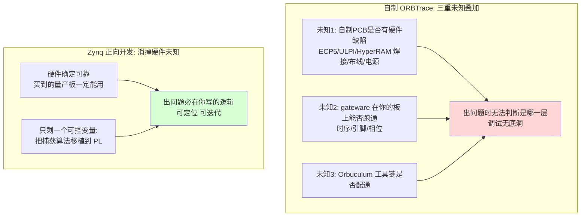
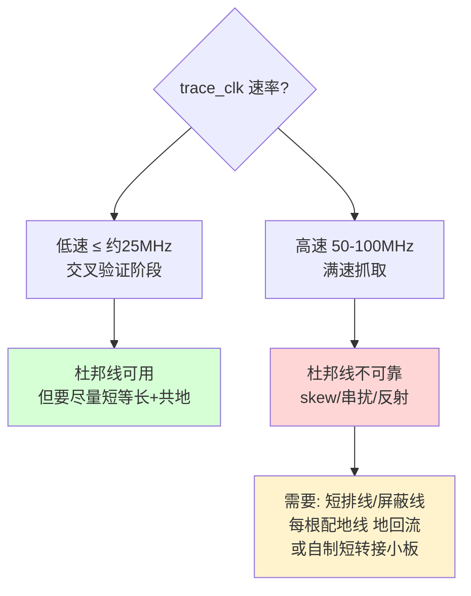
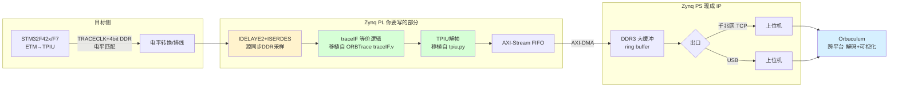
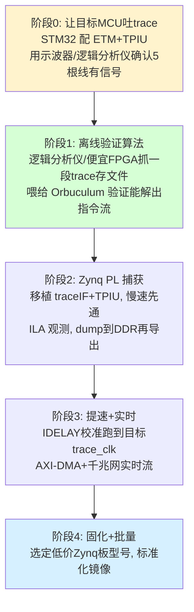

# Cortex-M 指令流 Trace：基于 Zynq 正向开发的落地方案

> 目标：抓 Cortex-M（STM32F42x / F7 先做交叉验证）的 ETM 指令流，性能无损、无插桩、函数跳转级可见，用于定位 UAF 与性能问题。
> 约束：单台 < 1000 RMB、可大规模采购、上位机跨平台。
> 决策：**放弃自制 ORBTrace（三重未知难调试），改用"买现成 Zynq 板 + 正向移植 ORBTrace 捕获算法"**。
> 本文记录方案、风险拆解、分阶段路线与关键技术决策。

---

## 0. 为什么这个决策是对的（风险视角）

你的核心判断——"自制 ORBTrace = 同时面对软硬件两个都不熟的未知，难定位问题"——在工程上完全正确。本质是**未知变量隔离**：

**关键点**：Zynq 把"硬件是否可靠"这个最难排查的变量直接消掉。剩下的"移植捕获逻辑到 PL"是纯软件问题，可在确定可靠的硬件上反复迭代、用逻辑分析仪/ILA 观测。这比在一块可能有焊接/布线缺陷的自制板上调陌生 gateware 可控得多。

---

## 1. 先锁死技术前提（这两点不成立则一切免谈）

### 1.1 目标 MCU 必须有 ETM + 引出 4-bit TRACE 端口

- **STM32F42x（Cortex-M4）/ STM32F7（Cortex-M7）都有 ETM**，支持 4-bit 并行 TRACE（TRACECLK + TRACED0-3）。✅ 选型正确。
- **关键坑：开发板要把这 5 根线引出来。**
  - **STM32F429I-DISC1（DISCO-F429ZI）**：板载 ST-LINK，但 **trace 引脚默认未引到方便的排针**，且部分 trace 引脚（PE2-PE6 一组）可能被板上外设（SDRAM/LCD）占用——需查原理图确认能否复用，可能要飞线。
  - **更省心的选择**：用 **STM32 Nucleo-144** 或自己的最小系统板，把 PE2/PE3/PE4/PE5/PE6（F4/F7 的 TRACECLK/TRACED0-3 默认映射）引到杜邦排针。
  - ST 社区有人证实 F429 可软件使能 ETM 并从这 5 脚输出，但缺现成例子——**这部分要你自己配 DBGMCU + TPIU + ETM 寄存器**（或用 OpenOCD/pyOCD 的 trace 配置脚本）。

### 1.1bis STM32F429 Discovery 的接口能不能直接接 trace？（专项核实）

**先给结论**：
1. **F429 有 ETM**——已二次确认（见下方权威链接），它通过引脚输出 trace，SEGGER 明确说 J-Trace 可对该板做 trace。
2. **Disco 板没有标准 trace 连接器**——板上只有 SWD（经 ST-LINK）。要做 4-bit 并行 trace，**只能从扩展排针 P1/P2 引出 TRACECLK/TRACED0-3**，本质上还是排针 + 杜邦线/排线，**没有现成的 MIPI-20 trace 座可插**。

#### (a) ETM 是否存在——已确认

| 证据 | 内容 |
|------|------|
| ARM CoreSight **ETM-M4 TRM** | Cortex-M4/M4F 有可选 ETM-M4 宏单元，用于重建程序执行流 |
| **SEGGER 知识库** "Tracing on ST STM32F429" | 原文：该 MCU 通过引脚实现 tracing，可用 J-Trace 做 trace（已改写，符合引用规范）|
| STM32F429 参考手册 RM0090 | DBGMCU 支持 TRACE_MODE 配置为同步 1/2/4-bit |

→ **ETM 确定有，4-bit 并行 trace 端口确定存在。** 链接见附录。

#### (b) trace 引脚映射与板上占用

F429 的 trace 引脚是**固定复用功能**（不是任意 GPIO）：

| 信号 | 引脚 | AF | 备注 |
|------|------|----|----|
| TRACECLK | **PE2** | AF0(系统) | trace 时钟 |
| TRACED0 | **PE3** | AF0 | |
| TRACED1 | **PE4** | AF0 | |
| TRACED2 | **PE5** | AF0 | |
| TRACED3 | **PE6** | AF0 | |

**关键风险**：STM32 Discovery 系列外设密集（板载 64Mbit SDRAM、2.4" LCD、L3GD20 陀螺仪、USB OTG），ST 官方社区明确指出**Discovery 板只有少数 GPIO 空闲**。因此**必须查原理图确认 PE2-PE6 这 5 个引脚是否被占用、以及是否被引到了 P1/P2 扩展排针上**：

- 若 PE2-PE6 已引到 P1/P2 排针且未被占用 → **可以用排针 + 杜邦线/跳线直接接**，无需飞线。
- 若某几个被 LCD/SDRAM 等占用 → 需在软件里释放该外设，或对冲突引脚飞线。
- **这一步你必须亲自比对 F429I-DISC1 原理图（见附录链接）**，因为板子改版（DISCO→DISC1）可能影响排针分配。

#### (c) "必须杜邦线吗？"——分速率回答

权威布线要求（来自 IAR i-jet-trace / SEGGER J-Trace 设计指南）：trace 信号应 **50Ω 阻抗**、连接器距 MCU **<75mm**、各 trace 线长度差 **<12.5mm**、需良好地回流。松散杜邦线全都不满足。但有一个决定性缓解手段——**trace_clk 可以分频降速**：

- **交叉验证阶段（推荐做法）**：把 TPIU 的 trace 输出时钟通过预分频降到 **10–25MHz**。此时单沿有效窗口 ≥ 20–50ns，**普通杜邦线（尽量短、5 根信号各配 1 根地线绞合、总长 < 10cm）实测可用**。代价是降低了瞬时 trace 带宽——但对 F429@168MHz 做"函数跳转级"验证，配合 ETM 的分支压缩，低速 trace_clk 通常仍够（且 ETM FIFO 满时会丢，属可接受的事件级丢包）。
- **满速抓取阶段**：trace_clk 上到 50–100MHz 时，杜邦线几乎必然出问题（眼图闭合）。届时需要：**短排线（<5cm）+ 每信号配地 + 接地排**，或做一块**巴掌大的转接小板**（排针→短走线→Zynq 的 IO 排针，可加端接电阻）。这块小板比复刻整个 ORBTrace 简单得多，是值得的折中。

#### (d) 务实建议

1. **第一步先量信号**：配好 ETM 后，用示波器/逻辑分析仪先在 **低速 trace_clk** 下确认 PE2-PE6 有正确波形——此时杜邦线足够。
2. **交叉验证全程用低速 trace_clk + 短杜邦线**，先把"采集→解码→指令流"链路打通，不要一上来追满速。
3. **要追满速/将来上 500MHz MCU** 时，再做一块短转接小板解决信号完整性——这是唯一需要碰硬件的小工作，远小于自制 ORBTrace。

> 一句话：**F429 Disco 能接 trace，但走的是扩展排针不是专用 trace 座；低速验证用杜邦线够，满速抓取需短排线/小转接板。** 先确认 PE2-PE6 在 P1/P2 上可用且未被占用是前提。

### 1.2 带宽核算（F7@最高主频）

- 指令 trace 经验值 ~1.2–1.6 bit/指令。
- STM32F7 最高 216MHz（不是 500M，你的 500M 上限是给未来项目预留）：216M × 1.5 ≈ **324 Mbit/s**。
- 4-bit @ trace_clk（ARM 规范上限 ~100MHz，DDR）= 4×2×100M = **800 Mbit/s** 端口上限。
- **结论：F4/F7 交叉验证阶段带宽余量充足，不会成为瓶颈。** 真正逼近极限是将来上 500MHz 目标 MCU 时，那时再用 Zynq 的大 DDR 缓冲优势。

---

## 2. Zynq 方案架构（正向移植 ORBTrace 捕获算法）

### 2.1 你要做的 vs 可复用的

| 部分 | 来源 | 工作量 |
|------|------|--------|
| 源同步 DDR 采样（IDELAYE2/ISERDES） | Xilinx 标准原语 + 校准 IP | 🟡 中（7系标准玩法，资料多） |
| TPIU 帧组装 | **移植 ORBTrace `traceIF.v`** | 🟢 小（Verilog 可几乎直接用） |
| TPIU 解帧/去ID混淆/通道分离 | **移植 ORBTrace `tpiu.py` 逻辑** | 🟡 中（Amaranth→Verilog/HLS 或直接重写） |
| AXI-DMA → DDR → 网络 | Xilinx 标准 IP + PetaLinux | 🟢 小（官方教程海量） |
| 解码 + 可视化 | **Orbuculum（跨平台，直接用）** | 🟢 复用 |

### 2.2 上位机：Orbuculum 跨平台已满足

- Orbuculum（`orbcode/orbuculum`）支持 Linux / macOS / Windows，✅ 命中你的跨平台要求。
- 它本就是 ORBTrace 的配套解码器，吃的是 **OrbFlow 格式**（COBS 封装的 TPIU 流）。
- **关键集成点**：只要你的 Zynq 把数据按 ORBTrace 的 OrbFlow 格式（或裸 TPIU 流）从网络/USB 吐出，Orbuculum 就能直接解。Orbuculum 支持从网络源 / 文件 / 设备读入——**这意味着你甚至可以先不实现实时高速口，先把 trace dump 成文件喂给 Orbuculum 验证算法正确性。**

---

## 3. 分阶段路线（把风险逐段消化）

这是 Zynq 方案最大的优势——**可以切成可独立验证的阶段，每阶段只引入一个新变量**：

**阶段 0 和 1 不需要 Zynq 也能做**，能极大降低风险：
- 阶段 0：先证明你的 STM32 能从 5 根脚输出 trace（这是最容易卡的一步，与探针无关）。
- 阶段 1：哪怕用逻辑分析仪抓一小段存成文件，喂给 Orbuculum，验证"trace 数据 → 指令流"这条软件链路通。**这一步把上位机/解码这个变量提前消化掉。**
- 阶段 2 起才上 Zynq，且先慢速、先 dump 文件、用 ILA 看波形，最后才追实时高速。

---

## 4. 选板建议（< 1000 RMB、可批量）

| 板 | 器件 | 价格 | 千兆网 | 适合 |
|----|------|------|--------|------|
| Sipeed Tang HEX / 类似 7020 核心板 | Zynq-7020 | ~¥450-600 | 看型号 | 主力，便宜可批量 |
| 各类淘宝 7010/7020 核心板+底板 | 7010/7020 | ~¥300-700 | 多数有 | 性价比 |
| MYIR Z-turn | 7010/7020 | 稍高 | 有 | 文档全，适合起步 |
| PYNQ-Z2 | 7020 | ~¥900 | 有 | 资料最丰富，适合学习阶段 |

- **7010 vs 7020**：交叉验证 F4/F7 用 **7010 就够**（逻辑量需求小）；要留余量上 500MHz 目标 MCU，选 7020。
- 都在 1000 RMB 内，且**淘宝现货、批量无压力**——这正是你要的"绝对买得到"。

---

## 5. Zynq vs 自制 ORBTrace：决策对照

| 维度 | 自制 ORBTrace | Zynq 正向开发 |
|------|--------------|--------------|
| 硬件可得性 | ❌ 需投板打样 | ✅ 淘宝现货 |
| 硬件可靠性 | 🟡 自制有缺陷风险 | ✅ 量产板确定可靠 |
| 调试变量数 | 🔴 软+硬+工具链三重未知 | 🟢 仅 PL 逻辑一个变量 |
| 单台成本 | 物料低(~¥100+)但含研发/打样 | ¥300-700 现成 |
| 批量成本 | 量产更低（若调通） | 单价稍高但零研发 |
| 算法可复用 | ✅ 直接烧官方 bitstream | 🟡 需移植到 PL（但有源码参考） |
| 上手时间 | 长（画板+打样+调硬件） | 中（买来就能写逻辑） |
| 资料丰富度 | 🟡 ORBTrace 冷门 | ✅ Zynq 海量 |

**核心结论**：自制 ORBTrace 的"物料便宜"优势，被"研发+打样+调试陌生软硬件"的时间成本吃掉；Zynq 单价稍高，但**把不可控的硬件风险换成了可控的软件工作量**，且硬件绝对买得到、可批量。对你"既要能落地又要可大规模采购"的诉求，Zynq 正向开发是更稳的路径。

---

## 6. 主要风险与应对（不回避）

| 风险 | 严重度 | 应对 |
|------|--------|------|
| 120MHz 源同步 DDR 采样时序收敛 | 🟡 中 | 7系有 IDELAYE2/ISERDES 硬核+校准IP；F4/F7 实际 trace_clk 可降到 50-100MHz，余量大；阶段3 才攻 |
| 移植 ORBTrace Amaranth 逻辑到 PL | 🟡 中 | `traceIF.v` 是现成 Verilog 可直接用；`tpiu.py` 逻辑简单可重写；按阶段2先慢速验证 |
| STM32 ETM 配置无现成例子 | 🟡 中 | OpenOCD/pyOCD 有 trace 配置；阶段0 单独攻克，与探针解耦 |
| OrbFlow 格式对接 Orbuculum | 🟢 低 | 阶段1 先用文件喂 Orbuculum 验证格式 |
| 目标板未引出 trace 引脚 | � 中 | F429 Disco：PE2-PE6 走 P1/P2 排针（需先比对原理图确认未被占用），非专用 trace 座 |
| 杜邦线信号完整性 | 🔴 高 | 交叉验证降 trace_clk 到 10-25MHz 用短杜邦线即可；满速抓取需短排线+配地或小转接板（见 §1.1bis） |

---

## 7. 结论与下一步

**方案定调**：买现成低价 Zynq（7010/7020）板，参考 ORBTrace 的 `traceIF.v` / `tpiu.py` 正向开发 PL 捕获逻辑，PS 侧用标准 AXI-DMA + 千兆网/USB 导出，上位机复用跨平台的 Orbuculum。先用 STM32F42x/F7 做交叉验证。

**立刻可做、且不依赖 Zynq 的两步**（建议先做，把最易卡的变量提前排掉）：
1. **阶段0**：在 STM32F429/F7 上配通 ETM+TPIU，用逻辑分析仪确认 TRACECLK + TRACED0-3 有正确波形。
2. **阶段1**：抓一段 trace 存文件，喂给 Orbuculum，验证能解出函数跳转级指令流。

这两步成功后，再投入 Zynq 的 PL 开发就几乎只剩"把已验证的算法搬进可靠硬件"这一件事了。

---

## 附录：关键来源

- ORBTrace 捕获算法源码：`orbcode/orbtrace` 的 `verilog/traceIF.v`、`orbtrace/trace/tpiu.py`（本仓库已分析，见 `orbtrace软件层分析与精简硬件可行性.md`）
- 跨平台上位机：`orbcode/orbuculum`（Cortex-M SWO/SWV/TRACE Demux 与后处理）
- 指令 trace 带宽经验值（1.2–1.6 bit/指令）：US Patent 7,752,425；ARM "Calculating the number of trace port pins"
- 4-bit TRACE 端口与 trace_clk ~100MHz 上限：ARM ETMv1-v3.5 Architecture Spec、20-way connector pinout
- STM32F429 ETM 引脚（TRACED0-3 + TRACECLK）与可用性：ST 社区 "ETM trace on STM32F429"、STM32F429I-DISC1 资料
- **F429 有 ETM 并经引脚 trace（二次确认）**：ARM CoreSight ETM-M4 TRM（`developer.arm.com/docs/ddi0440`）；SEGGER 知识库 "Tracing on ST STM32F429"（`kb.segger.com/Tracing_on_ST_STM32F429`，明确 J-Trace 可对该板 trace）
- **F429 trace 引脚映射**：PE2=TRACECLK / PE3-6=TRACED0-3（AF0 系统功能），STM32F429 RM0090 DBGMCU TRACE_MODE
- **Disco 板 GPIO 紧张、需查原理图**：ST 社区 "Discovery 板只有少数 GPIO 空闲"；F429I-DISC1 原理图（ST 官方 32F429IDISCOVERY 页面 / scribd "STM32F429I-DISCO Schematics"）；空闲 IO 参考 `s31108/STM32F429IDISCOVERY-FreeIO-Pinout`
- **trace 布线/信号完整性要求**：IAR i-jet-trace "General PCB layout guidelines"（50Ω、连接器距 MCU <75mm）；SEGGER J-Trace 设计指南（各线长度差 <12.5mm）
- 低价 Zynq 板：Sipeed Tang HEX 7020、淘宝 7010/7020 核心板、PYNQ-Z2
