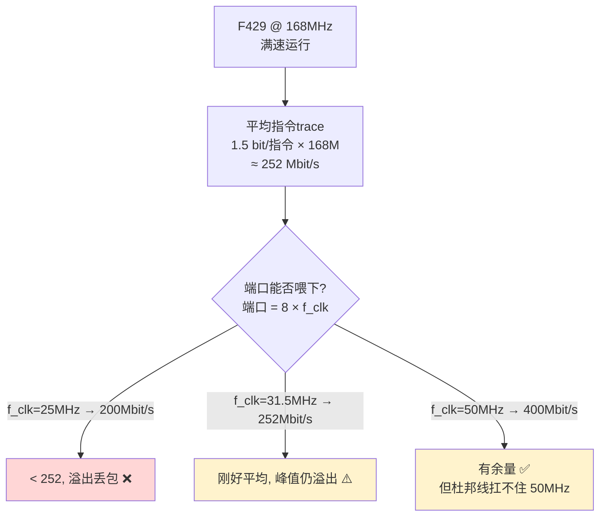
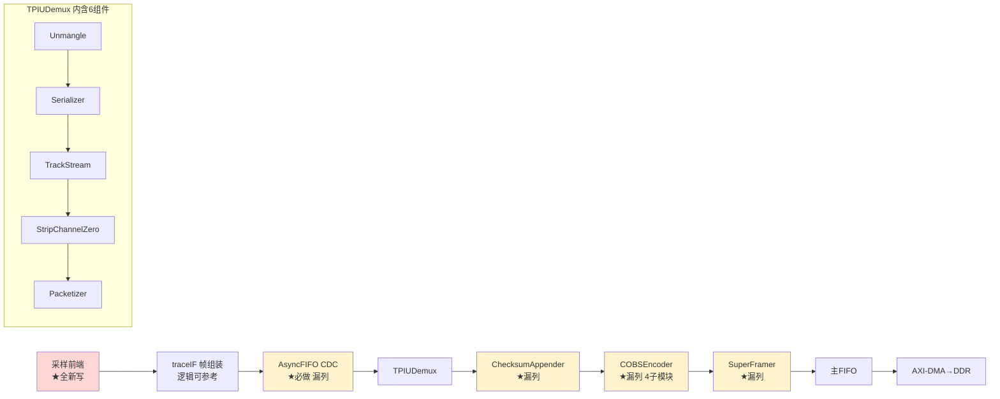
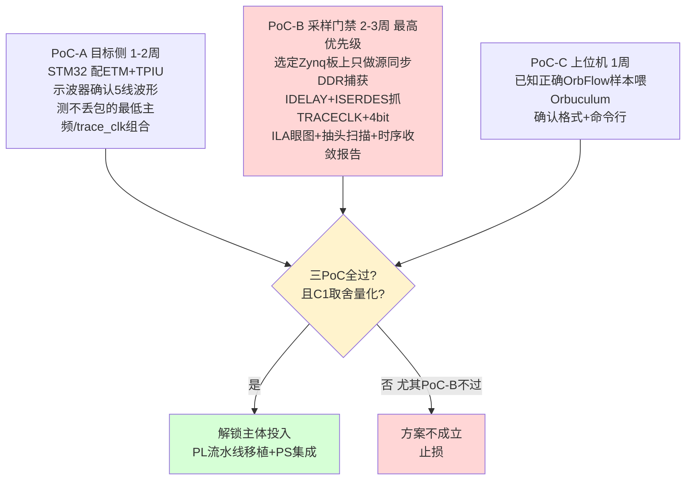
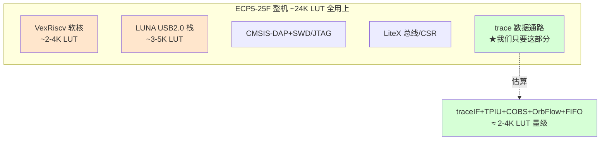
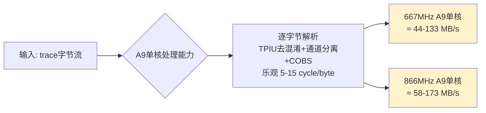
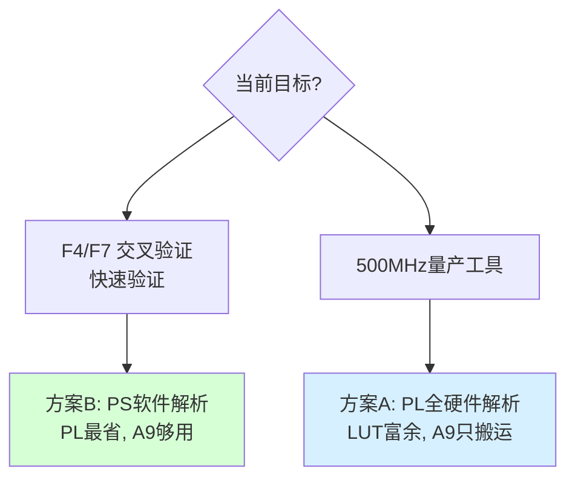
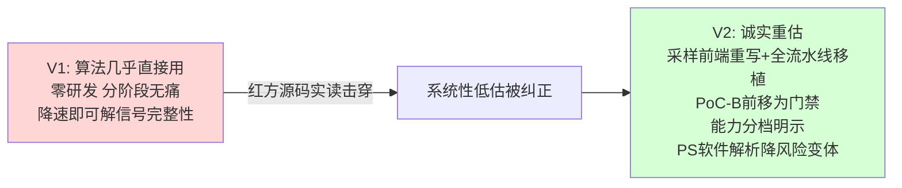

# M核指令流 Trace · Zynq 方案 V2（蓝方回应红方评审）

> 版本：V2，回应《红方评审-M核指令流trace-Zynq正向方案.md》
> 立场：蓝方。**红方这份评审基于源码实读，绝大部分成立，蓝方接受并据此重构方案。**
> 核心修正：
> 1. 撤回"算法几乎直接用"——承认采样前端必须重写、整条 OrbFlow 流水线被漏列（接受 C2/C3）。
> 2. 撤回"分阶段逐步消化、阶段3 才攻采样"——**把源同步采样 PoC 前移为最高优先级门禁**（接受 C4）。
> 3. 正面回答 C1 的核心矛盾——**重新定义工具的能力边界**：它不是"任意满速无损"，而是"在可量化的 trace_clk 上限内无损"。
> 4. 撤回"零研发/可大规模采购"的乐观措辞——诚实重估为多人月系统集成（接受 S4）。

---

## 0. 逐条表态

| 红方质疑 | 档位 | 蓝方裁定 | 处理 |
|---------|------|---------|------|
| C1 降速 vs 满速不可兼得，打击 UAF 用途 | 致命 | ✅ **接受算术，这是真矛盾** | 重新定义能力边界 + 量化取舍（§1） |
| C2 traceIF.v 采样架构与 Zynq 根本不同 | 致命 | ✅ **完全接受，源码实读为准** | 撤回"几乎直接用"，重估工作量（§2） |
| C3 漏列 OrbFlow/COBS/SuperFramer/CDC | 致命 | ✅ **完全接受，是漏列** | 补全完整移植清单（§2.2） |
| C4 最大风险推到阶段3 + 校准救不回闭眼 | 致命 | ✅ **接受** | PoC-B 前移为门禁（§3） |
| S1 阶段1 LA 验证隐含一次软件重写 | 严重 | 🟡 部分接受 | 改用"已知正确样本"验证（§4） |
| S2 千兆对 500MHz 站不住 | 严重 | 🟡 接受方向，补实测数据修正 | 见 §5 |
| S3 廉价板时钟/bank 约束被忽略 | 严重 | ✅ **完全接受** | 选板增加硬约束（§6） |
| S4 实验装置 vs 量产工具 + 零研发失实 | 严重 | ✅ **接受，措辞不诚实** | 重估研发量 + 量产形态（§7） |
| S5 阶段间格式复用未论证 | 严重 | ✅ 接受 | 统一格式契约（§4） |
| m1 PE2-PE6 占用其实更乐观 | 让步 | ✅ 采纳红方平反 | 降级风险（§6） |
| m2 ETM 配置"缺例子"被夸大 | 次要 | ✅ 接受 | 修正（§4） |
| m3 "性能无损"措辞 | 次要 | ✅ 接受 | 区分两种"无损"（§1） |

**总基调**：红方赢了技术细节的绝大部分。蓝方 V1 把"逻辑核心可参考"过度包装成"算法几乎直接用、零研发、分阶段无痛"，这是不诚实的。V2 不辩护，只做两件事：**把每个被高估的工作量据实重列；把红方要求的 PoC 前移为正式立项门禁。**

---

## 1. 正面回答 C1：重新定义工具的能力边界（最重要）

红方 C1 是这份评审的核心杀招，且算术正确。蓝方不回避，给出诚实的重新定义。

### 1.1 接受红方的带宽算术

红方说得对：**"10-25MHz 杜邦线 + 168MHz 满速无损"在数字上不成立。** 25MHz 端口只有 200Mbit/s，喂不下 252Mbit/s 的平均流，必然周期性 ETM FIFO overflow，而溢出恰好可能丢在 UAF 现场——对核心用途是致命的。

### 1.2 蓝方的诚实修正：工具能力分两档明示

不再宣称"任意满速无损"。工具的真实能力边界是：

| 档位 | 条件 | trace 完整性 | 适用 |
|------|------|------------|------|
| **A. 低速无损** | 杜邦线 + trace_clk ≤ 25MHz + **被测 CPU 降频或轻负载**，使平均 trace 率 ≤ 200Mbit/s | ✅ 完整、无丢包 | 功能性验证、可重现的 UAF（降频复现）、交叉验证算法正确性 |
| **B. 满速无损** | **短转接板（非杜邦线）** + trace_clk 50-100MHz + IDELAY/ISERDES | ✅ 完整 | 满速 168/216MHz、将来 500MHz |
| ❌ 不存在 | 杜邦线 + 满速 | — | 红方指出的伪命题，撤回 |

**关键取舍（诚实陈述）**：
- 交叉验证阶段（档位 A）：要无损，**必须降低被测 CPU 主频或负载**，让平均 trace 率落在低速端口能力内。这一步的目的是验证"采集→解码→指令流"链路正确，不是满速抓取。
- 要满速无损（档位 B），**杜邦线必须换成短转接板**——这是硬件前置，不能用降速回避。

### 1.3 关于 UAF：降频复现是否可接受

红方质疑"UAF 复现时丢包就前功尽弃"。蓝方的诚实回答：
- **UAF 若能在降频下复现** → 用档位 A 无损抓取，问题解决。多数逻辑型 UAF（释放后逻辑误用，与时序无关）可在降频下复现。
- **UAF 只在满速/特定时序下复现**（竞态型）→ 必须用档位 B（转接板 + 满速）。此时降速会改变时序、可能掩盖 bug。
- 因此 §1.2 的档位划分不是逃避，而是明确告诉使用者：**竞态型问题必须投入转接板做满速；逻辑型问题低速即可。** V1 没说清这个边界，是缺陷，现已补上。

### 1.4 m3：区分两种"无损"
- **对被测程序性能无损**：ETM 是旁路监听，成立（无论档位）。
- **对 trace 完整性无损**：仅在端口带宽 ≥ 平均 trace 率时成立（档位 A 需降频，档位 B 需转接板）。
- V1 把两者混为"性能无损"，接受红方 m3 修正。

---

## 2. 接受 C2/C3：据实重列移植工作量

### 2.1 C2：采样前端必须重写（撤回"几乎直接用"）

红方实读 `traceIF.v` 的结论正确：它用 `always @(posedge traceClkin)` **把外部 TRACECLK 直接当时钟域**，内部无 IDELAY/ISERDES/校准。而 Zynq 满速捕获需要完全不同的源同步架构。两者是互斥的采样哲学。

**修正后的真相**：
- 可复用的：`traceIF.v` 里"16-bit construct 移位 + TPIU 同步字检测 + 128-bit 帧组装"那段纯时序逻辑（约几十行）——**作为逻辑参考**。
- 必须全新写的：TRACECLK 进 MRCC/BUFIO/BUFR、IDELAYE2 + ISERDESE2 + IDELAYCTRL(200MHz ref) + 抽头校准状态机 + 进系统时钟域的 AsyncFIFO。
- 工作量定级：**从"小"修正为"中偏大"。**

### 2.2 C3：补全被漏列的完整流水线

红方实读 `core.py` 的实际通路完全正确。V1 的工作量表只列了 traceIF+tpiu，漏掉了喂 Orbuculum **必需**的整条 OrbFlow 封装。补全如下：

**完整移植清单（替代 V1 §2.1 的乐观表）**：

| 模块 | 来源 | 复用程度 | 估算(人日) |
|------|------|---------|-----------|
| 采样前端 IDELAY/ISERDES/校准 | 全新（Xilinx 模板） | 🔴 全新 | 5-10 |
| traceIF 帧组装 | `traceIF.v` 逻辑 | 🟡 参考重写 | 2-3 |
| AsyncFIFO CDC (trace→sys) | `stream.py` | 🟡 参考 | 1-2 |
| TPIUDemux（Unmangle/Serializer/TrackStream/StripChannelZero/Packetizer） | `tpiu.py` Amaranth | 🔴 重写为 Verilog | 5-8 |
| ChecksumAppender | `orbflow.py` | 🟡 重写 | 1 |
| COBSEncoder（4子模块+2×256FIFO） | `cobs.py` | 🔴 重写 | 3-5 |
| SuperFramer | `orbflow.py` | 🟡 重写 | 1-2 |
| AXI-Stream 适配 + AXI-DMA | Xilinx IP | 🟢 标准 | 2-3 |
| **PL 小计** | | | **~20-34 人日** |

→ 接受红方结论：**这不是"小工作量"，是中等规模的 HDL 移植+验证。**

> 注：有一条可缩小工作量的替代路径——**把 TPIUDemux/COBS/OrbFlow 整段放到 PS 的 ARM 上用 C 软件做**（数据已在 DDR）。PL 只保留"采样前端 + traceIF 帧组装 + DMA"。这样 PL 工作量减半，C 代码还能直接移植 orbuculum 已有的 C 实现。代价是 PS 要承担解析负载——但 trace_clk 在档位 A/B 下数据率 ARM 软件可承受。**这条路径列为 V2 的推荐变体（见 §8）。**

---

## 3. 接受 C4：源同步采样 PoC 前移为门禁

红方最关键的结构性批评：V1 把"唯一真正困难且不可控"的源同步采样推到阶段3，风险倒挂。蓝方完全接受，重排路线。

**核心改变**：PoC-B（源同步采样）**不再是阶段3，而是立项门禁**。它不通过，整个方案不成立，止损在几周的 PoC 投入，而非全量投入后才暴露。这正是红方要求的"最大未知前移"。

**关于 C4 的眼图闭合**：接受红方——IDELAY 只移动采样点，救不回闭合的眼图。因此 PoC-B 必须明确：
- 若用杜邦线，只在**低速 trace_clk（档位 A）**下验证采样链路正确性；
- 满速采样（档位 B）的 PoC-B 必须**在短转接板上做**，否则不能代表满速可行性。

---

## 4. 接受 S1/S5/m2：验证策略修正

- **S1（阶段1 LA 验证隐含重写）**：接受。改为——**不用 LA 造数据**，而是用 orbuculum 项目里**已知正确的 OrbFlow 样本文件**（或先在档位 A 低速下用 PoC-B 的真实采集）喂 Orbuculum，验证上位机链路。避免"另起炉灶写一遍软件 traceIF"。
- **S5（格式契约）**：接受。定义统一的**字节序/封装契约**——以 `traceIF.v` 的 `{packet[7:0],packet[15:8]}` 交换 + TPIU half-byte 去混淆 + COBS 封装为唯一基准，所有阶段产出/消费都遵循它，确保验证资产跨阶段复用。
- **m2（ETM 配置缺例子被夸大）**：接受。本仓库就有 `support/muleboard.ocd`，OpenOCD/pyOCD 有 4-bit parallel trace 先例。PoC-A 难点修正为"有先例的寄存器细活"（DBGMCU TRACE_IOEN + TRACE_MODE 4-bit + TPIU formatter + ETM LAR 解锁），不是无人区。
- 补充事实：**TPIU 有异步时钟预分频器（TPIU_ACPR），trace 输出时钟可独立于 core clock 配置**——这从硬件上保证了档位 A 的"降 trace_clk"是可实现的（但不改变 C1 的带宽结论）。

---

## 5. 接受 S2 方向，补实测数据修正

红方质疑"千兆对 500MHz 站不住"。蓝方查证后诚实修正：

- 500MHz × 1.5 bit/指令 ≈ **750 Mbit/s**，加 TPIU formatter(+6.7%) + COBS 开销 → **≈800+ Mbit/s** 持续需求。
- Zynq-7000 GEM 实测：Xilinx 官方与社区数据显示**单向 TCP 经优化（零拷贝/调大缓冲）可达 ~900Mbit/s 接近线速，但未优化或双向时常跌到 500Mbit/s 甚至更低**。
- **修正结论**：
  - 对 F4/F7（≈252-324 Mbit/s）：千兆**确实余量充足**，V1 这部分对。
  - 对 500MHz 目标（≈800 Mbit/s）：**逼近 GEM 实测优化后上限，不是"余量充足"**，需要零拷贝 + 内核调优，且无富余。接受红方——这恰是选 7020 的唯一理由，却没被验证。
- **行动**：500MHz 目标的 PS 侧持续 TCP 吞吐，列入主体投入前必须实测的项（见 §9）。若达不到 800Mbit/s，500MHz 满速需考虑：① 出口走 USB3（需带 USB3 PHY 的板）；② 或接受档位 A 降频。

---

## 6. 接受 S3/m1：选板增加硬约束 + PE2-6 风险降级

### 6.1 S3：选板不能只看价格/网口（接受）

源同步捕获的物理约束必须进选板清单：

| 必须核实项 | 要求 |
|-----------|------|
| TRACECLK 落点 | 必须是 **MRCC/SRCC 时钟能力引脚**（能进 BUFIO/BUFR 驱动 ISERDES） |
| 5 信号 bank | TRACECLK + TRACED0-3 最好**同一 IO bank / clock region** |
| bank 电压 | 可配 3.3V（或加电平转换） |
| 排针标注 | 板子是否标注哪些 PL IO 是时钟脚、属哪个 bank |

接受红方：**"能买到 ≠ 能用于源同步捕获"**。淘宝核心板多数不标时钟脚/bank，需拿板子原理图逐一核对，或优先选有完整 IO 文档的板（如 PYNQ-Z2、MYIR）。

### 6.2 m1：PE2-PE6 风险降级（采纳红方平反）

接受红方让步——F429 的 FMC SDRAM 数据线从 PE7 起，PE0/1 为 NBL0/1，**PE2-PE6 不被 SDRAM 占用**；LCD/陀螺仪走 SPI5（PF 口），通常也不占。所以：
- 风险从 🔴/中 **降级为低**。
- 结论从"可能要飞线"修正为"**大概率可用，仅需对 F429I-DISC1 原理图核对 PE2-PE6 是否引到 P1/P2 排针**"。

---

## 7. 接受 S4：诚实重估研发量与量产形态

撤回 V1 §5 决策表里"零研发/上手时间中/可批量"的不实标注。诚实对照：

| 维度 | 自制 ORBTrace | Zynq 方案（诚实版） |
|------|--------------|-------------------|
| 硬件风险 | 🔴 自制 PCB 缺陷 | 🟢 消掉（核心板可靠） |
| PL 研发 | 🟢 烧官方 bitstream | 🔴 ~20-34 人日（采样+全流水线移植，见 §2.2） |
| PS 研发 | — | 🔴 PetaLinux + AXI-DMA 驱动 + ring buffer + 导出应用 |
| 上位机 | 🟢 直接用 | 🟡 OrbFlow over TCP 对接核对 |
| 目标固件 | 需配 ETM | 需配 ETM（同） |
| 量产形态 | 板子统一 | 🔴 **每台需排针/转接板接线，未解决** |
| 总研发量 | 低（若硬件调通） | **多人月，横跨 PL/PS/驱动/上位机/固件五层** |

**诚实结论（接受红方）**：Zynq **不是"零研发"**，它把"硬件不确定性"换成了"同等量级的系统集成不确定性"。它的真正价值只有一条且确凿：**硬件绝对买得到、绝对可靠，PoC 失败也能止损在软件层**。"可大规模采购"指的是**硬件可大量买到**，但**成品工具的量产形态（连接标准化）仍未解决**——这是 V2 必须明说的遗留问题。

### 7.1 量产形态的初步思路（不回避）
- 实验/小批量：排针 + 短转接板（档位 B）或短杜邦（档位 A）。
- 真量产工具：需设计一块**标准 MIPI-20 trace 座 + 短等长走线到 Zynq IO** 的转接板——这块板比复刻整个 ORBTrace 简单，但仍是一项 PCB 工作，**必须计入成本**。

---

## 8. V2 推荐架构（吸收红方意见后）

**PL 最小化 + PS 软件解析**（§2.2 提到的变体，作为降风险首选）：

**为什么这个变体更好**：
- PL 只保留"CPU 做不到的高速采样 + 帧组装 + DMA"，**把红方 C3 漏列的整条 OrbFlow 流水线挪到 PS 用 C 写**——而 orbuculum 本身就是 C 实现，可大量复用，避免重写成 Verilog。
- PL 工作量从 ~20-34 人日降到 ~10-15 人日（只剩采样前端+帧组装+DMA）。
- 代价：PS 承担解析负载。但档位 A/B 的数据率（≤400Mbit/s 量级）下，1.5GHz 双核 A9 做字节流解析可承受（这点本身也需 PoC 验证，列入 §9）。

---

## 8bis. 逻辑门数量、资源开销与算力评估（应红方补充）

前几版只谈了带宽与工作量，未量化**PL 逻辑资源**与**PS 算力**。这是判断"能否塞进 7010/7020、PS 软件解析变体扛不扛得住"的硬指标，补上。

### 8bis.1 参照基准：ORBTrace 整机在 ECP5-25F 的占用

ORBTrace mini 用 **LFE5U-25F**：约 **24K LUT（24.3K）+ 1008 Kbit EBR（56×18Kbit）+ 28 个 18×18 乘法器**。注意——这颗 25F 装下的是**整机**：VexRiscv 软核 + LiteX 总线 + LUNA USB2.0 栈 + CMSIS-DAP + 完整 trace 流水线 + DFU/Flash。而我们要移植的**只是 trace 数据通路那一部分**。

### 8bis.2 PL 侧逻辑资源估算（trace 数据通路）

按模块逐项估（基于源码规模与同类设计经验，**待 PoC 综合后用真实 utilization 报告替换**）：

| PL 模块 | 逻辑量级 | BRAM | 说明 |
|---------|---------|------|------|
| 采样前端 ISERDESE2×5 + IDELAYE2×5 + IDELAYCTRL | 硬核原语，~几百 LUT 胶水 | 0 | 用的是专用 IO 原语，不吃通用 LUT |
| traceIF 帧组装（128bit construct+sync） | ~200-400 LUT | 0 | 移位+比较+小状态机 |
| TPIUDemux 6 子模块 | ~400-800 LUT | 0 | 位重排+小 FSM，无算术 |
| ChecksumAppender | ~50 LUT | 0 | 一个减法累加 |
| COBSEncoder（含 2×256B FIFO） | ~300-500 LUT | **2 个 BRAM**（2×256×9bit） | FIFO 用 BRAM |
| SuperFramer | ~150 LUT | 0 | |
| 主缓冲 FIFO | 看深度 | **见下** | 资源大头在这 |
| AXI-Stream + AXI-DMA | ~500-1000 LUT | 1-2 | Xilinx IP |
| **PL 合计（不含主缓冲）** | **≈ 2-4K LUT** | **~5-8 BRAM** | — |

**结论（LUT 层面）**：

| 器件 | LUT | BRAM(36Kb块) | 容纳 trace 通路 |
|------|-----|-------------|----------------|
| **XC7Z010** | 17,600 | 60×36Kb ≈ 2.1 Mbit | 🟢 绰绰有余（用 ~15-25% LUT） |
| **XC7Z020** | 53,200 | 140×36Kb ≈ 4.9 Mbit | 🟢 富余巨大（用 <8% LUT） |
| ECP5-25F（参照） | 24,300 | 1008 Kbit | 整机都装得下 |

→ **逻辑门数量根本不是约束**。7010 都富余，trace 数据通路只占其 1/5 左右。**真正的资源约束在 BRAM 缓冲深度，不在 LUT。**

### 8bis.3 BRAM 缓冲深度（这才是 PL 侧真正要算的）

回顾红方在 ORBTrace 那轮的致命-2：缓冲吸收突发的能力是关键。Zynq 的 BRAM 比 ECP5 多：

| 缓冲位置 | 容量 | 突发净灌入(档位B满速,假设出口400Mbit/s,峰值800Mbit/s→净400Mbit/s=50MB/s)下耗尽 |
|---------|------|------|
| 7010 全 BRAM 2.1Mbit ≈ 262KB（不可能全给FIFO，实际~150KB） | ~150KB | ~3ms |
| 7020 全 BRAM 4.9Mbit ≈ 612KB（实际~400KB可用） | ~400KB | ~8ms |
| **PS 的 DDR3（本方案真正缓冲）** | **数百 MB** | **秒级** |

**关键设计决策**：本方案的主缓冲**不放 BRAM，放 PS 的 DDR3**（经 AXI-DMA）。PL 里的 BRAM FIFO 只做"DMA 之前的小缓冲"（几 KB ~ 几十 KB 足矣，吸收 DMA 突发延迟）。这就把 ORBTrace 那轮"BRAM vs HyperRAM 差 100 倍"的死结**彻底解开**——Zynq 的 DDR3 缓冲是 MB~百 MB 级，远超 ORBTrace 的 8MB HyperRAM。**这是 Zynq 方案相对原 ORBTrace 的结构性优势。**

### 8bis.4 PS 算力评估（§8 软件解析变体的命门）

§8 推荐"把 TPIU/COBS/OrbFlow 解析放 PS 用 C 软件做"。这要算 A9 扛不扛得住：

**算力估算**（Zynq-7010/7020 的 A9 主频典型 667MHz~866MHz，注意**不是** 1.5GHz——V1/前文误写，A9 没那么高，**修正**）：

| 场景 | trace 字节率 | A9 单核能否软件解析 |
|------|------------|-------------------|
| F429@168MHz（降频档位A，~25MB/s） | ~25 MB/s | 🟢 单核轻松 |
| F4/F7 满速（~32-40MB/s） | ~40 MB/s | 🟢 单核可行 |
| 500MHz 目标满速（~100MB/s） | ~100 MB/s | 🔴 单核吃力，需双核/优化/或退回 PL 硬件解析 |

**修正一个前文错误**：之前 §8 写"1.5GHz 双核 A9"是错的——Zynq-7010/7020 的 A9 是 **667-866MHz**（7020 最高常见 766MHz/866MHz，7010 多 667MHz）。据此修正结论：

- **F4/F7 交叉验证（你当前目标）**：PS 软件解析**完全可行**，单核 A9 即可，§8 变体成立。
- **500MHz 满速**：~100MB/s 逐字节解析对 667-866MHz 单核吃力（按 8 cycle/byte 需 ~800MHz×… 接近占满甚至超）。此时应：① 用双核分流；② 或**退回 PL 硬件解析**（§2.2 的完整 PL 流水线，LUT 富余足够）；③ 或纯转发不解析（PL 只打包 OrbFlow，PS 仅 DMA+网络搬运，解析全交给上位机 PC）。

→ **最稳的工程选择**：PS **不做解析，只做搬运**——PL 输出已封装好的 OrbFlow，PS 经 DMA 取到 DDR 后直接 TCP 发出，**所有 TPIU/COBS 解析交给 PC 上的 Orbuculum**。这样：
- PS 算力需求降到最低（只是内存搬运 + 网络，A9 轻松）；
- PL 需实现完整流水线（§2.2 的 ~20-34 人日），但 LUT 完全够；
- 把"算力"问题从嵌入式端彻底移到 PC 端（PC 算力不是问题）。

### 8bis.5 三种分工方案的资源/算力对照

| 方案 | PL LUT | PL BRAM | PS 算力 | PL 工作量 | 推荐场景 |
|------|--------|---------|--------|-----------|---------|
| **A. PL 全硬件解析** | ~2-4K | ~5-8块 | 极低（仅搬运） | 大(~20-34人日) | 500MHz 满速、量产 |
| **B. PS 软件解析**（§8） | ~1-2K | ~3块 | 中（F4/F7可,500M吃力） | 小(~10-15人日) | F4/F7 交叉验证、快速出原型 |
| **C. PL 仅采样转发，PC 解析** | ~1-2K | ~3块 | 极低 | 中 | 介于两者，PC 端解析最灵活 |

### 8bis.6 资源/算力小结

1. **LUT 逻辑门：完全不是约束。** trace 数据通路 ~2-4K LUT，7010（17.6K）都富余 4-5 倍，7020 富余十几倍。ORBTrace 整机（含软核+USB 栈）才占满 24K 的 ECP5-25F，我们只取其中一小块。
2. **BRAM：PL 只需几 KB~几十 KB 小缓冲，主缓冲放 PS 的 DDR3（百 MB 级）**——这是相对 ORBTrace（8MB HyperRAM）的结构性优势，红方在 ORBTrace 轮的"缓冲差 100 倍"问题在此不存在。
3. **PS 算力：A9 是 667-866MHz（修正"1.5GHz"笔误）。** F4/F7 阶段软件解析单核够用；500MHz 满速建议 PL 硬件解析或 PS 仅搬运、PC 解析。
4. **结论：硬件资源（门/RAM）从不是瓶颈；瓶颈始终是①源同步采样时序(PoC-B)②出口带宽(GEM)③（若软件解析）PS 算力。** 这三者已在 §3/§5/本节量化。

> 补充修正：本文档及前文凡出现"1.5GHz 双核 A9"均应更正为 Zynq-7010/7020 的 **667-866MHz 双核 Cortex-A9**。这不改变 F4/F7 阶段的结论，但 500MHz 满速场景的 PS 解析能力需按修正值重估（已在 8bis.4 处理）。

---

## 9. 主体投入前必须实测的项（接受红方"缺一不可"）

| 编号 | 验证项 | 达标线 | 对应红方质疑 |
|------|--------|--------|------------|
| V-1 | C1 取舍表：CPU主频/负载 vs 最小 trace_clk，实测降速下 Orbuculum 是否 overflow | 给出 UAF 复现所需的主频/trace_clk 组合 | C1 |
| V-2 | PoC-B 源同步采样时序报告 + ILA 眼图/抽头扫描 | setup/hold 正余量，TRACECLK 落 MRCC | C2/C4/S3 |
| V-3 | OrbFlow 样本喂 Orbuculum 跑通 | 解出指令流，确认命令行 | C3/S1 |
| V-4 | 选板硬约束核对表（bank/时钟脚/电压） | 候选板逐一过 | S3 |
| V-5 | PS 侧持续 TCP 实测吞吐 | F4/F7 达标；500MHz 需 ≥800Mbit/s 否则改方案 | S2 |
| V-6 | （若用 §8 变体）PS A9 软件解析吞吐 | 能跟上目标 trace 率 | C3 变体 |
| V-7 | 量产连接形态 + 单台装配工时 | 给出转接板设计或 trace 座方案 | S4 |
| V-8 | F429I-DISC1 原理图 PE2-6 逐脚确认 | 确认引到 P1/P2 | m1 |
| V-9 | PL 综合后真实 utilization（LUT/BRAM/IO） | 落在 7010/7020 资源内、留余量 | 8bis 资源评估 |
| V-10 | PS DDR3 ring buffer 实测可用深度与吞吐 | 验证主缓冲秒级抗突发 | 8bis.3 |

---

## 10. 蓝方 V2 最终立场

1. **红方赢了绝大部分技术细节，蓝方接受。** C1（带宽矛盾）、C2（采样架构）、C3（漏列流水线）是源码与算术层面的硬事实，无可辩护；C4/S2/S3/S4 的工程判断也成立。V1 把"逻辑可参考"包装成"几乎直接用、零研发、分阶段无痛"，是不诚实的乐观。

2. **方案大方向仍成立（红方也认可）**：买现成 Zynq 隔离硬件风险、PoC 先行——这个风险管理框架对。错的是 V1 对工作量和采样风险的低估，以及对能力边界的含糊。

3. **V2 的实质改变**：
   - 能力**分档明示**（档位 A 低速无损需降频 / 档位 B 满速无损需转接板 / 杜邦线满速是伪命题）；
   - 源同步采样 **PoC-B 前移为立项门禁**（不通过即止损）；
   - 工作量**据实重列**（PL ~20-34 人日 + PS/驱动/上位机，多人月）；
   - 推荐 **PS 软件解析变体**降低 PL 重写量、复用 orbuculum 的 C 代码；
   - 诚实承认**量产形态未解决**，列入待办。

4. **接受红方的批准条件**：不全量投入，先过 PoC-A/B/C 三道门，其中 **PoC-B（源同步采样）是命门**。三门通过且 C1 取舍量化后，再投主体。**这与红方最终立场一致。**

---

## 附录：V2 新增/修正的关键事实来源

- TPIU 异步时钟预分频器 TPIU_ACPR、trace 输出时钟可独立于 core clock：ARM Cortex-M3 TRM "Trace output"、ARM 社区 "TPIU Trace Clock How to Configure"、Keil ULINKpro 用户指南（Clock Prescaler 支持到 200MHz）
- ETMv3 trace port 半速时钟（端口速率 = 2× trace_clk）：ARM ETMv1-v3.5 Arch Spec "trace-port-clocking-modes"
- Zynq-7000 GEM 千兆实测吞吐（优化后近线速 ~900Mbit/s，未优化/双向常跌至 ≤500Mbit/s）：Xilinx Wiki "Zynq-7000 Ethernet Performance / XAPP1082"、Xilinx 论坛 "Zynq ethernet bidirectional performance"
- 源码事实（采样架构、完整流水线、字节序）：与红方一致，见 `traceIF.v` / `core.py` / `tpiu.py` / `cobs.py` / `orbflow.py` / `glue.py`
- 指令 trace 带宽经验值 1.5 bit/指令：US Patent 7,752,425；ARM trace port pins 计算
- F429 trace 引脚 PE2-6、FMC SDRAM 从 PE7 起：STM32F429 RM0090 / 数据手册引脚复用表
- **PL 资源量（8bis）**：XC7Z010 = 28K 逻辑单元 / 17,600 LUT / 60×36Kb BRAM(2.1Mbit) / 80 DSP；XC7Z020 = 85K 逻辑单元 / 53,200 LUT / 140×36Kb BRAM(4.9Mbit) / 220 DSP（Xilinx DS187、elinux Z-turn/Zedboard、Digilent Arty-Z7）
- **ECP5-25F 参照资源**：24.3K LUT / 1008Kbit EBR / 28×(18×18) 乘法器（Mouser/Arrow LFE5U-25F 规格）
- **Zynq-7010/7020 A9 主频 667-866MHz**（非 1.5GHz）：Xilinx DS187 / Zedboard(~800MHz) 规格 —— 修正前文笔误
- **A9 逐字节流处理经验值 5-15 cycle/byte**：通用 ARM Cortex-A9 标量处理估算（待 PoC-V6 实测替换）
