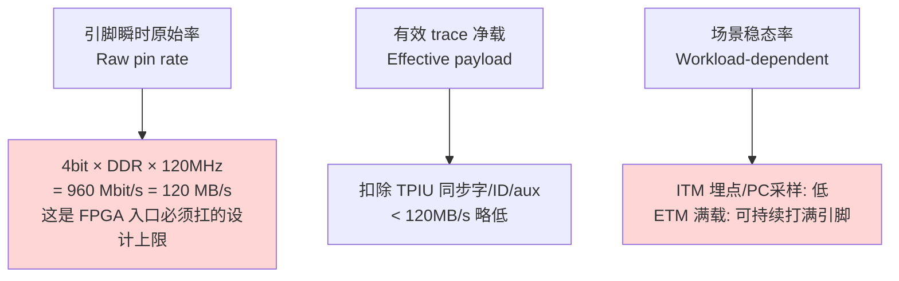
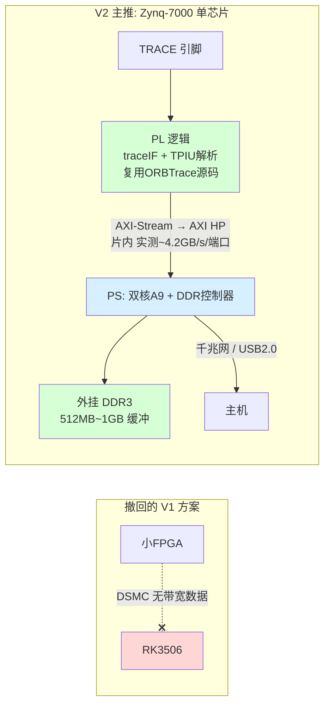
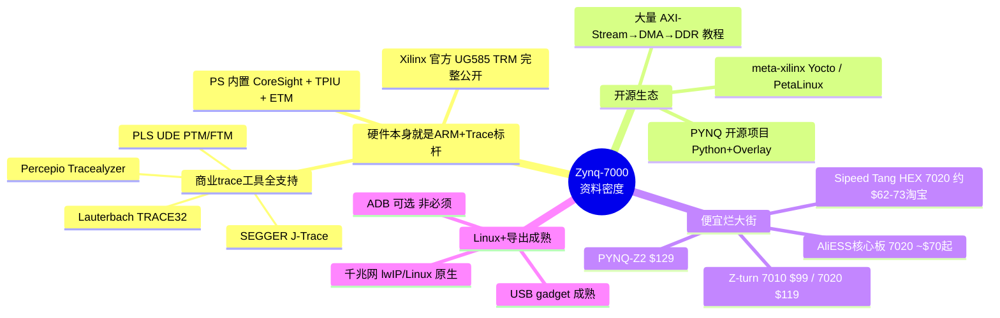
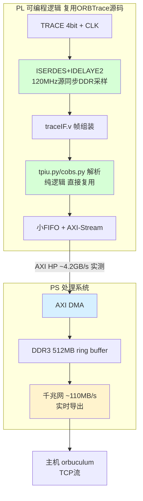
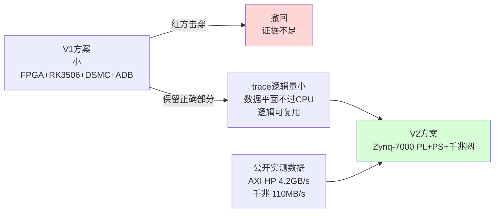

# ORBTrace 精简硬件可行性 V2（蓝方回应红方评审）

> 版本：V2，回应《红方评审-orbtrace精简硬件可行性.md》
> 立场：蓝方。**我们接受红方大部分质疑，并据此修正方案。**
> 核心变化：**撤回"小器件 + RK3506 + DSMC + ADB"作为主推方案**（证据不足，红方击穿成立）；改推**资料极其丰富、片内高带宽互联的 Zynq-7000（ARM+FPGA 同芯片）方案**，并给出带宽预算与待验证项。
> 关键原则：**只在拿到 PoC 数据后才下"可行"结论**。本文区分「已被证据支持」与「仍需实测」。

---

## 0. 先表态：哪些质疑我们接受

红方这份评审是专业且大部分正确的。蓝方逐条表态：

| 红方质疑 | 档位 | 蓝方裁定 | 处理 |
|---------|------|---------|------|
| 致命-1：500KB/s 是 CMSIS-DAP 读速、非 trace 吞吐 | 致命 | ✅ **完全接受，是硬错误** | 撤回该数字，重做数据率口径（§1） |
| 致命-2：BRAM 仅吸收 ~1ms 突发、差 HyperRAM 100× | 致命 | ✅ **接受计算，结论成立** | 撤回"BRAM 替代不降性能"，见 §2 |
| 致命-3：DSMC 无任何带宽/时序/驱动数据 | 致命 | ✅ **接受** | **撤回 DSMC 方案**，改片内 AXI（§3） |
| 致命-4：小器件 120MHz DDR 时序收敛无证据 | 致命 | ✅ **接受** | 撤回 iCE40/GW1N/12F，见 §4 |
| 严重-1：Cynthion 场景不可比 | 严重 | ✅ 接受 | 删除该类比 |
| 严重-2：25F BRAM 预算高估 | 严重 | ✅ 接受 | 修正 BRAM 预算（§2） |
| 严重-3：RK3506 device 侧 USB 实测未知 | 严重 | ✅ 接受 | 列入待验证；新方案出口改为千兆网（§3） |
| 严重-4：A7 软件解帧速率无核算 | 严重 | ✅ 接受 | 撤回 §7.6 软件解析激进变体 |
| 严重-5：DDR 带宽争用未分析 | 严重 | 🟡 部分接受 | 新方案给带宽预算（§3.3） |
| 存疑 1-5 | 次要 | ✅ 接受 | 口径统一（§1），BOM 见 §5 |

**结论先行**：红方击穿的不是"能不能把 trace 逻辑从 SoC 剥出来"（这点仍成立），而是"用最便宜的小器件 + 一条没数据的总线 + 软件解析也不降性能"这个过度外推。V2 放弃这条过度乐观的路径，换一条**有海量公开数据支撑**的路径。

---

## 1. 修正数据率口径（回应致命-1、存疑-1/2）

红方对：把 CMSIS-DAP 的 500KB/s 当 trace 吞吐是张冠李戴。V1 的 README 原文确实是描述调试口读速。**作废这个锚点。** 重新建立口径：

### 1.1 三个必须分清的速率

### 1.2 关键修正：ETM 满载就是会持续打满（接受存疑-2）

红方对：不能用"ITM 稳态不大"代表全部。**ARM ETM 指令 trace 在分支密集代码段会持续以接近引脚带宽输出**——这正是 trace 工具的高价值场景。所以正确的设计前提是：

> **FPGA 入口必须按引脚峰值 120MB/s 持续设计，不能假设"稳态不大"。** 出口与缓冲必须围绕"可能持续打满"来选型，而不是围绕"通常很闲"。

这一修正直接否定了 V1 "USB2.0 量级就够"的乐观前提——**因为 ETM 满载 120MB/s 已经超过 USB2.0 HS 的实测 ~40MB/s 上限**。出口必须更宽，或必须有大缓冲+可承受丢包的明确策略。

---

## 2. 缓冲问题：接受致命-2，修正结论（回应致命-2、严重-2）

红方的缓冲耗尽计算正确，蓝方复核并采纳：

| 缓冲方案 | 容量 | 突发净灌入(120−40=80MB/s)下耗尽时间 |
|---------|------|-----------------------------------|
| 当前 FIFO 8192×9bit | ≈9 KB | **≈112 µs** |
| 全片 BRAM（25F 实际可用，非 126KB 全占） | 乐观 ~64 KB | **≈0.8 ms** |
| 外部 HyperRAM（原 mini） | 8 MB | **≈100 ms** |

**蓝方裁定**：
- 严重-2 成立——25F 的 126KB EBR 是全片总量，要分给 USB 栈/CDC/COBS FIFO 等，独占 100KB 给主 FIFO 不现实，~64KB 是更诚实的上限。
- 致命-2 成立——BRAM 与 HyperRAM 的突发吸收能力差约 **100 倍**，对 ETM 满载场景这是实打实的性能（抗突发）下降，不是"无感"。

**修正结论**：**"用片内 BRAM 替代外部大 RAM 不降性能"这个论断撤回。** 任何要保留 ETM 满载能力的方案，**必须有 MB 级以上的缓冲**——这意味着要么保留外部大 RAM，要么用一个本身就带大 DDR 的平台。这恰好把方案推向"FPGA + 大 DDR 的 SoC"，但连接方式必须是**有数据支撑的高带宽通路**（见 §3）。

---

## 3. 撤回 RK3506/DSMC，改推 Zynq-7000（回应致命-3、严重-3/5）

### 3.1 为什么撤回 RK3506+DSMC

红方致命-3 成立：DSMC 没有任何公开带宽/时序/DMA/驱动数据，且手册显示它复用并行显示总线引脚（"DSMC and LCD cannot be used simultaneously"），设计目标是中低速并行外设，不是持续 120MB/s DMA 注入。**在拿到 DSMC 实测前，不能把它当 trace 数据主通路。** 蓝方撤回该方案作为主推。

### 3.2 改推：Zynq-7000（ARM Cortex-A9 + FPGA 同一颗硅片）

把"小 FPGA + 外挂 Linux SoC + 一条可疑总线"换成**一颗芯片内就有 FPGA(PL) + ARM(PS) 的 Zynq**，连接走**片内 AXI HP 端口**——这条通路有 Xilinx 官方实测数据。

### 3.3 带宽预算（这是红方要求的，用公开实测数字）

| 链路环节 | 带宽 | 来源 | 对 120MB/s trace 是否够 |
|---------|------|------|----------------------|
| TRACE 引脚入口 | 120 MB/s 峰值 | 文档计算（4bit×DDR×120MHz） | 设计目标 |
| PL→PS AXI HP 端口 | **实测 ~4264 MB/s/端口**，共 4 端口 | Xilinx Embedded Design Tutorials（64bit@150MHz, 1066M tranx/s × 4B） | ✅ 余量 **35 倍** |
| DDR3 缓冲带宽（A9 PS 侧） | 32bit DDR3-1066 理论 ~4.2GB/s | Zynq-7000 TRM | ✅ 远超 trace 写入+读出之和 |
| 千兆以太网出口 | 理论 125MB/s，TCP 实测 ~110MB/s | 通用千兆实测 | ✅ **首次出口 ≥ 引脚峰值**，可不丢包实时导出 |
| USB2.0 HS 出口（备选） | 实测 ~40MB/s | USB2.0 规范 | 🟡 仍是瓶颈，适合非满载场景 |

**关键结论**：
1. **AXI HP 片内通路余量 35 倍**，彻底回避红方致命-3（DSMC 无数据）——这条通路是 Xilinx 官方教程里有实测数字的标准路径。
2. **出口改千兆网（~110MB/s）后，首次出现"出口带宽 ≥ 引脚峰值"**，意味着 ETM 满载也能近实时导出，缓冲只需吸收网络抖动而非长时间净灌入——**这从根本上解决了致命-2 的缓冲耗尽问题**（出口够快，缓冲不再是命根子）。
3. DDR 带宽争用（严重-5）：A9 跑 Linux + trace 写入(120MB/s) + 网络读出(120MB/s) 合计 ~240MB/s，相对 DDR3 的 ~4.2GB/s 占用 <6%，争用可忽略。

### 3.4 Zynq 方案如何逐条回应红方

| 红方致命/严重 | Zynq 方案的回应 |
|--------------|----------------|
| 致命-2 缓冲 | 出口千兆 ≥ 引脚峰值，不再依赖大缓冲兜底；且 DDR 本就 512MB+，远超需求 |
| 致命-3 DSMC 无数据 | 改用 AXI HP，**有 Xilinx 官方实测 4.2GB/s** |
| 致命-4 小器件时序 | 用 Zynq PL（7 系 FPGA，有 IDELAY/ISERDES 硬核），120MHz 4bit DDR 是其标准能力，见 §4 |
| 严重-3 device USB 实测 | 主出口改千兆网，绕开 USB device 不确定性 |
| 严重-5 DDR 争用 | 已给预算，占用 <6% |

---

## 4. 时序问题：选有 ISERDES/IDELAY 的器件（回应致命-4）

红方致命-4 成立：决定能否跑的是 IO 时序能力，不是 LUT 数。蓝方接受，并修正器件选择逻辑：

- **撤回** iCE40UP / Gowin GW1N 小器件作为高速采样器——它们缺等效的高性能 DDR 输入延迟链，120MHz 4bit 源同步收敛工程上不可靠。
- **改用 Zynq-7000 的 PL（Artix-7 同源架构）**：自带 **ISERDES + IDELAYE2（每 IO 可调输入延迟，31 抽头 × 78ps）+ MMCM/PLL**，这正是为源同步高速接口设计的硬核。120MHz 4bit DDR 捕获对 7 系 FPGA 是**标准能力**（7 系常用于 LVDS 显示、相机等数百 MHz 源同步接口）。
- 原 mini 板用 ECP5 的 DPA/IODELAY 做相位对齐——Zynq PL 的 IDELAYE2 是功能更强的等效物，且 Xilinx 提供成熟的 IDELAY 校准 IP。**相位对齐能力不是"去掉"而是"换成更强的"**（修正存疑-5：红方指出 V1 此处逻辑反了，接受）。

> 注：仍需 PoC 给出布局布线后时序报告（setup/hold 余量）才能最终确认，但 7 系做 120MHz 源同步 DDR 有大量公开先例，风险远低于 iCE40。

---

## 5. 为什么是 Zynq：资料极其丰富 + 烂大街（回应"资料一定要多"）

你要求"资料多、烂大街"。Zynq-7000 在 ARM trace 这个具体领域是**资料最丰富的平台，没有之一**：

对比 RK3506：RK3506 是新芯片（2024），中文资料集中在几家模组厂，DSMC 几乎无公开实测；而 Zynq 有十几年积累、Xilinx 官方海量教程、PYNQ 开源生态、以及**所有主流商业 trace 工具都拿它做参考平台**。从"资料多、风险低"角度，Zynq 完胜。

### 5.1 候选板（按价格/资料）

| 板子 | 器件 | 价格 | 网口 | 资料 |
|------|------|------|------|------|
| Sipeed Tang HEX | Zynq-7020 | ~$62-73（淘宝/AliExpress） | 千兆 | 中文社区多 |
| MyIR Z-turn V2 | 7010/7020 | $99/$119 | 千兆 | 官方文档全 |
| PYNQ-Z2 | 7020 | $129 | 千兆 | **PYNQ 开源生态最丰富** |
| 各类 7020 核心板 | 7020 | ~$70 起 | 看型号 | 淘宝海量 |

### 5.2 诚实的 BOM 对比（回应存疑-4）

| 方案 | 主要料 | 估算 | 备注 |
|------|--------|------|------|
| 原 ORBTrace mini | ECP5-25F + USB3343 + HyperRAM + GreenPAK + PMIC | 自制板 | 需自研 PCB（主板未开源） |
| V2 Zynq 现成板 | 买 7020 开发板 | $62-130 | **零 PCB 研发，直接用** |
| V2 Zynq 自制 | 7020 + DDR3 + 千兆PHY + PMIC | 较高 | 7020 单价 > ECP5，料更多 |

**诚实结论**：若**自制量产板**，Zynq 的 BOM 比 ECP5 方案更贵（7020 芯片贵、DDR3 + 千兆PHY + 复杂供电）。Zynq 的优势**不在便宜，而在**：① 现成开发板极便宜且零研发；② 资料/工具链海量；③ 片内高带宽通路有实测数据；④ 出口千兆网 ≥ 引脚峰值。**如果目标是"快速做出能用、可验证的原型"，Zynq 最优；如果目标是"最低量产成本"，原 ECP5+PHY 方案反而更省。**

---

## 6. 修正后的方案全貌

**分工**：
- **PL（FPGA）**：只做 CPU 做不到的部分——高速源同步 DDR 采样 + TPIU 帧组装。TPIU/COBS 解析逻辑**直接复用 ORBTrace 的 `traceIF.v` / `tpiu.py` / `cobs.py`**（这些已验证、协议正确，是项目精华）。
- **PS（ARM）**：AXI DMA 搬到 DDR ring buffer，千兆网导出。**不在 CPU 上做逐字节协议解析**（撤回 §7.6，接受严重-4）。
- **出口**：千兆网为主（≥引脚峰值，可实时），USB2.0 为备选（非满载场景）。

---

## 7. 仍需 PoC 验证的项（不回避红方"零实测"的批评）

蓝方明确：以下结论目前是"有公开数据支撑的强假设"，**仍需 PoC 实测才能定案**。我们不重蹈 V1"理论上可行"的覆辙。

| 待验证项 | 验证方法 | 达标线 |
|---------|---------|--------|
| 120MHz 4bit DDR 源同步捕获时序收敛 | Vivado 布局布线后时序报告 + 实板眼图 | setup/hold 正余量 |
| AXI HP 持续注入 DDR 吞吐 | PL 端造 120MB/s 流，实测 DMA 到 DDR 速率 | 持续 ≥120MB/s 无丢 |
| 千兆网持续导出速率 | iperf + 实际 trace 流，测 ETM 满载下丢包率 | 持续 ≥110MB/s |
| ETM 满载真实数据率分布 | 在目标 SoC 上实测各档（ETM满载/ITM/PC采样） | 建立真实基线，替代被作废的 500KB/s |
| 端到端延迟 | 引脚→主机时间戳 | 满足 trace 连续性要求 |

**PoC 路径**：买一块 $70 的 7020 板（Tang HEX / 核心板）+ 把 ORBTrace 的 `traceIF.v` 移植到 PL + AXI DMA + 千兆网导出。这套全部用 Xilinx 官方教程里的标准 IP，**没有任何一环是"无公开数据的新东西"**——这是与 RK3506/DSMC 方案最本质的区别。

---

## 8. 最终结论（蓝方 V2 立场）

1. **红方赢了 V1 的大部分论点，蓝方接受。** V1 把"trace 逻辑量小"过度外推成"小器件+RK3506+DSMC+软件解析都不降性能"，每个关键数字都缺失或误用——这个批评成立，V1 主推方案撤回。

2. **但红方没有否定的核心仍然成立**：ARM trace 协议解析逻辑量确实小、数据平面确实不经过 CPU、这些逻辑确实可以从原 SoC 里剥出来复用。这是 V2 的出发点。

3. **V2 的关键转变**：不再追求"最便宜的小器件"，而是选**资料最丰富、片内通路有官方实测数据、出口带宽能盖过引脚峰值**的 Zynq-7000。它系统性回应了红方四个致命点：
   - 致命-2 缓冲 → 出口千兆网 ≥ 引脚峰值，缓冲不再是命根子；
   - 致命-3 DSMC → 改 AXI HP，有 Xilinx 实测 4.2GB/s；
   - 致命-4 小器件时序 → 用带 ISERDES/IDELAYE2 的 7 系 PL；
   - 严重-3 USB device → 出口改千兆网绕开。

4. **诚实的代价**：Zynq 自制量产板 BOM 比 ECP5 方案贵；优势在原型速度、资料密度、风险可控。**若追求最低量产成本，原 ORBTrace 的 ECP5+ULPI 方案仍是更优解**——V2 不假装 Zynq 在所有维度都赢。

5. **不重蹈覆辙**：V2 明确列出 §7 的 5 项待 PoC 验证清单，并给出全部用官方标准 IP 的 PoC 路径。**在 PoC 数据达标前，V2 也只是"有数据支撑的强候选"，不是"已证可行"。** 这是对红方"先做 PoC 再立项"立场的正面接受。

---

## 附录：V2 关键数字来源

- PL→PS AXI HP 端口实测 ~4264 MB/s：Xilinx Embedded Design Tutorials "Evaluating High-Performance Ports"（64bit×150MHz×1066M tranx/s 算式）
- Zynq-7000 内置 TPIU/CoreSight/ETM：Xilinx UG585 Zynq-7000 TRM（manualslib 摘录的 "Trace Port Interface Unit (TPIU)" 章节）
- 商业 trace 工具支持 Zynq trace：Lauterbach（zynq-7000 平台页）、PLS UDE PTM/FTM、SEGGER wiki、Percepio（千兆网 trace 流式）
- 低价 Zynq 板：Sipeed Tang HEX 7020 ~$62-73（CNX-Software / AliExpress）、Z-turn 7010 $99 / 7020 $119（Xilinx 板卡页）、PYNQ-Z2 $129（AMD 大学计划）
- 7 系 ISERDES/IDELAYE2 源同步能力：Xilinx 7 Series SelectIO 资源（IDELAYE2 31 抽头）
- 被作废的 500KB/s 出处：`orbtrace/README.md`（"very fastest CMSIS-DAP interface ... 500KBytes/sec"，确为调试口读速）
- RK3506 DSMC 缺乏公开带宽数据：Forlinx OK3506 手册（仅 "Support 1x master or 1x slave"、"DSMC and LCD cannot be used simultaneously"）
