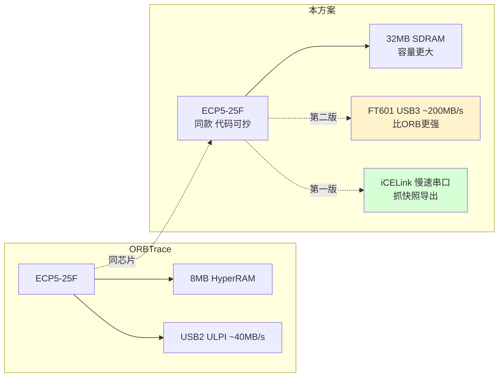
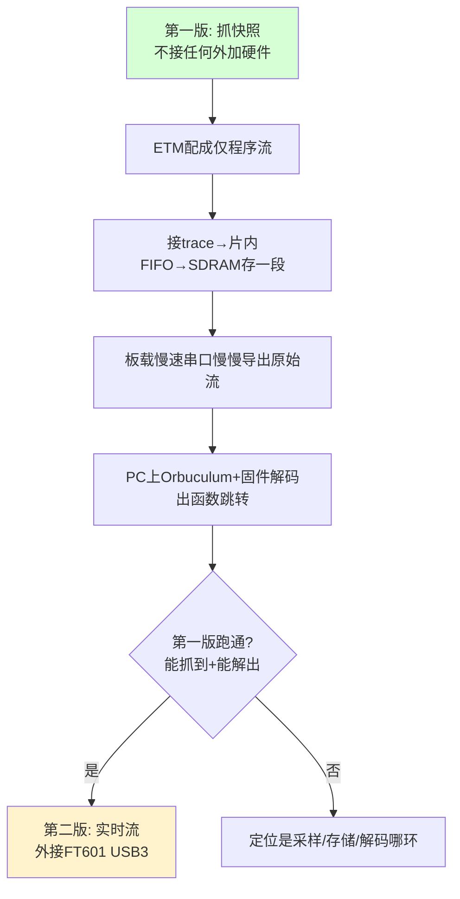
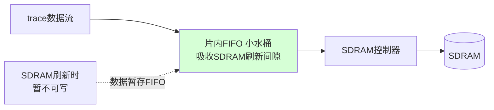
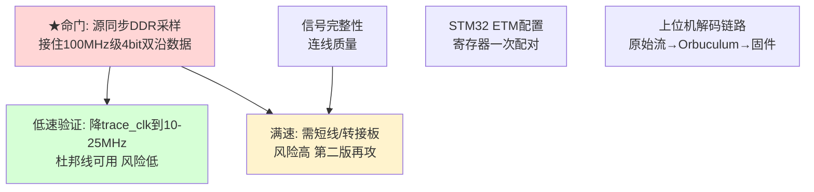

# Cortex-M 指令流 Trace · iCESugar-Pro 抓快照方案

> 目标：抓 Cortex-M（先以 STM32F429 交叉验证）的 ETM 指令流，定位 UAF 与性能问题，要求性能无损、无软件插桩。
> 约束：单台 < 1000 RMB、硬件可大规模采购、上位机跨平台。
> 方案定调：**以买得到的 iCESugar-Pro（Lattice ECP5-25F）正向复刻 ORBTrace 的 trace 捕获，第一版走"抓快照 + 低速口导出"，第二版再加 USB3 实时出口。**
> 本文档供红方评审。所有关键数字标注来源或标注"待 PoC 实测"。

---

## 0. 方案演进背景（为何收敛到本方案）

经过 ORBTrace 自制方案、RK3506+DSMC 方案、Zynq 正向方案三轮红蓝评审，逐一被否定或降级，核心教训沉淀如下：

| 曾经的方案 | 被否原因（红方击穿点） |
|-----------|---------------------|
| 自制 ORBTrace PCB | 软硬件双未知，调试无底洞；主板 KiCad 未开源 |
| RK3506 + DSMC | DSMC 无任何公开带宽/时序数据，不可据此立项 |
| Zynq 正向开发 | 对 F4/F7 是过度设计；PS 仅搬运则丧失选 Zynq 理由；缓冲推到 DDR3 是类别错误（抗失速缓冲必须在 DMA 上游） |

**本方案的收敛逻辑**：
1. 你的真实数据率不高（F429@168MHz ≈ 32MB/s），**不需要大带宽平台**，Zynq 的优势用不上。
2. 接 trace 的物理难点（源同步 DDR 采样）**与平台无关，选哪个都要面对**——那就选"能直接抄 ORBTrace 代码"的同款芯片，把这块难点的风险降到最低。
3. 出口带宽决定要不要大缓冲。**先用"抓快照 + 慢导出"绕开实时高速出口**，把最难的实时性问题推迟到第二版。

---

## 1. 关键技术前提（先锁死，不成立则免谈）

### 1.1 ETM 存在性（已二次确认）
- STM32F429（Cortex-M4）含可选 **ETM-M4**，经 4-bit 并行 TRACE 端口输出。
- 证据：ARM CoreSight ETM-M4 TRM；SEGGER 知识库明确 J-Trace 可对 STM32F429 做引脚 trace。

### 1.2 一个必须破除的认知误区（本方案的设计基石）

**误区**："我只要函数跳转，数据量小，低速口实时抓就够。"

**事实**：单片机从 trace 引脚吐出的是 **ETM 原始压缩流**，不是"函数跳转"。它高度压缩，且**必须配合被测程序的固件镜像（.elf）在上位机端反推**才能还原成指令/跳转。因此：
- **无法在 FPGA 端"只挑函数跳转"** —— 此时数据尚未解码，分不出哪段是跳转。
- "挑选/解码"只发生在 PC 上的 Orbuculum + 固件镜像。
- **源头减量的正确手段**：在 STM32 侧把 ETM 配成"**只跟踪程序流（PC/分支/异常），关闭数据访问 trace**"。这能大幅降低平均速率，但**峰值瞬间仍可能很高**（密集分支段），故仍需缓冲。

→ 本方案据此设计：FPGA 端只负责"无差别完整抓取 + 缓冲 + 搬运"，所有解析交给 PC。

### 1.3 数据率核算

| 场景 | 平均 trace 率 | 备注 |
|------|--------------|------|
| F429@168MHz，仅程序流 trace | 远低于 32MB/s | 数据访问 trace 已关 |
| F429@168MHz，最坏满载估算 | ≈252 Mbit/s ≈ 32 MB/s | 1.5 bit/指令经验值 |
| 未来 500MHz 目标 | ≈94 MB/s | 留待第二版/USB3 |

---

## 2. 硬件选型：iCESugar-Pro（ECP5-25F）

### 2.1 为何是它

| 维度 | iCESugar-Pro | 评价 |
|------|-------------|------|
| FPGA 芯片 | **LFE5U-25F**，与 ORBTrace **同款** | 🟢 接 trace 代码可直接参考，且 ORBTrace 已在该芯片证明 120MHz trace 采样可行 |
| 采样能力 | ECP5 自带 DDR 输入 + 输入延迟原语 | 🟢 满足源同步 DDR 采样的硬件前提 |
| 板载内存 | 32MB SDRAM（IS42S16160B） | 🟢 容量/带宽对本用途足够（见 §4） |
| 工具链 | yosys + nextpnr 开源 | 🟢 免费 |
| 可采购性 | 淘宝现货、SODIMM 模块化 | 🟢 满足"可大规模采购" |
| **USB 出口** | **板上 USB 仅接 iCELink 调试器，FPGA 无直接 USB** | 🔴 **唯一硬伤**，决定分两版（见 §3） |

### 2.2 与 ORBTrace 的对应关系



---

## 3. 分两版实施（核心策略：先绕开实时高速出口）



### 3.1 第一版：抓快照（Snapshot）

**数据通路**：
```
STM32 trace引脚 → ECP5接收(DDR采样) → 片内FIFO(顶SDRAM刷新) → SDRAM环形缓冲(抓一段) → iCELink串口 → PC → Orbuculum解码
```

**特点**：
- **不接任何外加硬件**，iCESugar-Pro 原样用。
- 出口用板载慢速串口——**只负责事后慢慢倒出已存好的快照**，不要求跟上实时峰值。
- 对 UAF 用途天然契合：抓"崩溃前后那一段"，非连续长流。
- 32MB SDRAM @ 仅程序流 trace，可存数秒级快照（满载估算 ≈1 秒，降速/仅程序流下更久）。

**触发方式**（待定，PoC 确认）：手动触发 / 看门狗超时 / 特定地址命中 / 满即停（环形缓冲保留最近一段）。

### 3.2 第二版：实时流（可选升级）

- 外接 FT601（USB3，实测 ~190-200MB/s）模块到 SODIMM 扩展 IO。
- 出口带宽（200MB/s）≫ trace 峰值（32MB/s，甚至 500MHz 的 94MB/s）→ **数据进多少出多少，SDRAM 可退为小缓冲甚至不需要大缓冲**。
- 实现实时连续 trace。仅在确有连续抓取需求时才做。

---

## 4. 内存：SDRAM 够用吗？为何 ORB 用 HyperRAM？

### 4.1 带宽核算

| 项 | 数值 |
|----|------|
| SDRAM (IS42S16160B) 理论带宽 | 16bit × ~166MHz ≈ **300+ MB/s** |
| trace 写入需求（最坏） | 32 MB/s（F429）/ 94 MB/s（500MHz） |
| **余量** | **≥3-9 倍** |

→ **带宽充足，不是约束。**

### 4.2 ORBTrace 为何选 HyperRAM 而非 SDRAM——以及为何对本方案不构成问题

ORB 选 HyperRAM **不是因为带宽**，而是：
1. **SDRAM 需周期性刷新**（物理特性），刷新时短暂不可读写（"打嗝"）。突发数据撞上刷新需谨慎处理。HyperRAM 引脚少、控制简单、行为更可预测，做通用产品更省心。
2. ORB 是**面向所有用户的成品**，必须保证任何场景零丢失，故选最稳的内存 + 大缓冲扛突发。

**对本方案为何不成问题**：
- 你是**自用 + 抓快照**，非"任意场景零丢失"的通用产品，ORB 的产品级极致稳定取舍不必照搬。
- SDRAM 的"刷新打嗝"用 **§5 的片内 FIFO** 即可吸收（刷新仅几百 ns，FIFO 容量需求极小，片内绰绰有余）。

### 4.3 片内缓冲（FIFO）设计——你的思路正确



- 原理：trace 先进片内 FIFO，再搬入 SDRAM；SDRAM 刷新不可写的几百 ns 内，数据暂存 FIFO，刷新结束后补入。
- 这是**标准教科书做法**，FIFO 只需容纳"一次刷新间隙 + 仲裁延迟"的数据量，片内 BRAM 完全够。

---

## 5. 真正的命门与风险（不回避）



| 风险 | 严重度 | 应对 |
|------|--------|------|
| **源同步 DDR 采样**（与平台无关的固有难点） | 🔴 高 | 抄 ORBTrace 同芯片代码；第一版先低速（降 trace_clk）验证 |
| 信号完整性（杜邦线 vs 满速） | 🟡 中 | 低速验证用杜邦线；满速需短线/转接板，第二版处理 |
| STM32 ETM+TPIU 寄存器配置 | 🟡 中 | 有 OpenOCD/pyOCD 先例 + 本仓库 muleboard.ocd 参考 |
| SDRAM 刷新打嗝 | 🟢 低 | 片内 FIFO（§4.3） |
| 上位机解码（含固件镜像） | 🟢 低 | Orbuculum 跨平台现成；先用已知样本验证 |
| 板载 25MHz 晶振（ORB 是 30MHz）| 🟢 低 | 改时钟参数 |
| SDRAM 类型与 ORB 不同 | 🟢 低 | 自写控制器或用快照思路，影响小 |

**诚实结论**：本方案把前几版的"平台风险/缓冲风险/出口风险"基本消化掉了，**唯一剩下的真命门是源同步 DDR 采样**——而这是任何 trace 探针都绕不开的物理门槛，本方案通过"同款芯片抄代码 + 第一版降速验证"把它的风险压到最低。

---

## 6. 实施路线（分阶段，每阶段单一新变量）

| 阶段 | 任务 | 不依赖 | 通过判据（待量化） |
|------|------|--------|-------------------|
| P0 | STM32F429 配 ETM（仅程序流）+ TPIU 4-bit，示波器确认 5 线波形 | FPGA | 低速 trace_clk 下波形正确稳定 |
| P1 | 用已知正确样本喂 Orbuculum，验证 PC 解码链路 | FPGA、硬件 | 解出函数跳转，与 golden 一致 |
| P2 | ECP5 低速接 trace → 片内 FIFO → SDRAM 存快照 | USB3、转接板 | 抓一段存入，导出原始流正确 |
| P3 | 全链路：抓快照 → 串口导出 → Orbuculum 解出函数跳转 | USB3 | 端到端解出真实执行流 |
| P4（第二版）| 接 FT601，提速到满速实时；满速需转接板 | — | 满速无丢、实时流 |

**P0/P1 不依赖 FPGA，可立即并行启动**，提前消化最易卡的两个变量（ETM 配置、PC 解码）。

---

## 7. 待 PoC 实测项

| 编号 | 验证项 | 达标线 |
|------|--------|--------|
| V-1 | ETM 仅程序流模式下，F429 各负载的实际平均/峰值 trace 率 | 建立真实基线 |
| V-2 | 低速 trace_clk 源同步采样正确性（杜邦线） | 连续采集无误帧 |
| V-3 | 片内 FIFO 吸收 SDRAM 刷新的最小深度 | 无溢出 |
| V-4 | SDRAM 快照可存时长（仅程序流 / 满载两档） | 满足 UAF 现场窗口 |
| V-5 | 串口导出一段快照 + Orbuculum 解码 | 解出正确函数跳转 |
| V-6（第二版）| 满速 trace_clk 采样 + 信号完整性（转接板） | 眼图/时序余量达标 |
| V-7（第二版）| FT601 持续吞吐 | ≥ trace 峰值 |

---

## 8. 方案边界（诚实声明能做什么、不能做什么）

**能做**：
- 抓快照式指令流 trace，定位**能在抓取窗口内复现**的 UAF / 执行流异常。
- 第一版零外加硬件，低速验证打通全链路。
- 第二版加 FT601 实现满速实时。

**不能做 / 限制**：
- 第一版**非实时**（抓快照后慢导出），不能连续长时间实时流。
- **低速档需降低被测 CPU 频率/负载**才能无损——这会扰动时序，**对时序敏感的竞态型 UAF 可能掩盖**。竞态型必须走第二版满速 + 转接板。
- "只要函数跳转"**不能在源头按字节挑选**，只能靠 ETM 仅程序流模式减量 + PC 端解码筛选。
- 满速（第二版）仍需解决信号完整性（短线/转接板），这是物理门槛。

---

## 9. 结论

本方案是三轮评审后收敛的务实解：**用买得到的 iCESugar-Pro（与 ORBTrace 同款 ECP5）复刻 trace 捕获，第一版以"抓快照 + 慢导出"绕开实时高速出口这一最大工程障碍，把风险集中到唯一的物理命门——源同步 DDR 采样，并用"同芯片抄代码 + 低速先验证"将其风险压至最低。** 第二版再以 FT601 USB3 升级到满速实时。

相比被否的前几版：消掉了自制 PCB 的硬件未知、消掉了 DSMC 的无数据风险、消掉了 Zynq 的过度设计与缓冲类别错误。**代价是第一版非实时、且对竞态型 UAF 能力受限**——这两点已在 §8 诚实声明。

---

## 附录：关键来源

- iCESugar-Pro 规格（LFE5U-25F / 32MB SDRAM IS42S16160B / 25MHz / 板载 iCELink，FPGA 无直接 USB）：官方仓库 `wuxx/icesugar-pro`
- ORBTrace 同款芯片与 trace 捕获源码：`orbcode/orbtrace`（`verilog/traceIF.v`、`trace/*.py`）
- STM32F429 ETM 经引脚 trace：ARM CoreSight ETM-M4 TRM；SEGGER "Tracing on ST STM32F429"
- ETM 程序流 vs 数据 trace、需固件镜像解码：ARM ETM Architecture Spec；SEGGER "General information about tracing"
- FT601 USB3 实测吞吐 ~190-200MB/s：FTDI FT601 规格；Alchitry Ft（实测 190+MB/s）
- 指令 trace 带宽经验值 1.5 bit/指令：US Patent 7,752,425；ARM trace port pins 计算
- 上位机 Orbuculum 跨平台：`orbcode/orbuculum`
