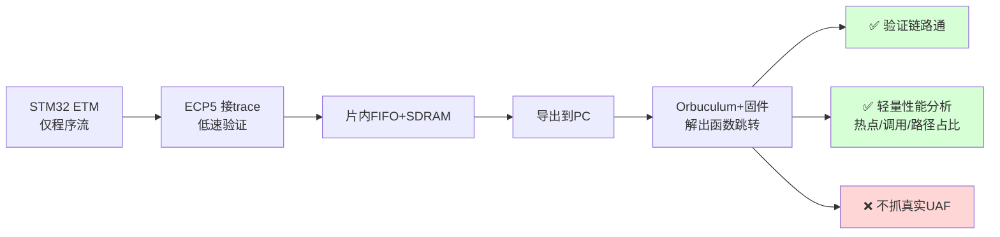
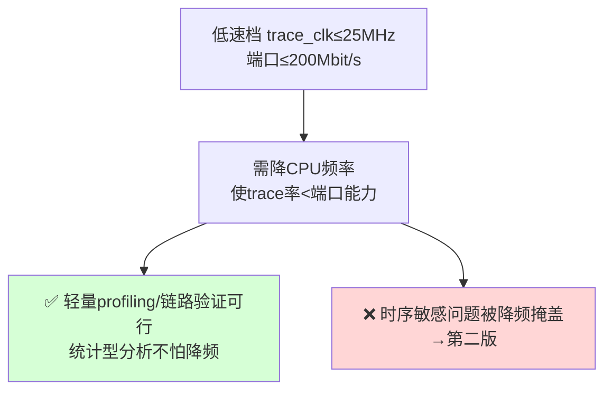

# Cortex-M 指令流 Trace · iCESugar-Pro 方案 V2（蓝方回应第四轮红方评审）

> 版本：V2，回应《红方评审-iCESugarPro抓快照方案-第四轮.md》
> 立场：蓝方。**接受红方核心结论，对第一版做诚实正名。**
> 最大修正：**第一版不再宣称"定位 UAF"，重新定位为"trace 采样 + 解码链路验证 PoC + 轻量性能 profiling 工具"。** UAF（尤其竞态型/长程型）明确划归第二版能力，且承认第二版仍有未解命门。

---

## 0. 本轮定调：接受红方，给第一版正名

红方第四轮的核心判断成立，蓝方接受：**"抓快照"没有消除难题，只是把"出口带宽"换成了"触发+覆盖窗口"和"导出耗时"两个新难题；真正的工具能力仍压在第二版。** 因此第一版**不能当"能定位 UAF 的工具"宣传**。

但这里有一个关键澄清——**蓝方本就不需要第一版去抓 UAF。** 经与需求方确认，第一版的真实目标是：

1. **验证整条 trace 链路能跑通**（采样 → 缓冲 → 导出 → PC 解码出函数跳转）；
2. **顺带覆盖"轻量性能问题"**（热点函数、调用频率、执行路径占比等 profiling 类需求）。

UAF（特别是竞态型、长程型）从一开始就不是第一版的目标。所以红方 F1/F2 击穿的"抓快照定位 UAF"——**蓝方直接撤回这个宣称**，不辩护。

| 红方质疑 | 档位 | 蓝方裁定 | 处理 |
|---------|------|---------|------|
| F1 触发待定 + 环形缓冲冲掉 UAF 根因 | 致命 | ✅ 接受 | 撤回"抓快照定位 UAF"；第一版不抓 UAF（§1） |
| F2 第一版无法定位真实 UAF | 致命 | ✅ 接受 | 第一版正名为链路 PoC + 轻量 profiling（§1/§2） |
| F3 真命门（满速+转接板）推到第二版 | 致命 | ✅ 接受 | 诚实标注第二版命门未解，不假装第一版降低了它（§5） |
| F4 用平均掩盖峰值，峰值无数据 | 致命 | ✅ 接受 | 峰值率列为 P0 必测前置，所有结论改用峰值口径（§3） |
| S1 串口导出分钟级 | 严重 | ✅ 接受 | 改"只导触发邻域片段"+给实测要求；轻量场景数据量小（§4） |
| S2 同芯片≠同板，引脚未核实 | 严重 | ✅ 接受 | 引脚核实列为开工前置门（§6） |
| S3 vs Artix-7+FT601 未诚实对比 | 严重 | ✅ 接受 | 补对照表 + 给出"何时该换 Artix"判据（§7） |
| m1 SDRAM 带宽口径 / FIFO | 次要 | ✅ 接受 | 修正为有效带宽 ~150-200MB/s（§3） |
| m2 晶振/SDRAM 差异 | 次要 | ✅ 接受 | 维持低风险 |
| m3 "性能无损"措辞 | 次要 | ✅ 接受 | 全文改为"ETM 旁路无侵入；第一版降频抓取会扰动时序"（§1） |

**总基调**：红方赢了"第一版不是 UAF 工具"这个核心点。V2 不再包装第一版的价值，而是**把它的真实价值（链路验证 + 轻量 profiling）说清楚，把它做不到的（真实 UAF）划清楚**。

---

## 1. 第一版的真实定位与能力边界（诚实声明）

### 1.1 第一版是什么

**一句话：第一版是"用最便宜、买得到的硬件，把 Cortex-M ETM 指令流采集→解码这条链路端到端打通"的验证平台，附带可用于轻量性能分析。**

### 1.2 第一版能做什么（独立价值，不吹）

- **链路验证**：证明 ECP5 源同步采样、片内缓冲、SDRAM 存储、导出、PC 端 Orbuculum + 固件镜像解码——整条链路可工作。这是第二版的必要地基。
- **轻量性能 profiling**（真实可用价值）：
  - 函数执行频率、热点函数、调用关系；
  - 执行路径分布、分支占比；
  - 这类需求**不要求满速无损、不要求抓崩溃瞬间**——抓一段有代表性的运行片段，统计分析即可。降频/采样窗口有限对统计型 profiling **影响可接受**。

### 1.3 第一版明确做不到什么（接受 F1/F2）

- ❌ **定位竞态型/时序型 UAF**：降频抓取会扰动时序，掩盖竞态。
- ❌ **定位长程 UAF**：根因与崩溃间隔可能远超环形缓冲窗口（28MB 仅覆盖满速 <0.3s / 降频 <7s），根因现场会被冲掉。
- ❌ **实时连续 trace**：第一版抓快照后慢导出，非实时。
- ❌ **满速无损**：低速档需降 CPU 频率才不溢出（见 §3）。

### 1.4 措辞修正（m3）
全文统一：**"ETM 是旁路监听，对被测程序的运行性能无侵入；但第一版为了用低速链路抓取，需降低被测 CPU 频率，降频本身会扰动时序。"** 不再使用可能被误读为"满速无损"的"性能无损"。

---

## 2. 32MB RAM 的现实定位（需求方已确认）

需求方明确认可：**32MB SDRAM 抓 UAF 不够，但抓轻量性能问题够用。** 这与红方 F1 的窗口反算一致，蓝方采纳为设计前提：

| 用途 | 32MB 够不够 | 说明 |
|------|------------|------|
| 链路验证 | ✅ 够 | 抓一小段就能验证解码 |
| 轻量性能 profiling | ✅ 够 | 统计型分析，一段代表性片段足矣 |
| 崩溃即根因的同步问题 | 🟡 勉强 | 需触发延迟 < 窗口（见 §3） |
| 长程/竞态 UAF | ❌ 不够 | 根因远早于崩溃，窗口冲掉；→ 第二版 |

→ **32MB 不是缺陷，是与第一版定位匹配的容量。** 抓 UAF 是第二版（更大缓冲 + 实时出口）的事。

---

## 3. 峰值率：从平均口径改为峰值口径（接受 F4）

红方对——抓快照怕的是峰值，V1 全用平均立论是错的。修正：

### 3.1 峰值的物理上限

- ETM 程序流 trace 在密集分支段/中断风暴时，瞬时可逼近 4-bit 端口物理上限。
- 端口上限 = 4 bit × 2（双沿）× trace_clk：
  - trace_clk=100MHz → **800 Mbit/s = 100 MB/s**（约平均的 3 倍）
  - trace_clk=25MHz（低速档）→ **200 Mbit/s** —— **低于 F429@168MHz 满速平均 252Mbit/s，必然溢出**

### 3.2 由此得出的硬约束（坐实低速档=降频档）

**低速档（trace_clk 10-25MHz）必须配合降低 CPU 主频**，使被测程序的平均+峰值 trace 率落在端口能力内。这是第一轮 C1 的延续，V2 正式接受并写入能力边界：

### 3.3 SDRAM 带宽口径修正（m1）
- 撤回"300+MB/s / 余量 9 倍"。
- 修正为**有效写带宽 ~150-200 MB/s**（计入刷新 ~0.8%、行切换、仲裁）。
- 对比峰值 100MB/s，仍有余量，但口径诚实。
- 片内 FIFO：真正要扛的是 SDRAM 控制器突发停顿（非刷新，刷新仅 0.8%），最小深度待 P2 实测；ECP5-25F 的 126KB BRAM 足够。

### 3.4 峰值率列为 P0 必测前置
所有窗口/容量结论在拿到**实测峰值率**前都是暂定。V-1 升级为开工前置项。

---

## 4. 导出耗时：改为"只导触发邻域片段"（接受 S1）

红方反算正确：导出满载 1 秒快照经 iCELink 串口要 0.5-4 分钟，迭代不可用。修正：

### 4.1 关键改变：不全导，只导有用的片段
- **轻量 profiling 场景数据量本就小**：统计热点/调用，抓几十~几百 KB 的代表性片段即可，不需要导 28MB。
- **链路验证场景**：导几 KB~几十 KB 验证解码正确性即可。
- **若做"崩溃邻域"**：只导出环形缓冲中触发点前后的小片段（依赖触发，见限制）。

### 4.2 导出耗时目标
- 单次迭代导出控制在 **< 30 s**（红方判据）。
- 对应：导出片段 ≤ 几 MB（按 iCELink CDC 实测净速反推上限，V-4 实测）。
- 若 iCELink 串口实测太慢导致连小片段都超 30s → **第一版直接上 FT601**（见 §7），不在串口上将就。

### 4.3 待实测（V-4）
iCELink CDC 净吞吐 + 导出 N MB 耗时表；确认能否只导邻域片段。

---

## 5. 不掩盖第二版命门（接受 F3）

红方对——满速+转接板+源同步采样是真命门，不能假装第一版降低了它。诚实声明：

- **第一版的低速验证，对第二版的满速可行性零证明力**（眼图在满速才闭合，低速通过≠满速通过）。这点与 Zynq 第二轮结论一致，蓝方不重犯"低速外壳遮命门"。
- **第二版命门仍未解**：满速源同步 DDR 采样 + 受控阻抗转接板的信号完整性。这是物理门槛，任何平台都绕不开。
- **诚实排期**：第二版命门必须**单独立 PoC 验证**（满速 + 转接板眼图/时序），不得用第一版进度冒充。

→ V2 不宣称"命门已被压到最低"，而是：**第一版只解决链路 bring-up；满速命门是第二版必须独立攻克的、尚未解决的硬骨头。**

---

## 6. 开工前置门：iCESugar-Pro 引脚核实（接受 S2）

红方对——同芯片≠同板。`traceIF.v` 把 TRACECLK 直接当时钟用，要求它落在 ECP5 时钟能力脚。**这是开工前必须核实的门，不通过则换板/换引脚：**

| 核实项 | 要求 | 不通过的后果 |
|--------|------|-------------|
| TRACECLK 候选引脚 | 落在 ECP5 **PCLK/ECLK 时钟能力脚** | 满速必时序崩，第二版命门从起点不可达 |
| 5 根 trace 线 | 尽量同一 IO bank / 同区域 | 跨 bank 增加 skew |
| bank 电压 | 可配 3.3V（或加电平转换） | 电平不匹配 |
| SODIMM 引脚固定性 | 边缘 IO 分配是否被 SODIMM 锁死 | 比自由 PCB 更难补救 |

**核实方法**：查 `wuxx/icesugar-pro` 引脚约束文件 + ECP5 datasheet pinout，逐脚比对。**核实通过才动手。**

---

## 7. 诚实对照：iCESugar-Pro vs Artix-7+FT601（接受 S3）

红方对——不能被"同芯片"单点吸引。诚实对照：

| 维度 | iCESugar-Pro | Artix-7 + FT601（如 Alchitry Au+Ft） |
|------|-------------|-----------------------------------|
| 采样代码 | 可参考 ORBTrace（ECP5 IDDRX） | 需把 IDDRX 换 Xilinx ISERDES/IDDR |
| 实际改动量 | 仍需改引脚/SDRAM/时钟 | 改采样原语层 |
| **FPGA 接 USB** | ❌ 无 → 逼出抓快照+串口 | ✅ FT601 USB3 ~190MB/s |
| **第一版能否实时** | ❌ 否 | ✅ **是**（出口 > trace 峰值） |
| 导出耗时 | 串口分钟级（S1） | USB3 秒级 |
| 缓冲压力 | 需 SDRAM 抓快照 | 出口够快，几乎不需大缓冲 |
| 价格 | 较低 | 略高 |
| 满速命门 | 同样需转接板 | 同样需转接板 |

### 7.1 诚实结论
- **"同芯片能抄"的优势被高估**：`traceIF.v` 核心是芯片无关 Verilog，换 Artix 只改采样原语层；而在 iCESugar-Pro 上换板同样要改引脚/SDRAM/时钟。省下的不足以抵"无 USB"赔上的。
- **真正主导成败的是出口（USB），不是采样代码复用率。**

### 7.2 选型判据（明确化）
- **若第一版只为"验证链路 + 轻量 profiling"且预算敏感** → iCESugar-Pro 够用（抓快照/串口对验证和轻量 profiling 可接受），且与 ORBTrace 同芯片便于对照。
- **若希望第一版就能实时、或预期很快要做第二版的满速实时** → **直接选 Artix-7 + FT601**，跳过抓快照这套将就，第一版即实时。
- **决策点**：你当前明确是"先验证链路 + 轻量性能问题"，iCESugar-Pro 成立；但**一旦确认需要实时/UAF，应果断转 Artix-7+FT601，不要在 iCESugar-Pro 上硬堆第二版**。

---

## 8. 修正后的实施路线

| 阶段 | 任务 | 不依赖 | 量化判据 |
|------|------|--------|---------|
| **前置门** | iCESugar-Pro SODIMM trace 引脚核实（§6） | — | TRACECLK 落时钟脚、5 线同 bank、3.3V → 通过才开工 |
| P0 | STM32F429 配 ETM（仅程序流）+ TPIU；示波器确认 5 线波形；**实测峰值率**（§3.4） | FPGA | 波形稳定 + 建立峰值基线 |
| P1 | 已知样本喂 Orbuculum，验证 PC 解码链路 | FPGA | 解出函数跳转与 golden 一致 |
| P2 | ECP5 低速接 trace → FIFO → SDRAM | USB3、转接板 | 连续采集 ≥10min，误帧率 <1e-9，FIFO 无溢出 |
| P3 | 全链路：抓片段 → 导出 → 解码 | USB3 | 解出真实执行流；单次迭代（触发→导出→解码）**< 30s** |
| P3.5 | 轻量 profiling 实用化（热点/调用统计） | — | 能产出有用的性能报告 |
| **第二版（独立立项）** | FT601 实时 + 转接板满速 + 满速源同步采样 PoC | — | 满速眼图/时序达标（**单独命门，不靠第一版背书**） |

**P0/P1 不依赖 FPGA，立即可启动**，提前消化 ETM 配置与 PC 解码两个变量。

---

## 9. 待补证据（接受红方"缺则不批"清单）

| 编号 | 项 | 对应红方 |
|------|----|---------|
| V-1（前置）| 程序流 trace **峰值率**实测（密集分支+中断） | F4 |
| V-2 | iCESugar-Pro SODIMM trace 引脚 bank/时钟脚/电压核实表 | S2 |
| V-3 | 低速档下需把 CPU 降到多少频率才不溢出端口 | F4/C1 |
| V-4 | iCELink CDC 净吞吐 + 导出 N MB 耗时；能否只导邻域片段 | S1 |
| V-5 | 片内 FIFO 吸收 SDRAM 突发停顿的最小深度 | m1 |
| V-6 | 第一版能定位的 bug 类型清单（与项目初衷做交集，诚实标注） | F2 |
| V-7 | iCESugar-Pro vs Artix-7+FT601 对照表（已在 §7 给出框架，补价格/工时） | S3 |
| V-8（第二版）| 满速源同步采样 + 转接板眼图/时序报告 | F3 |

---

## 10. 结论

**V2 的实质是给第一版"降格正名"：**

1. **撤回"第一版定位 UAF"的宣称**（接受 F1/F2）。第一版是**链路验证 PoC + 轻量性能 profiling 工具**，这是它真实且足够的价值——也正是需求方当前所需。
2. **32MB RAM 与该定位匹配**：抓 UAF 不够（需方已确认），抓轻量性能问题够用。
3. **诚实接受**：峰值口径（F4）、低速档=降频档（C1）、串口导出改只导片段（S1）、引脚必须核实（S2）、第二版命门未解且不靠第一版背书（F3）。
4. **选型诚实**：iCESugar-Pro 适合"验证链路+轻量 profiling+预算敏感"；**一旦要实时/UAF，应转 Artix-7+FT601**（§7.2）。
5. **不重犯老毛病**：不宣称第一版降低了第二版的满速命门，该命门单独立 PoC。

**与红方最终立场一致**：第一版可做，但只作为"采样/解码链路 bring-up + 轻量 profiling"，不作"UAF 工具"宣传。想要真 UAF/实时，要么解决触发+窗口（大缓冲+低延迟触发），要么换 Artix-7+FT601 直接实时。

---

## 附录：关键来源

- iCESugar-Pro 规格（ECP5-25F / 32MB SDRAM / 板载 iCELink，FPGA 无直接 USB）：`wuxx/icesugar-pro`
- ORBTrace 同芯片与采样源码（`traceIF.v` 以 traceclk 为时钟域）：`orbcode/orbtrace`
- ETM 程序流 trace、需固件镜像解码：ARM ETM Architecture Spec；SEGGER "General information about tracing"
- ETM 峰值可逼近端口物理上限：ARM trace port pins 计算（4×2×trace_clk）
- FT601 USB3 ~190-200MB/s：FTDI FT601；Alchitry Ft 实测
- 上位机跨平台：`orbcode/orbuculum`
- SDRAM 刷新开销（tRFC≈60-70ns / 7.8µs 间隔 ≈ 0.8%）：IS42S16160B 数据手册口径
