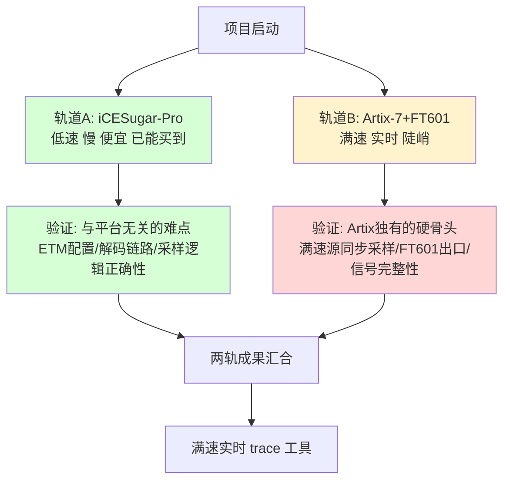
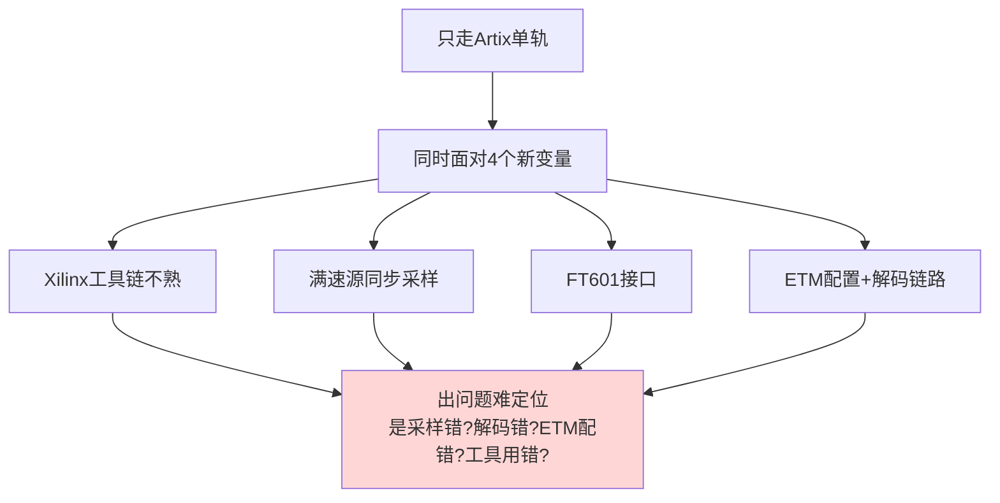
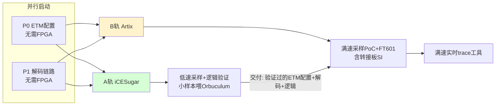

# Cortex-M 指令流 Trace · 双轨并行方案 V3

> 版本：V3。在第五轮红方评审（建议直接上 Artix-7+FT601、放弃 iCESugar-Pro）之后提出。
> 核心调整：**不在 iCESugar-Pro 与 Artix-7 之间二选一，而是双轨并行**——两块板价格都可承受，分工验证不同层次的风险。
> 立场：蓝方。本文档供红方评审，重点接受红方第五轮 N1/F2 的事实，但论证"双轨"不是伪经济，而是有意的降险结构。

---

## 0. 为什么是"双轨"而不是"二选一"

### 0.1 第五轮红方的核心结论（已接受的事实）

- **N1**：ETM 仅程序流给的是"执行了哪些指令"，不是"花了多少时间"——指令计数 ≠ 耗时，profiling 若要耗时必须开时间戳包，会推高带宽。**接受。**
- **F2**：第一版能复用到第二版的部分（ETM 配置、PC 解码、芯片无关逻辑）不依赖 iCESugar-Pro；iCESugar 专属的部分（SDRAM 控制器、串口导出、低速采样前端）到满速版要丢弃。**接受。**
- **红方建议**：既然如此，直接上 Artix-7+FT601，省掉 iCESugar 这一版。

### 0.2 为什么蓝方仍要保留 iCESugar 轨——但理由完全重构

红方的逻辑前提是"**先做 iCESugar 第一版，再做 Artix 第二版**"——串行、有先后、后者取代前者。**在串行假设下，红方完全正确：iCESugar 是被取代的一次性投入。**

V3 改变的是**结构**：不是"先 iCESugar 后 Artix"，而是**两轨从一开始就并行，各自验证不同的、不重叠的目标**。在并行结构下，F2 的"复用率低"不再是缺点——因为两轨本就不指望互相复用代码，而是**互相隔离风险**。

### 0.3 双轨的本质：用便宜的轨道吸收"非平台风险"，让陡峭的轨道只面对"平台风险"

你的直觉——"Artix 一步到位但会更陡峭"——是对的。陡峭来自**多个新东西同时上**：陌生的 Xilinx 工具链 + 满速源同步采样 + FT601 高速接口 + 信号完整性，全是新的，一旦不通很难判断卡在哪。

双轨的价值就是**拆解这个陡峭**：
- 先用 iCESugar 轨（便宜、慢、容错高）把"**和 Artix/满速无关的那些难点**"摸熟——ETM 怎么配、trace 数据长什么样、Orbuculum 怎么解码、采样逻辑怎么写。这些在低速下调试容易、出错好定位。
- 等这些都心里有数了，Artix 轨再上时，**它只剩"满速 + FT601 + 信号完整性"这一类纯平台问题要攻**，不用同时跟"ETM 配置不对""解码链路不通"这些纠缠。

→ **双轨不是做两个产品，是把一个陡峭的学习/验证曲线，拆成"缓坡先行 + 陡坡专攻"两段。**

---

## 1. 两轨各自的明确目标（不重叠）

### 轨道 A：iCESugar-Pro（缓坡轨）

**定位**：低成本、低风险地消化"与平台无关的难点"。**明确不做** SDRAM 控制器、不做串口大批量导出（接受红方 F2——这些是 throwaway）。

| 验证目标 | 为什么放在 A 轨 | 与平台无关？ |
|---------|---------------|------------|
| STM32 ETM + TPIU 配置（输出 5 线波形） | 与 FPGA 无关，最易卡 | ✅ 完全无关 |
| trace 数据格式理解 / Orbuculum 解码链路 | 在 PC 端，与 FPGA 无关 | ✅ 完全无关 |
| 采样逻辑 + TPIU 解帧的**逻辑正确性**（低速下） | 逻辑是芯片无关 Verilog/Amaranth | ✅ 逻辑无关 |
| 低速采样 → 片内 FIFO → 小样本（≤几十KB）→ Orbuculum | 验证"端到端能解出函数跳转" | ✅ 链路无关 |

**A 轨明确不做**（接受红方 F2/N3）：
- ❌ SDRAM 控制器、环形大缓冲（throwaway）
- ❌ 串口大批量导出（分钟级，无意义）
- ❌ 声称能做 profiling 耗时分析（N1：仅程序流算不出耗时）
- ❌ 声称能定位 UAF

**A 轨产出**：一套**验证过的、芯片无关的** ETM 配置脚本 + 采样/解帧逻辑 + 解码流程。这些**直接喂给 B 轨复用**（F2 承认这部分可复用——正是 A 轨要交付的）。

### 轨道 B：Artix-7 + FT601（陡坡轨）

**定位**：攻克满速实时所需的、Artix/出口独有的硬骨头。

| 验证目标 | 为什么必须 B 轨 |
|---------|---------------|
| 满速源同步 DDR 采样（ISERDES/IDELAY/校准） | 平台独有，低速验证零证明力 |
| FT601 USB3 出口 ~190MB/s | iCESugar 无 USB，做不到 |
| 满速信号完整性（转接板/短线） | 物理命门，任何平台都要面对 |
| 实时连续 trace（无需大缓冲，出口>峰值） | FT601 省掉 RAM 的前提验证 |

**B 轨复用 A 轨的**：ETM 配置、解码链路、采样/解帧逻辑（移植采样原语层 ECP5→Xilinx）。

---

## 2. 双轨如何降险（回应红方"伪经济"预判）

红方第五轮判定"分两版用两块板是伪经济"。V3 的反驳：**那是对"串行两版"的判定，对"并行双轨"不成立。** 逐条：

| 红方"伪经济"论点 | 在并行双轨下是否成立 |
|----------------|-------------------|
| iCESugar 的采样前端/SDRAM/串口到 Artix 要丢弃 | A 轨**本就不做** SDRAM/串口（接受 F2）；采样前端只做"逻辑验证"不做满速版，逻辑可复用 |
| 第一版对满速命门零证明力 | **正确，且正是双轨的设计**：满速命门交给 B 轨，A 轨不碰它、也不假装碰 |
| 能复用的不依赖 iCESugar | **正确**：能复用的（ETM配置/解码/逻辑）正是 A 轨要交付给 B 轨的，A 轨用便宜板把它们先做对 |
| 浪费一轮工程 | 并行不浪费时间（两轨同时走）；A 轨吸收的是 B 轨最难定位的"非平台 bug" |

**核心论点**：A 轨的价值不在"它的硬件能复用到 B"，而在**"它让 B 轨启动时，ETM/解码/逻辑这三件事已经是已知正确的，B 轨只需专注调平台问题"**。这是用 ~几百元的板，换 B 轨调试时的**变量隔离**。

### 2.1 如果只走 Artix 单轨会怎样（陡峭的代价）

A 轨先把 V4（ETM+解码）和采样逻辑正确性消化掉后，B 轨的 FAIL 风险大幅下降——出问题时，ETM 配置和解码链路是"已知对的"，可以排除，问题必在平台层（采样/FT601/SI），定位范围缩小一半。

---

## 3. 双轨的真实风险（不回避红方会问的）

诚实列出双轨自身的风险，先于红方提出：

| 风险 | 严重度 | 应对 |
|------|--------|------|
| **两轨都做不深，浅尝辄止** | 🟡 中 | 明确分工：A 轨只做"逻辑+解码验证"且有完成判据；不无限投入 |
| A 轨的"采样逻辑正确"对 B 轨满速仍零证明力（红方 N/F 重申） | 🟡 中 | **承认**：A 轨验证的是逻辑正确性（帧组装/解帧对不对），**不是时序可行性**；时序是 B 轨的事。两者本就分工 |
| 精力分散，双线作战 | 🟡 中 | A 轨工作量小且大半与平台无关（ETM/解码），可快速收尾再聚焦 B |
| ECP5→Xilinx 采样逻辑移植仍要重写采样层 | 🟢 低 | 接受，这是 B 轨固有工作；A 轨交付的是上层逻辑，不是采样原语 |
| N1 时间戳问题（profiling 算不出耗时） | 🟡 中 | **两轨都明确：本工具产出"执行流/函数跳转/路径占比"，不产出"耗时占比"**，除非开时间戳包（届时重算带宽，B 轨上做） |

### 3.1 对 profiling 的诚实重新定位（接受 N1）

无论哪条轨，**默认输出是"控制流信息"**：执行了哪些函数、走了哪些分支、各路径的**执行次数/占比**。这对"看程序实际跑了哪条路、某分支是否被走到、死代码、意外路径"非常有用。

**"耗时占比"需要时间戳/周期包**——这会推高带宽，放在 **B 轨满速 + FT601** 上验证（出口够快，扛得住加包后的带宽）。A 轨低速不做耗时分析。

→ 不再宣称"轻量 profiling 工具"含糊带过，而是明确：**控制流分析（默认）vs 耗时分析（需时间戳，B 轨）**。

---

## 4. 双轨执行计划

| 阶段 | A 轨（iCESugar） | B 轨（Artix+FT601） |
|------|-----------------|-------------------|
| 共同前置 | P0 ETM配置 + P1 解码链路（都不依赖 FPGA，最先做） | 同左，共享成果 |
| 第一步 | 低速接 trace → 片内 FIFO → 小样本导出 | 搭 Xilinx 工具链 + FT601 回环测试（先不接 trace） |
| 第二步 | 验证采样/解帧逻辑正确，喂 Orbuculum 解出函数跳转 | 满速源同步采样 PoC（含转接板，看眼图/时序） |
| 第三步 | **A 轨收尾**：交付验证过的逻辑与流程 | 接入 A 轨逻辑 + 实时流出 FT601 |
| 完成判据 | 端到端解出正确函数跳转（小样本即可） | 满速无丢、实时、解出正确执行流 |

**关键**：A 轨设了明确的**收尾点**（解出函数跳转即停），不无限投入，避免红方担心的"两轨都做不深"。

---

## 5. 开工前置（沿用红方要求，两轨各自）

### A 轨前置
- iCESugar-Pro SODIMM 上 trace 引脚核实（是否落时钟能力脚、bank、电压）——低速下要求可放宽，但仍需确认能接。

### B 轨前置
- Artix-7 板选型：确认 FT601 连接（优先 Alchitry Au+Ft 这类板对板对插，避免自己拿排针接 40 根高速线）。
- 满速源同步采样 + 转接板 SI 作为独立 PoC（红方反复强调的命门）。

### 共同前置
- STM32F429 SODIMM/排针 trace 引脚引出 + ETM 配置（P0）。
- 程序流 trace **峰值率**实测（决定满速档带宽，B 轨用）。

---

## 6. 量化判据（接受红方"无阈值门禁=没门禁"）

| 编号 | 轨 | 项 | 阈值 |
|------|----|----|------|
| Q-1 | 共同 | P0 ETM 5 线波形 | 低速 trace_clk 下稳定、无异常 |
| Q-2 | 共同 | P1 解码（已知样本喂 Orbuculum） | 与 golden 逐条一致 |
| Q-3 | A | 低速端到端解出函数跳转 | 小样本（≤几十KB）解码正确 |
| Q-4 | A | 采样/解帧逻辑正确性 | 与参考实现位级一致 |
| Q-5 | B | 满速源同步采样 | 眼图水平≥0.5UI、setup/hold余量≥0.3ns |
| Q-6 | B | FT601 持续吞吐 | ≥ trace 峰值（实测，目标≥150MB/s） |
| Q-7 | B | 实时端到端 | 满速无丢、解出正确执行流 |
| Q-8 | 共同 | 输出能力声明 | 明确"控制流分析"为默认；"耗时分析"需时间戳包（B轨验证带宽） |

---

## 7. 结论

**V3 的核心主张：iCESugar-Pro 与 Artix-7 不是二选一，而是双轨并行的缓坡轨与陡坡轨。**

1. **接受红方第五轮全部事实**：N1（仅程序流算不出耗时）、F2（复用率低）、低速对满速零证明力——这些都对。
2. **但红方"伪经济"的判定基于"串行两版"假设**；V3 改为"并行双轨"，结构不同：A 轨不指望硬件复用到 B，而是用便宜板**隔离掉"非平台风险"（ETM/解码/逻辑）**，让陡峭的 B 轨只面对平台风险。
3. **回应你的直觉**："Artix 一步到位但更陡峭"——双轨正是为驯服这个陡峭：A 轨先把缓坡走完，B 轨上时已知 ETM/解码/逻辑都对，定位问题的范围缩小一半。
4. **代价诚实**：双线作战、A 轨硬件不复用、A 轨对满速零证明力——但 A 轨工作量小、价格可承受、且其交付物（验证过的逻辑与流程）正是 B 轨最难自查的部分。
5. **两轨都明确**：默认产出"控制流/函数跳转/路径占比"，**不含耗时**；耗时需时间戳包，在 B 轨满速验证。

**一句话**：用一块几百元的慢板，把"和 Artix 无关的坑"先踩平，给陡峭的 Artix 轨减负——这不是做两个产品，是把一条陡峭曲线拆成缓坡+陡坡两段并行走。

---

## 附录：关键来源与前几轮结论索引

- ETM 仅程序流 vs 耗时需时间戳/周期包：ARM ETM Architecture Spec；第五轮红方 N1
- 低速验证对满速零证明力、复用率拆解：第四/五轮红方 F2/F3
- iCESugar-Pro 规格（ECP5-25F / 无 FPGA 侧 USB）：`wuxx/icesugar-pro`
- Artix-7 + FT601 现成对插板：Alchitry Au（XC7A35T + 256MB DDR3 + 102 IO）+ Alchitry Ft（FT600，~200MB/s）
- ORBTrace 采样/解帧逻辑（芯片无关部分可复用）：`orbcode/orbtrace`
- 上位机跨平台：`orbcode/orbuculum`
- FT601 出口 ~190-200MB/s > trace 峰值（~100MB/s）→ 省外挂 RAM：FTDI FT601 / Alchitry Ft 实测
