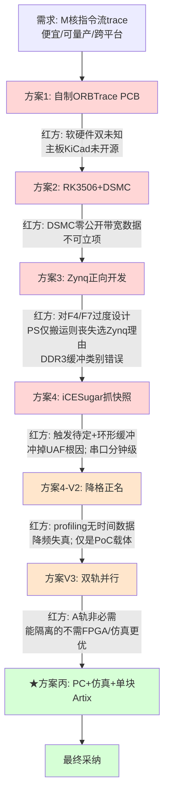
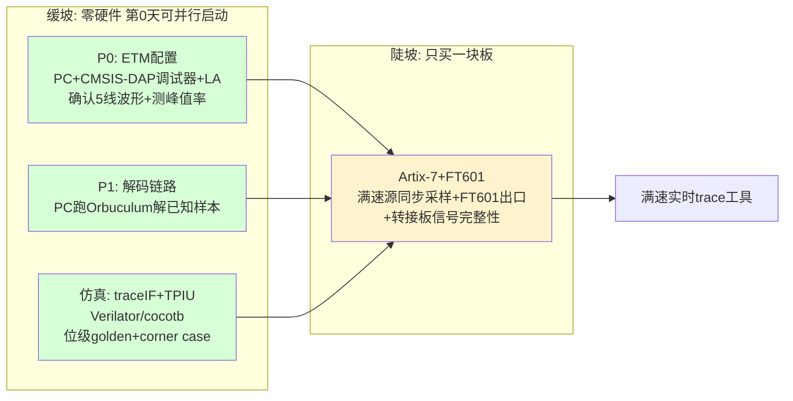

# Cortex-M 指令流 Trace 工具选型 · 六轮红蓝博弈复盘与最终结论

> 用途：复盘整个选型推演过程，交红方做最终审核确认。
> 结论先行：**采用红方第六轮方案丙——PC+调试器验证 P0/P1 + 仿真 testbench 验证逻辑 + 只买一块 Artix-7+FT601。先从仿真研究起步，暂不折腾板子。**

---

## 0. 需求基线（贯穿全程的判据）

| 需求 | 内容 |
|------|------|
| 功能 | 抓 Cortex-M 指令流（函数跳转级），定位 UAF 与性能问题 |
| 非功能 | 性能无损（不插桩）、可大规模采购、单台 < 1000 RMB、上位机跨平台 |
| 验证对象 | 先用 STM32F429（Cortex-M4，确认有 ETM）做交叉验证 |

**全程被逐步澄清的关键事实**（决定了多个方案生死）：
- trace 出芯片是 **ETM 原始压缩流**，"挑函数跳转/算耗时"都在 PC 端解码完成，FPGA 端无法源头筛选。
- **耗时归属需要时间戳/周期包**，仅程序流模式给不出耗时——"性能问题"定位依赖满速+时间戳。
- **源同步 DDR 采样 + 信号完整性**是任何方案都绕不开的物理命门；低速验证对满速零证明力。

---

## 1. 博弈历程总览

---

## 2. 逐方案复盘（为什么被否 / 留下了什么）

### 方案1：自制 ORBTrace PCB
- **设想**：照 ORBTrace 复刻一块板。
- **否决**：ORBTrace 主板 KiCad 未开源（仅 PDF 原理图）；自制 = 软硬件双未知，调试无底洞。
- **留下**：确认 ORBTrace 的 gateware（`traceIF.v`/`trace/*.py`）开源可复用、上位机 Orbuculum 跨平台——**这两样贯穿到最终方案。**

### 方案2：RK3506 + DSMC
- **设想**：小 FPGA 采集 + RK3506 跑 Linux，经 ARM-FPGA 总线 DSMC 导出、ADB 上传。
- **否决**：DSMC 无任何公开带宽/时序/驱动数据，且复用显示总线、定位中低速外设；不能据此立项。
- **留下**：认识到"出口带宽 + 缓冲"是核心矛盾，trace 稳态不大但峰值高。

### 方案3：Zynq-7000 正向开发
- **设想**：ARM+FPGA 同芯片，PL 采集→AXI HP→DDR3→千兆网。
- **否决**：对 F4/F7（~32MB/s）是过度设计；若 PS 仅搬运则相对"小FPGA+USB"丧失选 Zynq 理由；**"缓冲推到 DDR3"是类别错误**——抗失速缓冲必须在 DMA 上游，DDR3 在下游救不了 DMA 服务间隙。
- **留下**：确立"AXI HP 有官方实测带宽"等事实；更重要的是认清**缓冲位置的物理约束**。

### 方案4：iCESugar-Pro 抓快照（V1 → V2 降格）
- **设想**：与 ORBTrace 同款 ECP5-25F，抓快照存 SDRAM，慢速串口导出；V2 降格为"链路验证+轻量 profiling"。
- **否决**：①触发机制待定，环形缓冲（28MB）满速仅覆盖 <0.3s，**冲掉 UAF 根因现场**；②串口导出分钟级，迭代不可用；③**profiling 的本质是时间归属，仅程序流给不出时间**，指令计数 ≠ 耗时，降频还会扭曲热点分布。
- **留下**：明确了第一版能力边界，以及"控制流分析 ≠ 性能(耗时)分析"。

### 方案V3：双轨并行（iCESugar 缓坡 + Artix 陡坡）
- **设想**：用便宜慢板隔离非平台风险，给陡峭的 Artix 减负。
- **否决**：A 轨能隔离的风险，要么**不需要 FPGA**（ETM 配置/解码链路，PC 即可）、要么**仿真更优**（逻辑正确性，testbench 能测 corner case、位级对比）、要么**对满速零证明力**（低速端到端）——iCESugar 在任何一层都非必需；且双工具链税 + 单人伪并行。
- **留下**：催生了红方更优的方案丙。

### ★最终：方案丙
- PC+调试器验证 P0/P1 + 仿真 testbench 验证逻辑 + 只买一块 Artix-7+FT601。
- 用零硬件成本的 PC+仿真实现"缓坡降险"，且更彻底；陡坡只保留一块必需的 Artix。

---

## 3. 最终方案（方案丙）落地结构

### 3.1 已验证的事实（本次实测，非纸面）
- **orbtrace 有现成仿真测试 + 真实数据**：`tests/test_tpiu.py`（内嵌真实 ITM "hello world" 数据，位级 golden 比对）、`test_cobs.py`、`test_swo.py`；`verilog/testbeds/traceIF_tb.v` + `stimfiles/`（真实采集转换的 slowitm/fastitm 激励）。
- **已在本机实跑通过**：安装 amaranth 0.5.4 后 `pytest tests/test_tpiu.py` → **3 个测试全 PASSED（0.58s）**。
- → **方案丙第3步（仿真验证逻辑）不仅可行，且 orbtrace 已备好测试与数据，可立即开始。**

### 3.2 仿真能验证什么 / 不能验证什么（边界诚实声明）
- ✅ 验证：帧组装、TPIU 解帧、COBS/OrbFlow 编码、SWO 解码的**逻辑正确性**（位级）。
- ❌ 不验证：满速时序收敛、源同步采样相位、信号完整性——这些必须上 Artix + 转接板，是真命门，仿真替代不了。

---

## 4. Artix-7 具体型号

**推荐板：Alchitry Au V2 + Alchitry Ft（板对板对插）**

| 项 | Alchitry Au V2 | Alchitry Au+（更大档） |
|----|---------------|----------------------|
| **FPGA 具体型号** | **XC7A35T-2FTG256I** | **XC7A100T**（约 101,440 逻辑单元） |
| 速度/温度等级 | -2 速度、I 工业级（V2 较 V1 升级） | — |
| 封装 | FTG256（256球 BGA） | — |
| 逻辑单元 | ~33,000 | ~101,440 |
| 板载内存 | 256MB DDR3 | 256MB DDR3 |
| IO | 102~104（20 路可 LVDS） | 102 |
| USB3 出口 | 配 **Alchitry Ft（FT600，~200MB/s）** 板对板对插 | 同 |

**选型说明**：
- **trace 数据通路逻辑量仅 ~2-4K LUT**（前几轮估算），**XC7A35T（33K 逻辑单元）绰绰有余**，无需上 100T。
- 关键不是逻辑量，是 **XC7A35T 自带 ISERDESE2 + IDELAYE2**（源同步 DDR 采样硬核）——这是接 trace 的物理前提，7 系全系都有，资料最多。
- **Ft 扩展板把 FT600 的高速并行总线在板对板连接器里走好**，避免自己拿排针接 40 根高速线（前几轮反复强调的坑）。
- 工具链：**Xilinx Vivado（有 Linux 版，不必 Windows）**；调试用 Vivado 自带 ILA（看 FPGA 内部信号，比 ECP5 强）。

> 备选：若买不到 Alchitry，可选其它"Artix-7（XC7A35T 及以上，确认有 ISERDES/IDELAY）+ 外接 FT601 模块"组合，但需自己处理 FT601 那 40 根高速线的连接（优先板对板连接器，不用长排针）。

### 4.1 你需要自己做的唯一硬件小件
- **STM32 → FPGA 的 5 线 trace 转接**：5 根线（TRACECLK + TRACED0-3）+ 配地，低速验证用短杜邦可凑合，满速需短规整走线/小转接板。这是唯一需要你碰的硬件，且简单。

---

## 5. 下一步行动（从仿真起步，不折腾板子）

| 步骤 | 动作 | 依赖硬件 | 状态 |
|------|------|---------|------|
| S1 | 跑通 orbtrace 全套仿真测试（tpiu/cobs/swo） | 无 | tpiu 已跑通；cobs 需装 `cobs` 库 |
| S2 | 读懂 trace 解码逻辑（traceIF→TPIU→COBS→OrbFlow） | 无 | — |
| S3 | 装 iverilog 跑 `traceIF_tb.v`，看底层采样 VCD 波形 | 无 | 待做 |
| S4 | 用 stimfiles 真实激励喂仿真，理解真实 trace 数据 | 无 | — |
| S5 | （并行）STM32F429 配 ETM，示波器确认 5 线波形 + 测峰值率 | 仅需 STM32 + 调试器 + 示波器 | — |
| S6 | （并行）PC 跑 Orbuculum 解已知 OrbFlow 样本 | 无 | — |
| —— | 以上全绿后，再买 Artix-7+FT601 上板攻满速命门 | Artix | 暂不启动 |

---

## 6. 待红方确认的点

1. **结论是否接受**：采纳方案丙、从仿真起步、暂不买板——是否同意。
2. **型号是否认可**：Alchitry Au V2（XC7A35T-2FTG256I）+ Ft，35T 是否足够（逻辑量 ~2-4K LUT vs 33K 可用）。
3. **能力边界声明是否到位**：本工具默认产出"控制流/函数跳转/路径占比"；"耗时(性能)分析"与"UAF"依赖满速+时间戳/缓冲，属上板后能力——是否需对需求方更明确告知。
4. **仿真阶段的量化判据**：Q-4（traceIF+TPIU 位级 golden + sync丢失/坏帧/width切换 corner case 全过）作为"缓坡逻辑层通过"的门槛，是否认可。
5. **是否遗漏**：六轮收敛中是否还有未被覆盖的风险，需在上板前补验。

---

## 附录：关键事实与来源索引

- ORBTrace gateware 开源、采样逻辑（`traceIF.v` 以 traceclk 为时钟域）：`orbcode/orbtrace`
- orbtrace 现成仿真测试与真实数据：`tests/test_tpiu.py`（ITM hello world 位级 golden）、`verilog/testbeds/traceIF_tb.v`、`stimfiles/slowitm|fastitm`（convert.py 注明源自真实 CSV 采集）
- 本机实测：amaranth 0.5.4 + `pytest tests/test_tpiu.py` → 3 passed
- Alchitry Au V2 型号 XC7A35T-2FTG256I + 256MB DDR3 + 102~104 IO：Alchitry/SparkFun/Digikey 论坛
- Alchitry Au+ = XC7A100T（~101,440 逻辑单元）：Mouser/SparkFun
- Alchitry Ft = FT600，~200MB/s：alchitry.com/boards/ft
- 7 系 ISERDESE2/IDELAYE2 源同步采样能力：Xilinx 7 Series SelectIO
- 上位机 Orbuculum 跨平台、Vivado 有 Linux 版：`orbcode/orbuculum`、Xilinx 文档
- trace 物理命门（满速源同步采样+SI，低速零证明力）：第二~六轮红方一贯结论
