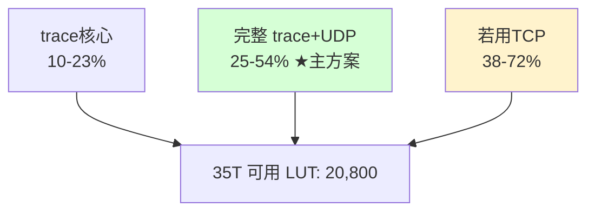

# M核 Trace 工具 · 逻辑门(LUT/FF/BRAM)开销分析表

> 目标平台：微相 A7-Lite **XC7A35T**（Artix-7），板载千兆以太网出口。
> 用途：评估 trace 工具完整逻辑能否塞进 35T，供红方审核。
> **数据诚实声明（务必先读）**：本表**没有真实 Vivado 综合报告**。所有数字按"来源可信度"分三级标注，**严禁当作承诺值**：
> - 🟦 **实测锚定**：引用公开的 IP/开源核实测资源数据（注明出处）。
> - 🟨 **经验估算**：基于源码规模 + 同类逻辑经验，给区间。
> - 🟥 **占位待测**：无可靠参照，仅给数量级，必须综合后替换。
> 红方前几轮已点名"估算当事实"是禁忌，本表据此**全部给区间 + 来源等级**，不给个位精确值。

---

## 0. 器件容量基线（实测/官方）

| 资源 | XC7A35T 总量 | 来源 |
|------|-------------|------|
| LUT（6输入1输出） | **20,800**（注：33,280 是"逻辑单元/LC"口径，LUT 实际 20,800） | 🟦 Xilinx DS197；Xilinx 论坛确认 35T 类器件 LUT 数 |
| Flip-Flop (FF) | 41,600 | 🟦 官方 |
| Block RAM (36Kb) | 50 块 ≈ 1,800 Kb ≈ 225 KB | 🟦 官方 |
| ISERDESE2 / IDELAYE2 | 每个 IO 自带（专用，不占 LUT） | 🟦 7 Series SelectIO |

> ⚠️ 口径坑：厂商宣传"33,280 逻辑单元"，但**真正约束设计的是 20,800 LUT**。本表占用率分母一律用 **20,800 LUT**（保守口径）。

---

## 1. 逐模块开销估算

### 1.1 入口：trace 采样 + 解码（ORBTrace 可复用核心）

| 模块 | LUT 估算 | FF 估算 | BRAM | 来源等级 | 依据 |
|------|---------|--------|------|---------|------|
| 采样前端（ISERDESE2×5 + IDELAYE2×5 + IDELAYCTRL） | 0（专用原语） | — | 0 | 🟦 | 专用 IO 硬核，不占通用 LUT |
| deskew 校准状态机（抽头扫描/眼心搜索） | 500 ~ 1,500 | 400 ~ 1,200 | 0 | 🟨 | 逐 lane 训练逻辑，区间偏大取保守 |
| traceIF 帧组装（128bit construct + sync 检测） | 200 ~ 400 | 200 ~ 350 | 0 | 🟨 | 源码 ~150 行，移位+比较 |
| 跨时钟域 AsyncFIFO（trace域→sys域） | 100 ~ 300 | 150 ~ 300 | 1 ~ 2 | 🟨 | 红方提醒的必做项 |
| TPIU 解帧（Unmangle/Serializer/TrackStream/StripChannelZero/Packetizer） | 400 ~ 800 | 400 ~ 700 | 0 | 🟨 | `tpiu.py`，纯位重排+小FSM，无算术 |
| ChecksumAppender | 30 ~ 80 | 20 ~ 50 | 0 | 🟨 | 一个减法累加 |
| COBSEncoder（GroupSplitter + 2×256B FIFO + Combiner） | 300 ~ 500 | 250 ~ 450 | 2 | 🟨 | 2 个 256×9 FIFO 用 BRAM |
| SuperFramer | 100 ~ 200 | 100 ~ 180 | 0 | 🟨 | 超时/超帧计数 |
| **入口小计** | **1,630 ~ 3,780** | **~1,500 ~ 3,200** | **~5 ~ 8** | | trace 核心，逻辑量小 |

### 1.2 出口：千兆以太网（本方案 LUT 大头）

| 模块 | LUT 估算 | FF 估算 | BRAM | 来源等级 | 依据 |
|------|---------|--------|------|---------|------|
| 千兆 MAC（RGMII，verilog-ethernet `eth_mac_1g_rgmii`） | 1,200 ~ 2,500 | 1,000 ~ 2,000 | 0 ~ 2 | 🟨（锚定开源核规模） | Alex Forencich verilog-ethernet 千兆 MAC 量级 |
| UDP/IP 协议栈 + ARP | 1,500 ~ 3,000 | 1,200 ~ 2,500 | 2 ~ 4 | 🟨 | UDP 轻于 TCP；含 ARP/ICMP 最小集 |
| TX/RX 缓冲（FIFO） | （含上方） | — | +2 ~ 4 | 🟦 锚定 | LiteEth 实测："两 buffer tx/rx 约 +2,700 LUT，其中 ~1,700 为分布式RAM" → **缓冲可吃大量 LUT-as-RAM，须警惕** |
| **出口小计（UDP 方案）** | **~2,700 ~ 5,500**（含缓冲可能更高） | **~2,200 ~ 4,500** | **~4 ~ 8** | | 🟦 LiteEth 参照见下方警示 |

> 🟦 **实测警示（关键）**：LiteEth 官方 issue 报告——配置成"双缓冲 TX/RX"时**额外增加约 2,700 LUT，其中约 1,700 是被推断成分布式 RAM（LUT-as-RAM）的 buffer**。意味着：**以太网缓冲若让工具推断成分布式RAM，会吃掉大量 LUT**。对策：强制 buffer 用 Block RAM 而非分布式RAM（综合属性/核配置控制），可把这 1,700 LUT 转移到 BRAM。**这是本设计 LUT 占用最大的不确定项，必须在综合时盯住。**

### 1.3 杂项

| 模块 | LUT 估算 | FF | BRAM | 来源 |
|------|---------|----|------|------|
| 时钟（MMCM：50M→200M for IDELAYCTRL + sys 时钟）、复位 | 100 ~ 300 | 100 ~ 300 | 0 | 🟨 |
| CSR / 配置寄存器 / 调试钩子 | 300 ~ 700 | 300 ~ 600 | 0 ~ 2 | 🟨 |
| **杂项小计** | **400 ~ 1,000** | **~400 ~ 900** | **~0 ~ 2** | |

---

## 2. 总计与占用率

| 配置 | LUT 总估 | 占 35T（20,800） | BRAM 估 | 占 BRAM（50） |
|------|---------|------------------|---------|---------------|
| **A. 仅 trace 核心（不含网络）** | 2,030 ~ 4,780 | **10% ~ 23%** | 5 ~ 10 | 10% ~ 20% |
| **B. trace + 千兆UDP 出口（完整，缓冲用BRAM）** | **5,130 ~ 11,280** | **25% ~ 54%** | 9 ~ 18 | 18% ~ 36% |
| C. 同上但缓冲被推断成分布式RAM（坏情况） | 6,800 ~ 13,000 | 33% ~ 63% | 9 ~ 14 | 18% ~ 28% |
| D. 若出口改 TCP（更重，仅作对比） | 8,000 ~ 15,000+ | 38% ~ 72%+ | 12 ~ 20 | 24% ~ 40% |

---

## 3. 结论与判断

1. **35T 够用，主方案（B，trace+UDP）占用 25%~54% LUT，留有余量。** 即便落在区间上沿（54%），仍有近一半余量给后续功能（时间戳、触发逻辑、调试）。
2. **trace 核心本身很省（10%~23%）**，与前几轮"~2-4K LUT"一致——再次确认逻辑门**不是瓶颈**。
3. **LUT 大头在千兆以太网出口，不在 trace。** 这是"用板载网口换 FT601 接线便利"所付的逻辑代价。
4. **最大不确定项 = 以太网 buffer 的实现方式**（🟦 LiteEth 实测：可能吃 ~1,700 LUT 分布式RAM）。必须在综合时强制 buffer 用 BRAM。
5. **不需要 100T/200T。** 即使坏情况（C，63%）35T 仍塞得下。

---

## 4. 待红方审核 / 必须实测替换的项

| 项 | 当前等级 | 必须如何确认 |
|----|---------|-------------|
| 全设计真实 LUT/FF/BRAM | 🟨🟥 估算 | **Vivado 综合+实现后 utilization 报告**（唯一权威） |
| 千兆 MAC+UDP 实际占用 | 🟨 锚定开源核 | 选定核（verilog-ethernet / LiteEth）后跑 OOC 综合实测 |
| 以太网 buffer 是否吃分布式RAM | 🟦 LiteEth 有先例 | 综合后查 LUT-as-RAM 数量，强制改 BRAM |
| deskew 校准逻辑 | 🟨 偏大估 | 采样前端 PoC 综合后确认 |
| 时序（不只面积） | 未评 | **面积够 ≠ 时序收敛**；满速源同步采样的 setup/hold 余量是独立命门，本表不覆盖 |

---

## 5. 红方关注点预答（防止"估算当事实"重演）

- **本表不声称任何精确值**：全部区间 + 来源等级，分母用保守的 20,800 LUT。
- **本表只评"面积/逻辑门"，不评"时序"**：35T 装得下 ≠ 满速能跑通。**满速源同步采样的时序收敛是独立命门，必须靠上板 PoC 的眼图/时序报告（眼高≥0.5UI、setup/hold≥0.3ns）单独验证，本表不为其背书。**
- **以太网是新增的、未在 ORBTrace 中验证过的部分**：ORBTrace 用 USB，本方案用千兆网，这块逻辑（MAC+UDP+buffer）是 ORBTrace 没有的，估算可信度低于 trace 核心，**实测前留足余量**。

---

## 附录：数据来源

- XC7A35T 资源（20,800 LUT / 41,600 FF / 50 BRAM）：🟦 Xilinx DS197 XA Artix-7 Overview；Xilinx 论坛 "33280 LUTs"口径辨析
- LiteEth buffer 资源实测（双缓冲 +2,700 LUT，~1,700 为分布式RAM）：🟦 GitHub `enjoy-digital/liteeth` issue #43
- verilog-ethernet 千兆 MAC（规模参照）：🟦 `alexforencich/verilog-ethernet`
- AXI EthernetLite 资源口径（OOC 流程）：🟦 AMD/Xilinx IP 文档
- ORBTrace trace 核心源码规模：`orbcode/orbtrace`（`traceIF.v`/`trace/*.py`，本仓库已分析）
- ISERDESE2/IDELAYE2 为专用 IO 硬核不占 LUT：🟦 Xilinx 7 Series SelectIO (UG471)
