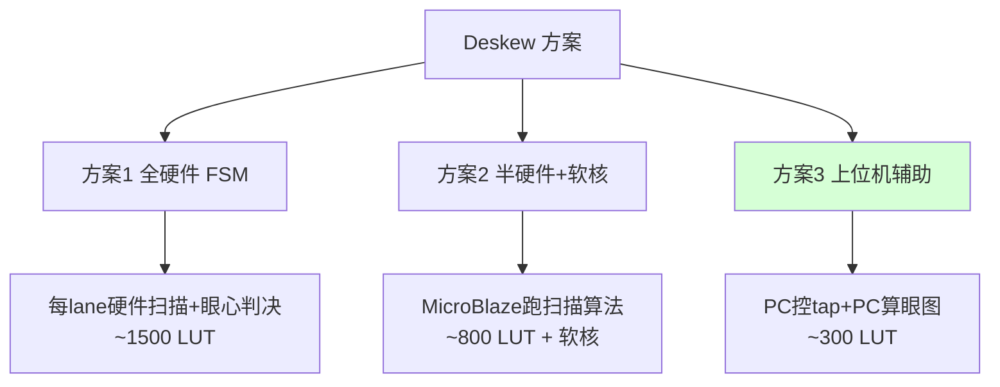

# 12 · Deskew 方案选型 mini-proposal（r10 C2 要求）

> 触发：r10 C2 要求 Stage-3 启动前定下 deskew FSM 的实现方案，不要等上板才挑（架构决策推到最贵阶段做是错的）。
> 范围：4-bit 源同步 trace 采样的 per-lane IDELAY tap 校准（eye-scan / deskew）。
> 当前状态：Stage-2 骨架用静态 `IDELAY_VALUE=16`（中点占位），无训练逻辑。

---

## 问题定义

ARM TPIU 4-bit trace 是源同步 DDR：TRACECLK + TRACED0-3。FPGA 侧用 IDELAYE2 给每条数据线插可调延迟（0-31 tap，每 tap ~78ps @200MHz refclk），把采样点对到数据眼图中心。

**为什么必须 deskew**：
- 4 条数据线 PCB 走线长度不可能完全等长（GPIO1 排针非 SI 受控走线，skew 可能 ±数百 ps）
- TRACECLK 与数据的相位关系受目标板、线缆、温度影响
- 不校准 → 采样点可能落在数据跳变沿 → 误码

**eye-scan 的本质**：对每条 lane，扫 0-31 全部 tap，记录每个 tap 下能否正确解出已知图案，找到"连续正确窗口"的中心 tap 烧死（或运行时持续跟踪）。

---

## 三种实现方案对比

### 方案 1：全硬件 deskew FSM

**原理**：参考 Xilinx XAPP1064/XAPP585 的 IDELAY 训练逻辑。每条 lane 一个状态机，扫 32 tap，对每个 tap 用已知训练图案（TPIU sync `ff ff ff 7f` 或专门的 training pattern）判正确性，记录通过窗口，取中点。4 lane 并行 + 全局仲裁。

| 维度 | 评估 |
|------|------|
| LUT 估算 | ~1,000–1,500（5 lane 训练逻辑 + 图案比对 + 窗口记录 + tap 写口） |
| 上板调试难度 | 中（纯硬件，确定性行为，但 FSM 复杂，bug 难定位） |
| 灵活性 | 低（算法烧死在硬件，改判决阈值要重综合） |
| 依赖 | 无（FPGA 独立完成） |
| 风险 | LUT 占用最大；FSM 本身要充分仿真验证 |

### 方案 2：半硬件 + 软核（MicroBlaze）

**原理**：硬件只提供 IDELAY tap 读写 CSR + 错误计数器，扫描算法跑在 MicroBlaze 软核上（C 代码）。

| 维度 | 评估 |
|------|------|
| LUT 估算 | ~800（CSR + 计数器）+ MicroBlaze（~1,500 LUT + BRAM 存程序） |
| 上板调试难度 | 高（软硬协同，要调 MicroBlaze 工具链 + 固件 + 硬件 CSR） |
| 灵活性 | 中（算法在固件可改，但要重新编译固件 + 烧录） |
| 依赖 | MicroBlaze（又引入一层工具链 + license 考量） |
| 风险 | 总资源最大（软核本身吃 1500+ LUT）；调试面最广 |

### 方案 3：上位机辅助（推荐）

**原理**：FPGA 侧只提供 ① IDELAY tap 写口（通过现有以太网 UDP 控制通道，或 trace_dbg 端口的反向）② 当前帧解码状态/错误标志读回。**眼图扫描算法跑在 PC 上**：PC 依次设 tap=0..31，每个 tap 让目标发已知程序，读回 FPGA 解帧成功率，PC 算出眼心，写回最佳 tap。

| 维度 | 评估 |
|------|------|
| LUT 估算 | ~300（tap 写 CSR + 错误/同步状态读回，复用 UDP 控制通道） |
| 上板调试难度 | 低（算法在 PC，Python 即可，改算法零成本，可视化眼图） |
| 灵活性 | 高（PC 端随便改扫描策略、判决、可视化） |
| 依赖 | 上位机协议（但本项目解码本来就全在 PC——架构一致） |
| 风险 | tap 切换 + 测量有网络往返延迟，单次校准耗时长（但 deskew 是一次性/低频操作，不影响 trace 实时性） |

---

## 选型结论：方案 3（上位机辅助）

**理由**：
1. **架构一致性**：本项目从第一轮博弈起就确立"解码全在 PC（Orbuculum）"。deskew 眼图算法放 PC 端，与"FPGA 只做采样 + 搬运、PC 做智能"的一贯架构完全吻合。
2. **FPGA 侧最省**：~300 LUT vs 方案1 的 1500 / 方案2 的 800+软核。35T 完整版预估从 24% 进一步压到 ~22%。
3. **调试最快**：眼图扫描是上板第一关，PC 端 Python 写算法 + 实时可视化眼图，比硬件 FSM 或软核固件迭代快一个数量级。FPGA 小白也能在 PC 端调。
4. **deskew 是低频操作**：开机校准一次（或温度漂移时重校），不在 trace 实时通路上，网络往返延迟无所谓。

**FPGA 侧需要实现的最小集**（Stage-3）：
- IDELAY tap 写 CSR：通过 UDP 控制包（复用以太网）或专用低速口，把 5 bit × 4 lane tap 值写进 trace_capture_a7 的 tap_data* 端口（目前是常量 16，改成 CSR 驱动）
- 解帧状态读回：traceIF 的 sync 状态 + 帧错误/lost 计数（trace_lost_cnt 已有）回传 PC
- tap_load 脉冲：写 tap 后触发 IDELAYE2 重加载

**PC 侧（Orbuculum 扩展或独立 Python 工具）**：
- 扫 tap 0-31 × 4 lane，每点测窗口内解帧正确率
- 算每 lane 眼心，写回最佳 tap
- 可视化 4 条 lane 的眼图（debug 利器）

**资源对完整版预估的影响**：deskew 从原估 +1500 LUT（方案1 假设）降到 +300 LUT，**完整版预估从 ~24% 降到 ~22% LUT**，35T 余量更宽。

---

## 对 r08/r09/r10 资源口径的修正

| 文档 | deskew 估算 | 基于方案 |
|------|------------|---------|
| r08/r09 反算 | +1,500 LUT | 方案1（全硬件，悲观上沿） |
| 本选型 | **+300 LUT** | 方案3（上位机辅助，已选定） |

完整版预估更新：
- 当前 T4 实测：2,317 LUT
- + deskew（方案3）：+300
- + UDP-trace 桥：+600
- + 时序膨胀：+400
- **完整版预估 ~3,617 LUT（17.4% of 35T）+ 13 BRAM（26%）**

比 r10 红方反算的 24% 更乐观，因为 deskew 选了最省的方案。**35T 余量 ~82%。**

---

## Stage-3 启动检查项（deskew 相关）

- [ ] trace_capture_a7 的 tap_data* 从常量 16 改为 CSR 可写
- [ ] 加 UDP 控制包解析（tap 写 + 状态读），或复用一个低速 CSR 通道
- [ ] PC 端 Python eye-scan 工具（扫描 + 眼心算法 + 可视化）
- [ ] 上板第一次：固定 target 发已知程序，跑全 tap 扫描，确认每 lane 有 ≥8 tap 连续正确窗口（r07 终审阈值）
