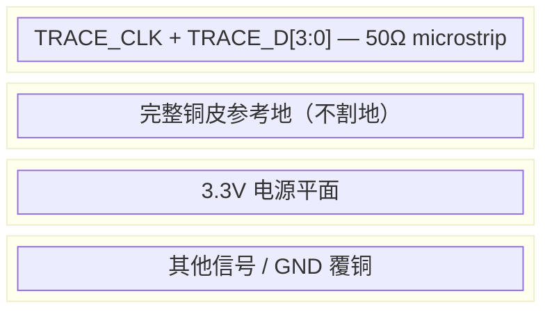
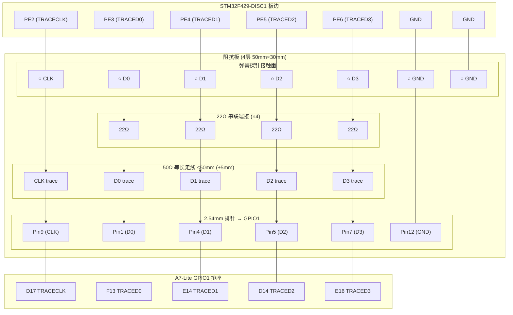

# 提案 28 — 84M DDR 阻抗板设计与 SI 验证方案

> 日期：2026-07-05
> 状态：设计阶段
> 关联：proposal 25（满速验证）、proposal 27（中断困境）、r24（红方诊断）
> 触发：84M 4-bit DDR 满速下 unknown=3.9%（SI/nibble-slip 本底），杜邦线无法满足时序余量

---

## 问题定义

84M DDR 并口 trace 的时序余量只有 ~0.5-1ns。当前杜邦线引入 1-3ns 随机 skew，直接吃掉全部余量——导致 3.9% unknown（branch address 包被破坏 → 幽灵函数调用 → 调用栈漂移）。

### 何时需要阻抗匹配？（1/10 法则）

核心判据不是"频率"本身，而是 **走线长度 vs 信号上升沿传播距离**。当走线长度 > 上升沿传播距离的 1/10 时，必须做传输线设计。

FR4 中信号传播 ≈ 15 cm/ns。STM32 LVCMOS33 fast slew rate 上升沿 tr ≈ 2-4 ns。

```
临界长度 = tr × 15 cm/ns × (1/10)
tr=2ns → 3cm    tr=4ns → 6cm
```

| TRACECLK 频率 | 等效边沿率 | 临界长度 | 5cm 走线 | 杜邦线可用？ |
|:---:|:---:|:---:|:---:|:---:|
| ≤20 MHz | tr~8ns | 12cm | 不需要匹配 | ✅ 杜邦线够（实测 21M→0.002% unknown） |
| 30-50 MHz | tr~4ns | 6cm | 边界 | ⚠️ 短杜邦线 <5cm 可能行 |
| **50-80 MHz** | tr~2.5ns | **4cm** | **需要匹配** | ❌ |
| **≥84 MHz** | tr~2ns | **3cm** | **必须匹配** | ❌ 实测 84M 杜邦线→3.9% unknown |
| ≥150 MHz | tr~1ns | 1.5cm | 严格要求 | ❌ |

> 参考：[Academy of EMC - Transmission Lines](https://www.academyofemc.com/transmission-lines)、[Baltic Lab - Critical Length](https://baltic-lab.com/2023/08/critical-length-of-a-pcb-trace-and-when-to-treat-it-as-a-transmission-line/)、Flux.ai High-Speed PCB Design Guide

**结论**：
- **≤30 MHz 不需要阻抗板**（杜邦线足够，我们 21M 的 0.002% unknown 实证）
- **50 MHz 是分界点**——短走线(<3cm) + 好的地回流可以凑合
- **≥80 MHz 必须阻抗板**——我们 84M 的 3.9% unknown 就是杜邦线超出临界长度的直接后果

**对 H743 的指导**：
- TRACE_CLK = 50MHz（HCLK/4）：5cm 短跳线 + GND 回流可能够用，建议仍上阻抗板
- TRACE_CLK = 100MHz（HCLK/2）：必须阻抗板

**实测对比**：

| 条件 | unknown% | 调用栈质量 |
|------|:---:|------|
| 21M 杜邦线 | 0.002% | 完美（15/15） |
| 84M 杜邦线 | 3.9% | 幽灵调用 548 次/23ms、栈漂移 |
| 84M 阻抗板（预期） | <0.5% | 可用（和 21M 杜邦线接近） |

---

## 时序预算分析（84M DDR）

```
TRACECLK = 84 MHz → 周期 = 11.9 ns
DDR → UI (Unit Interval) = 5.95 ns
采样窗口 = UI / 2 = 2.975 ns（边沿到 eye center）
```

| 项 | 预算 | 来源 |
|---|:---:|------|
| STM32 TPIU output skew (tsk) | ≤2.0 ns | DS9405 Table 34 (max spec) |
| PCB trace skew（CLK vs DATA） | ≤0.3 ns | 等长 ±5mm 设计目标 |
| 连接器 skew（弹簧探针） | ≤0.2 ns | 镀金 pogo pin |
| FPGA MMCM output jitter (pp) | ≤0.1 ns | VCO=840M 典型 |
| FPGA IDDR setup margin | ≥0.2 ns | DS181 |
| **总计消耗** | **≤2.8 ns** | |
| **剩余余量** | **≥0.175 ns** | 2.975 - 2.8 = 0.175 ns |

> 注：STM32 的 tsk=2.0ns 是 max spec（worst case）；典型值 ~0.8-1.2ns，此时余量 ~1ns，对 PSINCDEC 微调友好。

---

## PCB 设计规格

### 基本参数

| 参数 | 值 | 理由 |
|------|-----|------|
| 层数 | **4 层** | 完整参考地平面 |
| 板厚 | 1.6mm（标准） | 成本最低 |
| 阻抗 | **50Ω ±10%** 单端 microstrip | LVCMOS33 匹配 |
| 走线宽度 | ~6-7 mil（第 1 层到第 2 层 GND 间距 0.2mm） | 50Ω 设计 |
| 等长要求 | **CLK vs DATA 等长 ±5mm**（±33ps） | skew < 0.3ns |
| 总走线长度 | **≤50mm** | λ/10 @ 84MHz in FR4 = ~50mm |
| 过孔 | 最多 1 个/信号 | 每个过孔 ~50ps 延迟 |
| 端接 | 源端串联 **22Ω**（贴片 0402） | 抑制反射 |
| GND | coplanar ground（信号旁走地线） | 减少串扰 |
| 表面处理 | **沉金（ENIG）** | 顶针接触可靠性 |

### Stackup（4 层）



### 板尺寸与布局



> 注：CLK 不加串联端接（MMCM 需要干净的时钟边沿），DATA 各加 22Ω 源端端接。

### 连接器选型

**STM32 侧（弹簧探针）**：
- 型号推荐：P75-B1（圆头弹簧探针，2.54mm 间距，行程 1mm）
- 材质：铍铜镀金
- 接触电阻：<50mΩ
- 寿命：>10 万次
- 安装：焊接在阻抗板上，下压对准 DISC1 板的 PE2-PE6 测试点

**FPGA 侧**：
- 直接用 2.54mm 排针插入 A7-Lite 的 GPIO1 排座
- 或同样用弹簧探针对准 GPIO1 pad

---

## 验证仪器需求

### 示波器（首选）

| 参数 | 最低要求 | 推荐 |
|------|---------|------|
| 带宽 | ≥500 MHz | 1 GHz |
| 采样率 | ≥2.5 GSa/s | 5 GSa/s |
| 通道 | ≥2 | 4 |
| 功能 | 眼图测量、skew 测量 | 自动 mask test |

**型号与价格（2026 年国内参考价）**：

| 型号 | 带宽 | 采样率 | 通道 | 参考价 | 评估 |
|------|:---:|:---:|:---:|:---:|------|
| Rigol MSO5354 | 350MHz | 8 GSa/s | 4 | **~¥8,000** | 勉强够用（5次谐波欠） |
| **Siglent SDS2104X Plus** | **1GHz** | 10 GSa/s | 4 | **~¥12,000** | ✅ 推荐，性价比最高 |
| Siglent SDS6104A | 1GHz | 10 GSa/s | 4 | ~¥18,000 | 更好的 UI/jitter 分析 |
| Keysight MSOX3054T | 500MHz | 5 GSa/s | 4 | ~¥35,000 | 一线品牌，略贵 |
| R&S RTM3004 | 1GHz | 5 GSa/s | 4 | ~¥45,000 | 高端 |

**推荐：Siglent SDS2104X Plus（~¥12,000）**——1GHz/10GSa/s 4通道，能做 84M DDR 的眼图和 skew 分析。

### 逻辑分析仪（可选，交叉验证）

| 型号 | 采样率 | 通道 | 价格 | 评估 |
|------|:---:|:---:|:---:|------|
| DSLogic U2Basic（已有） | 500M/1ch, 100M/16ch | 16 | 已有 | 84M DDR 不够 |
| **Saleae Logic Pro 16** | 500 MSa/s | 16 | **~¥8,500** | ✅ 够 84M DDR |
| DreamSourceLab DSLogic U3Pro32 | 1 GSa/s | 32 | ~¥3,000 | 性价比可选 |
| Kingst LA5032 | 500 MSa/s | 32 | ~¥2,000 | 国产可选 |

> 注：对于 SI 验证，示波器比逻辑分析仪更重要——看的是模拟波形质量（眼图开口、过冲、振铃），不是数字协议。逻辑分析仪用于对比 FPGA 采到的数据 vs 独立采样的 ground-truth。

### 无源探头

| 型号 | 带宽 | 价格 | 说明 |
|------|:---:|:---:|------|
| 示波器标配 10:1 无源探头 | 500M-1G | 随机附 | 够用 |
| SMA 同轴连接（如果板上预留） | DC-6G | ~¥50/根 | 最佳 SI 测量 |

---

## 验证步骤

### Step 1：阻抗板到手后静态测量
- 用 TDR（如果示波器支持）或 VNA 确认走线阻抗 50Ω ±10%
- 无 TDR 时跳过（设计保证即可）

### Step 2：眼图测量
- 示波器触发：TRACECLK（CH1）
- 数据叠加：TRACED0（CH2），无限持续 → 眼图
- **判据：eye opening > 2ns = OK**
- 如果 eye < 2ns → 调整端接电阻值或走线

### Step 3：skew 测量
- CH1 = TRACECLK，CH2 = TRACED0
- 测边沿到边沿的延迟差
- **判据：|skew| < 0.5ns**
- 对所有 4 个 DATA lane 都测

### Step 4：FPGA 抓流对比
- 用阻抗板 + FPGA 84M 117° 比特流抓 func_test v2
- 测 unknown%
- **目标：unknown < 0.5%**
- 如果 > 0.5% → 用 PSINCDEC 微调相位

### Step 5：示波器 vs FPGA 交叉验证（可选）
- 示波器同时捕获 CLK + D0 波形
- 手动读波形确认某个 branch 包的字节值
- 对比 FPGA 采到的同一时段字节 → 确认一致性

---

## 成本汇总

| 项目 | 预估费用 |
|------|:---:|
| 阻抗板 PCB（4 层 5cm×3cm，5片） | ¥100-200 |
| 弹簧探针 + 治具 | ¥100-300 |
| 22Ω 0402 电阻 (×4) | ¥5 |
| **Siglent SDS2104X Plus 示波器** | **¥12,000** |
| Saleae Logic Pro 16（可选） | ¥8,500 |
| **总计（必要）** | **~¥12,500** |
| 总计（含逻辑分析仪） | ~¥21,000 |

---

## 预期效果

阻抗板 + 弹簧探针解决了杜邦线的三个核心问题：

| 问题 | 杜邦线 | 阻抗板 |
|------|:---:|:---:|
| 走线 skew | 1-5 ns（随机） | <0.3 ns（等长设计） |
| 阻抗不连续 | 严重（无参考地） | 可控（50Ω microstrip） |
| 连接器接触 | 差（氧化、松动） | 好（镀金弹簧探针） |

**预期结果**：unknown 从 3.9% 降到 <0.5%，达到和 21M 杜邦线（0.002%）接近的数据质量水平。84M 满速下调用栈完美重建，中断正确检测。
