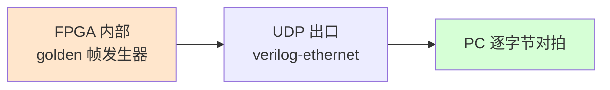

# Stage-4 · V0：FPGA 自产 golden 帧的 UDP 出口字节验证

> 第四阶段验证阶梯的第一关（见 `../PLAN_STAGE4.md`）。
> 结论：**FPGA 内部产生的字节经 RGMII → MAC → IP → UDP 出口到 PC 逐字节无误**，500 次迭代 0 mismatch / 0 lost，覆盖 8/32/64/100/128/200 字节多种长度。这是后面所有 trace 阶段的地基。

---

## V0 要单独锁定的能力

Stage-3 的网口关只证明了 **echo**（PC 发什么、FPGA 原样回什么）。但 trace 场景需要的是另一种能力：**数据源在 FPGA 内部、由 FPGA 主动把字节推过 UDP 出口**。echo 的字节来自 PC，证明不了「FPGA 自己产生的字节能不能字节无误地穿过出口」——而这正是整条 trace 链最底层、最该先锁定的一环。V0 就把这一环单独拎出来验。



## 设计：最小改动面，复用已验证机制

为把「新引入的未知」压到最小，**完整复用 Stage-3 已验证的 echo 头部 / 寻址 / 长度 / AXIS 握手**，只在一个点动手：把 UDP payload FIFO 输入处的数据字节，从「收到的字节」换成「FPGA 内部 golden ROM」。

- **UDP 端口 1234**：保留原始 echo（网络回归，确保改动没碰坏链路）。
- **UDP 端口 5000**：回包 payload 替换为 golden 帧；回包**长度沿用请求长度**（复用 echo 的 header/length 机制），所以 PC 发 N 字节就该收到 N 字节 golden。

一个 bitstream 同时是网络回归 + V0 测试。新增逻辑极小：一个帧内字节位置计数器 `golden_idx` + 一个组合逻辑 golden ROM + 一个数据 mux。

### golden 帧格式
- 帧首 **4 字节 TPIU 全同步前缀** `FF FF FF 7F`（只在帧首出现一次，对应真实 TPIU 帧头语义，便于在抓包里一眼认出）。
- 之后是**单调递增 ramp** `0xC0, 0xC1, ...`，跨整帧连续递增，到 256 回卷。ramp 能抓出字节重复 / 丢失 / 错位。

RTL（`syn/artix7/bringup/fpga_core_net.v`）：
```verilog
case (golden_idx)
    16'd0,16'd1,16'd2: golden_byte = 8'hFF;
    16'd3:             golden_byte = 8'h7F;
    default:           golden_byte = 8'hC0 + golden_idx[7:0];
endcase
```

## 踩坑：V0 立刻抓到一个真实逻辑 bug

第一版用 `case (golden_idx[4:0])`（只取低 5 位），结果 **len ≤ 32 时全过，len=64/100 时从第 32 字节起整个对不上**：

```
got      ...dcdddedf ffffff7f c4c5...   # 每 32 字节又冒出一次 sync 前缀
expected ...dcdddedf c0c1c2c3 c4c5...   # ramp 本应连续
first diff @byte 32: got ff exp c0
```

根因：`golden_idx[4:0]` 每 32 字节回到 0–3，于是 `FF FF FF 7F` 同步前缀被**周期性重复**，而它本该只在帧首出现一次。修复：用全宽 `golden_idx` 判断前缀（只命中 idx 0–3），ramp 用 `golden_idx[7:0]` 让它跨 32 字节边界连续递增。

> 这恰好是 V0 的价值：**短帧不会暴露的位置计数 / 边界 bug，被长帧 + ramp 对拍揪了出来**。如果当初直接全链路对接，这个 bug 会混在采样相位、TPIU 同步等一堆未知里，极难定位。

## 实测结果

工具链（VM 桥接到 `192.168.10.x`，FPGA = `.42`）：
```bash
source ~/workpath/tools/xilinx/Vivado/2021.1/settings64.sh
cd syn/artix7/bringup/build
vivado -mode batch -source ../run_net_test.tcl       # 出 net_test.bit
vivado -mode batch -source ../program_net_test.tcl   # JTAG 烧录
cd .. && python3 v0_golden_check.py --ip 192.168.10.42 --len 128 --iters 500
```

| 长度 (B) | 迭代 | ok | mismatch | lost |
|---------|------|----|----|----|
| 8 | 30 | 30 | 0 | 0 |
| 32 | 30 | 30 | 0 | 0 |
| 64 | 30 | 30 | 0 | 0 |
| 100 | 30 | 30 | 0 | 0 |
| 128 | **500** | **500** | **0** | **0** |
| 200 | 30 | 30 | 0 | 0 |

回归：UDP 1234 echo 仍原样回显，未被破坏。

**判据 W-0（golden 帧经 FPGA RTL → UDP → PC 逐字节一致）达成。**

## 文件清单
```
syn/artix7/bringup/
  fpga_core_net.v       新增 golden 帧发生器 + 端口 5000 分支（端口 1234 echo 不变）
  net_test_top.v        顶层注释补充 V0 端口说明
  v0_golden_check.py    PC 端对拍脚本（多长度 / 多迭代 / 丢包统计）
```

## 下一步
- **V1**：物理采样回环——已知 pattern 绕板一圈接回 trace 引脚，扫 IDELAY tap 画眼图找眼心。这是真命门（源同步采样相位）的第一次正面接触。
- **V3**（可并行）：编译 Orbuculum，准备网络源实时解码。
