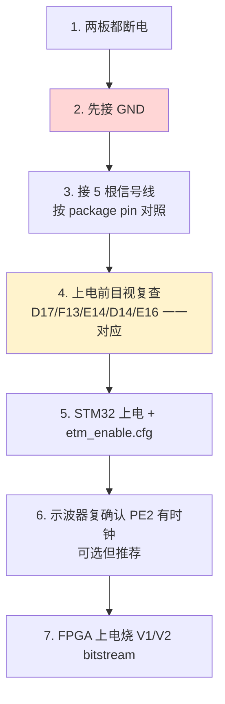

# Stage-4 · STM32 ↔ FPGA trace 物理连线指南

> 给 V1（采样回环）/ V2（接真实 ETM）用的物理连线。**V1 和 V2 是同一套物理连接**——5 根 trace 信号 + 1 根共地，从 STM32F429-DISC1 接到 A7-Lite 的 GPIO1（BANK 16）。连一次两个阶段都能用，区别只在 FPGA 里跑什么逻辑。

---

## 一句话

6 根杜邦线（5 信号 + 1 地），STM32 的 PE2..PE6 接 FPGA BANK16 的 D17/F13/E14/D14/E16，**两板必须共地**。全是 3.3V LVCMOS，电平兼容，直连，不需要电平转换。

---

## 连线表

| 信号 | STM32F429-DISC1 | → | FPGA package pin（**权威**） | FPGA 网名 | 性质 |
|------|-----------------|---|------------------------------|-----------|------|
| TRACECLK | PE2 | → | **D17** | GPIO1_4P (IO_L12P_T1_**MRCC**_16) | 时钟，必须落 MRCC |
| TRACED0 | PE3 | → | **F13** | IO_L1P_T0_16 | 数据 |
| TRACED1 | PE4 | → | **E14** | IO_L4N_T0_16 | 数据 |
| TRACED2 | PE5 | → | **D14** | IO_L6P_T0_16 | 数据 |
| TRACED3 | PE6 | → | **E16** | IO_L5P_T0_16 | 数据 |
| **GND** | 任一 GND 脚 | → | 任一 GND 脚 | — | **共地，绝对必须** |

> 引脚来源：`syn/artix7/constraints/trace_probe.xdc`，已在 Stage-2 用 Vivado 器件库 `get_property BANK/PIN_FUNC` 实测核对（见 `proposals/13-r10回应-独立证据交付.md` D1）。五线全在 BANK 16，共享一个 IDELAYCTRL。

---

## ⚠️ 安全要点（避免插错烧 IO）

1. **以 package pin（D17/F13/E14/D14/E16）为准，不要照搬排针丝印脚号。**
   厂商 `A7_LITE_GPIO.xlsx` 的 GPIO1 P/N 标注被实测发现有抄错（E14 实为 L4N 而非标的 P 端）。只有 Vivado 器件库的 package pin 权威。对照板子时，认 **FPGA 球脚号 / 原理图网名**，别认 xlsx 的 P/N 列。

2. **共地优先接、最后拔。** 没共地的话两板地电位浮动，trace 信号采不对，严重时损 IO。先接 GND 再接信号。

3. **线尽量短、等长。** trace 是 100MHz+ DDR 源同步信号，杜邦线越短越好（建议 ≤10cm）。5 根尽量等长，减小 lane 间 skew（skew 大会吃掉眼图余量，V1 扫 tap 时会看到）。

4. **BANK16 电压 = 3.3V。** A7-Lite 的 GPIO1（VCCIO_A）配 3.3V，与 STM32 的 3.3V trace 输出匹配。xdc 里 IOSTANDARD=LVCMOS33，别改成别的电平。

5. **STM32 先单独验过再接。** STM32 的 ETM 已在 Stage-3 用示波器确认 PE2..PE6 出数据（`stage3-bringup/02-stm32-etm-enable.md`）。接 FPGA 前先 `etm_enable.cfg` 跑一遍、示波器确认有波形，避免“到底是没发还是没收”的二义。

---

## 连线前后的自检流程

---

## V1 vs V2 的区别（连线相同，逻辑不同）

| | 数据源 | FPGA 逻辑 | 看什么 |
|---|--------|-----------|--------|
| **V1** | 已知 pattern（STM32 GPIO toggle 慢速方波，或 FPGA 自发自收） | 采样前端 + IDELAY tap 扫描 | 每 lane 眼图，找眼心 tap |
| **V2** | STM32 真实 ETM 执行流（低速 trace_clk） | 采样 → traceIF → TPIU → UDP | sync 稳、lost_cnt==0、payload 对得上 |

> V1 其实可以**完全不接 STM32**——用 FPGA 自己一个 IO 发已知 pattern、绕板一圈接回 trace 输入脚自发自收，这样连 STM32 的不确定性都摘掉，纯验 FPGA 采样相位。是否绕回看你想先验哪段。若用 STM32 GPIO 当慢速源，则按上表接 PE2（或任一 GPIO）→ D17。

---

## 下一步

连好线后做 **V1**：先低速，扫 IDELAY tap 0–31 画眼图，定每 lane 眼心。需要先写 V1 的采样回环顶层（IDELAYE2 + ISERDES/IDDR + tap 写入通道 + 正确率统计从 UDP 读出）。
