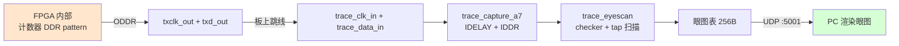

# Stage-4 · V1：FPGA 自环 IDELAY 眼图扫描（不接 STM32）

> 第四阶段验证阶梯第二关（见 `../PLAN_STAGE4.md`）。
> 目的：在**完全不接 STM32** 的前提下，正面接触真命门——源同步 DDR 采样的相位。FPGA 自己发已知 DDR pattern、板上跳线绕回 trace 输入脚、用 Stage-2 的采样前端 `trace_capture_a7` 采样，自动扫 32 个 IDELAY tap，把每 tap/每 lane 的误码数做成「眼图」表，PC 用一个 UDP 包读走。
> 这样把「STM32 会不会发对」这个变量彻底摘掉——眼睛开不开，只取决于 FPGA 自己的采样链。

---

## 为什么先自环、不接 STM32

V1 要验的是 FPGA 采样链本身（IBUF→IDELAYE2→IDDR + IDELAYCTRL + 时钟 buffer）的相位能力。如果一上来就接 STM32，眼睛闭了你分不清是「STM32 发的有问题」还是「FPGA 采的有问题」。

自环把数据源换成 FPGA 自己——**已知、可控、确定性**。眼睛要是开了，说明 FPGA 采样链 + tap 扫描机制都对；之后接 STM32 眼睛闭了，就能锁定问题在 STM32 侧或线缆 SI，而不是 FPGA 逻辑。这就是「每关只引入一个未知」。



## pattern：自对齐计数器，不需要帧同步

每个 `clk_tx`（100MHz）周期发一个自增字节 `cnt`：
- lane i 的上升沿位 = `cnt[i]`，下降沿位 = `cnt[4+i]`
- 所以接收端恢复出的字节 `{trace_b, trace_a}` 就是 `cnt`，相邻周期恒差 +1

checker 只校验「本字节 == 上一字节 + 1」——**自对齐**，不管环路延迟多少拍都能锁。误码按 lane 归属（lane i 拥有 bit i 和 bit 4+i），得到每 lane 的误码率。

> 用计数器而非 PRBS：计数器的 +1 关系让 checker 无需种子同步，最简单且对单 bit 错敏感。

## tap 扫描 FSM

跑在恢复出的 `trace_clk` 上（关键设计，见下）。对 tap 0..31：
1. `S_LOAD` 写 tap 到 IDELAYE2（VAR_LOAD + `tap_load` 脉冲）
2. `S_SETTLE` 等 512 周期让延迟线稳定
3. `S_CLR`→`S_COUNT` 在 2^20 个 `trace_clk` 周期窗口内累加每 lane 误码（饱和到 0xFFFF）
4. `S_STORE` 把 4 个 lane 的 16-bit 误码写进表，更新 best_tap
5. 全扫完 `S_DONE`，把 IDELAY 停在 best_tap，链路即可用

表结构（256 字节）：`addr = tap*8 + lane*2 + {hi,lo}`，大端 16-bit 误码。

## 踩坑：「没接跳线」绝不能读成「眼睛全开」

第一版有个隐蔽缺陷：扫描 FSM 由**恢复时钟 `trace_clk` 驱动**——没插跳线时 `trace_clk` 不翻转，FSM 根本不跑，误码表停在复位值（全 0），而「0 误码」会被渲染成「眼睛全开」。**第一次没插线读出来 32 个 tap 全 clean、eye centre=15 —— 这是假阳性。**

修复：读出口用 `scan_done` 把关——扫描未完成时返回 `0xFF`（→ 误码 0xFFFF → 渲染成闭眼），PC 端识别「整表全 0xFF」为「扫描没跑起来」并提示检查跳线。这样：
- 没接跳线 / `trace_clk` 死 → 全 0xFF → 明确报「scan never ran」
- 接了跳线、扫完 → 真实眼图

> 这是 V1 自己的「诚实性」修补：宁可报「没测到」，也不能把「没测」伪装成「完美」。

## 物理连线（板上跳线，GPIO1 / BANK 16）

5 根跳线把输出脚接回输入脚（都在 GPIO1，同 BANK16，3.3V）：

| 输出（FPGA 发） | package pin | → 跳线 → | 输入（FPGA 收） | package pin |
|----------------|-------------|----------|----------------|-------------|
| txclk_out | C13 | → | trace_clk_in | D17 |
| txd_out[0] | B13 | → | trace_data_in[0] | F13 |
| txd_out[1] | A13 | → | trace_data_in[1] | E14 |
| txd_out[2] | A14 | → | trace_data_in[2] | D14 |
| txd_out[3] | C14 | → | trace_data_in[3] | E16 |

> 仍以 package pin 为权威（GPIO1 排针 P/N 丝印有抄错历史，见 `02-trace-wiring.md`）。

## LED 指示

- **LED0** = IDELAYCTRL ready（稳定常亮 = 200MHz 参考钟 OK，采样链可用）
- **LED1** = 扫描状态：灭=扫描中/没跑、慢闪=扫完且找到干净 tap、快闪=扫完但**没有**任何全 lane 干净的 tap（SI 问题）

## 流程

```bash
source ~/workpath/tools/xilinx/Vivado/2021.1/settings64.sh
cd syn/artix7/bringup/build
vivado -mode batch -source ../run_eyescan.tcl        # 出 eyescan.bit
vivado -mode batch -source ../program_eyescan.tcl    # JTAG 烧录
# >>> 插好 5 根跳线 <<<，等 LED1 慢闪（扫完）
cd .. && python3 eyescan_read.py --ip 192.168.10.42   # 读眼图，给出 best tap
```

## 当前状态

- [x] RTL（`trace_eyescan.v` + `eyescan_top.v`）+ 约束 + 综合：时序收敛（WNS/WHS 正），0 DRC error
- [x] UDP 读出路径实测可用（echo:1234 回归 OK；表读 :5001 响应）
- [x] 「没插跳线 → 全 0xFF 报 scan-never-ran」防伪阳性已实测确认
- [x] 插好跳线（GPIO1 内部回环，JTAG 边界扫描已确认 5 对连接正确）后**扫描真的跑起来**
- [x] **链路本身被证明能完美工作**：停在 best_tap 时，连续 32 个原始样本是干净的 +1 ramp（`d5 d6 d7 … f0 f1 f2`），8 bit 全部翻转（activity mask=0xff）
- [⚠] **眼图判定有问题待解**：见下

## 实测发现（诚实记录）

插好跳线、扫描跑通后，得到一个**尚未解释清楚的矛盾**：

| 证据 | 说明 |
|------|------|
| 原始样本缓冲（best_tap） | **完美 +1 ramp**，8 bit 全对 → 链路硬件没问题 |
| 每 tap 快照 `snap_d2->snap_d1` | 几乎每个 tap 都是干净 +1（62→63, 82→83 …） |
| 误码表 | **L0 仅 tap4~8 为 0，L1/L2/L3 在所有 32 tap 全饱和(255)** |

矛盾点：原始 ramp 干净 + 每 tap 快照干净，按理 4 条 lane 误码都该 0；但误码计数器说 L1-3 全错。**说明链路是好的，是「窗口内自由比较计数」这条判定路径有 bug 或对源同步相位的理解还差一层**（怀疑 `SAME_EDGE_PIPELINED` IDDR 的 Q1/Q2 上升/下降相位与 tap 的交互，导致重组字节"看着像 ramp"但 bit 位置判定为错）。

诚实结论：**V1 证明了「FPGA 采样链能采到完美数据」（raw ramp 干净），但「逐 tap 眼图自动判定」这套误码逻辑还没调对，best_tap 自动选择暂不可信。** 这是逻辑/方法问题，不是板子/连线问题（连线已被 JTAG 边界扫描独立验证）。

### 已排除
- 连线错：JTAG 边界扫描确认 5 对全对（D17↔C13, F13↔B13, E14↔A13, D14↔A14, E16↔C14）
- 死 lane / 没接通：activity mask=0xff，8 bit 全翻转过
- 数据源错：raw 缓冲是教科书级 +1 ramp

### 待办（下次接手）
- 重新推敲 checker 的 DDR 相位语义：用每 tap 多拍 burst 快照在 PC 端判 ramp 连续性，替代 FPGA 端自由计数；或改用 PRBS + 自同步校验器
- 或：直接信任 raw 缓冲法——固定扫 tap、每 tap 抓一段 raw 到 PC 判，把判定整个挪到 PC（FPGA 只采样不判）

## 设计边界（诚实声明）

- 当前 pattern 速率 = **100MHz DDR（200Mbps/lane）**，是保守的低速首跑，先证明采样链 + tap 扫描机制正确。真实 trace 满速命门留 V4 升速。
- 自环眼图 ≠ 接 STM32 的真实眼图：自环走的是板内 GPIO1↔GPIO1 短路径，SI 比 STM32 杜邦线好。自环开眼只证明「FPGA 采样链 + tap 机制对」；真实链路眼图要 V2 接 STM32 后再测。
- 时钟 buffer 当前用 `BUFG`（保守）。`trace_capture_a7` 另有 `BUFR_IO` 选项（区域局部、skew 更小），是源同步更正的选择，可在 V4 对比。

## 下一步
- 插跳线采真实自环眼图，确认有干净 tap 窗口。
- 然后 **V2**：换 STM32 真实 ETM 低速输入（连线见 `02-trace-wiring.md`），用 V1 得到的 tap 起步。
