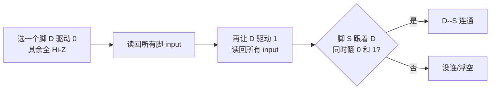

# Stage-4 · 纯 JTAG 边界扫描连通性测试（零编译）

> 需求：排针编号和 GPIO 映射太绕，想「随便插杜邦线，让 FPGA 自动找出谁连谁」，而且**不想每次都综合烧 bitstream**。
> 方案：用 JTAG 边界扫描（IEEE 1149.1 EXTEST），直接从 JTAG 驱动/采样每个物理引脚，**完全绕过 FPGA 内部逻辑，不需要任何 bitstream**。这就是飞针测试的原理。
> 状态：底层链路全部实测打通（IDCODE / EXTEST / 812-bit 边界寄存器 / 8 脚自一致性 PASS）。插上跳线即可扫出连接关系。

---

## 为什么 JTAG 比烧 bitstream 更适合「找连线」

| | 烧 bitstream 方案 | JTAG EXTEST 方案 |
|---|------------------|------------------|
| 每改一次 | 综合+实现+烧录 ~4 分钟 | 0 编译，秒级 |
| 驱动/采样谁 | FPGA 内部 IOBUF 逻辑 | JTAG 边界扫描单元直接控管脚 |
| 覆盖引脚 | 只有约束里写的 | **全部 229 个 IO**，随便选 |
| 依赖 | bitstream 正确 | 只依赖 BSDL（厂商提供） |

连通性这种「纯 IO 拓扑」问题，根本不该动 FPGA 逻辑——JTAG 边界扫描就是为这个设计的。

## 原理

7 系列每个 IO 在 JTAG 边界寄存器（812 bit）里有 3 个 cell：
- **control**：1=三态(Hi-Z)，0=使能输出
- **output**：使能时驱动的电平
- **input**：当前采样到的引脚电平

进 **EXTEST** 指令（opcode `0x26`）后，这些 cell 接管物理引脚（脱离内部逻辑）。扫描算法（walking-1）：



两相（驱动 0 再驱动 1）双重判定 + 要求**对称**（D 驱动时 S 跟、S 驱动时 D 也跟）才算一对跳线——排除浮空脚、串扰、单边误判。

## 关键踩坑：必须先清空 FPGA 配置

第一次扫，8 个脚里有一半「自一致性」失败（驱动 0/1 时自己的 input 读不对）。根因：**板上还跑着之前的 bitstream（DONE=1，QSPI 还会自动重载），内部逻辑在驱动这些 GPIO，跟 EXTEST 边界单元打架。**

修复：进 EXTEST 前先发 **JPROGRAM**（opcode `0x0b`）清掉配置，让 IO 回到未配置态（不被内部逻辑驱动），再立刻 EXTEST 扫描。修复后 8 脚自一致性全 PASS（驱动 0→读 0，驱动 1→读 1）。

> 自一致性测试（驱动脚自己的 input cell 是否跟随驱动值）是验证「EXTEST 极性 + bit 序 + 清配置」三件事都对的金标准，不需要插任何跳线就能做。

## 已验证的底层能力（实测）

| 验证项 | 结果 |
|--------|------|
| 原始 JTAG 移位（`scan_ir/scan_dr_hw_jtag -jtag_mode true`） | ✅ IDCODE = `0362d093` |
| EXTEST 进入 + 812-bit 边界 DR 移进移出 | ✅ 长度/回读正确 |
| BSDL 解析每脚 (control/output/input) cell | ✅ 88 个 GPIO 脚全解析（D17=733/734/735 等） |
| GPIO 排针↔package pin 映射（厂商 xlsx） | ✅ GPIO1/GPIO2 共 88 脚 |
| 清配置后 8 脚驱动/采样自一致性 | ✅ 全 PASS |
| 无跳线基线扫描 | ✅ 0 对（正确），单边浮空被识别为 warning |

## 用法

```bash
cd syn/artix7/bringup/jtag_pinscan
# 随便插好杜邦线后：
./run.sh                                  # 扫默认池(trace+loopback 8 脚)
./run.sh GPIO1_4P GPIO1_0P GPIO2_3P ...   # 或指定要扫的 GPIO 网名
```

输出示例（插了跳线后）：
```
==== DISCOVERED JUMPERS ====
  GPIO1_4P    ( D17)  <-->  GPIO1_5P    ( C13)
  GPIO1_0P    ( F13)  <-->  GPIO1_6P    ( A13)
  2 jumper(s) found across 8 pins.
```
拿到这张「网名↔package pin」对照，就能直接写进 xdc，不用再猜排针丝印的 P/N。

## 文件

```
syn/artix7/bringup/jtag_pinscan/
  parse_bsdl.py     解析 BSDL + GPIO xlsx -> pinmap.json（脚->cell 映射）
  gen_vectors.py    生成 EXTEST DR 向量 + 解码邻接（含两相对称判定）
  pinscan.py        编排：gen / decode
  run_scan.tcl      单会话 JTAG 移位（JPROGRAM 清配置 -> EXTEST -> 逐向量）
  run.sh            一键封装
```

> 依赖 BSDL：`$VIVADO/data/parts/xilinx/artix7/public/bsdl/xc7a35t_fgg484.bsd`，
> GPIO 表：厂商 `A7_LITE_GPIO.xlsx`（先 `cp` 到 `/tmp/gpio.xlsx` 或传参）。

## 适用边界

- 这是**静态连通性**测试（找杜邦线拓扑），不测速度/眼图。
- EXTEST 会清掉当前 bitstream（JPROGRAM），扫完要重新烧你的设计。
- 同理可推广：JTAG 边界扫描也能测「焊点虚焊/短路」，是板级 bring-up 通用手段。
- 后续 V1 眼图那种**运行时调参**（调 IDELAY tap 不重编）用 **VIO/ILA**，需要先编一次把核放进去——那是另一条路，跟这个零编译的连通性扫描不冲突。
