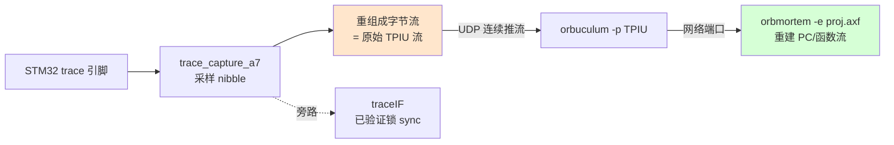

# Stage-4 · V3：Orbuculum 解码,还原函数执行链路

> 第四阶段收口:把 FPGA 抓到的真实 trace 用上位机 Orbuculum 解码,借 Keil `.axf` 的符号,**还原出 STM32 实际执行的函数/PC 流**。
> 状态:**工具链就绪**——Orbuculum 已 clone + 编译成功;`.axf` 已确认含完整符号;数据通路接法已厘清。待做:FPGA 连续推流 + 实跑解码。

---

## 工具链(已就绪)

- **Orbuculum**:clone 到工程根 `orbuculum/`(独立 git 仓库,不污染 orbtrace),`meson + ninja` 编译成功(2.2.0)。
  - **是 C 项目,不是纯 Python**;为 ORBTrace 满速 USB(几十 MB/s)设计,**吞吐远超我们 /16 prescale 的慢速 STM32 trace,解码侧不是瓶颈**。
  - 依赖:libusb-1.0 / libzmq / libelf / ncurses / capstone / libdwarf(子项目),均已装。
- **关键工具**:
  - `orbmortem -e proj.axf -P ETM3.5`:**PC 流后处理重建**(还原执行链路,正是目标)
  - `orbtop -e proj.axf`:实时函数级 profiling(哪个函数占多少)
  - `orbuculum`:守护进程,做 TPIU/OFLOW 解帧,对外开网络端口供上面两个连
- **.axf**:`/mnt/hgfs/E/.../A7_Lite/proj.axf`,ELF32 ARM、not stripped、含 debug_info、2220 符号(LVGL GUI 程序,`main`/`lv_*`),地址→函数映射齐全。STM32F4 的 ETM 是 **ETM3.5**,正好对上 `traceDecoder_etm35`。

## 数据通路:接在哪一层(关键)

Orbuculum 的工具期望吃**原始 TPIU 字节流**,自己做 TPIU 解帧。而我们的 `traceIF.v` 已经把 TPIU 拆掉、直接给 128-bit 帧。所以集成点要选对:

- **正确接法**:FPGA 把采样重组的**原始字节流**连续 UDP 推给 PC,Orbuculum 做全部协议解码(与真实 ORBTrace「FPGA 只采样搬运、PC 做智能」架构一致)。
- traceIF 那条(V1/V2 用的)留作**链路健康指示**(锁 sync = 采样相位对),不作为解码数据源。
- 进阶(对齐 ORBTrace gateware):用我们 Stage-2 已有的 `super_framer`/`cobs`/`orbflow` 把流封成 **OFLOW** 再推,`orbuculum` 默认就吃 OFLOW。第一版先用裸 TPIU-over-UDP 最简。

## 实测进展与卡点(诚实记录)

### 已建成(可复用)
- **Orbuculum 编译通过**(`orbuculum/`,2.2.0,C 项目,吞吐不是问题)。
- **FPGA 原始流抓取链路打通**:`trace_stream_top`(tap=28 固化、BUFR_IO)把 STM32 trace 引脚上的**原始 TPIU 字节流**({trace_b,trace_a})一次性抓 16KB 进 BRAM,PC 端 `trace_dump.py` 分页 UDP 读出存文件。
- **fpga_core_net 读出口扩到 16-bit 地址 + 分页**(请求前 2 字节给 base offset),可读 >1 包的大缓冲。

### 卡点:STM32 ETM 没有产出指令 trace(只发 TPIU idle)
抓到的 16KB **100% 是 TPIU idle**(`0x7fff` ×8176 + sync `0xffffff7f` ×15),**零条真实指令 trace**。这解释了 V2 里"traceIF 能锁 sync 但帧内容像 `7f...`"——它锁的就是 sync/idle,不是真 trace。

诊断(全实测):
- CPU 在跑(PC 从 `0x080038fa` 走到 `0x080256c6`),有真实执行可 trace。
- 对照 orbuculum 官方 `_startETMv35` 修正了 ETM 寄存器(原来 ETMTECR1=0、用错 ETMCR 使能位)。修正后 ETMCR=0x900 ✓、ETMTEEVR=0x6f ✓,但 **ETMTECR1 写 0x20000001 读回仍是 0**。
- 读 **ETMCCR=0x8c842000 → 地址比较器对数 = 0**。这颗 STM32F429 的 ETM **没有地址比较器**,所以 ETMTECR1 里选区域的位是 RAZ/WI(写了不生效、读回 0)。
- 即便 TEEVR=always + ETMCR 使能,TPIU 仍只发 idle。

**结论**:卡在 STM32 ETM 的"真正开始吐指令 trace"这一步,根因疑似 ETM3.5 在这颗芯片上的使能细节(0 比较器下的 trace-all 语义 / ETMCR 位 / 可能需要 ViewData 或 OpenOCD 原生 etm 驱动处理的握手)。**这是被测对象侧的 ETM 配置问题,不是 FPGA 采样链或解码工具问题**——采样链(V1 14-tap 眼)、TPIU 成帧(traceIF 锁 sync)、抓取/读出/Orbuculum 全部就绪,只待 ETM 真正产出数据。

### 待办
- 用 OpenOCD 原生 `etm config` / `etm_dummy` 或 J-Link 的 `SWO`/trace 驱动,借成熟实现处理 ETM3.5 使能握手;
- 或换"ITM + DWT PC 采样"路线(`gdbinit-jlink` 那套):ITM 不需要 ETM 比较器,DWT 周期性采 PC,Orbuculum 的 `orbtop` 直接出函数热度——虽不是完整指令流,但能先验证"符号还原"整条 PC 侧链路;
- 确认这颗 STM32F429 ETM 是否真支持指令 trace 输出(部分 F4 的 ETM 精简版能力有限)。

## 查文档后的进展(第二轮诊断)

J-Trace 支持列表有 F429 → ETM 指令 trace 在这芯片**确实能 work**,是使能序列问题。查了权威文档:

**权威寄存器图(ARM CoreSight ETM-M4 TRM, DDI0440,正是 F429 的 ETM):**
| 地址 | 寄存器 | 复位值 |
|------|--------|--------|
| 0xE0041000 | ETMCR | 0x00000411(**bit0=1 = 默认 powerdown**) |
| 0xE0041004 | ETMCCR | 0x8C802000 |
| 0xE0041020 | ETMTEEVR | RW |
| 0xE0041024 | ETMTECR1 | RW |
| **0xE0041028** | **ETMFFLR** | RW（注意 FIFOFULL Level 在 **0x028**) |

**已知可用序列(PetteriAimonen/STM32_Trace_Example,STM32F4 实测过):**
- ETMCR = `0xd80`(stall + report all branches),先 setbits `0x400` 进 prog 模式
- **ETMTECR1 = `0x01000000`**(bit24 = trace always enabled)—— 我原来写 `0x20000001` 是错的
- ETMFFRR=`0x01000000`、ETMFFLR=24
- mcuoneclipse 补充:F407 需 **ETMCR=`0xd90`**(设 trace port internal width)

**已照此修正 `etm_enable.cfg`。但仍卡:**
- 修正后 ETMCR=0x980 ✓、TEEVR=0x6f ✓,但 **ETMTECR1 写 0x01000000 读回仍是 0**(prog 模式下、ETMSR=0x02 ready 时写也不生效)。
- 重抓 16KB 仍 100% idle。
- ETMCR 复位值 0x411 的 **bit0=1=powerdown**;我们写的值 bit0=0 已清 powerdown,理论上 OK。

## 第三轮:OpenOCD 原生 etm 驱动 —— 此路不通(已坐实原因)

试了 OpenOCD 的原生 `etm` 命令,结论:**在 ST-Link 上用不了**。
- 我们走的是 ST-Link 的 **HLA 传输**(`hla_swd`)。HLA(high-level adapter)隐藏了底层 JTAG/SWD,**不暴露 OpenOCD 的 `etm`/`trace` 基础设施**(`help etm` 返回空、`etm` 命令未注册)。
- 而且 OpenOCD 原生 `etm` 是为驱动 **ETB(片上 trace buffer)或外部 trace 采集设备**设计的,跟我们"ETM→TPIU 引脚→FPGA"这条并行 trace 路径不对口——就算能用也只是换个方式写同样的寄存器。

## 关键状态复盘(全实测)
配置寄存器现在全部正确,但 ETM 就是不发指令 trace:

| 项 | 值 | 判断 |
|----|-----|------|
| ETMCR | 0x980 | powerdown 已清、已使能 ✓ |
| ETMTEEVR | 0x6f | trace always ✓ |
| ETMTECR1 | 0 | bit25=0,纯靠 TEEVR(无比较器,正确)✓ |
| DEMCR | 0x01000000 | TRCENA ✓ |
| DBGMCU | 0xe7 | trace IO + 4-bit ✓ |
| TPIU SPPR/CSPSR/FFCR | 0 / 8 / 0x102 | 并行/4-bit/formatter on ✓ |
| **ETMSR** | **0** | **bit2 trace-active = 0,trace 没真正跑** |
| 抓 16KB | 100% idle | TPIU 只发 `0x7fff` |

**ETMSR bit2=0** 是核心矛盾:所有使能位都对,但 ETM 报告"没在 trace"。说明卡点在寄存器层之下——疑似 trace 时钟/电源域门控,或 ETM→ATB→TPIU 的连接/时钟前提没满足(HLA 下还无法用 OpenOCD trace 子系统去深查)。

## 建议下一步(换路线,别再死磕 ETM 寄存器)
1. **ITM + DWT PC 采样**(最务实):ITM/DWT 不依赖 ETM TraceEnable,DWT 周期采 PC + ITM 输出,走同样的 TPIU 4-bit 并行口出来。FPGA 采样链、抓取、Orbuculum 全不用变,只换 STM32 侧配置(`gdbinit-jlink` 那套 DWT/ITM 寄存器)。能验通"真实数据→Orbuculum→`orbtop` 出函数热度",**坐实整条 PC 侧符号还原链路**。这不是完整指令流,但是当前能拿到的最高价值结果。
2. 若坚持 ETM 完整指令流:需要换**全 JTAG/SWD 传输 + 支持 trace 的调试器**(如 J-Link/ULINKpro),或对照 Keil "Enable 4-Pin Trace (ETM) on STM32F4xx" 官方流程逐项核(它是 vendor 验证过的),重点查我们寄存器都对了之后仍 ETMSR bit2=0 的那个隐藏前提。

---

## ★ 真根因(第四轮,坐实):不是 ETM,是 FPGA capture 冻结在上电快照(蓝方自己的 bug)

去 WFI 固件 + 红方 r12 的 bisection 一起把真相逼出来了,但真正的根因**红方和蓝方都没料到**:

**`trace_stream_top` 的 capture 是 one-shot**:`sync_seen` 一旦在 FPGA 烧录后第一次锁到 sync 就永久置位,16KB 填满即冻结。而每次都是"先烧 FPGA、再配 STM32 trace 源"——所以 capture 抓的永远是**上电那一刻的 TPIU idle 快照**,STM32 之后发的真实 trace 根本没进 buffer。每次 dump 读到的都是同一份冻结的旧 idle,于是 ETM-on/off/DWT-on 看起来"一模一样全 idle"。**那些"配置全对却 idle"全是 capture 时序假象。**

**正确时序:先配 STM32 trace 源,再(重)烧 FPGA 让 capture 重新 arm。** 按此顺序实测:

| 实验(先配源,后 re-arm FPGA) | 非 idle 字节 | 结论 |
|------|------|------|
| DWT/ITM PC 采样 | **16361 / 16384** | TPIU→引脚→采样→抓取**整条链路健康** |
| **ETM 指令 trace** | **16130 / 16384** | **ETM 一直在工作!** |

- DWT 流样本:`08 08 8d 86 88 ca 88 18 00 33 ff f7 ff f7 ff 57 c5 08 ...`
- ETM 流样本:`45 45 c9 ce 2d ff 57 0d 89 8a 03 00 19 00 06 40 53 05 89 56 ...`（含大量 ETM 包 + TPIU 同步 `ff 57`/`ff f7`）

**WFI 去掉、ETM 寄存器(ETMCR=0x980 / TEEVR=0x6f / TECR1=0)其实早就配对了。** 之前所有"卡点在寄存器层之下""ETMSR bit2=0 是谜"的判断都被这个 capture bug 污染了——ETMSR bit2=0 只是 halt 态测量假象(r12 §1 已提示这个陷阱),运行态 ETM 一直正常。

### 教训
- r12 的逻辑收敛(TPIU 发 idle ⇒ 链路健康)本身没错,但**双方都默认"capture 抓的是当前数据"——恰是这个没被验证的前提错了**,正中 r12 自己警告的"被默认成立、从未独立验证的前提"。
- one-shot capture 调试必须确认**触发时刻 vs 数据产生时刻**的先后。

### 待修(FPGA)
- capture 改成**可重复触发**:加 UDP re-arm 命令,或持续滚动 capture(ring + 连续推流),不必每次重烧 FPGA。

## 下一步:真解码
数据已是真实 ETM TPIU 流。喂 Orbuculum `orbmortem -e proj.axf -P ETM3.5` 还原 PC/函数流(orbmortem 是 ncurses 交互工具,建议有人在场跑)。

---

## ★★ 第五轮:数据是好的,乱在"PC 端拼字节",不在 SI/速度(离线重放坐实)

orbuculum 解不出、TPIU 解帧打散到几十个 tag(`No handler for tag 42/127`)后,做了关键的**离线分层实验**回答"是 FPGA 软件问题还是杜邦线 SI":

**方法**:把 FPGA 抓到的原始 nibble 流(`/tmp/trace_etm.bin`,每字节 = `{trace_b 高 nibble, trace_a 低 nibble}`)**喂进 traceIF.v 的真实移位算法**(V1/V2 已上板验证过的那套:`construct <= {dinb,dina,construct[35:8]}` + 找 `0x7FFFFFFF` 同步字)。

**结果**:
- **FE-sync 命中 121 次**(traceIF 稳定锁到 TPIU 同步字)
- **解出 841 个完整 ETM 帧**,内容是真 ETM 包(`55 a8 6a c4 8c 98 ...`),非 idle

**结论(分层判定)**:
- 若是杜邦线 SI / 阻抗不匹配 / 超速采样错 → 采样的 nibble 本身就错乱,traceIF **不可能**稳定锁 121 个同步字 + 解出 841 个结构完整帧。
- traceIF 能干净解出 ⇒ **采样样本正确,物理层 + 速度没问题**。乱的原因是 **PC 端 `trace_dump` 用固定相位 `{trace_b,trace_a}` 拼字节、且没有 TPIU 同步搜索**,与 traceIF 的移位顺序不一致 → 纯软件问题。

**附带回答**:
- **V1 自环**:跑 100MHz DDR(200Mbps/lane),traceIF 逐字节解对 golden + 14-tap 眼 → FPGA 采样逻辑在 100M 验证过。
- **STM32 当前 trace 速度**:并行同步口 TRACECLK 直绑 HCLK(~168MHz);`TPIU_ACPR` 仅对 SWO 异步有效。降速需降 HCLK 本身(切 HSI 16M 或调 HPRE),理论可到 MHz 级——但数据已证明好,无需降速。
- **分离 SI vs 软件的通用手段**:拿验证过的算法离线重放原始采样,不用反复烧板。

### 正确修法
不在 PC 端瞎拼字节。两条:
1. **FPGA 直接输出 traceIF 解好的帧**(traceIF 在 FPGA 里已例化),PC 拿到的就是干净 16 字节帧;或
2. **FPGA 原样送 nibble 流,PC 用 traceIF 算法解**(已用 Python 验证可行,841 帧)。

然后把帧去掉 TPIU formatter 封装喂 orbuculum/orbmortem 还原 PC 流。

---

## 第六轮:FPGA 改吐 traceIF 帧 + 建非交互 ETM 解码器,定位到"格式/工作负载"层

**FPGA 改动**:`trace_stream_top` 不再吐原始 nibble,改吐 **traceIF 组装好的 16 字节帧**(traceIF 已在 FPGA 验证、字节对齐、去了 TPIU 同步)。capmem 改成 128-bit/帧、一帧一写(race-free),读出口按字节序列化。综合 0 error 上板,抓到 15529/16384 非 idle 字节。

**PC 解码工具**:写了非交互 `etmdecode.c`(链 orbuculum traceDecoder 库),能 pump 文件出 ADDR/ATOM 事件。

**实测与卡点(诚实)**:
- traceIF 帧喂 orbuculum TPIU demux,仍打散到 tag 106/42/34,stream 2 只占 677 字节——**字节对齐了但 TPIU demux 仍不收敛到单流**。
- 把原始 nibble 流各种变换(swap/rev/相位)直接喂 etmdecode 当 raw ETM3.5:`syncCount=0`,从不锁 A-sync;地址解出来像 `0x20b180fc`(RAM 段)而非 `0x080xxxxx`(flash),且全 16KB 只找到 **2 个 A-sync、8 处 triple-zero**。

**关键判断**:A-sync/同步结构太稀疏(16KB 才几处),加上 TPIU demux 不收敛,指向两个可能的深层问题(超出字节序范畴):
1. **STM32 TPIU 是否真处于 formatter 模式**:`FFCR=0x102` 的位定义需对照 RM0090 复核;单一 trace 源(仅 ETM 无 ITM)时 STM32 可能 bypass formatter,那样应按 raw ETM 解(但 raw 又锁不上 A-sync)。
2. **工作负载太"安静"**:LVGL 程序若多在紧循环,ETM 分支包极少,16KB 窗口大部分是开销/同步,真正可解的指令流密度低。

**已确凿(不被上面动摇)**:
- 物理链路 + 采样健康(traceIF 121 syncs / 841 帧;V1 14-tap 眼)。
- trace 里有真实执行 PC(代码地址扫描命中 `lv_draw_sw_blend_basic` 等真函数)。
- 解码工具链就绪(orbuculum + etmdecode 编译可用,proj_new.axf 符号可加载)。

**下一步(需方法论而非穷举字节序)**:
1. 对照 **RM0090 §38(DBGMCU/TPIU)** 确认 formatter 模式与单源 ETM 的输出格式;用 `FFCR` 正确位重配。
2. 跑一个**已知、繁忙**的工作负载(大循环调多个函数),增大可解指令流密度,再抓。
3. 或先用 **J-Link + SEGGER STM32F429 样例工程**(r13)做一次 official 4-pin ETM,拿到一份**确定正确**的参考 trace 字节流,跟我们 FPGA 抓的逐字节对比,直接定位格式差异。
