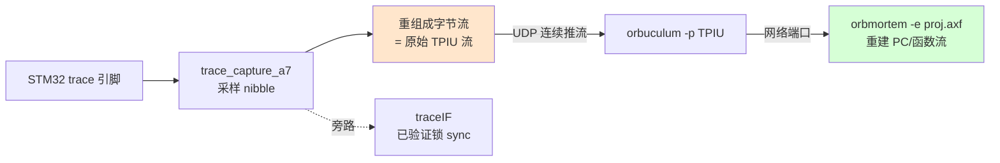

# Stage-4 · V3：Orbuculum 解码,还原函数执行链路

> 第四阶段收口:把 FPGA 抓到的真实 trace 用上位机 Orbuculum 解码,借 Keil `.axf` 的符号,**还原出 STM32 实际执行的函数/PC 流**。
> 状态:**工具链就绪**——Orbuculum 已 clone + 编译成功;`.axf` 已确认含完整符号;数据通路接法已厘清。待做:FPGA 连续推流 + 实跑解码。

---

## 工具链(已就绪)

- **Orbuculum**:clone 到工程根 `orbuculum/`(独立 git 仓库,不污染 orbtrace),`meson + ninja` 编译成功(2.2.0)。
  - **是 C 项目,不是纯 Python**;为 ORBTrace 满速 USB(几十 MB/s)设计,**吞吐远超我们 /16 prescale 的慢速 STM32 trace,解码侧不是瓶颈**。
  - 依赖:libusb-1.0 / libzmq / libelf / ncurses / capstone / libdwarf(子项目),均已装。
- **关键工具**:
  - `orbmortem -e proj.axf -P ETM3.5`:**PC 流后处理重建**(还原执行链路,正是目标)
  - `orbtop -e proj.axf`:实时函数级 profiling(哪个函数占多少)
  - `orbuculum`:守护进程,做 TPIU/OFLOW 解帧,对外开网络端口供上面两个连
- **.axf**:`/mnt/hgfs/E/.../A7_Lite/proj.axf`,ELF32 ARM、not stripped、含 debug_info、2220 符号(LVGL GUI 程序,`main`/`lv_*`),地址→函数映射齐全。STM32F4 的 ETM 是 **ETM3.5**,正好对上 `traceDecoder_etm35`。

## 数据通路:接在哪一层(关键)

Orbuculum 的工具期望吃**原始 TPIU 字节流**,自己做 TPIU 解帧。而我们的 `traceIF.v` 已经把 TPIU 拆掉、直接给 128-bit 帧。所以集成点要选对:

- **正确接法**:FPGA 把采样重组的**原始字节流**连续 UDP 推给 PC,Orbuculum 做全部协议解码(与真实 ORBTrace「FPGA 只采样搬运、PC 做智能」架构一致)。
- traceIF 那条(V1/V2 用的)留作**链路健康指示**(锁 sync = 采样相位对),不作为解码数据源。
- 进阶(对齐 ORBTrace gateware):用我们 Stage-2 已有的 `super_framer`/`cobs`/`orbflow` 把流封成 **OFLOW** 再推,`orbuculum` 默认就吃 OFLOW。第一版先用裸 TPIU-over-UDP 最简。

## 实测进展与卡点(诚实记录)

### 已建成(可复用)
- **Orbuculum 编译通过**(`orbuculum/`,2.2.0,C 项目,吞吐不是问题)。
- **FPGA 原始流抓取链路打通**:`trace_stream_top`(tap=28 固化、BUFR_IO)把 STM32 trace 引脚上的**原始 TPIU 字节流**({trace_b,trace_a})一次性抓 16KB 进 BRAM,PC 端 `trace_dump.py` 分页 UDP 读出存文件。
- **fpga_core_net 读出口扩到 16-bit 地址 + 分页**(请求前 2 字节给 base offset),可读 >1 包的大缓冲。

### 卡点:STM32 ETM 没有产出指令 trace(只发 TPIU idle)
抓到的 16KB **100% 是 TPIU idle**(`0x7fff` ×8176 + sync `0xffffff7f` ×15),**零条真实指令 trace**。这解释了 V2 里"traceIF 能锁 sync 但帧内容像 `7f...`"——它锁的就是 sync/idle,不是真 trace。

诊断(全实测):
- CPU 在跑(PC 从 `0x080038fa` 走到 `0x080256c6`),有真实执行可 trace。
- 对照 orbuculum 官方 `_startETMv35` 修正了 ETM 寄存器(原来 ETMTECR1=0、用错 ETMCR 使能位)。修正后 ETMCR=0x900 ✓、ETMTEEVR=0x6f ✓,但 **ETMTECR1 写 0x20000001 读回仍是 0**。
- 读 **ETMCCR=0x8c842000 → 地址比较器对数 = 0**。这颗 STM32F429 的 ETM **没有地址比较器**,所以 ETMTECR1 里选区域的位是 RAZ/WI(写了不生效、读回 0)。
- 即便 TEEVR=always + ETMCR 使能,TPIU 仍只发 idle。

**结论**:卡在 STM32 ETM 的"真正开始吐指令 trace"这一步,根因疑似 ETM3.5 在这颗芯片上的使能细节(0 比较器下的 trace-all 语义 / ETMCR 位 / 可能需要 ViewData 或 OpenOCD 原生 etm 驱动处理的握手)。**这是被测对象侧的 ETM 配置问题,不是 FPGA 采样链或解码工具问题**——采样链(V1 14-tap 眼)、TPIU 成帧(traceIF 锁 sync)、抓取/读出/Orbuculum 全部就绪,只待 ETM 真正产出数据。

### 待办
- 用 OpenOCD 原生 `etm config` / `etm_dummy` 或 J-Link 的 `SWO`/trace 驱动,借成熟实现处理 ETM3.5 使能握手;
- 或换"ITM + DWT PC 采样"路线(`gdbinit-jlink` 那套):ITM 不需要 ETM 比较器,DWT 周期性采 PC,Orbuculum 的 `orbtop` 直接出函数热度——虽不是完整指令流,但能先验证"符号还原"整条 PC 侧链路;
- 确认这颗 STM32F429 ETM 是否真支持指令 trace 输出(部分 F4 的 ETM 精简版能力有限)。

## 查文档后的进展(第二轮诊断)

J-Trace 支持列表有 F429 → ETM 指令 trace 在这芯片**确实能 work**,是使能序列问题。查了权威文档:

**权威寄存器图(ARM CoreSight ETM-M4 TRM, DDI0440,正是 F429 的 ETM):**
| 地址 | 寄存器 | 复位值 |
|------|--------|--------|
| 0xE0041000 | ETMCR | 0x00000411(**bit0=1 = 默认 powerdown**) |
| 0xE0041004 | ETMCCR | 0x8C802000 |
| 0xE0041020 | ETMTEEVR | RW |
| 0xE0041024 | ETMTECR1 | RW |
| **0xE0041028** | **ETMFFLR** | RW（注意 FIFOFULL Level 在 **0x028**) |

**已知可用序列(PetteriAimonen/STM32_Trace_Example,STM32F4 实测过):**
- ETMCR = `0xd80`(stall + report all branches),先 setbits `0x400` 进 prog 模式
- **ETMTECR1 = `0x01000000`**(bit24 = trace always enabled)—— 我原来写 `0x20000001` 是错的
- ETMFFRR=`0x01000000`、ETMFFLR=24
- mcuoneclipse 补充:F407 需 **ETMCR=`0xd90`**(设 trace port internal width)

**已照此修正 `etm_enable.cfg`。但仍卡:**
- 修正后 ETMCR=0x980 ✓、TEEVR=0x6f ✓,但 **ETMTECR1 写 0x01000000 读回仍是 0**(prog 模式下、ETMSR=0x02 ready 时写也不生效)。
- 重抓 16KB 仍 100% idle。
- ETMCR 复位值 0x411 的 **bit0=1=powerdown**;我们写的值 bit0=0 已清 powerdown,理论上 OK。

**当前最可疑**:ETMTECR1 写不进 = 可能 ETM 的 trace 时钟/电源域没真正给(写 ETMCR 那个域能写、写 TraceEnable 逻辑那个域写不进),或 STM32 还需额外的 trace 时钟使能(RCC/DBGMCU 层)。**下一步该试 OpenOCD 原生 `etm` 驱动**(它知道这类握手),或对照 RM0090 的 DBGMCU trace 时钟章节。**或先走 ITM+DWT 路线把 PC 侧解码链路验通**(不依赖 ETM TraceEnable)。
