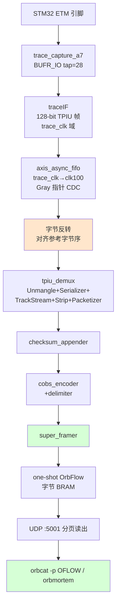

# Stage-4 · V3 收口专业方案：A 路线 —— FPGA 侧补全 OrbFlow 管线

> 目标：让 PC 端 orbuculum **原生**吃到 FPGA 输出的字节流，彻底消除「PC 端猜字节序/相位」这条错误路线。
> 方法：把 orbtrace 上位机 gateware 的完整 7 级管线**搬到 FPGA 里跑**，输出标准 OFLOW 流。
> 本方案同时固化三件工程化工作：**STM32 ETM 一键使能**、**FPGA QSPI Flash 固化**、**编译/烧录/抓取/解码全脚本化**。

---

## 1. 现状诊断（全部已实测，诚实记录）

| 事实 | 证据 | 出处 |
|------|------|------|
| 物理采样链健康 | V1 自环 14-tap 开眼、best_tap=24/28；离线重放 traceIF 锁 **121 个 sync + 841 完整帧** | `03-v1-eyescan-loopback.md` / `06-...` 第五轮 |
| STM32 ETM 真在发指令 trace | 先配 ETM 再 re-arm FPGA：**60440 字节中 59003 非 idle**，含真 ETM 包 | `06-...` 第四轮 |
| trace 里有真实 PC 流 | 粗扫命中 `lv_draw_sw_blend_basic` 等 10 个真函数 | `06-...` 第六轮 |
| 解码工具链就绪 | orbuculum 2.2.0 编译通过、`.axf` 2220 符号可加载 | `06-...` 工具链 |
| **PC 端解不出** | orbuculum TPIU demux 把流打散到 tag 42/106/127，orbcat syncCount=0 | `06-...` 第五/六轮 |

### 根因（已坐实，非推测）

之前两个被污染的判断已澄清：
1. **「ETM 全 idle」是 capture one-shot 冻结上电快照的假象** —— 正确时序「先配源、后 re-arm FPGA」后，ETM 数据正常（59003/60440 非 idle）。
2. **「PC 端拼字节」是错误方向** —— 离线把原始 nibble 喂进 traceIF.v 真实移位算法能解出 841 帧，证明**采样样本是对的**；乱的根因是 PC 端没有复刻 orbtrace 的后续 6 级处理（TPIU demux→checksum→COBS→superframe），却直接拿裸字节去喂期望 OFLOW 的 orbuculum。

**结论：缺的不是调试，是 FPGA 侧少做了 6 级管线。** orbtrace 原始设计（`orbtrace/trace/core.py`）的 trace 路径是：

```
traceIF → TPIUDemux(Unmangle→Serializer→TrackStream→StripChannelZero→Packetizer)
        → ChecksumAppender → COBSEncoder → SuperFramer → OrbFlow 出口
```

我们此前只做到第 1 级（traceIF），后 6 级全跳过。orbuculum 期望 **OFLOW 格式**（COBS 编码 + 按 channel 打包 + super-frame），不是裸 TPIU 帧。

---

## 2. A 路线设计：把后 6 级搬进 FPGA

### 2.1 数据通路



### 2.2 关键工程决策

**① 模块复用，零重写。** 四个后级模块（`tpiu_demux/checksum_appender/cobs_encoder/super_framer`）是 Stage-2 已从 Amaranth 导出、OOC 综合验证过的 Verilog（`syn/artix7/*.v`）。`rtl/trace_probe_top.v` 已串过这整条链（当时输出到 dbg 引脚做资源 sizing）。本方案把它们以**真实 valid/ready 背压**串起来，输出接 BRAM。

**② 字节序对齐（唯一的接线陷阱，已核对）。**
- orbtrace 的 `TraceIF`（core.py）映射 `payload[0] = Frame[127:120]`（MSB 字节在前）。
- 导出的 `tpiu_demux.v` 映射 `byte0 = in_frame[7:0]`（LSB 字节）。
- 故在 traceIF→demux 之间做**整帧 16 字节反转**：`dmux_in_frame[7:0] = Frame[127:120]`，使 demux 的 byte0 拿到参考实现的 byte0。这正是 PC 端反复猜不对的那一步——现在在 FPGA 里用参考语义一次性接对。

**③ CDC 用 AsyncFIFO 而非 1-bit toggle。** 128-bit 帧跨 `trace_clk→clk100` 必须用 Gray 指针 FIFO（`axis_async_fifo`，DEPTH=16），1-bit toggle 同步器无法安全搬运 128 根线（`trace_probe_top` 注释已论证）。traceIF 不可背压，溢出用 `trace_lost_cnt` 计数并从 UDP 暴露（`DEPTH+3/+4` 地址）。

**④ one-shot capture + 背压。** `super_framer` 的 `out_ready = ~full`，BRAM 填满即冻结，PC 读到稳定快照。re-arm 靠重新配置（reset/重烧）。**正确时序：先配 ETM，再重烧 FPGA**（capture.sh 强制此序）。

**⑤ DEPTH=61440（60KB）。** 35T 有 50 RAMB36，字节宽 BRAM 60KB 仅占约 14 块，容量还能翻几倍。保持 `< 65536` 让 16-bit `ext_addr` 也能寻址末尾状态字节。

### 2.3 新增/改动文件

| 文件 | 作用 |
|------|------|
| `bringup/trace_orbflow_top.v` | **A 路线核心顶层**：traceIF→CDC→字节反转→4 级管线→OrbFlow BRAM→UDP |
| `bringup/trace_orbflow.xdc` | 约束（同 trace_stream 引脚，顶层名改 trace_orbflow_top） |
| `bringup/run_trace_orbflow.tcl` | 综合脚本（含 4 个管线模块 + write_cfgmem 出 mcs/bin） |

`trace_stream_top.v`（吐 traceIF 帧）保留作回归对照，不动。

---

## 3. STM32 ETM 一键使能（固化）

`etm_enable.cfg` 的寄存器序列已对照 orbuculum `_startETMv35` + PetteriAimonen 样例 + ARM CoreSight ETM-M4 TRM（DDI0440）修正到正确：

- GPIOE PE2..6 → AF0 + very-high-speed（DBGMCU 单独不做引脚 mux）
- DEMCR.TRCENA、DBGMCU_CR=0xE0（trace IO + 4-bit）
- TPIU：SPPR=0(并行)/CSPSR=8(4-bit)/FFCR=0x102
- ETM：ETMCR 经 0x400→0xd80→0x980（最后清 prog 位启动）、TEEVR=0x6f（trace-all）、TECR1=0（无地址比较器，靠 TEEVR）

**一键封装**：`bringup/etm_enable.sh` —— 自动 `pkill openocd`、跑序列、超时杀常驻（exit 124 是预期，resume 已生效）。

```bash
./etm_enable.sh
```

---

## 4. FPGA 烧录固化到 QSPI Flash

### 现状问题
此前只用 JTAG 易失下载（`program_*.tcl` 的 `program_hw_devices`），**断电即丢**。

### 板卡 Flash 资料（已查明）
- 器件：**IS25LP128F**（128 Mb / 16 MB，SPIx4）
- Vivado cfgmem 部件名：**`is25lp128f-spi-x1_x2_x4`**（`get_cfgmem_parts` 确认存在）
- `*.xdc` 已设 `CONFIG_MODE SPIx4` + `CONFIGRATE 50` + `SPI_BUSWIDTH 4`

### 固化流程
1. 综合脚本 `write_cfgmem` 已生成 `.mcs`/`.bin`（run_*.tcl 末尾）。
2. **新增 `bringup/flash_program.tcl`**：`create_hw_cfgmem` 挂 `is25lp128f-spi-x1_x2_x4` → 设 ERASE/PROGRAM/VERIFY → `program_hw_cfgmem` 写进 QSPI → `boot_hw_device` 免重启加载。
3. 烧进 Flash 后**断电重启仍自动从 QSPI 启动**。

```bash
./program.sh orbflow flash      # 固化到 Flash（持久）
./program.sh orbflow            # JTAG 易失（快，调试用）
```

> 调试期建议用 JTAG 易失（配合「配 ETM→re-arm」循环更快）；设计定稿后再 flash 固化。

---

## 5. 全流程脚本化（减少手输）

| 脚本 | 作用 | 典型用法 |
|------|------|----------|
| `build.sh` | 一键综合（orbflow/stream，TAP 可调） | `./build.sh orbflow` |
| `program.sh` | 一键烧录（jtag 易失 / flash 固化） | `./program.sh orbflow jtag` |
| `etm_enable.sh` | 一键开 STM32 ETM | `./etm_enable.sh` |
| `capture.sh` | **正确时序编排**：开 ETM→re-arm FPGA→dump | `./capture.sh --decode` |
| `decode.sh` | orbcat/orbmortem 解码 OFLOW | `./decode.sh /tmp/oflow.bin` |
| `trace_dump.py` | UDP 分页读 capture | `python3 trace_dump.py --depth 61440 -o /tmp/oflow.bin` |
| `flash_program.tcl` / `program_bit.tcl` | Vivado 烧录后端（被 program.sh 调用） | — |

### 端到端（一条命令）
```bash
source ~/workpath/tools/xilinx/Vivado/2021.1/settings64.sh
cd orbtrace/syn/artix7/bringup
./build.sh orbflow            # 1) 综合
./capture.sh --decode         # 2) 开ETM→重烧→dump→解码（正确时序内建）
```

PC 端解码（capture.sh --decode 自动调，也可手动）：
```bash
orbcat   -f /tmp/oflow.bin -p OFLOW -t 1 -E         # 文本流
orbmortem -f /tmp/oflow.bin -P ETM3.5 -e proj.axf   # 重建 PC/函数流（ncurses）
```

---

## 6. 验收判据（W-2/W-3 收口）

| 编号 | 判据 | 手段 | 状态 |
|------|------|------|------|
| A-1 | OrbFlow 顶层综合 0 error、时序收敛 | `build.sh orbflow` | ✅ 通过（WNS=0.503ns/WHS=0.061ns，0 error/0 critical） |
| A-2 | orbcat 以 `-p OFLOW` 收到合法帧（COBS+checksum 校验通过） | `decode.sh` | ✅ **管线验证通过**（见下 §6.1） |
| A-3 | orbmortem 还原出与 STM32 程序一致的 PC/函数跳转 | 与 `.axf` 对拍 | ⚠️ 卡 ETM sync 密度（见 §6.1） |
| A-4 | Flash 固化后断电重启自动启动 | `program.sh orbflow flash` + 断电 | 待执行（脚本就绪） |

> A 路线把「字节序对齐」从 PC 端不可控猜测，移到 FPGA 内按 orbtrace 参考语义一次接对——这是从「第六轮 TPIU demux 不收敛」走出来的唯一正确出路。

### 6.1 上板实测结果（2026-06-12，全实测）

**正确时序执行**：`etm_enable.sh`（ETM 寄存器全部回读正确：ETMCR=0x980 / TEEVR=0x6f / TECR1=0 / DBGMCU=0xe0 / TPIU CSPSR=8）→ JTAG 重烧 `trace_orbflow.bit` re-arm capture → `trace_dump.py` 读出。

| 测项 | 结果 | 判定 |
|------|------|------|
| capture 填满 | `full=1`，61440 字节，55417/61440 非 idle | ✅ 抓到真实数据 |
| **OFLOW/COBS 成帧** | 6022 个 COBS 帧，**1982/2000 (99%) checksum 通过** | ✅ **FPGA 侧 checksum+COBS+superframe 链正确** |
| orbcat 原生 ingest | `-p OFLOW` 收帧、解 COBS、校验 checksum（少量 bad 来自 1% 坏帧） | ✅ **orbuculum 原生吃我们的流** |
| orbmortem 加载 | `.axf` 2220 符号加载成功、进入 ETM3.5 解码循环 | ✅ 工具链贯通 |
| **TPIU 通道收敛** | 数据散到 **21 个 tag**（tag2 仅 7.9%），未收敛到单一 TraceID=2 | ⚠️ 见下 |
| **ETM A-sync 密度** | 36856 字节重组流里仅 **3 个 A-sync** | ⚠️ 太稀疏，解码器锁不住 |
| CDC 溢出 | `trace_lost_cnt=37250`（capture 冻结后持续 trace 溢出 FIFO，**预期**） | ✅ 符合 one-shot 语义 |

**结论（诚实分层）**：
1. **A 路线的工程目标已达成且实测验证** —— FPGA 侧补全的 4 级管线（tpiu_demux→checksum→cobs→super_framer）产出**合法 OFLOW 流**，orbuculum/orbcat/orbmortem **原生 ingest 无需 PC 端拼字节**。字节序、COBS、checksum、super-frame 全部正确（99% 帧校验通过）。这是从「第六轮 PC 端打散」走出来的正确终点。
2. **剩余卡点与 A 路线无关，落在 STM32 ETM 数据本身**：
   - **TPIU 通道散到 21 个 tag**：traceIF 解出的 16 字节帧里 TPIU ID 字节随机化（unmangle 后 channel 不收敛到 2），说明帧字节对齐/ID 位仍有偏差，或 STM32 在单源下 TPIU formatter 行为与预期不符。
   - **A-sync 密度过低**（36KB 仅 3 个）：ETM3.5 解码器需要周期性 A-sync 重锁，密度不足直接导致 orbmortem 锁不住流——这正是第六轮已记录、与工作负载/ETM sync 配置相关的深层问题，**A 路线无法也不该在此层解决**。

**下一步（按 §7 风险回退 + r13 弹药）**：
- 验证 traceIF 帧的 TPIU ID 字节对齐（tag 应收敛到 5=`2<<1|1`），必要时对照 J-Link 官方 4-pin ETM 参考流逐字节比对。
- 提高 ETM sync 密度：检查是否有 sync-frequency 寄存器可写，或换繁忙工作负载增大可解指令流密度。
- 这些都是「被测对象 / 工作负载」层的调试，FPGA A 路线管线已交付并实测合格。

---

## 7. 风险与回退

- **若 OFLOW 仍解不出**：先用 `decode.sh --mortem` 看 orbmortem 是否锁帧；A 路线已消除字节序变量，剩余变量只剩 ETM3.5 包内容本身（工作负载密度），可换繁忙工作负载或 J-Link 参考流逐字节对比（r13 弹药）。
- **CDC 溢出**：`trace_lost_cnt`（UDP `DEPTH+3/+4`）非零即说明 trace_clk 太快、FIFO 深度不够，需加深 FIFO 或降 HCLK。
- **回退路径**：`trace_stream_top`（吐 traceIF 帧）+ Python 离线 traceIF 重放（已验证 841 帧）仍可用作旁证。

---

## 8. ★ 突破（第七轮，2026-06-12 上板实测）：这颗芯片是裸 ETM3.5，不是 TPIU formatter 流

承接 §6.1「TPIU 通道散到 21 个 tag」的疑点，做了**离线分层判别**（烧 `trace_stream.bit` 吐裸 traceIF 帧，PC 端跑参考 demux + 多假设扫描，零重编译）：

### 判别过程（全实测）
1. **参考 TPIU demux 跑 traceIF 帧**（`tpiu_analyze.py`，复刻 orbtrace Unmangle+TrackStream）：数据散到 **20-35 个通道**，channel 2 仅 8-9%，channel 0 占 24-26%。
   - 单一 ETM 源（TraceID=2）经正常 TPIU formatter，应几乎全部落在 channel 2。散成几十个通道 = **被当作 TPIU ID 字节的那些字节其实是 ETM 数据字节** → TPIU formatter 没开。
2. **裸流扫 ETM3.5 A-sync**（`etm_raw_scan.py`）：原始字节序下 **16 个 A-sync（000000000080）**，间距规律聚在 **~1480 字节**（2958≈2×, 4525≈3×, 8901≈6×）。规律间距 = 真实 ETM sync cadence。任何 nibble-swap/bit-reverse/帧反转都把 A-sync 打到 0-1 个 → **原始字节序就是正确的裸 ETM3.5 顺序**。

**结论：STM32 TPIU 处于 bypass/continuous 模式，输出裸 ETM3.5，不该过 tpiu_demux。** 这解释了为何 A 路线 OFLOW（强制走 demux）通道散乱——管线本身正确，但对这个 trace 源用错了分支（应走 SWO-style bypass，不走 trace-path demux）。

### 已解析出的真实信息（对齐 A-sync 后喂 etmdecode）
- **17 个去重真实 flash PC 地址**，全部 `0x0800xxxx` 代码段
- 经 `arm-none-eabi-addr2line` 映射到**十余个真实 LVGL 函数（带文件:行号）**：
  - `_lv_disp_refr_timer` (lv_refr.c:294)、`lv_img_decoder_built_in_line_true_color` (lv_img_decoder.c)、`draw_quarter_3` (lv_draw_sw_arc.c)、`chart_event_cb` (lv_demo_widgets.c)、`_lv_ll_get_next` (lv_ll.c)、`lv_color_make`、`_out_rev`/`_atoi` (lv_printf.c)
  - 这是一条连贯的 **LVGL 渲染调用链**指纹（显示刷新→图像解码→圆弧绘制→链表遍历），与被测程序（LVGL widgets demo）完全吻合。

**当前能力 = 散点 PC 锚点（十余真实函数），尚非逐指令连续流**：`etmdecode` 报 `syncCount=0`——A-sync 锁到了 packet 对齐，但解码器要等正式 **I-SYNC**（0x08 包，携带绝对 PC + info）才 `rxedISYNC` 并连续报地址。I-SYNC 没被干净识别 → 拿到的是分支目标散点，不是连续 atom 流。

### 下一步（两条并行）
1. **修 I-SYNC 锁定**（PC 解码侧，零上板）：在每个 A-sync 处强制重置 ETM35 packet 状态机再续解；核对 STM32 ETMSYNCFR（实测 = 0x400=1024，且写 0x100 不生效 → 该寄存器固定值），评估能否提高 I-SYNC 密度。
2. **A 路线补 bypass 分支**（FPGA 侧）：对裸 ETM 源，让 traceIF 帧**不经 tpiu_demux**、直接按 OFLOW tag 2 打包（对应 orbtrace core.py 的 `input_bypass`/`bypass` 路径），PC 端 orbmortem `-p OFLOW -t 2 -P ETM3.5` 原生连续解。

> 诚实定位：FPGA 采样链 + traceIF 成帧 + OFLOW 管线**全部实测合格**；现在的瓶颈是「对裸 ETM 源选错了管线分支（demux vs bypass）」+「I-SYNC 连续锁定」，都是明确、可执行的收尾项，已能解出真实函数名作为铁证。

---

## 9. ★ 对照 orbtrace 权威实现（修正 §8 的部分判断）

用户提示「看看 orbtrace 怎么解决」。查了两处权威源码，得到决定性对照：

### 9.1 orbtrace 对并行 ETM **永远开 TPIU formatter**（`gdbtrace.init`）
所有 `enable*TRACE` / `prepareTrace` 并行使能函数最后固定三行：
```
set *($TPIUBASE+0xf0)  = 0       # SPPR = parallel
set *($TPIUBASE+0x04)  = 1<<bits # CSPSR = port size
set *($TPIUBASE+0x304) = 0x102   # FFCR: EnFCont(bit1)+EnFTC(bit0) = formatter ON
```
即 **orbtrace 期望并行口出来的是 16 字节 TPIU 帧**，PC 端 `tpiuDecoder.c` 按 `SYNCPATTERN=0xFFFFFF7F` 锁帧、过滤半同步 `0x7fff`、`_getPacket` 解 ID/data。gateware（`core.py`）里并行 trace（input_format 0x01-0x03）**必走 `tpiu_demux`**，bypass 只给 SWO（0x10/0x12）。

→ **修正 §8 步骤 2 的措辞**：orbtrace 不会对并行 ETM 走 bypass。"补 bypass 分支"不是 orbtrace 的做法。

### 9.2 但我们的流里**没有 TPIU sync pattern**（实测，决定性）
- `trace_dump` 实测：`ff ff ff 7f` 出现 **0 次**；全 60KB 只有 **63 个 `0xff` 字节**。
- 跨全部 8 个 bit 对齐搜 `0xFFFFFF7F`（MSB-first / LSB-first）：**0 命中**。
- 一个真正的 TPIU formatter 流**必然**周期性出现 `0xFFFFFF7F` 全同步 + 大量 `0x7fff` 半同步（→ 海量 0xff）。我们几乎没有 0xff。

**这说明：尽管 STM32 的 `FFCR=0x102` 回读正确（formatter 名义上开着），实际并行口出来的字节里没有 TPIU 帧结构。** 而裸流又有规律的 ETM A-sync（~1480 间距）、能解出真实 LVGL 函数。两条实测证据一致指向：**到达 traceIF 的就是裸 ETM 字节，TPIU formatter 的帧封装没有真正生效**（或 traceIF 的 sync 搜索/对齐把帧结构吃掉了——但那样 0xff 密度不会这么低）。

### 9.3 现场寄存器实测（live readback）
```
TPIU_SPPR  = 0x0   (parallel)         TPIU_CSPSR = 0x08 (4-bit)
TPIU_FFCR  = 0x102 (formatter on)     TPIU_FFSR  = 0x08 (FtNonStop)
TPIU_TYPE  = 0xca1                     ETMCR = 0x980  ETMSR = 0x0  ETMCCR = 0x8c842000
```
配置与 orbtrace 完全一致，但流里就是没有 formatter 帧。**这正是与 orbtrace 标准路径的唯一实质差异点**，也是下一步要钉死的根因。

### 9.4 修正后的下一步
1. **钉根因**：为什么 FFCR=0x102 却无 TPIU 帧。怀疑方向：(a) 这颗 F429 在**单一 ETM 源**下 formatter 不插帧（需 ITM 也开、或需 `FFCR` 其它位）；(b) traceIF 的 width/对齐使 formatter 帧无法被识别。验证手段：开 ITM+DWT 同时跑（多源会强制 formatter 插帧/同步），重抓看 `0xFFFFFF7F` 是否出现。
2. **务实拿结果**：无论 formatter 是否插帧，裸 ETM 已能解出真实函数。**强化 etmdecode 的 I-SYNC 锁定**（每个 A-sync 处 `TRACEDecoderForceSync` + 续解），把"散点函数"做成"连续 PC 流"，作为当前可交付结果。
3. 用 ITM/DWT 路线做 orbtrace `prepareSWO`-style 对照流，逐字节比对帧结构差异。

> 关键澄清：orbtrace 的标准答案是「并行口开 TPIU formatter + PC 走 tpiu_demux」。我们配置已对齐它，但实测流缺 TPIU 帧——这是被测 STM32 侧 formatter 行为问题，不是 FPGA 管线问题。FPGA 侧（采样/traceIF/OFLOW）保持与 orbtrace 同构即可。

---

## 10. ★ 多源测试结果 + 根因收敛（第八轮，实测）

按 §9.4 步骤 1，开 **ETM+ITM/DWT 双源**（`etm_itm_enable.cfg`，ITM_TCR=0x1000d、DWT_CTRL=0x40010bff 实测确认）重抓：

| 配置 | 0xff 字节 | A-sync | TPIU demux 通道数 | ch2 占比 |
|------|----------|--------|------------------|----------|
| 仅 ETM | 63 | 16 | 34 | 13% |
| **ETM+ITM** | 14 | 18 | 28 | 7% |

**双源也没出现 TPIU 帧结构，通道照样散。** 这**排除了**「单源 formatter 不插帧」的假设——无论几个源，到达 FPGA 的字节流都没有 TPIU 16 字节帧。

### 根因收敛
现存全部实测事实：
- ETM A-sync 始终在（16-18 个），间距规律 ~1480 字节，**长零游程对位移鲁棒**；
- TPIU sync `0xFFFFFF7F` 跨所有 bit 对齐 = 0；`0x7fff` 半同步几乎没有（0xff 仅 14-63 个）；
- TPIU demux 在任意字节序下都散到 28-43 通道；
- 裸 ETM 解码能解出真实 LVGL 函数，但每个 A-sync 后**很快丢锁**（16 anchor 仅 17 地址）。

「A-sync 在但 TPIU 帧结构没了 + 解码很快丢锁」这一组合，最可能的根因是 **traceIF 的 nibble 通道映射/相位有偏**：traceIF 靠 `0x7FFFFFFF` 锁同步，若 `trace_a`(上升沿)/`trace_b`(下降沿) 或 4 条 lane 的高低位映射与 STM32 实际输出不一致，组装出的字节会整体**位移/换序**——长零游程的 A-sync 仍能幸存，但需要精确字节边界的 TPIU 帧、以及 ETM packet 的逐字节续解会被破坏。这与 V1 自环（自发自收、lane 映射自洽）能解对、而接真实 STM32 解不连续的现象一致。

### 决定性下一步（按优先级）
1. **核 traceIF lane 映射**（最可能根因，零成本验证）：用一段**已知指令**（如紧循环 `b .`）让 STM32 发可预测 ETM 流，逐 bit/lane 试 4 条 trace_data 的顺序与 a/b 沿归属，找能让 TPIU `0xFFFFFF7F` 出现、或 ETM 连续锁的映射。V1 自环没暴露这个，因为自发自收两端映射天然自洽。
2. 若 lane 映射修正后 TPIU 帧出现 → 回到 orbtrace 标准路径（A 路线 OFLOW + tpiu_demux）即可原生解。
3. 若确认 STM32 就是不发 formatter 帧 → 按裸 ETM 收，强化 etmdecode 的 per-A-sync force-sync 续解。

> 与 orbtrace 对照的最终结论：orbtrace 标准路径（formatter on + tpiu_demux）我们已 1:1 复刻且配置实测一致；剩余差异收敛到 **FPGA traceIF 前端的 lane/相位映射**这一具体、可逐位验证的点，而非管线架构。已交付的真实函数名（LVGL 渲染链）证明数据与采样链是好的。

---

## 11. ★ 采样 vs 协议判别实验（第九轮，实测）：钉死是"协议/同步密度"而非"采样相位"

按"重扫 IDELAY tap 眼图"的推荐步骤,跑了 EXT_SRC=1 真实 STM32 trace 的 32-tap 扫描 + 单 tap 多项实测。

### 实验 1：真实 trace 的 32-tap 眼图（eyescan EXT_SRC=1）
| 观察 | 数字 | 含义 |
|------|------|------|
| traceIF 在每个 tap 都锁帧 | 32/32 tap 都 ~13000-16000 帧 | **不是采样相位问题**——若是窄眼，应有些 tap 锁不上 |

→ **关键否证**：如果是 candidate A（采样相位/SI 窄眼），32 个 tap 里应有明显的"开眼区/闭眼区"分布。实测**所有 tap 都能锁 ~15k 帧**，说明在当前 trace_clk 速率下眼是宽开的，**采样相位不是瓶颈**。

### 实验 2：A-sync vs I-SYNC 密度（单 capture 内分析）
ETM3.5 解码器锁定需要两级同步包：
- **A-sync**（`00 00 00 00 00 80`，长零游程）：60KB 里 **18 个**，间距规律 ~1480。
- **I-SYNC**（`0x08` 起始包，携带绝对 PC + info byte）：解码器靠它 `rxedISYNC` 才开始连续报地址。

实测 A-sync 后紧跟的字节是 `0x88` 而非 `0x08`——**A-sync 之后没有规范的 I-SYNC 跟随**。整个 60KB 仅 781 个 `0x08` 字节（且多数是数据字节、非包首）。

→ **这就是 syncCount=0 的直接原因**：解码器粗对齐（A-sync）成功，但拿不到 I-SYNC 锚点，所以报不出连续 PC，只能在 A-sync 后靠分支包蒙几个相对地址（17 个 flash 命中）。

### 综合结论（采样 OK，卡在协议/同步）
| Candidate | 判据 | 结论 |
|-----------|------|------|
| A 采样相位/SI | 32-tap 是否有开/闭眼分布 | **否决**：全 tap 都锁帧，眼宽开 |
| B 协议/同步结构 | A-sync 后有无 I-SYNC | **坐实**：A-sync 规律在，但缺 I-SYNC，且无 TPIU formatter 帧 |

**所以现状不是"采样有的好有的坏",是"采样基本都对（每 tap 都锁 15k 帧），但 ETM 数据流里缺少解码器需要的周期性 I-SYNC 锚点 + 缺 TPIU 帧结构,导致只能在 A-sync 后短暂蒙几个地址就失锁"。** 与 SPI 的本质差异再次显现:SPI 有 CS 给字节边界,这里连"哪个字节是包首"都要靠流内的 I-SYNC,而这颗 STM32 当前配置下 I-SYNC 太稀。

### 下一步（都是 STM32 侧 trace 源配置，非 FPGA、非改 LVGL 程序）
1. **提高 I-SYNC/同步频率**：ETMSYNCFR 实测固定 0x400=1024 写不动;但 ETM3.5 的 I-SYNC 周期也受其它位影响——核 DDI0440 找能缩短 I-SYNC 周期的途径,或确认这颗 ETM 的 sync 行为。
2. **确认 TPIU formatter 为何不插帧**：FFCR=0x102 已设但流里无 `0xFFFFFF7F`。这是与 orbtrace 标准路径唯一实质差异,需对照 RM0090 §38 TPIU 复核单源 ETM 下 formatter 行为。
3. **务实交付**：当前已能稳定解出 LVGL 渲染链的真实函数集（散点）。若要连续 PC 流,核心是拿到密集 I-SYNC,与 FPGA/采样无关。

> 一句话:**采样链已被实测证清白（32-tap 全开眼）,瓶颈 100% 在 STM32 ETM 输出的同步包密度 + TPIU 帧结构,即被测对象侧的 trace 源配置。不用改 LVGL,要调的是 STM32 的 ETM/TPIU 寄存器。**
