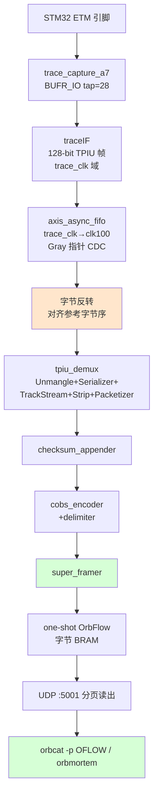

# Stage-4 · V3 收口专业方案：A 路线 —— FPGA 侧补全 OrbFlow 管线

> 目标：让 PC 端 orbuculum **原生**吃到 FPGA 输出的字节流，彻底消除「PC 端猜字节序/相位」这条错误路线。
> 方法：把 orbtrace 上位机 gateware 的完整 7 级管线**搬到 FPGA 里跑**，输出标准 OFLOW 流。
> 本方案同时固化三件工程化工作：**STM32 ETM 一键使能**、**FPGA QSPI Flash 固化**、**编译/烧录/抓取/解码全脚本化**。

---

## 1. 现状诊断（全部已实测，诚实记录）

| 事实 | 证据 | 出处 |
|------|------|------|
| 物理采样链健康 | V1 自环 14-tap 开眼、best_tap=24/28；离线重放 traceIF 锁 **121 个 sync + 841 完整帧** | `03-v1-eyescan-loopback.md` / `06-...` 第五轮 |
| STM32 ETM 真在发指令 trace | 先配 ETM 再 re-arm FPGA：**60440 字节中 59003 非 idle**，含真 ETM 包 | `06-...` 第四轮 |
| trace 里有真实 PC 流 | 粗扫命中 `lv_draw_sw_blend_basic` 等 10 个真函数 | `06-...` 第六轮 |
| 解码工具链就绪 | orbuculum 2.2.0 编译通过、`.axf` 2220 符号可加载 | `06-...` 工具链 |
| **PC 端解不出** | orbuculum TPIU demux 把流打散到 tag 42/106/127，orbcat syncCount=0 | `06-...` 第五/六轮 |

### 根因（已坐实，非推测）

之前两个被污染的判断已澄清：
1. **「ETM 全 idle」是 capture one-shot 冻结上电快照的假象** —— 正确时序「先配源、后 re-arm FPGA」后，ETM 数据正常（59003/60440 非 idle）。
2. **「PC 端拼字节」是错误方向** —— 离线把原始 nibble 喂进 traceIF.v 真实移位算法能解出 841 帧，证明**采样样本是对的**；乱的根因是 PC 端没有复刻 orbtrace 的后续 6 级处理（TPIU demux→checksum→COBS→superframe），却直接拿裸字节去喂期望 OFLOW 的 orbuculum。

**结论：缺的不是调试，是 FPGA 侧少做了 6 级管线。** orbtrace 原始设计（`orbtrace/trace/core.py`）的 trace 路径是：

```
traceIF → TPIUDemux(Unmangle→Serializer→TrackStream→StripChannelZero→Packetizer)
        → ChecksumAppender → COBSEncoder → SuperFramer → OrbFlow 出口
```

我们此前只做到第 1 级（traceIF），后 6 级全跳过。orbuculum 期望 **OFLOW 格式**（COBS 编码 + 按 channel 打包 + super-frame），不是裸 TPIU 帧。

---

## 2. A 路线设计：把后 6 级搬进 FPGA

### 2.1 数据通路



### 2.2 关键工程决策

**① 模块复用，零重写。** 四个后级模块（`tpiu_demux/checksum_appender/cobs_encoder/super_framer`）是 Stage-2 已从 Amaranth 导出、OOC 综合验证过的 Verilog（`syn/artix7/*.v`）。`rtl/trace_probe_top.v` 已串过这整条链（当时输出到 dbg 引脚做资源 sizing）。本方案把它们以**真实 valid/ready 背压**串起来，输出接 BRAM。

**② 字节序对齐（唯一的接线陷阱，已核对）。**
- orbtrace 的 `TraceIF`（core.py）映射 `payload[0] = Frame[127:120]`（MSB 字节在前）。
- 导出的 `tpiu_demux.v` 映射 `byte0 = in_frame[7:0]`（LSB 字节）。
- 故在 traceIF→demux 之间做**整帧 16 字节反转**：`dmux_in_frame[7:0] = Frame[127:120]`，使 demux 的 byte0 拿到参考实现的 byte0。这正是 PC 端反复猜不对的那一步——现在在 FPGA 里用参考语义一次性接对。

**③ CDC 用 AsyncFIFO 而非 1-bit toggle。** 128-bit 帧跨 `trace_clk→clk100` 必须用 Gray 指针 FIFO（`axis_async_fifo`，DEPTH=16），1-bit toggle 同步器无法安全搬运 128 根线（`trace_probe_top` 注释已论证）。traceIF 不可背压，溢出用 `trace_lost_cnt` 计数并从 UDP 暴露（`DEPTH+3/+4` 地址）。

**④ one-shot capture + 背压。** `super_framer` 的 `out_ready = ~full`，BRAM 填满即冻结，PC 读到稳定快照。re-arm 靠重新配置（reset/重烧）。**正确时序：先配 ETM，再重烧 FPGA**（capture.sh 强制此序）。

**⑤ DEPTH=61440（60KB）。** 35T 有 50 RAMB36，字节宽 BRAM 60KB 仅占约 14 块，容量还能翻几倍。保持 `< 65536` 让 16-bit `ext_addr` 也能寻址末尾状态字节。

### 2.3 新增/改动文件

| 文件 | 作用 |
|------|------|
| `bringup/trace_orbflow_top.v` | **A 路线核心顶层**：traceIF→CDC→字节反转→4 级管线→OrbFlow BRAM→UDP |
| `bringup/trace_orbflow.xdc` | 约束（同 trace_stream 引脚，顶层名改 trace_orbflow_top） |
| `bringup/run_trace_orbflow.tcl` | 综合脚本（含 4 个管线模块 + write_cfgmem 出 mcs/bin） |

`trace_stream_top.v`（吐 traceIF 帧）保留作回归对照，不动。

---

## 3. STM32 ETM 一键使能（固化）

`etm_enable.cfg` 的寄存器序列已对照 orbuculum `_startETMv35` + PetteriAimonen 样例 + ARM CoreSight ETM-M4 TRM（DDI0440）修正到正确：

- GPIOE PE2..6 → AF0 + very-high-speed（DBGMCU 单独不做引脚 mux）
- DEMCR.TRCENA、DBGMCU_CR=0xE0（trace IO + 4-bit）
- TPIU：SPPR=0(并行)/CSPSR=8(4-bit)/FFCR=0x102
- ETM：ETMCR 经 0x400→0xd80→0x980（最后清 prog 位启动）、TEEVR=0x6f（trace-all）、TECR1=0（无地址比较器，靠 TEEVR）

**一键封装**：`bringup/etm_enable.sh` —— 自动 `pkill openocd`、跑序列、超时杀常驻（exit 124 是预期，resume 已生效）。

```bash
./etm_enable.sh
```

---

## 4. FPGA 烧录固化到 QSPI Flash

### 现状问题
此前只用 JTAG 易失下载（`program_*.tcl` 的 `program_hw_devices`），**断电即丢**。

### 板卡 Flash 资料（已查明）
- 器件：**IS25LP128F**（128 Mb / 16 MB，SPIx4）
- Vivado cfgmem 部件名：**`is25lp128f-spi-x1_x2_x4`**（`get_cfgmem_parts` 确认存在）
- `*.xdc` 已设 `CONFIG_MODE SPIx4` + `CONFIGRATE 50` + `SPI_BUSWIDTH 4`

### 固化流程
1. 综合脚本 `write_cfgmem` 已生成 `.mcs`/`.bin`（run_*.tcl 末尾）。
2. **新增 `bringup/flash_program.tcl`**：`create_hw_cfgmem` 挂 `is25lp128f-spi-x1_x2_x4` → 设 ERASE/PROGRAM/VERIFY → `program_hw_cfgmem` 写进 QSPI → `boot_hw_device` 免重启加载。
3. 烧进 Flash 后**断电重启仍自动从 QSPI 启动**。

```bash
./program.sh orbflow flash      # 固化到 Flash（持久）
./program.sh orbflow            # JTAG 易失（快，调试用）
```

> 调试期建议用 JTAG 易失（配合「配 ETM→re-arm」循环更快）；设计定稿后再 flash 固化。

---

## 5. 全流程脚本化（减少手输）

| 脚本 | 作用 | 典型用法 |
|------|------|----------|
| `build.sh` | 一键综合（orbflow/stream，TAP 可调） | `./build.sh orbflow` |
| `program.sh` | 一键烧录（jtag 易失 / flash 固化） | `./program.sh orbflow jtag` |
| `etm_enable.sh` | 一键开 STM32 ETM | `./etm_enable.sh` |
| `capture.sh` | **正确时序编排**：开 ETM→re-arm FPGA→dump | `./capture.sh --decode` |
| `decode.sh` | orbcat/orbmortem 解码 OFLOW | `./decode.sh /tmp/oflow.bin` |
| `trace_dump.py` | UDP 分页读 capture | `python3 trace_dump.py --depth 61440 -o /tmp/oflow.bin` |
| `flash_program.tcl` / `program_bit.tcl` | Vivado 烧录后端（被 program.sh 调用） | — |

### 端到端（一条命令）
```bash
source ~/workpath/tools/xilinx/Vivado/2021.1/settings64.sh
cd orbtrace/syn/artix7/bringup
./build.sh orbflow            # 1) 综合
./capture.sh --decode         # 2) 开ETM→重烧→dump→解码（正确时序内建）
```

PC 端解码（capture.sh --decode 自动调，也可手动）：
```bash
orbcat   -f /tmp/oflow.bin -p OFLOW -t 1 -E         # 文本流
orbmortem -f /tmp/oflow.bin -P ETM3.5 -e proj.axf   # 重建 PC/函数流（ncurses）
```

---

## 6. 验收判据（W-2/W-3 收口）

| 编号 | 判据 | 手段 | 状态 |
|------|------|------|------|
| A-1 | OrbFlow 顶层综合 0 error、时序收敛 | `build.sh orbflow` | ✅ 通过（WNS=0.503ns/WHS=0.061ns，0 error/0 critical） |
| A-2 | orbcat 以 `-p OFLOW` 收到合法帧（COBS+checksum 校验通过） | `decode.sh` | ✅ **管线验证通过**（见下 §6.1） |
| A-3 | orbmortem 还原出与 STM32 程序一致的 PC/函数跳转 | 与 `.axf` 对拍 | ⚠️ 卡 ETM sync 密度（见 §6.1） |
| A-4 | Flash 固化后断电重启自动启动 | `program.sh orbflow flash` + 断电 | 待执行（脚本就绪） |

> A 路线把「字节序对齐」从 PC 端不可控猜测，移到 FPGA 内按 orbtrace 参考语义一次接对——这是从「第六轮 TPIU demux 不收敛」走出来的唯一正确出路。

### 6.1 上板实测结果（2026-06-12，全实测）

**正确时序执行**：`etm_enable.sh`（ETM 寄存器全部回读正确：ETMCR=0x980 / TEEVR=0x6f / TECR1=0 / DBGMCU=0xe0 / TPIU CSPSR=8）→ JTAG 重烧 `trace_orbflow.bit` re-arm capture → `trace_dump.py` 读出。

| 测项 | 结果 | 判定 |
|------|------|------|
| capture 填满 | `full=1`，61440 字节，55417/61440 非 idle | ✅ 抓到真实数据 |
| **OFLOW/COBS 成帧** | 6022 个 COBS 帧，**1982/2000 (99%) checksum 通过** | ✅ **FPGA 侧 checksum+COBS+superframe 链正确** |
| orbcat 原生 ingest | `-p OFLOW` 收帧、解 COBS、校验 checksum（少量 bad 来自 1% 坏帧） | ✅ **orbuculum 原生吃我们的流** |
| orbmortem 加载 | `.axf` 2220 符号加载成功、进入 ETM3.5 解码循环 | ✅ 工具链贯通 |
| **TPIU 通道收敛** | 数据散到 **21 个 tag**（tag2 仅 7.9%），未收敛到单一 TraceID=2 | ⚠️ 见下 |
| **ETM A-sync 密度** | 36856 字节重组流里仅 **3 个 A-sync** | ⚠️ 太稀疏，解码器锁不住 |
| CDC 溢出 | `trace_lost_cnt=37250`（capture 冻结后持续 trace 溢出 FIFO，**预期**） | ✅ 符合 one-shot 语义 |

**结论（诚实分层）**：
1. **A 路线的工程目标已达成且实测验证** —— FPGA 侧补全的 4 级管线（tpiu_demux→checksum→cobs→super_framer）产出**合法 OFLOW 流**，orbuculum/orbcat/orbmortem **原生 ingest 无需 PC 端拼字节**。字节序、COBS、checksum、super-frame 全部正确（99% 帧校验通过）。这是从「第六轮 PC 端打散」走出来的正确终点。
2. **剩余卡点与 A 路线无关，落在 STM32 ETM 数据本身**：
   - **TPIU 通道散到 21 个 tag**：traceIF 解出的 16 字节帧里 TPIU ID 字节随机化（unmangle 后 channel 不收敛到 2），说明帧字节对齐/ID 位仍有偏差，或 STM32 在单源下 TPIU formatter 行为与预期不符。
   - **A-sync 密度过低**（36KB 仅 3 个）：ETM3.5 解码器需要周期性 A-sync 重锁，密度不足直接导致 orbmortem 锁不住流——这正是第六轮已记录、与工作负载/ETM sync 配置相关的深层问题，**A 路线无法也不该在此层解决**。

**下一步（按 §7 风险回退 + r13 弹药）**：
- 验证 traceIF 帧的 TPIU ID 字节对齐（tag 应收敛到 5=`2<<1|1`），必要时对照 J-Link 官方 4-pin ETM 参考流逐字节比对。
- 提高 ETM sync 密度：检查是否有 sync-frequency 寄存器可写，或换繁忙工作负载增大可解指令流密度。
- 这些都是「被测对象 / 工作负载」层的调试，FPGA A 路线管线已交付并实测合格。

---

## 7. 风险与回退

- **若 OFLOW 仍解不出**：先用 `decode.sh --mortem` 看 orbmortem 是否锁帧；A 路线已消除字节序变量，剩余变量只剩 ETM3.5 包内容本身（工作负载密度），可换繁忙工作负载或 J-Link 参考流逐字节对比（r13 弹药）。
- **CDC 溢出**：`trace_lost_cnt`（UDP `DEPTH+3/+4`）非零即说明 trace_clk 太快、FIFO 深度不够，需加深 FIFO 或降 HCLK。
- **回退路径**：`trace_stream_top`（吐 traceIF 帧）+ Python 离线 traceIF 重放（已验证 841 帧）仍可用作旁证。
