# Stage-4 · 我们的 FPGA 与 ORBTrace 发的数据有何不同?设计差异与优劣

> 问题:我们 FPGA 输出的数据和 ORBTrace(Mini)发的有什么不同?为什么设计得不一样?优劣?
>
> 本文基于实际代码核对(`orbtrace/orbtrace/trace/core.py`、`amaranth_glue/luna.py`、我们的 `syn/artix7/bringup/trace_orbflow_top.v`),不凭记忆。

---

## 0. 一句话结论

**出口数据格式我们和 ORBTrace 是【一样】的(都是 OrbFlow:TPIUDemux→Checksum→COBS→SuperFramer)** —— 因为 A 路线我把 orbtrace 那 4 级管线原样搬进了 FPGA。

**真正的不同在两端:① 采样前端(我们裸 4-bit 直采 vs ORBTrace 经 formatter)② 传输(我们 UDP/千兆以太网 vs ORBTrace USB2 bulk)。** 还有一个 ORBTrace 有、我们当前实现上偷工了的关键点:**字节对齐保证**。

---

## 1. 完整链路对比

```mermaid
graph TB
    subgraph ORB["ORBTrace Mini (ECP5)"]
      O1["trace 引脚"] --> O2["traceIF 采样"]
      O2 --> O3["TPIUDemux"]
      O3 --> O4["Checksum"]
      O4 --> O5["COBS"]
      O5 --> O6["SuperFramer"]
      O6 --> O7["USB2 bulk EP 480Mbps"]
    end
    subgraph OURS["我们 (Artix-7)"]
      A1["trace 引脚"] --> A2["trace_capture_a7 (IDELAY+IDDR 采样)"]
      A2 --> A3["traceIF"]
      A3 --> A4["TPIUDemux"]
      A4 --> A5["Checksum"]
      A5 --> A6["COBS"]
      A6 --> A7["SuperFramer"]
      A7 --> A8["one-shot BRAM → UDP :5001 千兆"]
    end
    style O3 fill:#d6ffd6
    style A4 fill:#d6ffd6
    style O7 fill:#ffe6cc
    style A8 fill:#ffe6cc
```

绿色(中间 4 级管线 + OrbFlow 格式)**完全相同**;橙色(出口/传输)和最前端**不同**。

---

## 2. 三个真实差异

### 差异 ① 出口格式 —— 【相同】(刻意对齐)
- ORBTrace 出口 = OrbFlow:`TPIUDemux → ChecksumAppender → COBSEncoder → SuperFramer`(core.py 实测)。
- 我们 A 路线(`trace_orbflow_top.v`)= **同样 4 级,用的就是从 orbtrace 导出的同一份 Verilog**。
- **为什么要一样**:这样 PC 端 `orbcat -p OFLOW`/`orbmortem` 能原生解,不用改上位机。这是对的设计,不是差异。

### 差异 ② 采样前端 —— 【不同】(命门所在)
| | ORBTrace Mini | 我们 |
|---|---|---|
| 目标源 | 多种,常配硬件 TPIU formatter | STM32 单 ETM 源,**裸 ETM 无 formatter** |
| 采样 | ECP5 输入,trace 口经 formatter 后字节对齐 | Artix-7 IDELAY+IDDR 双沿采 4-bit |
| 字节对齐 | **formatter 保证字节对齐**(`0xFFFFFF7F` 帧同步周期出现) | **裸 4-bit 口,IHI0014Q §7.10.4 明文:不保证字节对齐** |

**这是我们和它最本质的不同**:ORBTrace 的输入天然字节对齐(要么源头开了 formatter,要么 ECP5 侧处理),所以下游 demux/decoder 不用操心子字节错位。我们直采裸 4-bit,命中了规范里"sub-byte port 需重对齐"的边角(见 `08-spec-compliance-crosscheck.md`)。

### 差异 ③ 传输 —— 【不同】(各有优劣)
| | ORBTrace Mini | 我们 |
|---|---|---|
| 物理 | USB2 High-Speed bulk(480Mbps 理论,实测几十 MB/s) | RGMII 千兆以太网 + UDP |
| 模式 | **连续流式**(bulk EP 持续吐) | **当前 one-shot**:抓满 60KB BRAM 冻结,UDP 分页读 |
| 协议 | USB bulk(有流控、可靠传输) | UDP(无重传,可能丢包/乱序) |

---

## 3. 为什么我"设计得不一样"

不是随意,是**平台和阶段约束**决定的:

1. **传输用以太网而非 USB**:微相 A7-Lite 板载千兆 PHY(RTL8211E),没有像 ORBTrace Mini 那样的 ULPI USB2 PHY + LUNA 栈。用板上现成的千兆口是最低成本的高带宽出口。**这是被动的平台选择,不是主动偏好。**

2. **one-shot BRAM 而非连续流**:Stage-4 是**端到端打通验证**阶段,one-shot 抓快照最容易调试、可重放、可离线分析(我们正是靠它做了大量离线诊断)。连续流式是后续阶段的事。

3. **裸 4-bit 直采而非 formatter**:STM32F429 这颗芯片单 ETM 源 + 我们没在 FPGA 侧实现 TPIU formatter 重封装,所以直接吃裸 ETM。**这是当前的"偷工",也正是解码卡点的根因。**

---

## 4. 优劣分析

### 我们方案的优势
- **带宽天花板高**:千兆以太网 1000Mbps vs USB2 480Mbps,满速 trace 时理论带宽更大。
- **传输距离/隔离**:以太网可跨网段、隔离好,适合远程/多机采集。
- **离线可重放**:one-shot 快照 + 文件 dump,调试和回归极方便(我们整个 Stage-4 诊断都受益于此)。
- **FPGA 资源充裕**:35T 有 50 RAMB36,capture 容量能翻几倍;ECP5 资源更紧。

### 我们方案的劣势
- **UDP 无可靠传输**:丢包/乱序要自己加 seq/重传(ORBTrace 的 USB bulk 天然可靠)。当前 one-shot + 分页读规避了这点,但连续流式时要补。
- **裸 4-bit 无字节对齐保证**:命中 §7.10.4 边角,解码器必须做子字节重对齐(ORBTrace 因 formatter 不用操心)。**这是当前最大短板。**
- **one-shot 不能连续 trace**:只能抓 60KB 快照,看不了长时间连续执行流(ORBTrace bulk 是连续的)。
- **延迟/实时性**:抓满才读,非实时;ORBTrace 是边发边解。

### ORBTrace 的优势(我们该学的)
- formatter 保证字节对齐 → 下游解码简单可靠。
- USB bulk 连续 + 可靠传输 → 真正的长时间实时 trace。

---

## 5. 给我们的改进方向(按优劣分析得出)

1. **补字节对齐**(对应劣势②,最高优先级):
   - PC 端解码器做 per-A-sync 子字节重对齐(`etm35lib` 已起步,有测试);或
   - FPGA 侧真正实现 TPIU formatter 重封装,让输出像 ORBTrace 一样天然对齐。
2. **连续流式 + UDP 鲁棒性**(对应劣势①③):capture 从 one-shot 改 ring buffer 连续推流,OrbFlow 帧加 seq number,PC 端统计丢包再决定要不要重传。
3. 出口格式保持与 ORBTrace 一致(OrbFlow),继续复用 orbuculum,不另起炉灶。

> 总结:**数据【格式】我们和 ORBTrace 是一样的(刻意对齐,复用上位机);不同在【采样前端的字节对齐】和【传输介质/模式】。前者是当前解码卡点的根因(我们直采裸 4-bit,少了 ORBTrace 的 formatter 字节对齐),后者是平台决定的取舍(千兆以太网带宽高但 UDP 不可靠、当前 one-shot 非实时)。**
