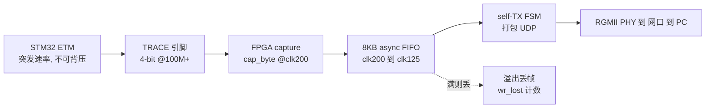
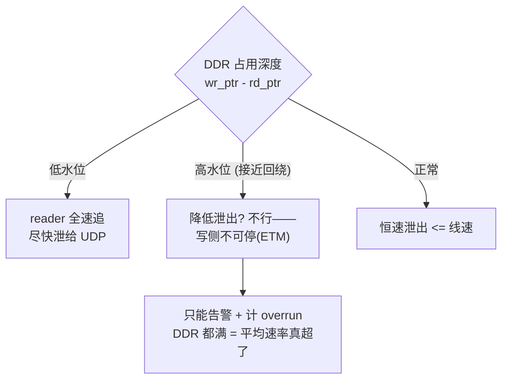
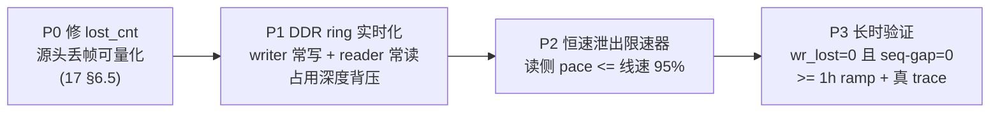

# 18 — DDR 缓冲 + 背压：零丢帧采集架构设计

**日期**：2026-08-22
**前置**：`17-link-endurance-stress-test.md` §6。
**目标**：物理层链路做到 **0 坏帧 + 0 丢帧**。坏帧已达标（字节零误码），本文解决 0 丢帧。

> ⚠️ **本方案前提未证，红方 r36 冻结（2026-08-22）。** DDR 只治"突发"，前提是 CoreMark
> **平均 trace 净荷率 < 线速**——但 17 §6.1 实测平均已 111MB/s、距线速仅 6%，前提濒危。
> 且 17 §6.3 证伪了"源头 FIFO 溢出"这个促使本方案的诊断（ramp 结构上不源头丢）。
> **动本文 RTL 前必须先做 17 §6.4 的证伪实验（P-1 不 poll ramp / P0d 平均率 / P0e DDR
> 并发带宽）。三者不全绿，本方案冻结。** 下文保留为方案预研，不代表已批准。

---

## 1. 问题陈述：为什么现在会丢帧

当前流式链路（`trace_stream_top` STREAM=1）：

三个硬约束：
1. **ETM 不可背压**：Cortex-M7 ETM 实时产 trace，ETF 只有 4KB，一旦下游停就立刻溢出，
   而且**溢出即永久丢数据**（发 Overflow 包，那段 trace 没了）。
2. **瞬时速率 > 线速**：CoreMark 紧循环里 ETM 一段密一段稀，峰值瞬时字节率可短时超过
   千兆线速（~118 MB/s），8KB FIFO 吸收不住 → 源头丢。
3. **UDP 无背压**：PC/网络就算能处理平均速率，也无法让 FPGA "等一下"——FIFO 一满就丢。

**结论**：只要"源头缓冲小 + 无处泄压"，突发就会在源头丢帧。软件（rmem/pin/backlog）
只能治主机侧，治不了源头（17 §6.3 实测证明）。

---

## 2. 设计目标与判据

| 目标 | 判据 |
|------|------|
| 0 坏帧 | NIC `errors`/UDP `InCsumErrors`=0；ramp 逐字节 monotone 0 破损（已达标）|
| 0 丢帧 | seq-gap=0 且 FPGA 源头 `wr_lost`=0，长时（≥1h）稳定 |
| 突发吸收 | 峰值瞬时速率 > 线速时不丢（DDR 吸收，恒速泄出）|
| 可量化 | 源头丢帧计数器可信（修 17 §6.5 的 lost_cnt）|

**关键指标**：源头 `wr_lost`（写入 DDR 时 FIFO 溢出）+ wire seq-gap（传输）+ 坏帧率。
三者全 0 才算物理层过关。

---

## 3. 架构：DDR3 环形缓冲吸收突发 + 恒速泄出

### 3.1 数据通路

核心思想：**DDR3（板载数百 MB）当巨型弹性缓冲**。写侧按 ETM 突发速率灌入，读侧按
**恒定的、低于线速的速率**泄出。突发被 DDR 深度吸收，PC 端看到的是平滑恒速流——就像
17 §6 里 ramp 恒速那样能零丢（ramp 之所以还丢 0.017% 是因为它没走 DDR、仍是小 FIFO）。

### 3.2 复用已有 RTL（不从零写）

项目已有可复用件（proposal 32 P2b）：
- `la_ddr_writer.v`：capture → DDR3 环形写入，**已有 `wr_lost` 溢出计数**。
- `la_ddr_reader.v`：DDR3 → 读出（P2b-2 blackbox readback）。
- `ddr3/`（MIG IP）+ `ddr3_selftest_top.v`：DDR3 控制器 + 自检。
- `trace_ddr_blackbox_top.v`：capture→writer→DDR3→:5001 状态，已验证"trace 字节零丢入
  DDR3"。

**缺的一块 = 把 blackbox（离线 ground-truth ring）改造成 real-time streaming buffer**：
writer 持续写、reader 持续追着写指针读、中间用 DDR 占用深度做**背压/限速**。

### 3.3 背压机制（关键新增）

DDR 不是无限大，仍需背压逻辑防 DDR 环形缓冲自身回绕覆盖未读数据：

**分清两种"满"**：
- **8KB FIFO 满**（现状）：**突发**就满，频繁丢——这是要 DDR 消灭的。
- **数百 MB DDR 满**：只有**平均速率**持续超线速才会满。若 CoreMark 平均 trace 率 <
  线速（4-bit@100M BB=0 实测平均 ~50-110MB/s，多数 < 千兆），DDR 永不满 → 真零丢。
  若平均也超线速，那是根本带宽不够，得降位宽/降频/加过滤（BB=0），非缓冲能解。

### 3.4 容量估算

- A7-Lite 板载 DDR3（需确认型号：常见 256MB / 128MB，MT41J128M16 之类，待查 `01_硬件资料`）。
- 256MB @ 100MB/s 平均超速 = 可吸收 **~2.5s 的满线速突发盈余**。CoreMark 突发是 µs-ms 级，
  远小于此 → 绰绰有余。
- 环形缓冲，wr/rd 指针 mod 容量；overrun 判据 = wr 追上 rd（未读被覆盖）。

---

## 4. 分阶段落地（先物理层 0 丢 0 坏）

- **P0（先做，便宜）**：修 `capture-side lost_cnt`（17 §6.5），让"源头到底丢没丢"可量化。
  这是所有后续验证的判据基础。当前只能靠主机计数器反推，不够硬。
- **P1**：`trace_ddr_blackbox_top` 的 writer/reader 从"抓一次 dump"改成"持续环形流"，
  reader 追 writer，DDR 占用深度出背压信号。
- **P2**：读侧加限速器，泄出速率恒定 ≤ 线速 95%，把 DDR 当弹性缓冲把突发抹平。
- **P3**：长时压测（复用 `stream_endurance.py`），判据 **wr_lost=0 + seq-gap=0 + 坏帧=0**。

---

## 5. 与"物理层优先"的关系（本阶段边界）

用户定调：**先集中精力搞定物理层链路，确保 0 坏帧 0 丢包**。据此划边界：

**本阶段做（物理层）**：
- 0 坏帧：已达标（字节零误码，17 §6.2）——保持，回归里守住。
- 0 丢帧：DDR 缓冲 + 背压（本文 P0-P3）。这是当前唯一未达标项。

**本阶段不做（留后）**：
- 应用层选择性重传（UDP + 从 DDR 重发丢失段）：只有当"DDR 也压不住"时才需要，
  且它属于协议层不是物理层。物理层 0 丢达成后若仍有极端场景残留再议。
- 解码/可视化（opencsd/cortrace）：独立并行推进，不阻塞物理层。

**为什么不直接上重传**：重传需要 FPGA 存历史 + PC 检测缺口回请 + FPGA 从 DDR 重发，
复杂且引入往返延迟。而**DDR 吸收突发**若能让平均<线速下真零丢，就不需要重传——先验证
这条更简单的路能不能达标（大概率能，因 CoreMark 平均率 < 千兆）。

---

## 6. 风险与验证

| 风险 | 缓解 |
|------|------|
| DDR 平均带宽不够（MIG 读写争用）| MIG @400MHz DDR3 带宽 ~数 GB/s，远超 118MB/s trace，读写各半仍够；实测 `ddr3_selftest` 确认 |
| 环形 wr/rd 指针跨 3 时钟域实时并发 | ⚠️ r36 命中：`la_ddr_writer/reader` 是**离线 dump**（写完才读，无并发）件，改成"持续并发读写同一 ring"是**全新场景**，"已处理"是过度复用假设，必须重新验证跨域指针追赶/回绕/读写不撞 |
| 平均速率真超线速 | 那是带宽根本不足，降位宽（2-bit）/降频/BB=0 过滤，非缓冲问题；DDR 只治突发不治平均 |
| lost_cnt 修不对，验证判据不硬 | P0 先修并用 ramp 已知丢/不丢场景标定 |

**最终验收**：ramp + 真 trace 各跑 ≥1 小时，**wr_lost=0（源头）+ seq-gap=0（传输）+ 坏帧=0
（内容）**，三通道全绿 = 物理层链路零丢零坏达标。

---

## 7. 下一步

1. **P0 修 lost_cnt**（`stream_endurance.py --depth` offset 对不上 stream bit / :5001 满速
   下读错寄存器）——先让源头丢帧可量化。
2. 查 A7-Lite 板载 DDR3 型号/容量（`01_硬件资料/`），确认 MIG 配置。
3. 按 P1→P3 把 blackbox DDR ring 实时化 + 背压 + 恒速泄出。

（解码侧 opencsd/cortrace 并行推进，见 proposal 43 / cortrace 仓库，不阻塞本阶段。）
