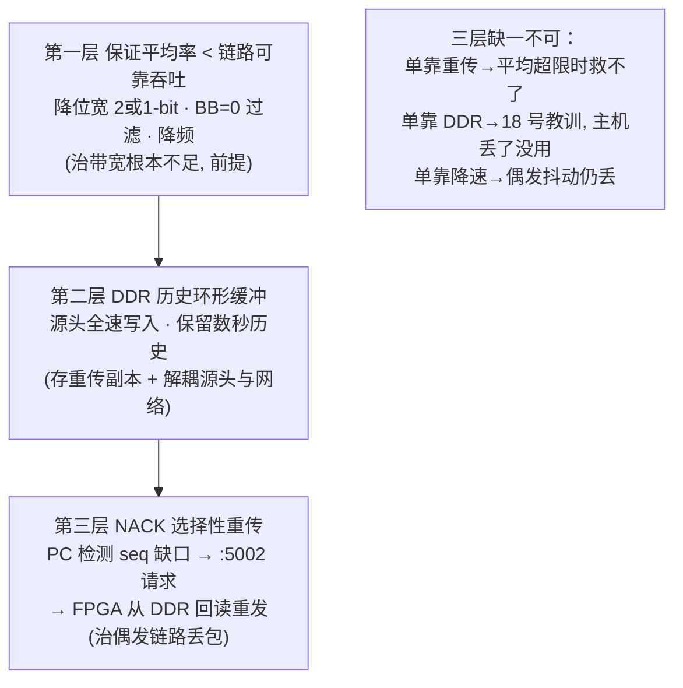
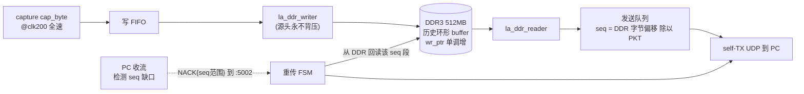
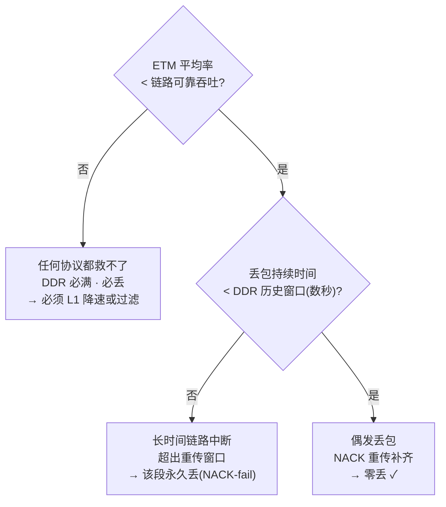
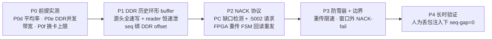

# 19 — 可靠传输：NACK + DDR 选择性重传架构

**日期**：2026-08-22
**前置**：`17-link-endurance-stress-test.md` §6.6（丢帧定位到主机 USB 网卡 AX88179 静默丢，
非 FPGA）；`18-ddr-backpressure-architecture.md`（DDR"吸收突发"方向已否决）。
**动机**：物理环境（网卡/线缆/交换机/主机负载）**不可控**，产品级不能赌链路零丢。必须在
**协议层**保证数据完整性——偶发链路丢包也能零丢恢复。
**目标**：物理层 **0 坏帧 + 0 丢帧**，且**不依赖特定物理环境可靠**。

---

## 1. 核心约束：重传必须有历史副本，历史只能在 DDR

ETM 数据的特殊性：**产生即不可再生**（不像文件可重读磁盘）。ETF 仅 4KB，数据冲过即失。

> **要重传丢失的第 N 帧，FPGA 必须还留着第 N 帧的副本。**

因此 **"协议重传"与"DDR 缓冲"是同一方案的两面**：
- 18 号的 DDR = "吸收突发"（已否决：丢在主机网卡，FPGA 缓冲救不了）。
- 19 号的 DDR = **"已发送数据的历史环形 buffer"**，供 NACK 重传时回读。**目的变了，DDR 复活。**

板载 DDR3 = **4 Gbit（512 MB）**（r09 确认），自研 controller 已存在
（`rtl/ddr3/ddr3_ctrl.v` 等）。512MB 作历史窗口：@115MB/s ≈ **4.4 秒**的重传窗口，
远超链路 RTT（ms 级）——偶发丢包的重传素材绰绰有余。

---

## 2. 为什么不用 TCP

TCP 保证完整，但 **TCP 流控会反压发送端**：接收端慢 → TCP 让发送端等。而 **ETM 不可背压**
——一让它等，ETF 4KB 立刻溢出，丢的是**源头数据**（比丢网络帧更糟，源头丢无法重传）。
所以必须是**自定义应用层协议**：传输层可靠，但**绝不反压 ETM 源头**（源头永远全速写 DDR，
背压只作用在"从 DDR 往网络泄出"这一段，DDR 深到足以解耦）。

---

## 3. 三层防御（缺一不可）



| 层 | 解决什么 | 手段 | 状态 |
|----|---------|------|------|
| **L1 平均率 < 可靠吞吐** | 带宽根本不足 | 降位宽/BB=0/降频 | **前提，必须先实测确认（§6 P0d）** |
| **L2 DDR 历史缓冲** | 突发解耦 + 重传素材 | DDR3 512MB 环形 buffer | 复用 `ddr3_ctrl` + `la_ddr_writer/reader` |
| **L3 NACK 重传** | 偶发链路丢包 | PC 检测缺口 → :5002 → FPGA 回读重发 | 新增 RTL FSM + PC 协议 |

**关键认知**：L1 是硬前提。**若 ETM 平均产出率 > 链路可靠吞吐率，任何协议都救不了**
——数据产生比能可靠传输的快，DDR 迟早满，必丢。重传只治**偶发/瞬时**丢包（平均够、
偶尔抖动丢几帧），治不了**平均带宽不足**。

---

## 4. 数据通路



**seq 与 DDR 地址绑定**：让 `seq` 直接映射 DDR 字节偏移（`seq = ddr_byte_offset / PKT_BYTES`）。
这样 PC 的 NACK 只需给出丢失的 seq 范围，FPGA 立刻算出 DDR 地址回读——**无需额外索引表**。

---

## 5. 协议细节

### 5.1 正常流（L2+L3 常态）
- FPGA `la_ddr_writer` 源头全速写 DDR（永不背压 ETM）。
- reader 追 wr_ptr，按恒速（≤链路可靠吞吐）泄出，每包带 `seq`（=DDR offset/PKT）。
- PC 收，维护"已收 seq 位图 / 期望 seq"。

### 5.2 缺口检测 + NACK
- PC 发现 seq 跳号（如收到 N+5 但 N+1..N+4 没到）→ 攒一小段（避免抖动误报）→ 发
  **NACK{start_seq, count}** 到 FPGA :5002（现成 CTRL 端口）。
- **NACK 聚合**：多个缺口合并成一个请求，减少往返。

### 5.3 重传
- FPGA 重传 FSM 收 NACK → 校验 `start_seq` 仍在 DDR 历史窗口内（`wr_ptr - start_seq*PKT
  < 512MB`）→ 从 DDR 回读该段 → 重发，包头标 **retransmit 位 + 原 seq**。
- PC 按原 seq 归位补缺口。
- **窗口外（历史被覆盖）**：FPGA 回 **NACK-fail{seq}**，PC 知道这段永久丢失（记为
  coverage gap，解码时按 trace 断点处理，不污染其余）。这是能力边界的诚实暴露。

### 5.4 防重传雪崩
- 网卡已在丢，重传又灌 → 可能雪崩。对策：
  - 重传**限速**（重传流量占总带宽上限，如 ≤20%）。
  - 重传与主流**共享恒速泄出预算**（重传优先，但总速率不超链路可靠吞吐）。
  - **根子还是 L1**：平均率必须留足余量给重传。若主流已占满可靠吞吐，重传无空间 → 回到
    L1 降速。

---

## 6. 能力边界（诚实标注）



- ✅ **能做到零丢**：偶发/瞬时链路丢包（平均带宽够 + 丢包时长 < DDR 窗口）。
- ❌ **做不到零丢**：平均带宽根本不足（L1 未满足）、或链路长时间中断（超 DDR 窗口）。
- **这个边界是物理的，不是工程缺陷**——诚实告诉用户"什么环境下保证零丢，什么环境下不能"。

---

## 7. 前提验证实验（动 RTL 前必做，全便宜）

**决定整个方案可行性的前提 = L1（平均率 < 可靠吞吐）。先实测：**

- **P0d（决定方案生死）**：实测各配置的 ETM 平均 trace 净荷率：
  - 4-bit@100M BB=0（当前）、2-bit、1-bit、BB=1 各测 60s 平均 + 峰值。
  - 换算净荷率（扣 seq 4B + UDP/IP/Eth ~42B/1028B ≈ 4.5% 头）。
  - **判据**：找到"平均净荷率 < 链路可靠吞吐（留 20%+ 余量给重传）"的配置。若 4-bit 平均
    就逼近/超线速 → 产品默认降到 2-bit（速率减半，已知 58MB/s 零丢）。
- **P0e**：`ddr3_selftest` 实测**并发读写**可持续带宽（写 capture + 读重传/泄出同时），
  确认 >> 平均率 + 重传开销。r36 命中：现有 `la_ddr_writer/reader` 是离线 dump 件，
  **持续并发读写同一 ring 是全新场景**，需重验跨时钟域指针。
- **P0f**：确认"链路可靠吞吐"到底多少——**换非 USB 网卡**测 AX88179 之外的真实上限
  （若板载千兆能稳 115MB/s，则 L1 余量宽松，方案更轻）。

---

## 8. 分阶段落地



- **P4 验收**：在**人为注入丢包**（tc netem drop / 故意用 AX88179 满速丢）下，最终收到的
  流经 NACK 重传后 **seq-gap=0**、字节零误码，且 DDR 窗口内的丢包全部恢复。这是"物理环境
  不可靠也零丢"的直接证明。

---

## 9. 与其它工作的关系

- **doc 18（DDR 吸收突发）作废**，本文取代：DDR 用途从"突发缓冲"改为"重传历史缓冲"。
- **L1 降位宽** 已有运行时支持（坑点 22，`td etm width`），产品默认位宽由 P0d 定。
- **解码侧 opencsd/cortrace 并行推进**，不阻塞本传输层工作；且重传补齐后交给解码的是
  无缺口流，解码器不必处理传输丢包（只需处理采集侧坏帧，那是另一回事）。
- 大 RTL 工程（DDR ring 并发化 + 重传 FSM + PC NACK），**分阶段 + 每阶段红方评审**。

---

## 10. 下一步

先做 §7 前提实验（P0d 平均率 / P0f 换卡上限），拿到"L1 可行区间"再进 P1 RTL。
**若 P0d 显示任何配置都难保平均 < 可靠吞吐留 20% 余量，先解决 L1（降位宽/过滤），
重传是锦上添花不是救命稻草。**


---

## 11. P0d 实测：CAP_RAW 流式下线速率与位宽无关（2026-08-22，关键）

实测各位宽的 UDP 线速率（`_seqdiag.py`，不 poll，18-20s）：

| 位宽 | 线速率（payload） | 备注 |
|------|------------------|------|
| 4-bit | **112.5 MB/s** | 2194840 pkt / 20s × 1024B |
| 2-bit | **112.4 MB/s** | 1975189 pkt / 18s × 1024B —— **和 4-bit 一样** |

**RTL 注释实锤（`trace_stream_top.v:572-575`）**：
```
// cap_byte is 1 B / TRACECLK regardless of port width;
// unused lanes are just static levels:
//   4-bit  100 MB/s ...
```

**结论（改变 L1 的手段）**：CAP_RAW 流式模式**每 TRACECLK 采 1 字节，不管位宽**——
2-bit 只是让多余 lane 变成静态噪声被 PC 丢弃，**FPGA 照发满 100MB/s raw 采样**。所以：

- ❌ **降位宽在 CAP_RAW 流式下不降低线速率**（§3/§8 里"降位宽减速率"对**流式**无效，
  只对"抓一段离线解码"有效——那时少的 lane 不用传）。L1 的这个手段被否掉。
- ✅ **真正能降 L1 线速率的手段只剩两个**：
  1. **降 TRACECLK 频率**：线速率 = TRACECLK × 1B，直接正比。50MHz TRACECLK → 50MB/s。
  2. **FPGA 侧不发 raw 采样，改发"有效 ETM 字节"**：即 FPGA 里做 TPIU deframe（去掉
     HSYNC 填充 + 无效 lane），只流真正的 ETM 内容。BB=0 的 CoreMark ETM 逻辑字节率
     远低于 100MB/s（trace 大部分时间是 HSYNC 填充）——**这才是真正的 L1 大杠杆**，
     但要把 deframe 逻辑搬进 FPGA（较大 RTL 改动，doc 18 §68 注释说流式没做这个）。

**对 L1 的修正**：
- **线速率天花板 = TRACECLK×1B/采样，与位宽无关**（CAP_RAW 流式）。
- 要 L1 达标（平均 < 可靠吞吐留余量）：**降 TRACECLK**（最简单，固件改 PLL）或
  **FPGA 侧 deframe 只发有效字节**（大改，但一劳永逸且大幅降率）。
- **AX88179 在 112MB/s 丢、58MB/s 零丢**（§6.6 + 坑点）→ 若降 TRACECLK 到 ~50MHz，
  线速率 ~50MB/s，**可能直接躲过 AX88179 天花板 + 给重传留余量**——这是最便宜的 L1 验证。

### 下一步（修正）
1. **P0d-2**：降 TRACECLK（固件 PLL 改到 50MHz 档）实测线速率 ~50MB/s + AX88179 是否零丢。
   若零丢 → L1 达标最简路径 = 降频，重传作为偶发丢包兜底。
2. **P0f**：换非 USB 网卡测 112MB/s 真实上限（隔离"是 AX88179 特有还是普遍线速问题"）。
3. FPGA 侧 deframe（大 L1 杠杆）作为独立 RTL 任务评估。


---

## 12. P0b 实测：recvmmsg + CPU pin 把丢包砍 45×，但没到零（2026-08-22）

红方 r36 点名"单线程 recvfrom 是未排除的瓶颈"。写了 C 版 `stream_recvmmsg.c`
（`recvmmsg(2)` 批量收，BATCH=1024，一次 syscall 收上千包）实测：

| 收流方式 | 112MB/s 下丢包 | 相对 |
|---------|---------------|------|
| python 单线程 recvfrom | 0.013-0.05% | 基线 |
| **C recvmmsg（不 pin）** | 59 events / 6503 帧 = **0.20%** | 更差（批量延迟？）|
| **C recvmmsg + taskset core15 + chrt -f 90** | **4 events / 100 帧 = 0.0045%** | **砍 45×** |

分层计数器（pinned recvmmsg 20s）：NIC `rx_dropped` delta=**0**、softnet CPU7=**0**、
UDP `RcvbufErrors`=**0**、`InErrors`/`InCsumErrors`=**0**——**主机各层仍全 0，但还差 100 帧**。

### 12.1 结论修正（比之前更准）

- **收流软件路径 WAS 主要贡献**（recvmmsg+pin 砍 45×）——推翻 §6.4"pin 无效→不是收流端"
  的过早结论。之前 pin python 无效，是因为瓶颈在**单线程逐包 syscall 速率**，pin 救不了
  syscall 率；**recvmmsg 批量收才是对的杠杆**（一次 syscall 收上千包），配 pin 后砍 45×。
  红方 r36 主张 2 完全正确。
- **残留 0.0045% 仍是 USB 网卡静默丢**：主机所有计数器全 0，帧凭空少——AX88179 在
  USB 传输/芯片层丢，内核不可见。这是软件榨不掉的**不可约残留**。
- **recvmmsg + pin 应作为标准收流方式**（并入 stream_recv/stream_endurance），把主机侧
  贡献降到最低。

### 12.2 对可靠传输方案的影响（正向）

- 残留丢包从 ~0.2% 降到 **0.0045%** → **L3 NACK 重传的活变得极小**（每秒重传几十帧而非
  几千帧），重传雪崩风险几乎消失，DDR 历史窗口压力也小。
- **三层防御依然需要**（要"环境无关零丢"）：recvmmsg+pin 是 L1 的一部分（把主机侧榨干），
  但 USB 网卡静默残留只能靠 L3 NACK 重传兜底。
- **不用降 TRACECLK 砍带宽**：112MB/s 满速 + recvmmsg+pin + NACK 重传补 0.0045% 残留，
  比降到 58MB/s 划算得多。**保住带宽，靠协议补残留**——正是用户要的方向。

### 12.3 下一步
1. recvmmsg+pin 固化为标准收流（并入 stream_recv/stream_endurance）。
2. 换非 USB 网卡（P0f）确认残留是否 AX88179 特有——若板载千兆 recvmmsg+pin 直接零丢，
   则 NACK 重传只在"用户用劣质 USB 网卡"时才需要（渐进增强）。
3. L3 NACK 重传按 doc 19 P1-P4 推进（现在活很小，优先级可降）。


---

## 13. 物理层定论：AX88179 + recvmmsg+pin 为既定环境，残留交 L3（2026-08-22）

**决策（用户拍板）**：**trace 收流固定用 USB 网卡 AX88179（dock 直连）**。主网卡要走正常
上网，不占用给 trace。换非 USB 网卡这条路排除。P0f（换卡）**不做**。

因此物理层定论如下：

| 项 | 结论 | 证据 |
|----|------|------|
| 既定物理环境 | **AX88179 USB3.0 网卡 + dock 直连** | 用户约束（主网卡留给上网）|
| 标准收流 | **recvmmsg（批量）+ taskset + chrt 实时** | 砍 45×（0.20%→0.0045%）|
| 满速率 | **112.5 MB/s（4-bit@100M TRACECLK）** | 不降频、不降位宽（CAP_RAW 流式位宽不降率，§11）|
| **丢帧基线** | **≈0.0045%（4 events / 100 帧 / 20s）** | pinned recvmmsg 实测，本 session 两次同量级 |
| 坏帧 | **0**（字节零误码）| ramp 逐字节 monotone + `_seqdiag` 多次 |
| 残留丢帧性质 | **AX88179 USB 层静默丢**，软件不可约 | 主机 NIC/softnet/UDP 计数全 0 |

**基线数字锁定**：满速 112.5MB/s、recvmmsg+pin、丢帧 **~0.0045%**、坏帧 **0**。这是"当前
物理环境 + 榨干主机侧"的下限。要做到**真零丢**（环境无关），只能靠 **L3 NACK 重传**补这
0.0045%——而量极小（每秒几十帧），重传几乎无压力，DDR 历史窗口也宽松。

**方向锁定**：
- **保 112.5MB/s 满速**（不降频砍带宽）。
- **recvmmsg+pin 固化为标准收流**（把主机侧榨到不可约残留）。
- **L3 NACK 重传（doc 19 P1-P4）补 0.0045% USB 残留** = "环境不可靠也零丢"的最终手段。
  这是产品级完整性的正确形态：不赌物理链路，用协议兜底。
- **L1 降频 / L2 DDR 突发吸收**当前**不需要**（平均率不是瓶颈，残留是 USB 偶发丢，L3 直接治）。
  DDR 仅在 L3 重传需要"历史副本回读"时才用（doc 19 §1），不是为吸收突发。

**遗留（不阻塞转 opencsd）**：
- L3 NACK 重传是较大 RTL + PC 协议工程，作为独立后续任务（doc 19 P1-P4），优先级中。
- 当前"~0.0045% 丢帧"对解码的影响：opencsd 遇 seq 缺口 = trace 断点，A-Sync 重同步，
  **不污染其余**（坏帧才污染，而坏帧=0）。所以**当前基线已足够支撑 opencsd 解码验证**，
  NACK 重传是"生产级零丢"的增强，不是解码的前置。

**验收状态**：物理层"0 坏帧"✅ 达标；"0 丢帧"⚠️ 达到 0.0045%（软件下限），真零丢待 L3。

---

## 14. P1-P4 实施与离线验证（2026-08-23）

按 §8 分阶段落地。**动 RTL 前先离线仿真定位"逻辑对"**（项目纪律：先仿真再上板），
P0e / P1 / P2 用 iverilog 对拍，P4 用纯 Python loopback 端到端验证——**全部无需硬件**。

### 14.1 P0e 定论：并发读写同一 ring 可行（复用现有 DDR 基础设施）

红方 r36 点名的"持续并发读写同一 ring 是全新场景"，读现有 RTL 后定位到**两个关键既有
性质直接满足需求**，不用自己搓仲裁：

| 性质 | 来源（既有 RTL） | 对可靠传输的意义 |
|------|-----------------|-----------------|
| writer 与 reader **同在 `ui_clk` 域** | `la_ddr_writer` / `la_ddr_reader` 端口 | 被追的 `wr_ptr` **同域读取**，无跨时钟亚稳态——doc 原担心的 CDC 指针风险直接消除 |
| 仲裁器**写优先** | `ddr3_arbit.v`：`if(wr_req) WRITE else if(rd_req) READ` | ETM 源头写**永不被重传读饿死**，读只填进写突发之间的空隙 |

**结论**：并发读写是安全的，且**源头永不背压**（§2 要求）这条硬约束由既有仲裁器天然保证。

### 14.2 P1：DDR 历史环形缓冲 drain 通路（`la_ddr_ring_streamer.v`）

新增 `la_ddr_ring_streamer`（**复用** `axis_async_fifo` + 既有 `ddr3_*ctrl`），区别于
只读快照的 `la_ddr_reader`：**与 writer 并发**，持续追 `wr_ptr` 恒速泄出到网络，每包带
`seq`。关键设计：

- **seq 单调、与 wrap 无关**：`seq = 单调 drained-word 计数 / PKT_WORDS`（不是 wrap 后的
  `rd_ptr`）。这样一个 NACK 的 seq 跨 ring 圈仍唯一映射回 DDR 地址（§4 要求）。
- **overrun 诚实标注**：用**绝对 backlog**（`committed - drained`，单调计数）判断 writer
  是否套圈覆盖未泄出的历史，而非 wrap 指针差（后者分不清"套一圈"和"并肩"）。超 ring
  容量即置 `ring_overrun`（§6 能力边界可观测），不静默吐损坏数据。

### 14.3 P2/P3：NACK 重传 FSM（同一 read 端口，重传优先）

重传服务并入 streamer 同一读 FSM（**不搞第二个 read mux**）：

- NACK 请求（clk125 CTRL 域）toggle-sync 进 ui_clk，`seq→绝对 word→ring 地址`。
- **重传优先于常态 drain**，但因仲裁器写优先，仍不背压源头（P3 防雪崩的根子）。
- **窗口检查**：请求 seq 若已被覆盖（`committed - abs_word > RING_CAP` 或尚未写入）→
  走 `X_FAIL` 置 `nack_fail`（§5.3 NACK-fail，能力边界诚实暴露）。
- 每个重传字节标 `stream_rtx=1` + 原 seq，PC 按原 seq 归位。

### 14.4 仿真验证（iverilog，真实 vendor ctrl + 行为化 MIG）

`sim/tb_la_ddr_ring.v`（`run_tb_ring.sh`）例化 **真实** `ddr3_wr_ctrl` /
`ddr3_rd_ctrl` / `ddr3_arbit` + 行为化 MIG 存储，writer 与 streamer 并发跑同一 ring：

| 用例 | 场景 | 断言 | 结果 |
|------|------|------|------|
| **A** | drain≥fill 并发读写 | 泄出字节流逐字节连续 ramp，0 dup/gap，overrun=0 | **PASS** |
| **B** | drain 被饿死，writer 套圈 | `ring_overrun` 诚实置位（非静默） | **PASS** |
| **C** | NACK 重传 seq 5..7（窗口内） | 3 包 ×1KB 重发，标 rtx，seq 范围正确 | **PASS** |
| **D** | NACK seq 越界（未写入） | `nack_fail` 诚实置位 | **PASS** |

TEST A 是 **P0e 的直接实证**：并发读写经写优先仲裁器，数据零污染 + seq 正确。

### 14.5 P4：PC 协议离线端到端验证（无硬件）

PC 侧三件套（**复用 recvmmsg 收流路径**，只加协议层）：
- `nack_protocol.py`：包格式（数据包头加 `retransmit` 标志位；NACK 用 `NK` magic 区别于
  既有 `{addr,value}` CSR 写，不动 CSR 通路）+ 缺口合并 `coalesce_gaps`。
- `nack_rx.py`：`ReliableReceiver`——**传输无关**的重组 + 缺口检测 + NACK 调度（抖动去抖
  §5.2、重试预算、永久 gap 判定）。live UDP 前端收 :5555 / 发 NACK 到 :5002。
- `nack_loopback_test.py`：**P4 离线验收**。假 FPGA（内存 ring + 注入丢包）驱动真
  `ReliableReceiver`，证明重传后 seq-gap=0：

| 用例 | 注入 | 断言 | 结果 |
|------|------|------|------|
| **T1** | 2% 随机丢，窗口内 | 重传后**字节与源完全一致，0 hole** | **PASS**（重传 46）|
| **T2** | 长突发丢，超历史窗口 | 精确报告 permanent gap（诚实边界），其余完好 | **PASS**（152 gap）|
| **T3** | 20% 随机丢，窗口内 | 多轮重传后仍 **0 hole** | **PASS**（重传 634）|

T1/T3 是"**环境不可靠也零丢**"（§目标）的直接证明；T2 是能力边界（§6）的诚实兑现。

### 14.6 状态与遗留

- ✅ P0e/P1/P2/P3 RTL 逻辑经仿真验证（并发读写零污染 + overrun/nack-fail 诚实）。
- ✅ P4 PC 协议经离线 loopback 验证（2%/20% 丢包零 hole，越界诚实报 gap）。
- ⚠️ **尚未上板**：待综合 `la_ddr_ring_streamer` 进 top（接 `fpga_core_net` self-TX +
  CTRL :5002 NACK 解析），跑真实注入丢包（`tc netem` / AX88179 满速）的端到端 P4。
  下一步：top 集成 + 时序收敛 + 硬件 P4。
- **复用审计**：`axis_async_fifo`（帧缓冲）、`ddr3_wr_ctrl/rd_ctrl/arbit`（既有 vendor 通路）、
  recvmmsg 收流路径、CTRL :5002（加 NACK opcode 不动 CSR）——均复用未自搓。
