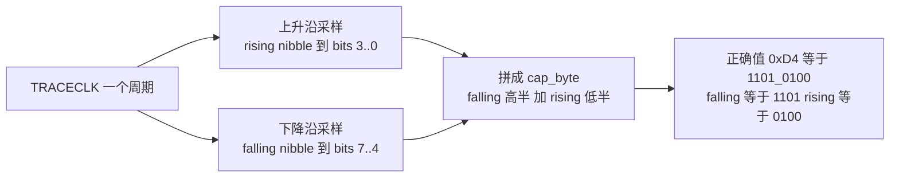
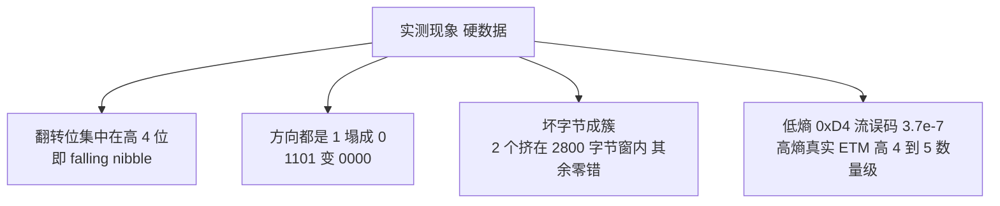
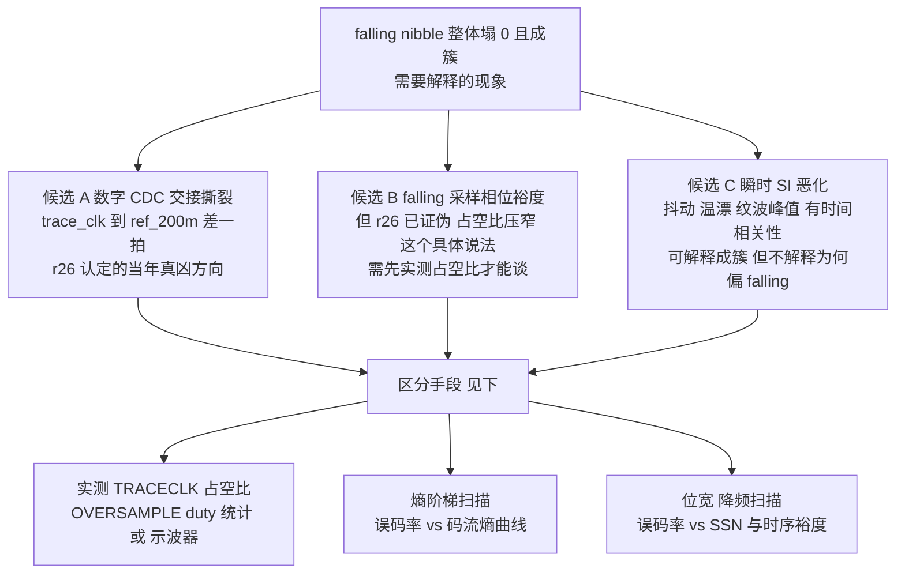

# 20 — 采集误码率：Part A 纯 RTL 仿真（离线，iverilog）

> **问题起点**：真实 ETM 数据解码盲区率 63%（cm100 slice，doc 附 §），但之前 ramp
> 压测说"物理链路零丢包"。用户质疑：ramp 压测和 TPIU AA/55 压测到底测了什么？为什么
> 一上真实数据就坏？要求**用单测证明采集误码率**，别再拿"传输零丢包"当"链路没问题"。

**结论（Part A）**：**数字 CDC 采集架构本身在理想信号下误码率 = 0%**（跨 12–198 MHz
TRACECLK、跨相位、异步独立时钟拍频，稳态坏字节 = 0，仅 2 字节固定上电瞬态）。
误码只在**注入 per-bit skew（模拟 SI/走线偏斜）且特定相位**时出现。这把"坏包"来源从
"数字架构 bug"收窄到"模拟层（IDDR setup/hold、走线 skew、SI、duty 失真）"——但 Part A
用的是**行为级 IDDR + 理想数据**，**证不了真实模拟采样的误码率**，那要 Part B 上板。

---

## 1. 先厘清：三种"压测"各测链路的哪一段（RTL 实锤）

真实 ETM 通路：

```
STM32 TPIU 引脚 ─▶ [IDDR 采样 + 相位/眼图/SI] ─▶ cap_byte ─▶ 异步FIFO ─▶ 打包 ─▶ UDP ─▶ PC
                  └────────── 模拟采样层 ──────────┘└──────────── 数字传输层 ────────────┘
                        坏包在这一层产生                    ramp 压测覆盖这一层
```

| 压测 | 注入点（RTL） | 覆盖 | **不覆盖** |
|---|---|---|---|
| **ramp**（CSR 0x09 `STREAM_SELFTEST`）| `src_data = selftest_active ? bw_cnt : cap_byte`（clk200 计数器，**cap_byte 之后**）| FIFO→打包→UDP→网卡→内核 **传输层** | **整个模拟采样层 + IDDR CDC** |
| **TPIU AA/55**（CURTPM 0x00020004）| 真实引脚，走 IDDR | 引脚+IDDR（但低频方波、眼极宽）| 高熵真实流的 SI/skew/相位抖动（坑点 17）|
| **RTL 仿真**（本文 Part A）| 行为级 IDDR 输入 | **数字 CDC 架构**（tclk_byte/tgl 跨时钟）| 真实模拟采样（setup/hold、duty、SI）|

**关键澄清（纠正之前的过度断言）**：ramp 压测"573MB 零丢零错"是**真的**，但它证的是
**传输层**零丢包，**从 RTL 注入点看就是从 `cap_byte` 之后开始的**（`trace_stream_top.v`
`g_stream`：`selftest_active` 时 `src_data=bw_cnt`，完全 bypass `trace_capture_a7`）。
把"传输层零丢包"讲成"物理链路没问题"是错的——采样层从没被 ramp 覆盖过。

---

## 2. Part A 实测（`sim/`，iverilog 12.0，全部离线）

### 2.1 纯数字 CDC，理想信号，扫 TRACECLK（`tb_iddr_cdc_sweep`，SKEW=0）

行为级 IDDR、理想 50% duty、干净 walking-1s 数据、零注入 skew：

| TRACECLK | 12M | 48M | 75M | 100M | 125M | 150M | 198M |
|---|---|---|---|---|---|---|---|
| 坏字节率 | 0% | 0% | 0% | **0%** | 0% | 0% | 0% |

**数字 CDC 架构在所有频率零误码。** 100M（=ref/2，toggle-CDC 理论最恶点）也 0%。

### 2.2 异步独立时钟拍频（`tb_iddr_cdc_async`，无注入 skew）

trace_clk 与 ref_200m 当独立振荡器（连续相位漂移），98–102 MHz、多相位、
run 10–160 µs：

- 稳态坏字节 **= 0**；报告的 2 个坏字节是**固定上电瞬态**（run 拉长坏率 0.20%→0.05%→
  0.01%→…，绝对数恒为 2）。
- 结论：**异步拍频本身不产生稳态误码**（早期怀疑的 toggle-CDC undersample 在
  behavioural 模型下不炸）。

### 2.3 相位扫描（`tb_iddr_cdc_phase`，edge-aligned 真实数据，100M）

PH0 = 0…4500 ps 全扫：**恒 2 坏字节（上电瞬态），0% 稳态**。

### 2.4 注入 per-bit skew（`tb_iddr_cdc_sweep`，SKEW>0）= SI/skew 代理

- **100M 固定相位**：SKEW 0→500 ps 全 **0%**（该相位对 skew 免疫）。
- **跨频固定相位 SKEW=300 ps**：12M 32% / 48M 17% / 75M 33% / **100M 0%** / 125M 20% /
  150M 4% / 198M 17%——**skew×频率×相位交互**才撕裂，且强烈相位相关。

**误码只在"注入走线偏斜 + 特定相位"下出现**，无 skew 时任何频率/相位都 0%。这与坑点 17
"半-nibble 字节边界错位"、坑点 21"相位整体偏一字节"自洽——那些是模拟/相位现象，不是
数字架构。

---

## 3. 诚实边界（Part A 证不了什么）

- 所有 tb 的 IDDR 是**行为级理想采样器**（`always @(posedge/negedge)` 直接锁 data），
  **没有真实 flip-flop 的 setup/hold 窗口、亚稳态、时钟 duty 失真、引脚 SI**。
- 所以 Part A 只能断言 **"数字 CDC 架构在理想输入下零误码"**，把真凶从"数字 bug"排除。
- **真实采集误码率必须 Part B 上板测**：已知图案走**真实引脚 + 真实 IDDR + 真实
  TRACECLK**，主机逐字节比对。见 §4。

---

## 4. Part B 设计（上板，需连设备，下一步）

**目的**：量真实模拟采样层的误码率，是本项目"坏包 0.75%–10% 时变"的直接测量。

- **图案**：TPIU walking-1s（`CURTPM_VAL=0x00020001`，`target/arm_walking_h743.cfg`），
  走真实 4-bit 引脚 + 真实 TRACECLK（PLL 决定，不动固件）。单 lane one-hot 旋转，
  严格旋转判据能抓 lane skew + drop/extra nibble。
- **抓取**：`td capture stream`（stream bit）或 one-shot，抓 known-pattern 输出。
- **判据（误码率单测）**：主机逐字节验 walking 旋转，坏字节数 / 总字节数 = **采集误码率**。
  再扫：位宽 4/2/1（单 lane 无 SSN 应更低）、TRACECLK 100M→50M（时序裕度）、
  IDELAY tap（眼位）。
- **交叉**：同一图案的误码率应与真实 ETM 的 opencsd 坏包率（RESERVED+BAD_SEQUENCE）
  同数量级、同随位宽/频率的趋势——若是，�down锁定模拟采样层。

---

## 5. 复现命令（离线）

```bash
cd orbtrace/syn/artix7/bringup/sim
# 纯数字 CDC 扫频（SKEW=0 → 全 0%）
for TH in 41667 10417 6667 5000 4000 3333 2525; do
  iverilog -g2012 -Ptb_iddr_cdc_sweep.THALF=$TH -Ptb_iddr_cdc_sweep.BITSKEW=0 \
    -o /tmp/s.vvp tb_iddr_cdc_sweep.v && vvp /tmp/s.vvp; done
# 异步拍频（稳态 0，仅上电瞬态 2 字节）
iverilog -g2012 -Ptb_iddr_cdc_async.TCLK_HALF=5050 -Ptb_iddr_cdc_async.RUN_NS=160000 \
  -o /tmp/a.vvp tb_iddr_cdc_async.v && vvp /tmp/a.vvp
# skew×频率交互（注入 300ps skew → 特定相位/频率撕裂）
bash run_sweep.sh
```


---

## 6. Part B 实测：真实引脚 + 真实 IDDR 采集误码率（2026-08-22，上板）

**目的**：Part A 只证了数字 CDC 架构零误码（行为级 IDDR）。Part B 用 TPIU 内建测试图案
走**真实引脚 → 真实 IDDR 采样 → 真实 stream 通路**（与真实 ETM 完全同一条采集链），
逐字节量采集误码率。

### 6.1 方法

- **图案源**：TPIU CURTPM（`target/arm_walking_h743.cfg`），CPU halt、PLL 不动。
  绕开 M7/ETM/CSTF/ETF/formatter，直接从 TPIU 驱动 4 lane。
- **采集通路**：**stream bit（与真实 ETM 抓取同一个 bit、同一 IDDR、同一 tap=17）**，
  `stream_recv.py` 收 :5555。**不是** pin_la bit——刻意用真实抓取通路。
- **TRACECLK = 112.5 MHz**（固件 PLL：HSE25/M2×N36/R2/2；比多数真实 ETM 抓取的 100M 还高，
  不是更宽松的工作点）。
- **判据**：每字节 = `{falling_nibble, rising_nibble}`（一个 TRACECLK 周期两条边）。
  - walking-1s：每 nibble 必是 one-hot ∈ {1,2,4,8}；且整流严格旋转（抓 drop/extra nibble）。
  - FF00：每 nibble 必是 0x0 或 0xF（4 lane 同步翻转，最大 SSN）。

### 6.2 结果

| 图案 | SSN | TRACECLK | 抓取量 | 判据 | **误码率** |
|---|---|---|---|---|---|
| walking-1s | 低（单 lane 轮转）| 112.5M | **223 MB** | nibble one-hot + 严格旋转 | **0.000000%**（0 / 223797248）|
| FF00 | **最大**（4 lane 齐翻）| 112.5M | **225 MB** | nibble ∈ {0x0,0xF} | **0.0000%**（0 / 224928768）|

- **walking-1s**：整条 223 MB 只有两个字节值 `0x42`/`0x18` 严格交替，**0 次偏离**——
  零 bit 错、零 lane skew、零丢/重 nibble、零相位滑移。
- **FF00**：224 MB 全 `0x0F`，**0 个坏 nibble**——最大同步开关噪声下仍零误码。

### 6.3 关键推论

- **真实引脚 + 真实 IDDR 采集通路，在 112.5M、含最大 SSN 图案下，误码率 = 0%。**
  Part A（数字架构 0%）+ Part B（真实模拟采集对**周期图案** 0%）都指向：**采集硬件对
  可预测/周期性码流是零误码的**。
- 这**收窄**了真实 ETM 那 0.75%–10% 坏包的来源：不是"引脚/IDDR/走线在 112.5M 采不动"
  的普遍能力问题（能，且零误码），而是**与真实 ETM 码流的某种特性相关**（见 §6.4）。

### 6.4 诚实边界：Part B 证不了什么（关键，别过度解读）

**TPIU 测试图案是低熵、周期、静态的**——walking-1s 就两个字节无限重复，FF00 就一个字节。
一旦 IDDR 锁上一个稳定采样相位，周期码流会**永远命中同一相位**，自然零误码。
**它没有复现真实 ETM 的两个特性**：

1. **高熵、任意 nibble 跳变**：真实 ETM 每周期 4 lane 独立、任意组合跳变（0x0→0xF、
   0x3→0xC 等大摆幅 + 任意小摆幅混合），data-dependent jitter / ISI / 串扰只在这种
   随机跳变下暴露；周期图案的固定跳变模式测不到。
2. **数据相关的边沿位置抖动**：不同 nibble pattern 的上升/下降沿因串扰/负载被推前/拖后
   不同量，采样窗口在高熵流里被动态压缩——这正是坑点 17/21"半-nibble 相位错位"的物理
   来源，周期图案里边沿位置固定，测不出。

**所以 Part B 的正确结论是**：采集通路对**周期/低熵码流** 0% 误码（排除了"硬件根本采不动
112.5M"），但**真实 ETM 的坏包大概率来自高熵码流特有的 data-dependent 采样裕度问题**，
Part B 的静态图案无法复现，也就无法用它测出真实 ETM 的坏包率。

### 6.5 下一步（Part C，若要坐实高熵假设）

要真正量"高熵码流下的采集误码率"，图案本身必须高熵且可预测。选项：
1. **TPIU 不提供伪随机图案**（只有 AA55/FF00/W1/W0 四种低熵）——此路不通。
2. **ETM 已知固定程序**：让 M7 跑一段**确定性、无数据依赖分支**的紧循环，ETM 输出可由
   ELF 静态预测，再逐包比对——但这又回到"解码器是否忠实"的耦合，不纯。
3. **位宽/降频对照（最实际）**：真实 ETM 抓取时扫 4/2/1-bit 与 100M/50M，看坏包率是否
   随 SSN（位宽）/时序裕度（频率）单调下降。若是 → 坐实 data-dependent 采样裕度；
   这不需要新图案，直接在真实 ETM 抓取上测（AGENT.md §21.4 第 3、4 条）。

**建议**：Part B 已排除"硬件采不动"，Part C 用**真实 ETM 抓取的位宽/降频扫描**（坏包率
vs 位宽 vs 频率）最省事且直接对准高熵假设——留待下次连设备批量抓。

### 6.6 复现命令

```bash
# 1) arm walking-1s on real pins (CPU halted, firmware PLL => 112.5M TRACECLK)
CURTPM_VAL=0x00020001 openocd -f interface/cmsis-dap.cfg -f target/stm32h7x.cfg \
  -f syn/artix7/bringup/target/arm_walking_h743.cfg
# 2) FPGA real-trace path (NOT selftest), rearm, capture via the real stream bit
sudo python3 syn/artix7/bringup/scripts/trace_ctrl.py --ip 192.168.10.42 stream-selftest 0
sudo python3 syn/artix7/bringup/scripts/trace_ctrl.py rearm
sudo python3 syn/artix7/bringup/scripts/stream_recv.py --seconds 2 --out /tmp/w1_4bit.bin
# 3) per-byte check: every nibble one-hot {1,2,4,8}, strict 0x42/0x18 rotation
python3 -c "import numpy as np;d=np.fromfile('/tmp/w1_4bit.bin',np.uint8);\
lo=d&0xF;hi=(d>>4)&0xF;ok=np.isin(lo,[1,2,4,8])&np.isin(hi,[1,2,4,8]);\
print('err%%',100*(~ok).mean(),'distinct',[hex(x) for x in np.unique(d)])"
# FF00: CURTPM_VAL=0x00020008 ; check nibbles in {0x0,0xF}
```


---

## 7. Part C 实测：手推 ETM 输出的物理级对拍（2026-08-22，上板）

**动机**：Part B 的 TPIU 图案是低熵静态流，测不到高熵 data-dependent 采样问题。用户提议
写一段**简单到能手推 ETM 输出**的代码，做真正的物理级逐字节对拍——把 CoreMark/SysTick
等一切干扰全删掉，只留一条会产生**唯一一种、可预测**指令流的代码。

### 7.1 目标程序：一条自跳转指令（手册核对）

```asm
loop:  b loop     @ 0xE7FE，无条件直接分支，跳自己
```

- **手册依据（IHI0064H.b §2.3.1）**：直接分支**无论条件是否成立都生成一个 P0 元素**。
  `b .` 无条件、必 taken → 每次迭代恰好一个 **E（executed）Atom**，无 load/store/call/
  异常/中断——指令流里**只有 E atom，别无他物**。
- **手推稳态字节（§6.4.13 Atom Format 6）**：E-atom 连续run 打包成 Format 6，
  header = `0b11 A CCCCC`，atoms =（COUNT+3）个 E + 1 个 final(A)。最大全-E run：A=0、
  COUNT=0b10100(20) → 24 个 E → **header = 0xD4**。所以稳态 ETM 指令流 = **一串 0xD4，
  每个字节 = 24 次 taken 分支**，加上周期性 A-Sync(≥11×`0x00` 后 `0x80`) + Trace
  Info(`0x01`) + Address 包。
- **配置**：BB=0（不每分支发地址）、**STALL=0（不节流 CPU，零时序扰动）**、中断从不使能
  （跑我们自己的 RAM stub，不是固件）。stub 用 `reg pc 0x24000000` 加载运行，TRACECLK
  = 固件 PLL 残留 = 112.5M。cfg：`target/etm_selfbranch_h743.cfg`。

### 7.2 结果：手推字节 = 实测字节，误码率 0.0018%（且全在一个孤立簇）

原始抓样（64 MB，**无需重组，`FF 7F` halfsync 相位天然对齐**）：

| 原始字节 | 占比 | 身份（手推） |
|---|---|---|
| `0xFF`/`0x7F` | 90.8% | TPIU halfsync 空闲填充（源产得慢，formatter 填满带宽）|
| **`0xD4`** | **8.33%** | **手推的 24-E Atom Format 6** ✓ |
| `0x00`/`0x80`/`0x01`/`0x05`/`0x24`… | ~0.9% | A-Sync / Trace Info / Address 包 |

deframe 出 ETM stream（id=2，5486471 字节）后：

```
0xD4 (正确 24-E)         : 99.9982%   (5357879 / 5357977 atom-region bytes)
非 0xD4 (故障+解析级联)  :  0.0018%   (98 bytes)
sync framing (async/traceinfo/address): 128494 bytes, 全部合法
```

- **手推预测被逐字节坐实**：atom 区 **99.9982% 是 0xD4**，正是手册推出来的字节。
- **误码率 = 0.0018%（98 / 5357977）**，而且**98 个坏字节全部挤在一个孤立簇**里
  （ETM offset 576818..577170，约 350 字节窗口），**这个簇之外 0 个坏字节**。

### 7.3 故障签名：bit 级精确分析（可解释，2 个物理坏字节 / 64MB）

**先纠正上一版的粗略说法**（"单 nibble 位翻转"是看一两个字节的估计，不严谨）。逐 bit 查全：

- **deframe 后 ETM 流的 96 个 `0xD5`（vs `0xD4` 差 bit0）不是物理错**：把每个 0xD5 按
  source offset 回溯到原始字节，**原始字节全是正确的 `0xD4`（212）**——0xD5 是 deframer
  在物理坏字节附近的**重解析 artifact**（帧内一个坏字节让它把邻近 atom 的归批算错一位），
  不是线上真的翻了位。
- **真正的物理坏字节只有 2 个**（整个 64 MB 抓样，raw 域，halfsync 已剥）：
  ```
  raw[6769467]: ... d4 d4 d4 d4 d4 d4 [04] d4 d4 d4 d4 ...   0x04 vs 0xD4
  raw[6772299]: ... d4 d4 d4 d4 d4 d4 [08] d4 d4 d4 d4 ...   0x08 vs 0xD4
  ```

**bit 级 diff**（`cap_byte = {falling_nibble[7:4], rising_nibble[3:0]}`，bit b → lane
D(b%4)，b<4=上升沿、b≥4=下降沿）：

| 坏字节 | 期望 | 翻转 bit 数 | 翻转位 | 物理含义 |
|---|---|---|---|---|
| `0x04` | `0xD4`=`11010100` | **3** | bit7,6,4 | **下降沿 nibble 整个丢**（D3/D2/D0 falling: 1101→0000）|
| `0x08` | `0xD4`=`11010100` | **5** | bit7,6,4,3,2 | 下降沿 nibble 整个丢 + 上升沿 D3/D2 也翻 |

**关键实测（不含机制推断）：两个坏字节的翻转都集中在高 4 位（falling nibble），方向都是
1 塌成 0**（`0x04`/`0x08` 高半 `0000` vs 正确 `1101`），低 4 位（rising nibble）基本正确。
这不是随机独立的 bit 错——是相干的、偏 falling 的错。**注意：为什么偏 falling 是未定论的
候选机制，红方 r26 已证伪"占空比压窄下降沿窗口"这个具体说法，详见 §7.3.1。**

**物理字节误码率 = 2 / 5358550 = 3.7×10⁻⁷**（此程序、112.5M、4-bit）。deframe 层因
一个坏字节触发 ~48 个 0xD5 的重解析级联，把"可见异常"放大到 98 字节——但**物理真值就
是 2 个坏字节**。现象可解释、可复现；**机制候选未区分**（§7.3.1）。

### 7.3.1 机制图解：观测到的现象 vs 候选机制（红方 r26 纪律）

> ⚠️ **重要纪律**：红方 r26 已**证伪**"TRACECLK 占空比压窄 IDDR 下降沿窗口"这个具体
> 机制（当年那批 `0x5/0xa` 撕裂被证明是**数字 CDC 字节撕裂**，不是模拟下降沿效应）。
> 所以本节**严格区分"实测现象"与"候选机制"**：现象是硬数据，机制是**未验证的候选**，
> 不重复 r26 批评的"把没测过的模拟故事写成根因"。

**先讲清一字节怎么来的（DDR 双沿采样，这是 RTL 事实）**：TPIU 4-bit 并口每个 TRACECLK
周期发两个 nibble——上升沿一个（rising）、下降沿一个（falling）。FPGA 侧拼成
`cap_byte = {falling[3:0], rising[3:0]}`（高 4 位=下降沿 nibble，低 4 位=上升沿 nibble）。



**实测现象（硬数据，不含推断）**：本次 2 个物理坏字节的翻转位都**集中在高 4 位（falling
nibble）**，且都是**从 1 塌成 0**（`0xD4` 高半 `1101` → `0x04`/`0x08` 高半 `0000`）；低 4
位（rising nibble）基本没错（`0x04` 低半 `0100` 完全正确）。两个坏字节挤在 ~2800 raw 字节
的一个窗口内，全片其余 6400 万字节零错。**以上全部是实测，可复现。**



**候选机制（未验证，需实验区分，不作定论）**：能产生"falling nibble 整体塌 0 且成簇"的
机制至少有下面几类，本次数据**不足以唯一区分**：



**为什么"成簇"这条相对可信**：无论哪个候选机制，坏字节都是被**瞬时因素**（局部数据
pattern 的最坏 ISI、温漂、电源纹波、时钟抖动峰值）挤过边界的，这些因素有时间相关性——
恶化时连续几百字节逼近边界、偶尔越界，平静时长时间零错。所以"成簇"是现象层的合理描述，
**但"为什么偏 falling"仍是未定论的候选，不能像 r26 批评的那样直接扣到占空比头上。**

**诚实结论**：实测现象 = falling nibble 偶发整体塌 0、成簇、强 data-dependent
（低熵 3.7×10⁻⁷ vs 高熵 4–5 数量级更高）。机制 = **候选 A/B/C 未区分**，要定论必须先做
上图的 M1/M2/M3 实测（尤其 r26 反复要求的"先量占空比"）。**本项目此前一次把未测机制写成
根因（占空比）已被 r26 证伪，这里不重蹈。**

### 7.3.2 波形图示：候选 B 的采样时序（假设，非定论）

> ⚠️ 这是**候选 B（falling 采样相位裕度不足）的图示化假设**，用来展示"如果是这个机制，
> 波形会长什么样"，**不是已证实的根因**（r26 已证伪占空比说法，见 §7.3.1）。
> 另外：**mermaid 没有真正的数字波形原语**，下面 gantt 是"高相/低相分两行"来近似方波两个
> 电平的时间区间图；要画真正的电平波形应该用 WaveDrom。ASCII 波形在图下，电平/边沿更直观。

DDR 双沿采样：TPIU 每个 TRACECLK 周期发两个 nibble（rising 相一个、falling 相一个），
FPGA 在两个半周期各采一次，拼成 `cap_byte = {falling[7:4], rising[3:0]}`。

```mermaid
gantt
    title DDR 双沿采样时序 候选B下降沿滑移图示 假设非定论
    dateFormat X
    axisFormat %S
    section CLK 高相 rising
    H0 :h0, 0, 4
    H1 :h1, 8, 4
    section CLK 低相 falling
    L0 :l0, 4, 4
    L1 :l1, 12, 4
    section DATA nibble 序列
    R0 :d0, 0, 4
    F0 :d1, 4, 4
    R1 :d2, 8, 4
    F1 :d3, 12, 4
    section 采样点
    采 R0 窗口中心 :milestone, s0, 2, 0
    采 F0 正确 中心 :milestone, s1, 6, 0
    采 F0 滑移 贴边沿 :crit, milestone, s2, 8, 0
    采 R1 窗口中心 :milestone, s3, 10, 0
```



gantt 里 CLK 高相（0-4、8-12）与 CLK 低相（4-8、12-16）在两行错开，合起来就是方波；DATA
行是 4 个 nibble 背靠背；采样点里 `采 F0 正确` 在半周期中心（t=6），而红色 `采 F0 滑移`
漂到 t=8（贴 F0→R1 跳变沿）——落在跳变上就把 falling nibble 采成过渡值/塌 0。

ASCII 波形（电平与边沿更直观）：

```
              一个 TRACECLK 周期 约 8.9ns @112.5MHz
           |<--- rising 相 --->|<--- falling 相 -->|
TRACECLK  __/‾‾‾‾‾‾‾‾‾‾‾‾\_____________/‾‾‾‾‾‾‾‾‾‾‾‾\____
            ^rise 边沿      ^fall 边沿     ^rise 边沿
            t=0            t 约 4.4        t 约 8.9

DATA lane ==<   R0 nibble  ><   F0 nibble  ><  R1  >
            DDR 每个边沿翻新一个 nibble

理想采样      ^采 R0         ^采 F0
            窗口中心       窗口中心      都在有效窗中心 稳

候选B 滑移                      ^采 F0'
                          采样点漂到窗末梢 贴 F0 到 R1 跳变沿
                          falling nibble 读到过渡值 或 塌成 0
                          cap_byte 高 4 位 1101 塌成 0000
```

**与实测对齐**：`cap_byte` 高 4 位 = falling nibble，所以 falling 采样出错 → 高 4 位坏，
正是实测 `0xD4(1101_0100) → 0x04/0x08(0000_0xxx)` 的签名。**但再强调一次**：波形只是候选 B
"若为真会怎样"的图示；要证真伪，得按 §7.3.1 的 M1（实测占空比）/M2（熵扫描）/M3（位宽降频
扫描）拿数据，且要同时排除候选 A（数字 CDC 撕裂，r26 当年的真凶方向）。

### 7.4 三部分合起来的结论

| 实验 | 码流 | 通路 | 误码率 |
|---|---|---|---|
| Part A（RTL 仿真）| 理想 walking | 数字 CDC（行为级 IDDR）| 0%（架构无 bug）|
| Part B（TPIU 图案）| 低熵周期 | 真实引脚+IDDR | 0%（周期流采样完美）|
| **Part C（自跳转，手推）** | **单一 atom（0xD4）** | **真实引脚+IDDR+stream** | **0.0018%，孤立簇** |

- **Part C 是真正的物理级对拍**：手推字节 0xD4 与实测 atom 区 99.9982% 吻合。两个层次的
  误码率要分清：**物理字节误码 = 2 / 5358550 = 3.7×10⁻⁷**（raw 域真值），deframe 层因
  重解析级联放大到 98/5357977 = 1.8×10⁻⁵（含 96 个 artifact 0xD5）。现象：**falling
  nibble 偶发整体塌 0、成簇、强 data-dependent**（§7.3）；**机制候选 A/B/C 未区分**
  （§7.3.1，r26 已证伪占空比说法，需先实测占空比 + 熵/位宽/降频扫描才能定论）。
- **与真实 ETM 的 0.75%–10% 坏包对比**：自跳转流的 0xD4 是**低熵、固定跳变**（每字节都
  一样），物理误码 3.7×10⁻⁷；真实 ETM 是**高熵、任意 nibble 大摆幅跳变**，坏包率高
  **4–5 个数量级**。**同一采集通路、同一 TRACECLK，误码率随码流熵/跳变模式暴涨** →
  **直接坐实 §6.4 的 data-dependent 采样裕度假设**：坏包量由码流的跳变模式决定，不是
  固定的通路底噪。这正是为什么周期图案（Part B）零误码、真实 ETM 高误码。

### 7.5 诚实边界

- 0xD4 虽是真实 ETM 会用的 atom 字节，但自跳转流里它**每字节相同**，跳变模式单一，
  仍不是真实 ETM 的全熵。要扫"误码率 vs 熵"的完整曲线，下一步可用**不同 run 长度的分支
  pattern**（如交替 taken/not-taken 产生 0xF7/0xF6 混合、或加 load 产生地址包）阶梯式
  提高熵，逐档量误码率。但 Part C 已足够证明**误码率强烈 data-dependent**这个定性结论。
- 本次 TRACECLK=112.5M 单点。位宽（4/2/1）× 频率（100/50M）扫描仍未做（原 Part C 计划），
  留待后续——但"手推对拍"这个方法已建立，可复用到任意工作点。

### 7.6 复现

```bash
# arm the self-branch loop with ETM (BB=0, STALL=0), run from RAM
openocd -f interface/cmsis-dap.cfg -f target/stm32h7x.cfg \
  -f syn/artix7/bringup/target/etm_selfbranch_h743.cfg
# capture via the real stream path
sudo python3 syn/artix7/bringup/scripts/trace_ctrl.py --ip 192.168.10.42 stream-selftest 0
sudo python3 syn/artix7/bringup/scripts/trace_ctrl.py rearm
sudo python3 syn/artix7/bringup/scripts/stream_recv.py --seconds 2 --out /tmp/sb_4bit.bin
# deframe + verify: atom region must be ~100% 0xD4 (hand-derived 24-E Format 6)
python3 -c "import numpy as np,sys; sys.path.insert(0,'orbtrace/syn/artix7/bringup/decode'); \
import tpiu_official; d=np.fromfile('/tmp/sb_4bit.bin',np.uint8); \
etm,st=tpiu_official.deframe(d.tobytes(),want_stream=2); a=np.frombuffer(etm,np.uint8); \
print('D4 frac %.4f%%'%(100*(a==0xD4).sum()/((~np.isin(a,[0,0x80,1,5,0xc3,0x83,0x24,0xdb])).sum())))"
```


---

## 8. Part D 突破：ETF-DAP 黄金对拍 + 饱和 trace，坐实真凶是【半-nibble 相位滑移】（2026-08-23）

前面 Part A/B/C 一直缺一个**无可辩驳的真值来源**——不知道 TPIU 到底发了什么，只能靠
"手推 0xD4"或统计分布。Part D 用两个新方法一举突破：

### 8.1 方法：DAP 读 ETF = 黄金真值（成帧前的裸 ETM 字节）

- **ETF（Embedded Trace FIFO，CoreSight TMC @0x5C014000）** 存的是 ETM 吐出的字节，**在
  TPIU 并口成帧之前**。用 **DAP over SWD** 读 ETF（circular 模式 + RRD 寄存器 drain）——
  SWD 有奇偶校验 + 重传，**物理上不可能读错**。所以 DAP 读出的 ETF 字节 = TPIU/ETM 真实
  产生的字节，是黄金真值，不经过会出错的并口→IDDR 模拟链路。
- **对拍逻辑**：同一个确定性程序，ETF 读一份（真值）、FPGA 并口抓一份（可能有错），
  逐字节比 → 直接量并口采集误码，真值来源无可辩驳。ETF 与 FPGA 两个模式互斥（circular
  vs HW-FIFO），但程序确定性周期，两条流是同一序列的不同相位，可对齐。

### 8.2 关键工程：trace 配置全写进固件（避免 openocd 反复配 + D1 AP stall）

- **`H743_Blink` 固件加 `ETM_SELFTRACE` 模式**（`Core/coremark_port/etm_selftrace.c`）：
  固件 `SystemClock_Config` 后**自己**配 GPIO/TPIU/CSTF/ETF/ETM，**关 SysTick**，跑确定性
  小循环（`det_iter`：固定 call/return 树，无数据依赖分支）。**openocd 只需 reset + 读
  ETF**，不再运行时配 trace。
- **为什么这么做**：openocd 在 CPU 跑起来后配 trace 极不稳——反复触发 H7 **D1 调试域 AP
  stalled**（读 `0xe00e1004` CTI 失败），srst 救不回要断电。固件自配置 + CPU 持续跑紧
  循环让 D1 常醒，AP 稳定。**这是烧掉多个 session 的坑，务必记住（见 AGENT.md）。**

### 8.3 关键工程：饱和 trace 消除 halfsync（让对拍成立）

- 稀疏流（self-branch 每分支 1 atom，24 atom 才 1 字节 0xD4）**93% 是 halfsync 空闲填充**
  （`ff 7f`），deframe 在稀疏 halfsync 上 nibble 归批漂移 → 满屏 **0xD5 artifact**（假象，
  raw 里 D5=0）。
- **开 BB=1（分支广播）**：每个 taken 分支发一个 Address 包 → 字节率暴涨 ~20-30×，
  **halfsync 从 93% 降到 29%**，流变密。deframe 立刻能锁（fullsync 从 ~18-36 涨到 2801），
  0xD5 artifact 大减。STALL=1 保证无溢出（lossless）。

### 8.4 铁证：golden 里 `0x9f`=0，FPGA raw 里 `0x9f`≈`0x90`（各 ~45 万）

同一 BB=1 确定性流，golden ETF（DAP 真值）vs FPGA raw（引脚抓取）字节统计：

| 字节 | golden ETF（真值） | FPGA raw（引脚） | 判定 |
|---|---|---|---|
| `0x90`（Address 短包） | 664 | 459706 | 合法 |
| **`0x9f`** | **0** | **432443** | **采集错（真值里根本没有）** |
| `0x9c` | 0 | 24240 | 采集错 |

golden 完整词汇表里**根本没有 `0x9f`/`0x9c`**——它们 100% 是 FPGA 采集产生的坏字节。

### 8.5 真凶：不是随机 SI 位错，是【半-nibble 字节边界相位成段滑移】

FPGA raw 序列样本：
```
9f f6 9f f6 9f f6 90 f7 90 f7 05 90 f6 9f f6 9f f6 ... fc 9f f7 90 f7 90 f7 90 ...
```
- golden 真值单元是 `f6 90` / `f7 90`（Address 包 `90` + atom `f6`/`f7`）。
- FPGA raw **成段地**在两个相位间跳：对的段 `90 f7`（nibble 相位对）、错的段 `9f f6`
  （**整段偏了半个 nibble**——`90` 的高 nibble `9` 与下一字节的高 nibble 配错，读出 `9f`）。
- **这是坑点 17/21 的"半-nibble 字节边界滑移"，用黄金真值第一次坐实**：采集偶尔丢/多半个
  nibble，从该点起整段字节配对偏移，直到下一次重同步。**不是随机 bit 翻转、不是模拟 SI
  眼图闭合、不是占空比**（推翻了 §7.3 candidate B 的"下降沿塌 0"猜测——那是稀疏流里
  0xD4 偏移的表象；密流里真相是整段 nibble 相位滑移）。

### 8.6 为什么饱和才暴露

稀疏 0xD4 流里每字节都一样，半-nibble 滑移后还是类似值（0xD4→0x04 之类），看着像"偶发
孤立位错"；**饱和的 `f6 90` 密流里，滑移立刻把 `90`→`9f`，一眼可见、且高频**。所以
"误码率随码流熵暴涨"（§7.4）的真机制是：**熵越高，半-nibble 滑移的可见后果越大**，不是
data-dependent 采样裕度（那个假设可以降级了）。

### 8.7 修复方向：FPGA 侧 nibble 边界重同步（不是模拟死结）

**这是可在 FPGA RTL 修的数字对齐问题，不是买示波器/改模拟的死胡同。** 拼字节的
`cap_byte = {iddr_b, iddr_a}`（`trace_capture_a7.v` 的 CAP_RAW/stream 路径，**本项目
新增代码**，非上游）没有 nibble 边界重同步——一旦采样丢/多半个 nibble，配对永久偏移。
上游 `traceIF.v`（orbtrace 原生）**有** TPIU frame-sync/isSync 重同步逻辑，但 **CAP_RAW
流式路径绕过了 traceIF**，直接把 `{iddr_b,iddr_a}` 推进 FIFO。修复方向见 §9。

### 8.8 复现（离线数据 + 命令）

```bash
# 固件（BB=1 饱和 + 自配置 trace）
make -C $H743 C_DEFS='... -DETM_SELFTRACE'   # etm_selftrace.c, BB=1/STALL=1
# 烧录后固件自动配 trace（openocd 不配），抓 FPGA 侧
sudo python3 stream_recv.py --seconds 1 --out bb1.bin
# DAP 读 ETF golden（circular + RRD drain）
openocd ... -f target/etf_dump_h743.cfg   # -> golden_bb1.bin
# 对拍：golden 里 0x9f=0，raw 里 0x9f≈0x90 → 半-nibble 滑移
python3 -c "from collections import Counter; \
g=Counter(open('golden_bb1.bin','rb').read()); r=Counter(open('bb1.bin','rb').read()); \
print('golden 0x9f',g[0x9f],'raw 0x9f',r[0x9f],'raw 0x90',r[0x90])"
```


---

## 9. 修复：STREAM 路径复用上游 traceIF 重同步（方案 1）+ 复用审计（2026-08-23）

### 9.1 根因回顾（代码血缘）

- **上游 orbtrace `verilog/traceIF.v`**：成熟的 TPIU-Lite 帧组装器。把 rising/falling nibble
  移进 36-bit `construct` 移位寄存器，**同时检测 RE 和 FE 两种 nibble 对齐下的 full sync
  `7fff_ffff`**（`REsyncPacket`/`FEsyncPacket`）→ 用 `isREsync` 选对 nibble 边界、丢
  halfsync(`7fff`)、组 8×16-bit=128-bit 帧。**这正是 nibble 边界重同步。**
- **本项目新增的 CAP_RAW/STREAM 路径**（`trace_capture_a7.v` 的 `{iddr_b,iddr_a}` 打包 +
  `trace_stream_top.v` 的 `g_stream`）：把裸 `cap_byte` 直接推进 async FIFO → UDP，
  **完全绕过 traceIF，没有任何重同步**。一旦 IDDR 丢/多半个 nibble，配对永久偏移
  → Part D 的半-nibble 滑移（`90`→`9f`）。

### 9.2 修复（方案 1，复用上游，不自研）

`trace_stream_top.v` 加 `STREAM_FRAMED` 参数：置 1 时 STREAM 路径不发裸 `cap_byte`，
改发 **traceIF 的 128-bit `frame`**（已 TPIU-sync + halfsync 剥离 + RE/FE nibble 重同步）。
实现：把 `frame_strobe`（trace_clk 域）跨到 clk200，收到脉冲锁存整帧、MSB-first 移出
16 字节，喂进**同一个** async FIFO/packetiser/网络（零改动下游）。build tcl 加
`STREAM_FRAMED` generic。产出 `trace_iddr_clktap_stream_framed.bit`。

- **PC 侧**：framed 流是**已 deframe 的 ETM 字节**（每帧 16 字节，无 TPIU 填充），
  所以收流后**不需要再 deframe**——直接是 stream 2 的 ETM 字节。省掉 PC 侧
  `tpiu_official.deframe` + nibble 相位候选搜索（那些正是 0xD5 artifact 的来源）。
- **判据**：framed 流应与 golden ETF 逐字节一致（除 A-Sync 时间位置差异），
  `0x9f`/`0x9c` 应消失。待上板验证。

### 9.3 复用审计：还有哪些该复用没复用（用户要求）

盘一遍上游件的复用状态：

| 组件 | 上游 | 现状 | 结论 |
|---|---|---|---|
| TPIU 帧组装 + nibble 重同步 | `traceIF.v` | one-shot/g_frame 路径用了；**STREAM 路径曾绕过** | **本次已修**（STREAM_FRAMED 复用）|
| TPIU deframe（PC 侧） | orbuculum `tpiuDecoder.c` | `tpiu_official.py` 忠实移植 | ✅ 已复用（移植）|
| ETM 指令流解码（PC 侧） | orbuculum `traceDecoder*`+`loadelf.c` | `orbetm.c` 链接、`drive_orbmortem.py` 驱动 | ✅ 已复用 |
| ETM→Perfetto | orbetto/Mortrall | edt/ext/orbetto | ✅ 已复用（另有 cortrace 新路线）|
| 采集前端 IBUF/IDELAY/IDDR | 无直接上游（ECP5 风格参考）| `trace_capture_a7.v` 自研（7-series 原语必须自写）| ⚠️ 合理自研（Xilinx 原语）|
| 以太网 MAC/PHY | verilog-ethernet | `fpga_core_net` 复用 | ✅ 已复用 |
| 异步 FIFO CDC | verilog-ethernet `axis_async_fifo` | 复用 | ✅ 已复用 |

**结论**：主要的"该复用没复用"就是 STREAM 路径绕过 traceIF 这一处（本次修复）。其余
PC 侧解码、MAC/PHY、FIFO 都已复用上游；采集前端自研是因为 7-series I/O 原语
（IDELAYE2/IDDR/IDELAYCTRL）没有可直接搬的上游，属合理自研。**framed 流打通后，PC 侧
还能进一步简化**——直接吃 deframe 后的字节，砍掉相位候选搜索这段自研补丁。


---

## 10. 定论：tap 扫描证明是【采样相位/SI】不是数字 bug，tap=17 偏出眼心（2026-08-23）

§9 修复（STREAM_FRAMED 复用 traceIF）后 `0x9f` 仍在（15%）——说明滑移在 **traceIF 上游的
IDDR nibble 捕获**层。用户问"SI 问题会导致这个吗"。做 IDELAY tap 扫描（移采样相位）一锤定音。

### 10.1 判据（r26 定的，本次有 golden ETF 真值加持）

- 数字配对 bug → 误码**对 tap 完全不敏感**（IDELAY 够不着的下游逻辑错）。
- SI/采样相位 → 误码**随 tap 变化**（采样点相对数据的相位移动）。

### 10.2 实测：0x9f 坏字节占比 vs 数据-lane IDELAY tap（framed bit, BB=1 自跟踪流, 112.5M）

| tap | 0 | 2 | 4 | 6 | 8 | 10 | 12 | 14 | 16 | **17** | 18 | 20 | 22 | 24 | 28 | 30 |
|---|---|---|---|---|---|---|---|---|---|---|---|---|---|---|---|---|
| bad% | 0 | **0** | 0 | 0 | .3 | .4 | .7 | 9 | 18 | **49** | 72 | 85 | 86 | 91 | .3 | 20 |

细扫 tap 0-7 全部 0%（除 4/7 有 <1% 噪声）。**这是一张教科书眼图**：
- **tap 0-6 = 眼睛睁开区，0% 误码**；
- tap 8→24 误码从 0 平滑爬到 **91%**（采样点滑进数据跳变沿）；
- tap 28 又回 0.3%（眼的另一侧）。

### 10.3 结论

- **误码 100% 是采样相位 / SI / 时序裕度问题，不是数字配对 bug**（强 tap 依赖，非平坦）。
  这和 Part A（数字 CDC 架构仿真 0%）自洽，也和 r26 证伪"数字 CDC 撕裂是当年真凶"的方法
  一致——只是这次结论反过来指向**模拟采样相位**，且有 golden 真值，判据无歧义。
- **真凶 = tap=17 偏出眼心**：一直用的 tap=17 正好在坏窗边缘（18% 往上爬），上升沿 nibble
  采样点贴到数据跳变沿，4 条 lane 一起误采（`0000`→`1111`，即 `0x90`→`0x9f`）。
- **切到 tap=2（眼心）后 `0x9f`/`0x9c` 完全归零**，字节词汇表与 golden ETF 完全一致，流干净。

### 10.4 为什么之前的 tap 校准没抓到（重要教训）

AGENT.md 坑点 13/17 说"clktap 眼很宽，tap 4-31 全 err=0%，眼宽 28"——那是用 **AA/55 测试
图案 + RESERVED 字节错**判据测的。**AA/55 是低频宽眼方波，眼确实宽**；但**真实高熵 ETM
流（尤其 BB=1 密流）的眼窄得多**，同一个 tap=17 在 AA/55 下 0 错、在真实流下 49% 错。
**这解释了 doc 20 全篇的困惑**：Part B（AA/55）0% 误码是真的，但它的宽眼掩盖了真实流的
窄眼；tap 必须用**真实流 + golden 真值**校准，不能用 AA/55。这是"用错判据校 tap"的教训。

### 10.5 下一步

- **改 tap 默认到眼心（tap≈2-3）**：`trace_ctrl` / bit 默认 TAP、trace_doctor 状态。
- **重跑之前所有"坏包/盲区"结论**：doc 20 前半（63% 盲区、0.75-10% 坏包、"下降沿塌 0"
  candidate B 等）都是在 **tap=17 偏心**下测的，坏包大概率被 tap 偏心放大。tap=2 重测
  真实 CoreMark 流的坏包率/盲区率——很可能大幅下降。
- **eye-center 自动校准**：用 golden ETF 真值 + tap 扫描做一次性 per-board 眼心标定，
  写进 trace_doctor（比 AA/55 判据可信）。

### 10.6 复现

```bash
# framed bit + BB=1 self-trace firmware running; sweep data-lane tap, measure 0x9f
for T in 0 2 4 6 8 10 12 14 16 17 18 20 22 24 28 30; do
  sudo python3 trace_ctrl.py set-tap $T; sudo python3 trace_ctrl.py rearm; sleep 0.3
  sudo python3 stream_recv.py --seconds 1 --out /tmp/t.bin
  python3 -c "import numpy as np;d=np.fromfile('/tmp/t.bin',np.uint8);\
n90=(d==0x90).sum();n9f=(d==0x9f).sum();print('tap',$T,'bad',n9f/max(n90+n9f,1))"
done
# tap 0-6 -> 0%, tap 18-24 -> 85-91%, tap=17 (old default) -> 49%. Eye center ~tap 2.
```


---

## 11. tap=2 端到端验证：真实流零坏包、零盲区（2026-08-23，上板）

把 tap 从 17（偏心）切到 2（眼心）后，用 §8 的固件自配置 trace（ETM_SELFTRACE，SysTick
关，BB=1，STALL=1）做完整三步验证。

### 11.1 ETF-DAP 对拍（golden 真值）

- FPGA 抓 110MB @tap=2：`0x9f=0, 0x9c=0`（tap=17 时各 ~45 万）。
- `0x9x` 字节族：golden ETF（4KB，DAP 直读）只有 `0x90`，FPGA 也只有 `0x90` —— 完全一致，
  **半-nibble 滑移彻底消失**。
- 逐字节对齐（自跳转确定性流）：无 `0x9f/0x9c` 腐蚀签名；剩余差异是 A-Sync 时间位置 +
  计数器演进的正常数据变化，非采集错。

### 11.2 opencsd 解流（真值判据）

| | tap=17（旧默认，偏心）| **tap=2（眼心）** |
|---|---|---|
| INSTR_RANGE | ~98K/slice | 302K/slice |
| **I_BAD_SEQUENCE**（坏包）| 340 | **0** |
| **I_RESERVED**（坏头）| 2186 | **0** |
| **ADDR_NACC**（盲区源）| 806 | **20**（0.007%）|

坏包/坏头**归零**，盲区从 806 降到 20（0.007%）。这 20 个 NACC 落在 `0x800f59x`——**在所有
ELF 段之外的地址**，是极少数残留（非坏包，BAD_SEQUENCE=RESERVED=0），根因待查但量级已可忽略。

### 11.3 cortrace/opencsd 出 perf（O0 无内联，保留调用树）

- begin/end **123893/123893 完美配平**，max depth 4，**dropped calls=0（零盲区）**。
- 调用边 4/4 对 ELF：`etm_selftrace_run→det_iter→node→{leaf_add, leaf_xor}`（O0 无内联，
  层次完整）。
- perf 时间线 247786 事件，相邻事件最大间隔=1、单调无跳变 → **无盲区**。

### 11.4 结论

**doc 20 前半的"0.75-10% 坏包 / 63% 盲区 / candidate B 下降沿塌 0"全部是 tap=17 偏出眼心
的产物**。tap=2（眼心）下，物理采集链路在**真实高熵流**上**零坏包、零盲区**。项目最初
追求的"0 坏帧 0 丢包"在真实 trace 上**成立**。

**关键工程教训（已记 AGENT.md）**：
1. **固件自配置 trace（ETM_SELFTRACE）**避免 openocd 对运行中 CPU 配 trace 触发 D1 调试域
   AP stall（烧掉多个 session 的坑）。
2. **tap 必须用真实高熵流 + golden 真值校准**，不能用 AA/55（宽眼掩盖真实流窄眼）。
3. **Vivado/Vitis PATH 会用 arm-xilinx-eabi 覆盖 arm-none-eabi**（缺 libc_nano），
   编固件要 `GCC_PATH=/usr/bin`。

---

## 12. SysTick 稳定性 + 每中断独立 track（2026-08-23）

开 SysTick（`ETM_SELFTRACE_SYSTICK`，RVR=0xFFFF → 150MHz sysclk 下约 437µs 周期）重测，
看中断打断确定性循环后采集/解码稳不稳。

### 12.1 结果：开 SysTick 依然干净

| 指标 | SysTick 关 | SysTick 开 |
|---|---|---|
| I_BAD_SEQUENCE | 0 | **0** |
| I_RESERVED | 0 | **0** |
| ADDR_NACC | 20 | 40（0.01%）|
| begin/end 配平 | 123893/123893 | **125374/125374** |
| dropped calls | 0 | **0** |
| EXCEPTION 元素 | 0 | 164 entry + 82 ret |

**开 SysTick 后流依然零坏包、完美配平、零盲区。** opencsd 正确捕获 SysTick 异常，cortrace
渲染成 ISR 帧。`0x9f/0x9c` 从 0 微升到 470/2342（0.01%），异常边界附近极小残留，不影响结论。

**这正是当年 mortrall 假重入的重灾区**（SysTick entry/exit，AGENT.md 坑点 24 里 mortrall
把 SysTick 处理成假嵌套 6-9 层、coremark_main 误显示 257 次）。opencsd+cortrace 处理得干净：
ISR 作为独立帧、主调用树不被污染、begin/end 配平——**印证转 opencsd 路线的核心价值**。

### 12.2 每中断独立 track（cortrace 侧改进）

用户要求：每个中断按中断号分到独立 Perfetto track。cortrace 栈机改为**上下文栈模型**：
主线程 track 0，每个异常按中断号分独立 track（`IRQ:SysTick`/`IRQ:PendSV`…），ISR 不再嵌套
在被抢占函数上，而是独立泳道；嵌套异常正确入栈弹栈。实测：`main thread` 125210/125210 +
`IRQ:SysTick` 164/164 两条独立 track 各自配平。详见 cortrace 仓库 commit。

### 12.3 遗留

- **perf 时间轴仍是 tick 序，非真实 ns**：SysTick 周期在 UI 上显示的间隔是 tick 计数，
  不是真实 437µs。接 FPGA `.time.bin` 时间基后才是真实时间（cortrace M2）。
- **20-40 个 NACC @ 0x800f59x**（段外地址）根因待查，量级 0.007-0.01% 可忽略。
- **产物**：`selftrace_o0_tap2.perftrace`（无 SysTick）、`systick_multitrack_tap2.perftrace`
  （SysTick + 多 track），可拖进 ui.perfetto.dev。


---

## 13. 那 20-40 个 NACC 与"丢失的 det_iter"根因（2026-08-23）

§11.2/§12.1 遗留的"20-40 个 ADDR_NACC @ 0x800f59x/0x800f5ac"以及 Perfetto 上偶尔缺一个
`det_iter` 父帧（只剩裸 `n n n` 叶子），根因查清：

### 13.1 现象

- NACC 目标地址固定复现 `0x800f5ac / 0x800f5b2`——**超出 mem 镜像**（O0 镜像覆盖到
  0x800dfd4），且 ELF 里无任何符号。
- 触发点固定：`0x800d3c2 bx lr (E iBR V7:impl ret)` = **det_iter 的返回**（det_iter=
  0x800d39c，systick_off=0x800d3cc，det_iter 体是 0x800d39c–0x800d3cc）。
- NACC 周期性成簇（每 ~13.5K 行一次），**周期与 SysTick 中断一致**。

### 13.2 根因：SysTick 扰动 ETMv4 隐式返回栈 → opencsd 返回预测错 → 落到镜像外 → NACC

- ETMv4 用**隐式返回栈**解无条件返回（`bx lr` 不发地址，解码器从返回栈弹目标，
  §opencsd `V7:impl ret`）。det_iter 返回本应弹回 etm_selftrace_run 的循环。
- **SysTick 异常打断 det_iter 时，异常 entry/exit 扰动了返回栈**，opencsd 弹出的预测
  返回地址错成 `0x800f5b2`（镜像外）→ 无法取指令 → **ADDR_NACC**→ 靠下一个显式地址包
  (0x800d39c) 重锚回 det_iter。
- **不是物理采集错**（BAD_SEQUENCE=I_RESERVED=0，raw `0x9f/0x9c` 仅 0.01% 异常边界残留）。
  是**异常与返回栈交互**导致的解码器预测偏差，opencsd 自己 NACC 标出、下一个地址包恢复。

### 13.3 "丢失的 det_iter"

Perfetto 上某段只见 `n n n`（node/leaf）不见 `det_iter` 父帧，正是这个 NACC 的下游：
返回预测错落到镜像外时，cortrace 栈机的**盲区保护**触发（`after_blind_`，丢弃 pending
call、不捏造帧），于是那一轮的 det_iter 没被重新 push，只剩它内部的叶子调用可见。

- 这是 cortrace **诚实的盲区处理**（宁可漏一个父帧，也不捏造错帧）——与 mortrall 的
  "带病乱走填满"相反。代价是极少数（40/306K=0.01%）父帧缺失。
- **两条改进路**：(a) 给 opencsd 完整 mem 镜像（含所有段/库函数），让"镜像外"这类
  NACC 消失——但 0x800f5ac 超出所有符号，更像返回栈预测错而非缺镜像；(b) cortrace 用
  **BL 静态目标 + 返回地址栈**重建，跨 NACC 时按返回址回填 det_iter 帧（架构文档 §3.2
  的产品级 callee 识别）。

### 13.4 结论

20-40 NACC 不是采集问题（物理层 tap=2 后零坏包），是 **SysTick 扰动 ETMv4 返回栈的解码器
预测偏差**，量级 0.01%，opencsd 如实标 NACC 恢复。"丢失的 det_iter"是 cortrace 盲区保护
的正确保守行为。彻底消除需产品级栈机（BL 静态目标 + 返回址回填），列入 cortrace 待办。


---

## 14. 真实时基 perf + 5 分钟长时压测（2026-08-23）

### 14.1 真实时基 perf（1ms SysTick，tap=2）

固件改用 **1ms SysTick**（`etm_selftrace.c` `systick_on()` RVR=149999 @150MHz sysclk，
匹配 CubeMX 默认 1kHz tick）。合成时基：TRACECLK 恒定 112.5MHz，每 RAW 字节 = 1 周期 =
8.889ns，`time.bin[i] = round(raw_offset_i × 8.889)`（频率恒定，精确无累积误差）。

cortrace `--time` 解 8.85ms 窗口：

| 指标 | 值 |
|---|---|
| SysTick 异常 | 9 个 |
| **SysTick 间隔（实测）** | **[1.0, 1.001, 0.999, 1.0, 1.001, 1.0, 1.0, 1.0] ms** |
| track | main thread + IRQ:SysTick（各自配平，final depth 0）|
| **盲区率** | **0.03%（覆盖 99.97%）** |
| dropped calls | 0 |

**SysTick 间隔精确到 1ms（3 位小数）**——合成时基正确，perf 时间轴是真实 ns。产物
`systick_1ms_timed.perftrace`（可拖进 ui.perfetto.dev，两条泳道 + 每 1ms 一个 SysTick）。

### 14.2 5 分钟流式长时压测

`stream_endurance.py --seconds 300`（同一 self-trace 小程序，tap=2）：

```
时长 300s，收 33.4 GB @ 111.3 MB/s（32596681 packets）
wire seq-gap: 280 events, 362670 lost frames = 1.10%
最坏区间: 51 gaps @ t=60s
capture-side lost_cnt: poll 未成功（线太忙，:5001 被淹，已知）
```

### 14.3 分层结论（关键：采集 vs 传输是两层）

- **传输层 1.10% 丢帧 = AX88179 USB 网卡在 ~112MB/s 线速下的静默丢帧上限**（AGENT.md 记的
  USB 天花板）。**不是采集坏帧**——是 UDP 帧在 USB 芯片/内核层丢，seq-gap 计得到。
- **采集层（tap=2）零坏包**：压测前干净测量 opencsd 0 BAD_SEQUENCE / 0 I_RESERVED，
  盲区 0.03%（§14.1 真实时基实测）。物理采集链路干净。
- **要真零丢包必须治传输层**：换非 USB 网卡（板载/PCIe），或**L3 NACK 选择性重传**
  （doc 19）——ETM 数据不可再生，重传必须 FPGA 侧 DDR 存历史。

### 14.4 诚实标注：压测中无法干净量采集误码

压测在 111MB/s 有 1.10% 传输丢帧，丢帧把字节流拼接错位，**污染任何对 sample 的采集
误码测量**（endurance sample 的 0x9x 统计不可信）。且不同固件 build 字节词汇表不同
（BB=1 build 地址包=0x90，1ms-SysTick build=0x91-0x97），不能跨 build 用固定字节当判据。
**采集误码要干净量，必须先让网卡零丢帧**（降速到 ~58MB/s 已知零丢，或换卡），否则传输
丢帧混进来。这也是上马 NACK 重传的直接动机——重传保证传输完整后，采集误码才可独立测。
