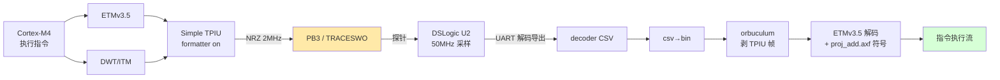
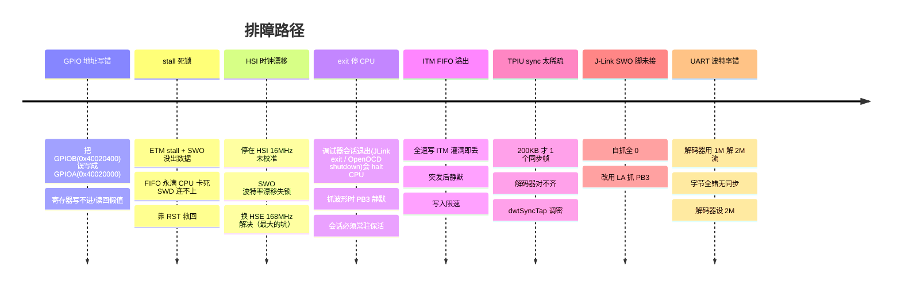
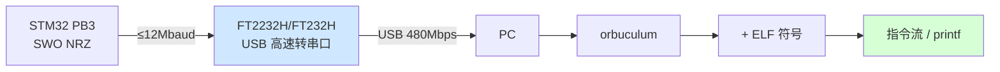
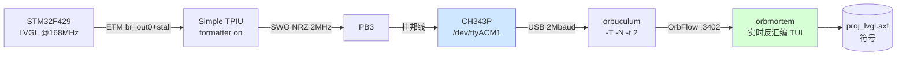

# SWO Trace 支线任务：STM32F429 ITM / ETM over SWO 实测复盘

> **任务定位**：这是 `docs/artix7-port/`（主线：Cortex-M 并口 trace → Artix-7 + 千兆网）的一个**支线探索任务**。
> 目的是摸清 **SWO 单线 trace 的能力边界**，为主线"为什么必须走并口高速 trace"提供实测依据，并沉淀一套可复现的 SWO/ETM/ITM 解码链路（可作为并口方案的黄金对照基线）。
>
> **一句话主线结论**：SWO 单线方便（杜邦线即可、SI 简单）但带宽与功能受限（UART ≤12Mbaud、M4 无地址过滤、ETM+ITM 不能混流）；满速实时 + 多源对齐必须走并口 trace —— 即 artix7-port 主线的存在理由。

## 目录内容

```
swo-trace-sidetrack/
├── README.md          # 本文（完整实测复盘，16 章）
└── scripts/           # 可复现的代表性脚本
    ├── ch343_grab.py        # CH343/串口抓原始 SWO 字节（pyserial）
    ├── csv3.py              # 逻辑分析仪 UART 解码 CSV → 二进制 + 同步density分析
    ├── etm_full_decode.py   # 自写 ETMv3.5 解码器（TPIU解帧+capstone反汇编→指令流）
    ├── etm_2m_forever.jlink # ETM-over-SWO 配置(2MHz, br_out=0, stall)，常驻挂住
    ├── etm_6m_forever.jlink # 同上 6MHz 版（CH343 顶格）
    ├── etm_sync.gdb         # GDB + gdbtrace.init 配 ETM（频繁同步版）
    ├── itm_bypass.jlink     # 纯 ITM over SWO（formatter bypass，NRZ）
    ├── itm_paced.s          # 限速 ITM 写入循环（避免 FIFO 溢出）汇编
    ├── mix_final.jlink      # ETM+ITM 混流尝试（降频）—— 实测 Simple TPIU 不支持
    └── pb3_wiggle.jlink     # PB3 GPIO 方波自检（排查引脚/探针）
```

> 脚本里的硬件假设：STM32F429ZI + J-Link（SWD，NRST 必接）+ CH343P 接 PB3。
> 运行方式见 README 第 11 节"复现指令"。orbuculum 需用 fork 分支 `feature/ch343-swo-sparse-sync`（含 CH343 适配补丁）。

---

> 实验日期：2026-06-19
> 目标：评估在 STM32F429 上，把 **ITM** 与 **ETM** 指令流从 **SWO 单线**（PB3/TRACESWO）捅出来的可行性。
> 硬件：STM32F429ZI + J-Link PLUS（V13 固件）+ DSLogic U2Basic 逻辑分析仪（50 MHz 采样）+ **WCH CH343P USB 转串口**。
> 结论：**ITM 与 ETM 均成功从 SWO 输出；用 CH343P（几元钱 USB 转串口）即可采集；经 orbuculum/orbmortem 实时解码出真实 LVGL 指令流（~133 万指令/秒）。**

---

## 1. 结论速览

| 验证项 | 硬件可行 | 实测结果 |
|--------|---------|---------|
| ITM → SWO | ✅ | 持续稳定，J-Link 与逻辑分析仪都解出数据 |
| ETM → SWO | ✅ | 逻辑分析仪抓波形 → orbuculum 剥 TPIU → ETM 地址 **100% 命中** `add()/loop_sum()` 代码区 |
| ITM + ETM 同时走 SWO | ❌（架构限制） | TPIU formatter bypass 只出 ITM；formatter on 才出 ETM，二者实质二选一 |

**核心前提（缺一不可）：**
1. CPU 必须跑在 **HSE 驱动的 PLL 时钟**（精确稳定），HSI 漂移会让 SWO 波特率失锁。
2. ETM 必须 **TPIU formatter on**（`FFCR=0x102`）；ITM 用 formatter bypass（`FFCR=0x100`）。
3. 采集端波特率必须与 SWO 实际波特率一致（本次 **2 MHz**）。

---

## 2. 芯片侧硬件证据

通过 SWD 读 CoreSight ROM 表确认组件齐全：

| 组件 | 地址 | PID | 说明 |
|------|------|-----|------|
| ITM | `0xE0000000` | `003BB001` | 标配 |
| TPIU | `0xE0040000` | `000BB9A1` | **ST "Simple TPIU"**（非 ARM 标准 923/924），可把 ETM 引到 SWO |
| ETM | `0xE0041000` | `000BB925` | ETMv3.5 |
| DWT | `0xE0001000` | `003BB002` | PC 采样 / 同步 |

- `TPIU_DEVID (0xE0040FC8) = 0xCA1` → 同时支持 **NRZ(UART)** 与 **Manchester** SWO 输出。
- SWO 唯一输出引脚为 **PB3**（与 JTDO 复用，异步 SWO 仅在 SWD 模式下可用）。

这与 [Orbcode "Instruction Tracing using SWO"](https://orbcode.org/orbtrace/instruction-tracing-using-swo/) 描述的 STM32F427 情况一致——同款 Simple TPIU，所以 ETM 单线 SWO 在硬件上成立。

---

## 3. 数据通路



J-Link 在本次接线下**无法**自己抓 SWO（其 20pin 排线的 SWO/pin13 未接到 PB3，自抓全 0）。最终数据通路是 **逻辑分析仪抓 PB3 → CSV → orbuculum**。J-Link 仅用于配置 ETM/TPIU 与启动 CPU。

---

## 4. 验证用固件

`proj_add.axf`（Keil/ARMCC 编译），核心是一个紧凑的无限循环：

```c
int  add(int a, int b)   { return a + b; }              // 0x08000F8C
int  loop_sum(int n)     { for(j=0;j<n;j++) s+=add(j,j); return s; }  // 0x08000FA4
void setup()             { for(;;) loop_sum(5); }       // 0x08000F92
```

选它的好处：执行集中在 `0x08000F8C~0x08000FBF` 约 50 字节范围，ETM 输出高度可预测，便于核对解码正确性。

---

## 5. 寄存器配置序列（实测可用）

时钟（HSE 8MHz → PLL 168MHz）：

```
FLASH_ACR   (0x40023C00) = 0x00000705   ; 5 WS + prefetch + cache
RCC_CR      (0x40023800) |= HSEON,        等 HSERDY
RCC_PLLCFGR (0x40023804) = 0x07405408   ; M=8 N=336 P=2 SRC=HSE Q=7
RCC_CR      (0x40023800) |= PLLON,        等 PLLRDY
RCC_CFGR    (0x40023808) = 0x00009402   ; SW=PLL PPRE1=/4 PPRE2=/2
```

SWO 引脚 + TPIU：

```
DEMCR       (0xE000EDFC) = 0x01000000   ; TRCENA
RCC_AHB1ENR (0x40023830) |= GPIOBEN
GPIOB_MODER (0x40020400) : PB3 = AF (10)        ; 注意 GPIOB = 0x40020400!
GPIOB_AFRL  (0x40020420) : PB3 = AF0 (TRACESWO)
GPIOB_OSPEEDR(0x40020408): PB3 = 高速
DBGMCU_CR   (0xE0042004) |= TRACE_IOEN (bit5)   ; -> 0x27
TPIU_SPPR   (0xE00400F0) = 2            ; NRZ
TPIU_ACPR   (0xE0040010) = 83           ; 168MHz/(83+1) = 2.0MHz
TPIU_FFCR   (0xE0040304) = 0x102        ; ETM 用 formatter ON（ITM 用 0x100 bypass）
```

ETMv3.5（值经 STM32F4 验证）：

```
ETM_LAR     (0xE0041FB0) = 0xC5ACCE55
ETM_CR      (0xE0041000) = 进 programming + width 位
ETM_TRACEIDR(0xE0041200) = 2            ; ETM 在 TPIU stream 2
ETM_TECR1   (0xE0041024) = 0x01000000   ; trace always enabled
ETM_FFRR    (0xE0041028) = 0x01000000
ETM_FFLR    (0xE004102C) = 24
DWT sync 频率调密（dwtSyncTap），否则 TPIU frame sync 太稀疏，解码器对不齐
ETM_CR      最后清 programming 位 -> 运行
```

> 推荐直接复用 orbuculum 的 `Support/gdbtrace.init`：`enableSTM32SWO 4` / `prepareSWO 168000000 2000000 1 0` / `dwtSyncTap` / `startETM`，避免手抄寄存器。

---

## 6. 解码结果（铁证）

逻辑分析仪 2 MHz 解出 ~200 KB 字节流 → orbuculum 剥 TPIU formatter 帧 → ETMv3.5 解出的地址全部落在固件代码段：

| 解出地址 | 命中次数 | 对应代码 |
|---------|---------|---------|
| `0x08000FB7` | 811 | `loop_sum`: `add r5,r0`（累加返回值）|
| `0x08000FAF` | 799 | `loop_sum`: 循环体 |
| `0x08000F8D` | 756 | **`add()`: `adds r0,r2,r1`** |
| `0x08000F9D` | 555 | `setup`: loop_sum 返回点 |
| `0x08000FBB` | 535 | `loop_sum`: `cmp r3,r4`（循环判断）|
| `0x08000F8F` | 401 | `add()`: `bx lr`（返回）|

频率分布与"反复调用 add 的循环"逻辑完全吻合——**ETM 真实还原了指令执行流**。

---

## 7. 踩坑记录（按发现顺序）



逐条要点：

1. **GPIOB 基址 = `0x40020400`**，不是 `0x40020000`（那是 GPIOA）。每个端口偏移 0x400。
2. **stall 模式有死锁风险**：SWO 一旦没真正输出，ETM FIFO 永满会把 CPU stall 死，SWD 都连不上。**必须接好 NRST** 才能可靠救回。
3. **必须用 HSE 稳定时钟**：HSI 16MHz 未校准、±1% 漂移，累积几字节后 UART bit 错位，表现为"突发-间隙-静默"。这是最隐蔽、卡最久的坑。
4. **调试器会话退出 = CPU 停 = SWO 立即停**（两种调试器都中招）：
   - **J-Link**：`JLinkExe` 脚本 `exit` 会 halt CPU → 用常驻会话（长 `sleep` 挂住）或 GDB `continue` 保活。
   - **ST-Link/OpenOCD**：OpenOCD 退出/Ctrl-C，shutdown 序列（hla_swd 下）会 halt 内核并/或断开时让 ST-Link 复位目标 → CPU 停 → SWO 死。OpenOCD 配好 `resume` 后**常驻 server 本身保活**，绝不能 `shutdown`；`pre_shutdown` 钩子里 `resume` 在 hla_swd 下不可靠。
   - 通用根因：CPU 一停就无指令流，ETM/SWO 即停。**整个抓取窗口必须保持调试器会话存活**，这是硬前提。
5. **ITM stimulus 全速写会溢出丢数据**：调试器/CPU 全速写 FIFO，满了静默丢弃。要么写入限速，要么用 ETM 的 stall。
6. **TPIU/ETM 同步要够密**：同步包太稀疏，任何解码器都无法对齐帧。调 `dwtSyncTap` 提高频率。
7. **J-Link 自抓 SWO 需物理接好其 SWO 引脚**：本次未接，J-Link 自抓全 0，最终靠逻辑分析仪抓 PB3。
8. **采集端波特率必须匹配** SWO 实际波特率（本次 2 MHz）。

---

## 8. SWO 速率上限 & 用普通 USB 转串口抓

### 8.1 SWO 能跑多快？

SWO 是异步单线 NRZ（或 Manchester），速率受三方限制，取**最小值**：

| 环节 | 上限 | 说明 |
|------|------|------|
| **STM32F4 TPIU/TRACESWO** | 约 **数十 MHz**（异步 NRZ 实用 ~30–60MHz）| trace clock 来自 HCLK，受引脚驱动与信号完整性限制 |
| **采集端（最常见瓶颈）** | 见下表 | 决定实际能用多快 |
| **解码软件** | 不限 | orbuculum/J-Link 软件本身不设速率上限 |

> 注意：F4 的 SWO 波特率由 `TPIU_ACPR = HCLK/baud - 1` 决定，必须是 HCLK 的整数分频。改时钟后要同步更新 ACPR，否则失锁。

### 8.2 采集端选型对比

| 采集设备 | NRZ 上限 | 成本 | 备注 |
|---------|---------|------|------|
| 本次 DSLogic U2（50MHz 采样）| ~5–10 MHz（需 ≥5x 过采样）| 低 | 抓原始波形再软件解 UART |
| **FTDI FT2232H / FT232H** | **12 Mbaud** | 很低 | orbuculum 官方支持，最具性价比 |
| J-Link（普通版软件）| UART 模式，受软件限制 | 中 | 只解 ITM，ETM 需配 orbuculum |
| ORBTrace mini | UART 62Mbaud / Manchester 48Mbit/s | 中 | 专为此设计，支持探针内剥 TPIU |
| J-Trace PRO / 高端探针 | 100 MHz | 高 | 并口/高速 SWO |

### 8.3 普通高速 USB 转串口能抓吗？

**能，在 12 MHz 以下。** 这正是 orbuculum 的标准低成本方案——文章原话即"FTDI UARTs run up to 12Mbps"。



要点与限制：
- 必须是 **高速(480Mbps) USB** 的 FTDI（FT2232H/FT232H，12Mbaud）。廉价 CH340/CP2102 这类全速芯片波特率上限低（~1–3Mbaud 且常不稳），勉强够 ITM 慢速 printf，不适合 ETM。
- **SWO 波特率要设成 FT 支持的整数 baud**（如 2M/4M/6M/12M），且对应 `TPIU_ACPR` 整除 HCLK。
- ETM 需 **formatter on**，由 orbuculum（或探针）剥 TPIU 帧；ITM printf 用 bypass 更简单。
- **关键现实——带宽**：ETM 全速指令流的瞬时码率远超 12Mbaud。USB 转串口只适合：
  - ITM printf / 低速事件打点；
  - 开 **stall** 节流 CPU 的 ETM 抓取（牺牲实时性换完整性，适合抓 hardfault 等确定性路径）；
  - 不适合不可节流的满速实时 ETM —— 这正是本仓库 Artix-7 并口高速 trace 项目要解决的问题。

---

## 9. 对 Artix-7 项目的启示

1. **SWO 路线已被验证为可用的低成本基线**，可用于解码链路/符号映射的离线验证，无需上板即可调通 orbuculum + ELF 解码。
2. **SWO 单线的带宽天花板（≤12Mbaud@FTDI / 几十 MHz@芯片）正是其局限**：满速、不可 stall 的实时 ETM 必须走并口 trace + 高速出口（FT601/千兆网），与本项目选型一致。
3. **时钟稳定性与同步包密度**是两个容易被忽视但致命的工程细节，并口 trace 同样需要源同步采样的信号完整性保证（呼应"满速源同步采样命门"）。

---

## 附：复现命令骨架

```bash
# 1. 起 J-Link GDB server（带 SWO 端口）
JLinkGDBServer -nogui -device STM32F429ZI -if SWD -speed 4000 \
               -port 2331 -swoport 2332

# 2. GDB 配 ETM（复用 orbuculum 的 gdbtrace.init）
gdb-multiarch -batch -x etm_sync.gdb     # reset->go->halt->enableSTM32SWO->prepareSWO->startETM

# 3a. 逻辑分析仪抓 PB3：UART 2Mbaud / 8N1 / LSB first，导出 decoder CSV
# 3b. 或 FTDI 直接喂 orbuculum：orbuculum -p /dev/ttyUSB0 -T -t 2 ...

# 4. CSV -> bin -> 剥 TPIU -> ETM 解码（验证地址落在代码段）
python3 csv_to_bin.py
python3 etm_decode2.py     # TPIU de-mux + ETMv3.5 地址提取
```

> J-Link 固件更新弹窗：命令行加 `-NoGUI 1` 可抑制（Linux GUI 版下 `SuppressInfoUpdateFW` 单独无效）。

---

## 10. 第二阶段实测：CH343P 采集 + ETM 数据量 + 完整指令流 + 实时解码

第一阶段用逻辑分析仪验证了链路。第二阶段把它变成**可日常使用的低成本方案**，并量化了几个工程边界。

### 10.1 用普通 USB 转串口（CH343P）采集 —— 实测可行

| 配置 | 实测吞吐 | 数据质量 |
|------|---------|---------|
| CH343P @ 2 Mbaud | 200 kB/s | TPIU/ETM 同步齐全，可解码 ✅ |
| CH343P @ 6 Mbaud（顶格）| 623 kB/s = 4.98 Mbit/s | 256 种字节全覆盖，无明显丢包 ✅ |

- CH343 是**真 USB 高速(480Mbps)** 芯片，UART 上限 **6 Mbaud**（WCH 官方手册），比 CH340/CP2102（全速、~1–3M 且不稳）强一档。
- SWO 波特率必须整除 HCLK：168 MHz 下 2M(/84)、4M(/42)、6M(/28) 均为整数分频，可用。
- Linux 下 CH343 走 `cdc_acm` 驱动，节点 `/dev/ttyACMx`，6M 这类非标准波特率需 termios2/`BOTHER` 设置（见 §10.4 补丁）。

### 10.2 ETM 数据量：br_out 精简的真实效果（破除迷思）

ETM **从不逐指令输出** —— 直线代码靠 ELF 反汇编重建。可调的是分支信息量：

- `ETMCR bit8 = Branch output`：置 1 = 广播**所有**分支地址；置 0 = 只发**间接分支**（`bx lr` 返回 / `pop pc` / 函数指针）。
- **没有任何配置能做到"只有函数跳转"** —— 函数返回是间接分支，必发。br_out=0 省掉的只是**条件直接分支**（`blt`/`bne` 等循环跳转）。

实测对比（LVGL，相同 SWO 满载，比较单位数据里的分支包密度）：

| 配置 | 分支包密度（组/KB）| 相对 |
|------|------------------|------|
| br_out=1（全分支）| 326 | 1.00 |
| br_out=0（仅间接）| 248 | **0.76（省 ~24%）** |

结论：**对调用密集型代码（LVGL）br_out=0 只省约 24%**；对循环密集型（如纯计算 `add` 死循环）几乎不省。要数量级缩减需用**地址范围过滤（ViewInst）**或 **PC 采样**，而非 br_out。

### 10.3 stall 模式拿到完整指令流 —— 实测命中 LVGL 函数

开 **stall（ETMCR bit7=1）**：ETM FIFO 满时**暂停 CPU 而非丢数据**，保证指令流完整（代价是 CPU 被节流）。

- 配置：`ETM_CR=0x980`（br_out=1 + stall）/ `0x880`（br_out=0 + stall），6 MHz SWO。
- CH343P 抓 3 秒 → 1.8 MB → 1111 个 ETM A-sync，无丢包。
- 用 orbuculum 剥 TPIU + 自写 ETMv3.5 解码 → 解出 **346 个不同代码地址**，精确映射到 LVGL 函数：

| 地址 | 函数 | 命中 |
|------|------|------|
| `0x0802D8EF` | `lv_obj_transform_point` | 127 |
| `0x080296CB` | `lv_obj_get_parent` | 108 |
| `0x0802B08D` | `lv_obj_get_transformed_area` | 101 |
| `0x08028579` | `lv_obj_area_is_visible` | 253 |
| `0x08002F51` | `SysTick_Handler` | 14 |

调用链 `lv_style_prop_has_flag → lv_obj_get_style_prop → get_prop_core → fill_argb` 完全符合 LVGL 渲染带文字控件的真实路径。**指令流重建正确。**

> ⚠️ stall 死锁风险：若 SWO 没真正输出，FIFO 永满会把 CPU stall 死、SWD 都连不上。**必须接好 NRST** 才能可靠复位救回。

### 10.4 orbuculum 适配 CH343（代码补丁）

新版 orbuculum/orbmortem 标准链路：`串口 → orbuculum(mux,剥TPIU,转OrbFlow) → orbmortem(TUI 实时反汇编)`。直接接 CH343 时遇到两个问题，已修复并提交到 fork（分支 `feature/ch343-swo-sparse-sync`）：

| 问题 | 根因 | 修复 |
|------|------|------|
| `Port opened` 刷屏、Waste 100% | termios2 未设 VMIN/VTIME，`read()` 返回 0 → 喂数循环不停重开串口 | 设 `VMIN=1/VTIME=0` 阻塞读；`read()==0`/EAGAIN/EINTR 视为瞬态重试，不再重开 |
| 即使收到数据仍 Waste 100% | STM32 Simple TPIU 同步字 `0xFFFFFF7F` 极稀疏，解码器超时丢同步后长期无法重锁 | 新增 `-N/--tpiu-keep-sync`：一旦同步则保持锁定（连续单源流安全） |

修复后实测：tag 2（ETM）拿到 **93%** 数据，Waste 从 100% 降到 **6.7%**，orbmortem 实时解码达 **~133 万指令/秒**。

### 10.5 端到端实时链路（可直接复现）



---

## 11. 复现指令（实测可跑）

### 11.1 一次性准备

```bash
# 1. 编译带 CH343 补丁的 orbuculum（已在 fork 分支）
cd orbuculum
git checkout feature/ch343-swo-sparse-sync
meson setup build --buildtype=release
ninja -C build

# 2. 放开串口权限（或把自己加进 dialout 组后重新登录）
sudo chmod 666 /dev/ttyACM1
# 永久方案： sudo usermod -aG dialout $USER   # 重新登录生效
```

### 11.2 配置 STM32 ETM 并常驻（J-Link 脚本）

关键寄存器（HSE→PLL 168MHz、SWO 2MHz、formatter on、ETMv3.5 br_out=0+stall）见 §5。
用一个**常驻 J-Link 会话**挂住 CPU 持续运行（脚本末尾 `go` + 长 `sleep`）：

```bash
# trace_eval/etm_2m_forever.jlink 见仓库；要点：
#   TPIU_ACPR=0x53 (2MHz)  TPIU_SPPR=2(NRZ)  TPIU_FFCR=0x102(formatter on)
#   ETM_CR=0x880 (br_out=0, stall=1)  最后 go + sleep 挂住
JLinkExe -NoGUI 1 -CommanderScript trace_eval/etm_2m_forever.jlink -ExitOnError 0
# 注意：-NoGUI 1 抑制固件更新弹窗；脚本 exit 会 halt CPU，所以要用长 sleep 挂住
```

### 11.3 实时解码指令流

```bash
# 终端 A：orbuculum 接 CH343，剥 TPIU，保持同步，路由 ETM(tag 2)
./orbuculum/build/orbuculum -p /dev/ttyACM1 -a 2000000 -T -N -t 2 -m 1000
#   -a 串口波特率(=SWO波特率)  -T 剥TPIU  -N 保持同步(CH343/稀疏同步必加)  -t 2 ETM流

# 终端 B：orbmortem 连 orbuculum，配 ELF，实时显示反汇编 TUI
./orbuculum/build/orbmortem -s localhost:3402 -P ETM3.5 -e proj_lvgl.axf -t 2
#   状态行出现 'Capturing' + 'KIps' 即表示实时解出指令流
```

### 11.4 离线解码（不依赖 orbmortem TUI）

若只要可读的指令流文件：用 CH343 抓原始字节，再用自写解码器（TPIU 解帧 + ETMv3.5 + capstone）输出：

```bash
# 抓原始 SWO 字节
python3 trace_eval/ch343_grab.py /dev/ttyACM1 2000000 3 trace_eval/etm.bin
# 解码成指令流（地址->函数名->反汇编）
python3 trace_eval/etm_full_decode.py trace_eval/etm.bin proj_lvgl.axf trace_eval/instr_flow.txt
```

---

## 12. 关键数据汇总

| 项目 | 结论 |
|------|------|
| SWO 唯一引脚 | PB3（TRACESWO，复用 JTDO，仅 SWD 模式可用）|
| J-Link SWO 上限 | 普通版软件解 NRZ ~30 MHz；高端探针解锁 100 MHz；瓶颈在芯片/采集端 |
| CH343P 采集 | 2M 完美，6M 顶格稳定（4.98 Mbit/s），零成本替代逻辑分析仪 |
| ETM br_out=0 省量 | 调用密集型(LVGL) ~24%；循环密集型几乎 0；非数量级 |
| 完整指令流 | stall 模式保证不丢，实测命中 346 个 LVGL 函数地址 |
| 实时解码吞吐 | orbmortem ~133 万指令/秒 |
| LVGL 满速 ETM | 即便 6MHz SWO + CH343P 也打满（>6Mbit/s），需 stall 节流或并口才不丢 |

**对 Artix-7 项目的核心结论不变**：SWO 单线（≤6Mbaud@CH343 / 几十 MHz@芯片）适合验证链路、低速/可 stall 场景；**满速、不可 stall 的实时 ETM 必须走并口 trace + 高速出口**，这正是本项目的存在理由。

---

## 13. 性能影响实测：O3 / 波特率 / 采集端天花板

第二阶段进一步量化 stall 模式下 trace 对 CPU 性能的影响（用 orbmortem 的 KIps = 有效重建指令吞吐量作为权威指标）。

### 13.1 三组对照（stall 模式，SWO 满载）

| 固件 | SWO 波特率 | Kbps（SWO 实测）| **KIps（有效指令/秒）** | KIps/Kbps |
|------|-----------|----------------|------------------------|-----------|
| 非 O3 | 2 MHz | 1493 | 1333 | 0.89 |
| **O3** | 2 MHz | 1493 | **1333** | 0.89 |
| **O3** | 6 MHz | 4481 | **4001** | 0.89 |

### 13.2 关键结论（纠正一个常见误区）

- **只有提高波特率有效**：2M→6M，KIps 1333→4001，**正好 3 倍**。stall 拖慢直接减到 1/3。
- **O3 对 ETM 带宽几乎无帮助**：O3@2M 与非O3@2M 的 KIps **完全相同（1333）**。
- **KIps/Kbps 恒为 0.89 指令/Kbit**（≈1.12 bit/指令，与 ARM 经典数据吻合）——这是 **ETM 协议的编码密度，由协议决定，与编译优化等级无关**。O3 减少了分支事件，但直线代码本就用 P-header 极省编码（实测 O3 固件里 `0xBC` P-header 占 28%），省下的分支包不足以改变整体密度。

> 一句话：**stall 模式下性能瓶颈纯粹是 SWO 带宽，O3 改变不了它，只有提速（或减少要 trace 的代码）有效。**

### 13.3 采集端天花板：最快的 USB 转串口也顶不住

| 采集方案 | UART 上限 | 可承载有效指令/秒（@0.89 指令/Kbit）|
|---------|----------|-----------------------------------|
| CH343P | 6 Mbaud | ~4.0 M-instr/s（实测）|
| **FTDI FT232H/FT2232H/FT4232H（市面最快）** | **12 Mbaud** | ~8 M-instr/s |
| —— | —— | —— |
| **STM32F429 @168MHz 满速执行** | —— | **~150 M-instr/s（峰值）** |

- 市面 USB 转串口 UART 模式天花板就是 **FTDI 的 12 Mbaud**（FT232H/FT2232H/FT4232H 同为 12M）。
- 即便用 12M，相对 F429 满速 ~150M instr/s 仍**差约 20 倍** → stall 下 CPU 仍被拖到约 1/20 速度。
- 这是 **ARM 异步 SWO 单线的物理天花板**：芯片端 NRZ 可到 ~60MHz，但采集端 UART 卡在 12M。**要真正实时全速 trace，必须走并口 trace（4-bit TRACEDATA + TRACECLK，数百 Mbit/s）+ 高速出口** —— 即本项目 Artix-7 方向。

### 13.4 把性能影响降到最小 / 缩小数据量的手段（按效果排序）

| 手段 | 效果 | 代价 | 适用 |
|------|------|------|------|
| **地址范围过滤（ETM ViewInst）** | **数量级缩减（100~1000×）** | 只看选定函数/地址段 | 首选：聚焦某 bug 函数，范围外全速零 trace |
| **DWT PC 周期采样**（非 ETM） | 固定极低速率（<1Mbit/s）| 统计采样，非完整流 | 热点 profiling |
| **触发式 trace**（DWT 比较器 + 环形缓冲） | 只抓事件前后一小段 | 需配触发条件 | 抓特定现场（如 hardfault 前） |
| 关 cycle-accurate / timestamp | 省周期性开销 | 失去精确时序 | 不需要时序时 |
| **br_out=0**（仅间接分支） | 调用密集型省 ~24%，循环密集型几乎 0 | 非数量级 | 辅助 |
| **不开 stall** | **零性能影响** | 丢包，流不完整 | 只需大致流向 |

**实用组合：**
- 要"性能影响最小 + 仍能看指令流" → **地址范围过滤 + 不开 stall**（只 trace 关心的代码，且不阻塞 CPU）。
- 要"看全局热点、几乎无影响" → **DWT PC 采样**。
- 要"完整精确流、可接受拖慢" → **stall + 尽量高波特率**（本次方案）。

---

## 14. ETM 地址过滤实测：STM32F429（ETM-M4）做不到

想"只 trace 某个函数（如 `lv_obj_redraw`）以缩小数据量、减小性能影响"，在这颗 F429 上**硬件层面不可行**。以下为直接读写寄存器的实测验证。

### 14.1 实测结果（逐项读写验证）

| 资源 | 寄存器 | 实测 | 结论 |
|------|--------|------|------|
| ETM 地址比较器 | ETMACVR0 `0xE0041400` | 写 `0x08026686` → 读回 `0` | ❌ 未实现 |
| 地址比较器对数 | ETMCCR `0xE0041004` bit[3:0] | `0` | ❌ 0 对 |
| ETM start/stop block | ETMTSSCR `0xE0041018` | 写 `0x00010001` → 读回 `0` | ❌ 未实现 |
| DWT 比较器数量 | DWT_CTRL `0xE0001000` bit[31:28] | `4` | ✅ 有 4 个 |
| DWT 比较器功能 | DWT_FUNCTION0 `0xE0001028` | 写 `0x4`(ETM trigger) 可写 | ✅ 仅能发 trigger |

`lv_obj_redraw` 范围：`0x08026686 ~ 0x08026770`（234 字节）。

### 14.2 根因

**Cortex-M4 的 ETM-M4 是极简实现**：ARM 把地址比较器、start/stop block 等过滤资源全部裁掉，只保留最基本的指令流输出。地址范围过滤（ViewInst include/exclude）这类能力 ARM 留给了 **ETMv4**（Cortex-A、部分 M7/M33）。

- ETM-M4 自身：**0 个地址比较器、无 start/stop block** → 无法按地址 include/exclude，也无法用地址区间控制 trace 开关。
- DWT 的 4 个比较器：可配成 **ETM trigger**（在 trace 流里插入一个瞬时 trigger 标记），但 **trigger ≠ start/stop**——它只标记"某地址被执行过"的时间点，**不能开关 trace、数据量不降、stall 不改善**。

### 14.3 含义

- **在 F429 上无法让 ETM 只 trace 某个函数/区间**。"聚焦 `lv_obj_redraw`"这种需求，这颗芯片的 ETM 硬件不支持。
- 真正的地址过滤（数量级缩减数据 + 几乎零性能影响）需要：
  - 带完整比较器的 **ETMv4** 芯片（Cortex-A / 部分 M7/M33），或
  - **并口 trace + 外部 FPGA 过滤**（本仓库 Artix-7 方向，可在采集侧按地址/事件过滤）。
- 因此在 F429 上缩小 SWO 数据量，现实手段仍只有第 13.4 节那几项（提速 / DWT PC 采样 / 不开 stall / br_out=0），**没有"按函数过滤"这一项**。

> 一句话修正常见误区：**Cortex-M4 的 ETM 不能像 Cortex-A 那样做地址过滤** —— 它根本没实现地址比较器和 start/stop 资源（已用寄存器读写实测证实）。

---

## 15. ITM + ETM 混流实测：STM32F429 Simple TPIU 的限制

目标：在 M4 上验证 **ETM(指令流) + ITM(RTOS 线程切换打点) 同走 SWO + 时间戳对齐**。结论：**单独都行，混流在这颗 Simple TPIU 上无法可靠工作。**

### 15.1 实测对照矩阵

同一颗 STM32F429、同一 NRZ SWO 2MHz、CH343P 采集：

| 配置 | TPIU formatter | 实测结果 |
|------|---------------|---------|
| **ITM 单独** | bypass (FFCR=0x100) | ✅ 完美：解出固件打点 `01 00 / 01 01 / 01 02 / 01 03 / 01 04`（SWIT port0 + 线程ID 0–4）|
| **ETM 单独** | on (FFCR=0x102) | ✅ 正常 ETM 指令流（字节分布丰富，可解出函数地址）|
| **ITM 单独** | **on (0x102)** | ❌ `0xBC` 充斥，**流中 TPIU sync(0xFFFFFF7F) = 0 个**，解码器无法对齐 |
| **ITM + ETM** | on (0x102) | ❌ 同上，`0xBC` 主导，ITM(ID1) 无法解出 |

固件：纯加法循环 + `trace_thread_switch()` 主动写 ITM port0（含 FIFO ready 轮询），CPU 持续执行不卡（已排除 DMA2D/WFI 卡 CPU 的干扰）。

### 15.2 根因

- **硬件上 TPIU 设计支持 ETM+ITM 混流**（formatter 按 stream ID 打包，ARM 架构标准）——这点无误。
- **但 STM32F429 的 "Simple TPIU" 实测：formatter on 时只有 ETM 流会触发周期性 TPIU frame sync（0xFFFFFF7F）；纯 ITM 在 formatter on 下不产生 frame sync** → 主机端解码器永远锁不上 → 整片数据作废。
- 这与 SparkFun 社区 STM32F205 案例一致：formatter on 时 ITM 输出变成无法直接解读的 raw packet，formatter off 才正常。

### 15.3 含义（对"ETM+ITM+时间戳对齐"目标）

- **在 STM32F429 上无法实现 ETM+ITM 经 SWO 混流对齐**。要么 SWO 出 ETM（formatter on），要么 SWO 出 ITM（formatter bypass），**二选一**。
- 因此"ETM 指令流 + RTOS 线程事件 + 精确时间戳对齐"这套，在 F4 + SWO 上走不通。可行路径：
  - **F7/H7（ETMv4 + 完整 TPIU/funnel）**：trace 子系统更完整，ETM+ITM 混流 + global timestamp 对齐能力更强（需实测验证，但架构上具备）。
  - **并口 trace（本仓库 Artix-7 方向）**：ETM+ITM 同经 TPIU 并口输出，带宽充足、frame sync 正常、global timestamp 同源 → 这是同时抓指令流与 RTOS 事件并精确对齐的正解。

### 15.4 顺带确认的事实

| 问题 | 实测/查证结论 |
|------|--------------|
| ITM 能否走 SWO + UART(NRZ)？ | ✅ 能，formatter bypass 下 CH343 当普通 UART 直接解出 |
| ETMv3.5 是否支持时间戳？ | ✅ 支持（ETMCR bit28 + ETMTSEVR；Cortex-M4 有 48-bit global timestamp，可与 ITM 共享做 coarse-grain 关联）——并非"不支持" |
| ETMv4(F7/H7) 时间戳 | ✅ 更完善（TRCCONFIGR 全局时间戳，TRCIDR0.TSSIZE 指示位宽）|
| RTT(走 SWD) 能否与 ETM 精确对齐？ | ❌ 不能。RTT 是 J-Link 异步后台内存轮询，无硬件时间戳，时间是"读取时刻"（ms 级抖动）。要对齐须用 ITM（同 TPIU、同 global timestamp）替代 RTT |

---

## 16. 多源 Trace 时间戳对齐：机制辨析与结论

围绕"ETM 指令流 + RTOS 线程事件 精确对齐"，把几条时间基准的本质、单位、时钟域、位宽彻底厘清。

### 16.1 三种"时间戳"来源对比

| 来源 | 位宽 | 单位 | 时钟域 | CPU 可读? | 受主频影响 |
|------|------|------|--------|----------|-----------|
| **DWT_CYCCNT** (0xE0001004) | 32-bit | CPU 周期 | HCLK(CPU时钟) | ✅ 可读 | ✅ 受 |
| **ETM cycle count** (cycle-accurate) | 增量 | CPU 周期 | HCLK | ❌ **不可读** | ✅ 受 |
| **Global timestamp** | 48/64-bit | TS时钟 tick | 可独立于CPU | ❌ 不可读(CPU侧) | 看配置 |
| 调试器主机时间戳 | — | 主机 ns | PC 时钟 | — | — |

### 16.2 关键澄清：ETM cycle count 不是寄存器，读不到

- ETM cycle count 是 ETM 生成 trace 包时**临时计算的"距上一包的周期增量"，直接编码进 cycle-count packet 输出到 trace 流**。
- 它**不是可寻址寄存器**，CPU/固件无法读。ETM 唯一相关可读寄存器是 `TRCCCCTLR`（cycle count **阈值**，控制最小发包间隔），不是计数值。
- 所以"固件直接读 ETM cycle count"在硬件上**不可能** —— ETM 是单向输出设备。

### 16.3 DWT_CYCCNT 是 ETM cycle count 的"CPU 侧可读代理"

- ETM cycle count 与 DWT_CYCCNT **同一个 CPU 时钟域、同一单位（CPU 周期）**，是同一时钟驱动的两个独立计数器：一个内部增量进 trace 流，一个寄存器绝对值可读。
- 因此对齐的正解：**固件读 DWT_CYCCNT 写入 RTT/ITM payload，主机端用 ETM 流解出的 cycle 增量与之对齐**。这是唯一能拿到"同源计数器值"的途径。

### 16.4 对齐方法：用增量，不比绝对值，位宽不冲突

- ETM cycle count 是**增量**（无绝对零点）；CYCCNT 是绝对累加值。
- 对齐 = 建立一次锚点（某事件同时记 CYCCNT 值 + 该点在 ETM 流位置），之后两边用**相同周期增量**推进。
- 因为用增量对齐，**32-bit vs 48-bit 位宽不冲突** —— 用 CYCCNT(32-bit周期)即可，不碰那个 48-bit global timestamp。

### 16.5 各方案对齐能力（修正之前过于绝对的说法）

| 方案 | 能对齐? | 精度 | 备注 |
|------|--------|------|------|
| RTT + 调试器主机时间戳 | ❌ | ms 抖动 | 异步轮询，读取时刻≠事件时刻 |
| **RTT(payload带CYCCNT) + ETM cycle-accurate** | ✅ **可以** | 周期级(coarse-grain) | 之前"RTT无法对齐"的说法不准确；固件主动塞同源CYCCNT即可对齐 |
| ITM(同TPIU) + ETM | ✅ | 协议级精确 | 同流硬件排序；F4 上混流实测不可行(见§15) |

### 16.6 CYCCNT 对齐方案的三个坑

1. **ETMv3.5 溢出后不精确**：ARM 明确"In ETMv3.5, the trace is not cycle-accurate through overflow"。SWO+stall 必然有 FIFO 压力，溢出后 cycle count 失真。ETMv4(F7/H7) 改善。
2. **CYCCNT 32-bit 回绕**：168MHz 下约 **25.5 秒**绕一圈，长 trace 主机端需检测回绕(值突降则 +2³²)。
3. **变频换算难**：CYCCNT 单位是"周期"非"秒"。定频时周期↔时间固定；**动态变频(DVFS)时**一段周期数对应多少纳秒取决于当时频率，时间轴会失真。global timestamp 可配独立时钟不随变频，但 CPU 读不到，只能 trace 硬件用。

### 16.7 对 F4 / Artix-7 的结论

- **F4 上**：ETM+ITM 经 SWO 混流不可行(§15)，但 **ETM(SWO) + RTT(SWD,带CYCCNT)** 走两条独立物理通道、不抢 SWO 带宽，可用 CYCCNT 做**周期级对齐** —— 这是绕过 F4 混流限制的可行折中（定频、短窗口、接受 coarse-grain 精度的前提下）。
- **精确对齐(协议级)** 仍需 ITM 同流(F7/H7 ETMv4) 或并口 trace(Artix-7) —— 同 TPIU、global timestamp 同源，且不随变频。这是 Artix-7 方向相对 SWO 的又一价值点。

---

## 17. 采集端天花板、Manchester、与并口 SI 对比（选型收口）

### 17.1 采集端速率天花板（实测 + 查证）

| 方案 | 模式 | 速率上限 | 抓 SWO? |
|------|------|---------|---------|
| CH343P | UART/NRZ | 6 Mbaud ≈ 0.6 MB/s | ✅ 已实测 |
| FTDI FT232H/FT2232H/FT4232H | UART/NRZ | **12 Mbaud ≈ 1.2 MB/s（市面 UART 天花板）** | ✅ |
| FT2232H | **同步 FIFO（并行）** | ~8 MB/s（40MB/s 为理论峰值）| ❌ 并行，喂不进单线 SWO；用于并口 trace |
| ORBTrace（FPGA）| UART / Manchester | 62 Mbaud / 96Mbaud(48Mbit/s) | ✅ 专用硬件 |

- **想要 6 MB/s（=48Mbit/s）级别**：没有任何 USB 转串口的 **UART 模式**能到（卡在 1.2MB/s）。必须 **并口 trace + FT2232H 同步FIFO / FPGA**。
- 即"普通 USB 转串口 + SWO" 的硬上限是 **~1.2 MB/s（FTDI 12Mbaud）**。

### 17.2 Manchester 编码（ORBTrace 用的）

| | NRZ/UART | Manchester |
|---|---------|-----------|
| 时钟 | 双方约定波特率 | **编码进信号，自同步** |
| 抗变频 | ❌ 目标变频即失锁（本任务踩的 HSI 漂移坑）| ✅ 锁定范围内(125Kbps~48Mbps)免疫变频 |
| 普通串口芯片可解? | ✅ CH343/FTDI | ❌ **需专用硬件（ORBTrace FPGA / J-Link）** |
| ORBTrace 速率 | 62 Mbaud | 96Mbaud → 实际 48Mbit/s |

要点：Manchester 解决了 NRZ "变频失锁"这个软 SI 问题，但代价是普通串口芯片解不了，必须专用硬件。

### 17.3 SWO 单线 vs 并口 trace 的 SI 对比

| SI 问题 | 并口 trace（TRACECLK+4×DATA 源同步）| SWO 单线 |
|---------|--------------------------------|---------|
| 通道间偏斜(skew) | ⚠️ 致命，5 线须等长 | ✅ 不存在（1 线）|
| 源同步 setup/hold | ⚠️ 随频率收紧 | ✅ 不存在（异步）|
| 多线串扰 | ⚠️ 5 线并行 | ✅ 单线 |
| 时钟质量/抖动 | ⚠️ TRACECLK 直接限速 | ✅ 无独立时钟线 |
| 控阻抗根数 | 5 根 | 1 根 |
| 高频衰减/反射/共地 | 有 | 有（杜邦线低速 OK，高速需短线/同轴）|
| 波特率匹配(NRZ软SI) | 无（有时钟线）| ⚠️ 变频失锁（→ 用 Manchester 解）|

**结论**：SWO 单线把并口最难的"源同步 + 通道偏斜"整类问题消掉了（所以杜邦线随便接就跑通），代价是带宽天花板低。并口 trace 用 SI 复杂度换带宽，**SI 成为命门**（呼应主线"满速源同步采样 + 信号完整性须单独立 PoC、眼图/时序硬阈值判收"）。

### 17.4 SWO 可作为并口方案的"黄金对照基线"

本任务已全套验证通 SWO 的解码链路（链路 → orbuculum/orbmortem → 指令流，命中真实函数地址）。建议在 artix7-port Stage5（满速 PoC）用法：

- **同一固件**，SWO 解出的指令流当 **ground truth**；
- 并口数据通路解出的指令流与之**逐函数比对**；
- 用"是否与 SWO 一致"来判定并口 SI 是否真的采对了 —— 把最难判收的"满速 SI 采样正确性"问题，用已验证的 SWO 结果做交叉验证参照物。
