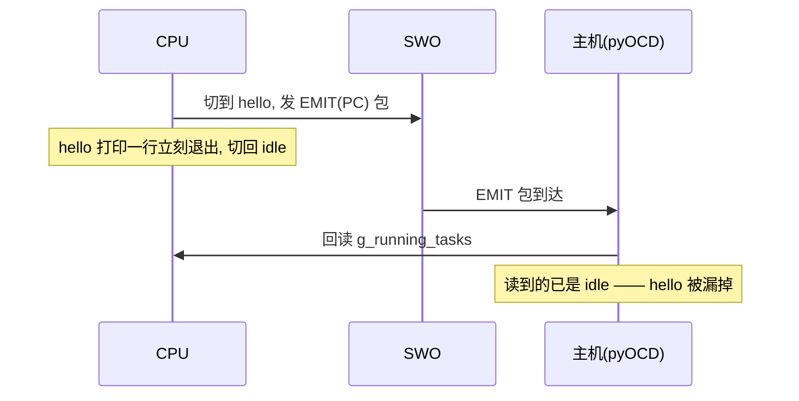
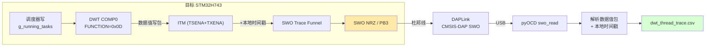
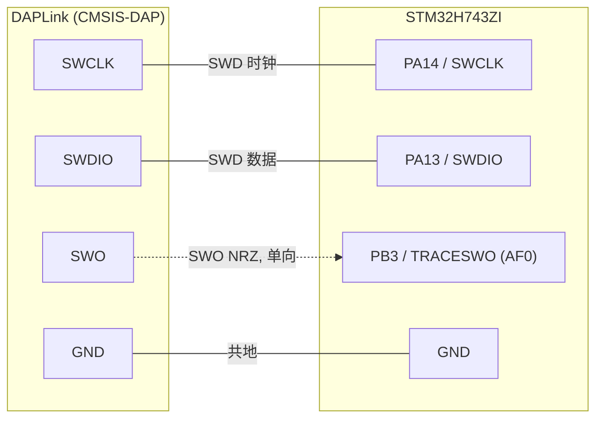

# H743 DWT Data Trace 零侵入线程切换追踪

> **任务定位**：`swo-trace-sidetrack/` 支线下的一个独立实测。上一篇（`../README.md`）在 STM32F429 上摸清了 ITM/ETM over SWO 的能力边界；本篇换到 **STM32H743 + NuttX**，验证另一条路线——**用 DWT Data Trace 经 SWO 零侵入捕获 RTOS 线程切换**，且只用一颗几元钱的 DAPLink。
>
> **一句话结论**：DWT 比较器监控内核写 `g_running_tasks`，硬件直接把"写入的新 TCB 指针"打进 SWO 数据值包，主机**不回读**目标内存。CPU 全程运行、零改动 NuttX、零性能损耗，连瞬间退出的短命线程（`hello`）都能抓到。

---

## 1. 结论速览

| 验证项 | 结果 |
|--------|------|
| DWT Data Trace 经 SWO 捕获 `g_running_tasks` 写入值 | ✅ 硬件直出 TCB 指针，无需回读 |
| 短命线程（hello，打印一行即退出）能否捕获 | ✅ 指针在 SWO 流里，不丢 |
| 需要改 NuttX 代码吗 | ❌ 零改动，纯调试器侧配置 |
| CPU 是否停机 | ❌ 全程运行，零性能损耗 |
| 探针 | DAPLink（CMSIS-DAP，几元钱）|

实测一次 12 秒捕获，从 SWO 流里解出 3 个不同线程的 TCB：

| TCB | pid | pri | state | 线程 |
|-----|-----|-----|-------|------|
| `0x24000430` | 0 | 0 | 3 | `nx_start`（idle）|
| `0x38000458` | 167 | 100 | 4 | **`hello_main`（短命，成功捕获）** |
| `0x38000a10` | 2 | 100 | 5 | `nsh_main` |

---

## 2. 为什么不用 DWT EMIT + 主机回读

最初的方案是 DWT EMIT（`FUNCTION=0x21`）：写 `g_running_tasks` 时发一个 PC 包，主机收到后**回读** `g_running_tasks` 拿新 TCB 指针，再读 TCB 里的 pid/name。

问题在于**回读依赖主机时机**：



实测：EMIT+回读方案跑一轮，几百条记录**全是 idle**，`hello` 一次没抓到（它太快，主机回读时早退出了）。这就是"主机现读时间戳/内存"的根本缺陷——事件时刻和主机读取时刻脱节。

**DWT Data Trace 从根上解决**：硬件在写发生的那一刻，就把**写入的数据值本身**（新 TCB 指针）编码进 SWO 包。主机只是解析流里已有的字节，不回读任何目标内存，短命线程也不会丢。


> 线程身份（pid/name）仍需按 TCB 指针读一次 TCB 结构——但这是**拿到硬件给的确切指针后的定向读取**（且带缓存），不是轮询 `g_running_tasks`。指针本身由硬件捕获，短命线程不丢。

---

## 3. 寄存器编码（官方 ARMv7-M ARM, DDI0403E）

编码全部查证自 ARM 官方架构手册，不是试出来的。

### 3.1 DWT_FUNCTIONn = 0x0D —— 数据值写包

Table C1-14（DWT address comparison functions）：

| FUNCTION | EMITRANGE | 访问类型 | 匹配动作 |
|----------|-----------|---------|---------|
| `1101` (0xD) | 0 | 写 (WO) | **Generate Data trace data value packet** |

即比较器命中对 `COMPn` 地址的写访问时，产生"数据值包"，payload 就是被写入的值。配 `DWT_MASK0=0` 做精确地址匹配。

> 注意区分：`FUNCTION=0x07` 是 **Watchpoint RW**（调试断点，会停机），不是数据 trace。二者别混。

### 3.2 数据值写包头 = 0x8F

Table D4-7（Discriminator IDs for Data trace packets）：

| bits[7:6] | CMPN[5:4] | bit3 | 含义 | 包头(比较器0) | SS(bits[1:0]) |
|-----------|-----------|------|------|--------------|---------------|
| `10` | 00 | 1 | 数据值包 / 写访问 | `0x8C` + SS | `11`=4字节 → `0x8F` |

解析判据：`(b & 0xC0)==0x80`（数据值）且 `bit2==1`（硬件源）且 `bit3==1`（写），后跟 SS 指示的 payload 字节数（4 字节 = TCB 指针）。

### 3.3 本地时间戳包 —— 重建时间轴

D4.2.4：时间轴用 SWO 流里的**硬件本地时间戳包**累计重建，不靠主机现读 CYCCNT。

- **LTS2**（单字节）：`0.TS[2:0].0000`，TS ∈ 1..6，直接累加。
- **LTS1**（多字节）：`0b11.TC.0000` 头 + continuation payload（每字节低 7 位，bit7=延续位）。

---

## 4. 数据通路



**关键**：CPU 全程运行，DWT 硬件在写发生时自动发包，零性能损耗。

---

## 5. 硬件与时钟

| 项 | 值 |
|----|----|
| MCU | STM32H743ZI（Cortex-M7）|
| 探针 | DAPLink（CMSIS-DAP v2），SWO→PB3，SWD→PA13/PA14 |
| 时钟 | HSE 25MHz → PLL1 400MHz；PLL1R=8 → TRACECLKIN=100MHz |
| SWO | NRZ/UART，115200 baud（prescaler=869）|

STM32H7 的 trace 组件挂在**系统总线地址 `0x5C00xxxx`**（通过 AP0/AHB-AP 访问），不是标准 Cortex-M 的 `0xE004xxxx`。且必须**先写 `DBGMCU_CR` 的 `TRACECLKEN`（bit20）**使能 trace 时钟，SWO 等寄存器才写得进。

### 5.1 接线

只需 4 根线：SWD 两根（时钟+数据）、SWO 一根（PB3）、外加共地。SWO 是**单线异步**输出，接线简单，无并口 trace 的偏斜/时序问题。



| DAPLink | STM32H743 | 说明 |
|---------|-----------|------|
| SWCLK | PA14 | SWD 时钟 |
| SWDIO | PA13 | SWD 数据（双向）|
| SWO | **PB3** | TRACESWO，数据单向 目标→探针 |
| GND | GND | **必须共地** |

> 若探针没有独立 SWO 引脚，部分 DAPLink 把 SWO 复用在 SWD 排针上（如 20pin 的 pin13）；确认你的探针 SWO 是否实际引出到 PB3。SWO 未接则捕获 0 字节。

### 5.2 引脚配置由脚本完成（重启后自成一体）

PB3 默认不是 TRACESWO 功能。脚本在配置阶段**显式**把 PB3 设成 AF0：使能 `RCC_AHB4ENR.GPIOBEN`，`MODER[PB3]=10`（复用功能）、`OSPEEDR[PB3]=11`（very high speed）、`AFRL[PB3]=0`（AF0=TRACESWO）。这样**冷启动/重新拔插后无需依赖任何残留状态**，脚本一跑就能重建整条通路。

---

## 6. 复现

```bash
# 依赖：pyocd, arm-none-eabi-nm, gdb-multiarch；DAPLink 连 H743，SWO 接 PB3
cd scripts
python3 dwt_thread_trace.py --elf /path/to/nuttx/nuttx --duration 12 --outdir ./out
```

脚本自动：从 ELF 提取 `g_running_tasks`/`_SEGGER_RTT` 地址和 TCB 字段偏移 → 配置 DWT/ITM/SWO → 通过 RTT 发 `hello` 等命令触发线程切换 → 捕获并解析 SWO → 输出 CSV。

输出 `out/dwt_thread_trace.csv`：

```csv
ts_local,tcb_addr,pid,state,pri,thread_name
...,0x38000458,167,4,100,hello_main
```

脚本细节见 `scripts/README.md`。

---

## 7. 实测证据

以下为一次真实 10 秒捕获（`--duration 10`）的原始数据，未经修饰。

### 7.1 运行输出

配置阶段寄存器读回值（证明写入生效）：

```
[4] DWT_COMP0    = 0x240003bc ok          # = g_running_tasks 地址
    DWT_FUNCT0   = 0x0100000d ok          # bit24=MATCHED, 低位 0x0D=数据值写包
[5] ITM_TCR      = 0x0000000f ok          # ITMENA|TSENA|SYNCENA|TXENA
[7] TPIU_FFCR    = 0x00000000 ok          # formatter 关闭
[8] SWO_SPPR     = 0x00000002 ok          # NRZ
    SWO_CODR     = 869 -> 115207 Hz ok
```

捕获结果：

```
capture done:
  raw SWO bytes: 11345
  data-value write packets (thread switches): 22

distinct TCBs (threads) captured:
  0x24000430  pid=0    pri=0    state=3   nx_start
  0x38000458  pid=20   pri=100  state=4   hello_main    <- 短命线程被捕获
  0x38000a10  pid=2    pri=100  state=5   nsh_main
```

### 7.2 原始 SWO 字节 → 数据值包解码（铁证）

从原始流 offset 1288 截取一段（含时间戳包 + 连续 5 个数据值写包）：

```
c0 ff 88 7a | 8f 10 0a 00 38 | c0 8a 5b | 8f 58 04 00 38 | c0 f6 86 04 |
             |  nsh_main      |          |  hello_main    |
8f 10 0a 00 38 | 8f 10 0a 00 38 | 8f 30 04 00 24
 nsh_main      |  nsh_main      |  nx_start(idle)
```

逐包对照官方编码（DDI0403E Table D4-7）：

| 原始字节 | 头解析 | payload(小端) | 对应线程 |
|----------|--------|---------------|----------|
| `8f 10 0a 00 38` | `0x8F`=数据值/写/比较器0/4字节 | `0x38000a10` | nsh_main |
| `8f 58 04 00 38` | 同上 | `0x38000458` | **hello_main** |
| `8f 30 04 00 24` | 同上 | `0x24000430` | nx_start(idle) |
| `c0 ff 88 7a` / `c0 8a 5b` | `0xC0`=LTS1 本地时间戳 | continuation | 时间轴增量 |

`0x8F` 头与手册 Table D4-7"数据值包/写访问/比较器0/4 字节"完全一致；payload 小端解出的 TCB 指针（`0x38000a10` 等）与 CSV、与 §7.1 捕获到的线程一一对应。**这证明 TCB 指针是硬件直接打进 SWO 流的，不是主机回读得来的。**

### 7.3 CSV 输出（节选）

```csv
ts_local,tcb_addr,pid,state,pri,thread_name
645999677,0x38000a10,2,5,100,nsh_main
646011335,0x38000458,20,4,100,hello_main
646077757,0x38000a10,2,5,100,nsh_main
646077757,0x24000430,0,3,0,nx_start
...
```

`ts_local` 为 ITM 本地时间戳累计值（硬件时间轴），`tcb_addr` 为硬件捕获的写入值，其余字段按该指针读 TCB 结构解析。short-lived `hello_main`（pid=20）稳定出现在每轮 `hello` 命令后，证明短命线程不丢。

---

## 8. 与主线 / F429 支线的关系

| 维度 | F429 SWO 支线（`../`）| 本篇 H743 DWT Data Trace |
|------|----------------------|--------------------------|
| 目标 | ETM/ITM 指令流 over SWO 的能力边界 | RTOS 线程切换零侵入捕获 |
| trace 源 | ETM（指令流）/ ITM（打点）| DWT 数据值包（内存写值）|
| 探针 | J-Link / CH343 / 逻辑分析仪 | DAPLink（更廉价）|
| 带宽需求 | 高（指令流打满）| 极低（每次切换一个 4 字节包）|
| 对主线的意义 | 论证满速指令流须走并口 | DWT 数据 trace 是"低带宽、事件驱动"的另一类用法，SWO 足以承载 |

**要点**：并非所有 trace 都需要并口高带宽。像"线程切换事件"这种**低频、小数据量**的观测，DWT Data Trace + SWO 单线就完全够用，且零侵入。这补齐了支线对 SWO 适用场景的认识——**指令流要并口，事件观测 SWO 够**。

---

## 9. 踩坑（H743 专属）

| 坑 | 解决 |
|----|------|
| DAPLink nRESET 默认拉低，芯片一直复位 | `probe.assert_reset(False)` 释放 |
| `session.open()` 会 reset CPU 清掉 trace 配置 | `auto_init=False` + 手动 `board.init()` |
| trace 寄存器写不进（读回 0）| 必须先写 `DBGMCU_CR` 的 `TRACECLKEN`(bit20) |
| PB3 未配成 TRACESWO，重启后无输出 | 脚本显式配 GPIOB PB3=AF0（见 §5.2），不依赖残留状态 |
| STM32H7 trace 组件不在标准 `0xE004xxxx` | 用系统总线地址 `0x5C00xxxx`（AP0 访问）|
| SWO 波特率失配 → 捕获 0 字节 | `swo_configure()` 波特率必须与 `SWO_CODR` 算出的一致 |
| `FUNCTION=0x07`(watchpoint) 会停机 | 用 `0x0D`（数据值 trace，不停机）|

---

## 附：关键寄存器速查（AP0 系统总线地址）

| 组件 | 寄存器 | 地址 | 值/说明 |
|------|--------|------|---------|
| DBGMCU | CR | `0x5C001004` | `0x00700000`（TRACECLKEN，必须先写）|
| RCC | AHB4ENR | `0x580244E0` | GPIOBEN=bit1（使能 GPIOB 时钟）|
| GPIOB | MODER | `0x58020400` | PB3=`10`（AF）|
| GPIOB | OSPEEDR | `0x58020408` | PB3=`11`（very high）|
| GPIOB | AFRL | `0x58020420` | PB3=`0`（AF0=TRACESWO）|
| DWT | COMP0 | `0xE0001020` | = `g_running_tasks` 地址 |
| DWT | FUNCTION0 | `0xE0001028` | `0x0D`（数据值写包）|
| DWT | MASK0 | `0xE0001024` | `0`（精确匹配）|
| ITM | TCR | `0xE0000E80` | `0x0F`（ITMENA\|TSENA\|SYNCENA\|TXENA）|
| ITM | TER | `0xE0000E00` | `0xFFFFFFFF`（使能全部 stimulus）|
| ITM | LAR | `0xE0000FB0` | 解锁 `0xC5ACCE55` |
| SWTF | CTRL | `0x5C004000` | `0x303` |
| TPIU | FFCR | `0x5C015304` | `0`（禁用 formatter）|
| SWO | SPPR | `0x5C0030F0` | `2`（NRZ）|
| SWO | CODR | `0x5C003010` | prescaler = TRACECLKIN/baud + 1 |
